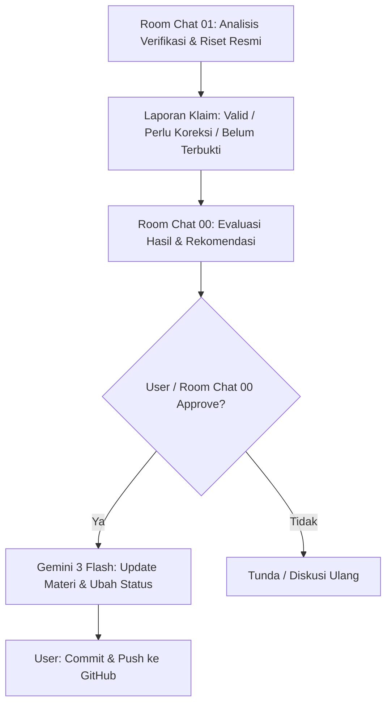

# Verification Workflow

Dokumen ini menjelaskan alur kerja resmi (official workflow) untuk proses verifikasi materi guna mengubah status verifikasi sumber pada bab materi dari **REVIEW** menjadi **VERIFIED**.

## 1. Tujuan
Memastikan setiap materi teknis PostgreSQL yang ada di dalam repositori ini benar-benar valid, akurat, dan sesuai dengan dokumentasi resmi PostgreSQL terbaru, serta tidak mengandung halusinasi AI.

## 2. Aturan Utama Verifikasi
1. **Akses Peramban (Browser/Web)**: Verifikasi hanya boleh dimulai jika **User** secara eksplisit mengaktifkan/mengizinkan browser/web access untuk pencarian informasi ter-update.
2. **Sumber Kebenaran Primer**: Dokumen resmi PostgreSQL (**PostgreSQL Official Documentation**) adalah satu-satunya sumber kebenaran utama. AI tidak boleh dianggap sebagai sumber kebenaran mutlak.
3. **Pemisahan Peran Kerja**:
   - **Room Chat 01**: Melakukan verifikasi analitis, membandingkan teks draf dengan dokumen resmi, dan menyusun laporan klaim validasi. **TIDAK** melakukan edit berkas.
   - **Room Chat 00**: Mengevaluasi laporan analisis verifikasi dari Room Chat 01 dan merekomendasikan keputusan kepada User.
   - **User**: Memberikan keputusan dan persetujuan akhir (*Approval*).
   - **Gemini (Executor)**: Melakukan pembaruan berkas materi dan memperbarui statusnya hanya setelah menerima instruksi tertulis final dari Room Chat 00 yang telah disetujui User.

## 3. Alur Verifikasi (Workflow)



Atau dalam bentuk teks mengalir:
```text
Room Chat 01 Verification Analysis
        ↓
Laporan klaim valid / perlu koreksi / belum terbukti
        ↓
Room Chat 00 Evaluasi
        ↓
User / Room Chat 00 approve
        ↓
Gemini update materi dan status (REVIEW -> VERIFIED)
        ↓
Commit/push oleh user
```

## 4. Kebijakan Status (Status Rules)
Setiap bab materi wajib memuat metadata status di bagian atas berkas dengan aturan berikut:

*   **Status: DRAFT** | **Status Verifikasi Sumber: REVIEW**
    *   *Arti*: Materi sudah ditulis secara lokal berdasarkan pengetahuan dasar/pengetahuan latih AI, tetapi **belum** dicocokkan atau diverifikasi dengan dokumentasi resmi PostgreSQL.
*   **Status: DRAFT** | **Status Verifikasi Sumber: VERIFIED**
    *   *Arti*: Materi telah dicocokkan secara manual dengan dokumentasi resmi PostgreSQL lewat alur verifikasi di atas, terbukti akurat, dan memiliki referensi pranala (URL/link) resmi yang jelas, namun masih berstatus draf yang dapat disempurnakan strukturnya di masa mendatang.
*   **Status: VERIFIED**
    *   *Arti*: Materi sudah matang secara struktur dan telah lulus verifikasi resmi (tidak boleh digunakan tanpa menyertakan pranala rujukan resmi PostgreSQL yang valid).
