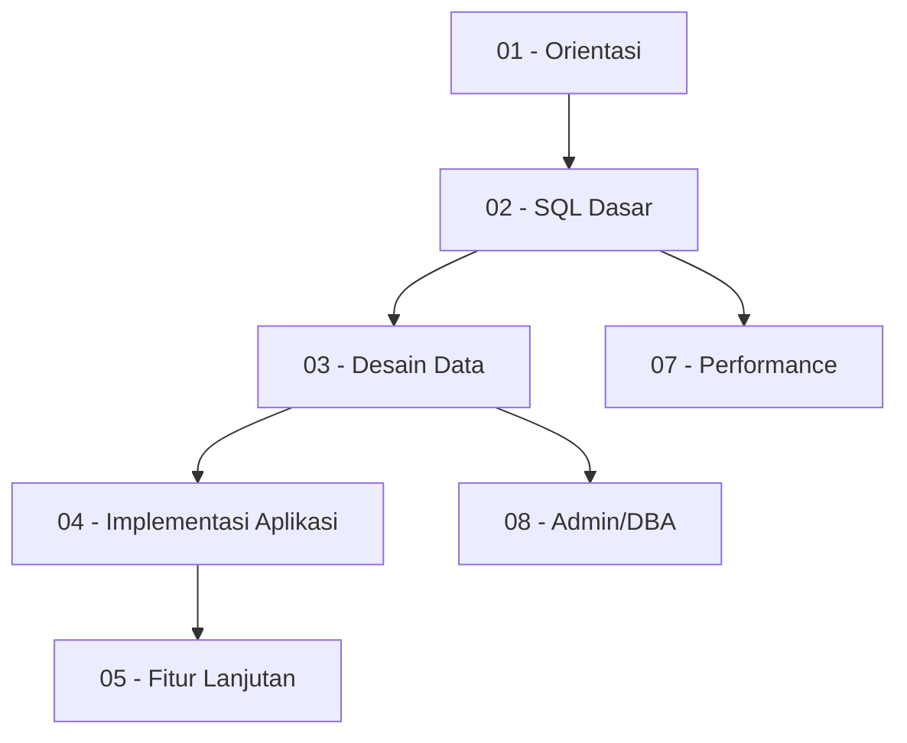

# Peta Relasi Materi PostgreSQL

Status: SKELETON

Tujuan:
- Menjelaskan hubungan antar rak, buku, dan bab.
- Membantu menentukan prasyarat dan urutan belajar.
- Membantu pembaca berpindah dari materi dasar ke materi lanjutan.

## 1. Relasi Antar Rak

## 2. Relasi Jalur Belajar Level 0 - 4
- **Rak 01** menyokong pemahaman konseptual untuk semua rak teknis.
- **Rak 02** adalah prasyarat mutlak untuk bisa melakukan manipulasi data di **Rak 04**.
- **Rak 03** memberikan aturan main (constraints) yang akan dihadapi saat menulis query di **Rak 02**.

## 3. Relasi Jalur Belajar Level 5 - 9
*(Akan dikembangkan)*

## 4. Relasi Interview dan Praktik Project
- Teori di Rak 01-04 akan diuji secara praktis di Rak 13 (Studi Kasus) dan Rak 14 (Interview).

## 5. Relasi Glosarium
Setiap istilah di file glosarium (Rak 00) merujuk pada pembahasan detail di Rak 01-16.
