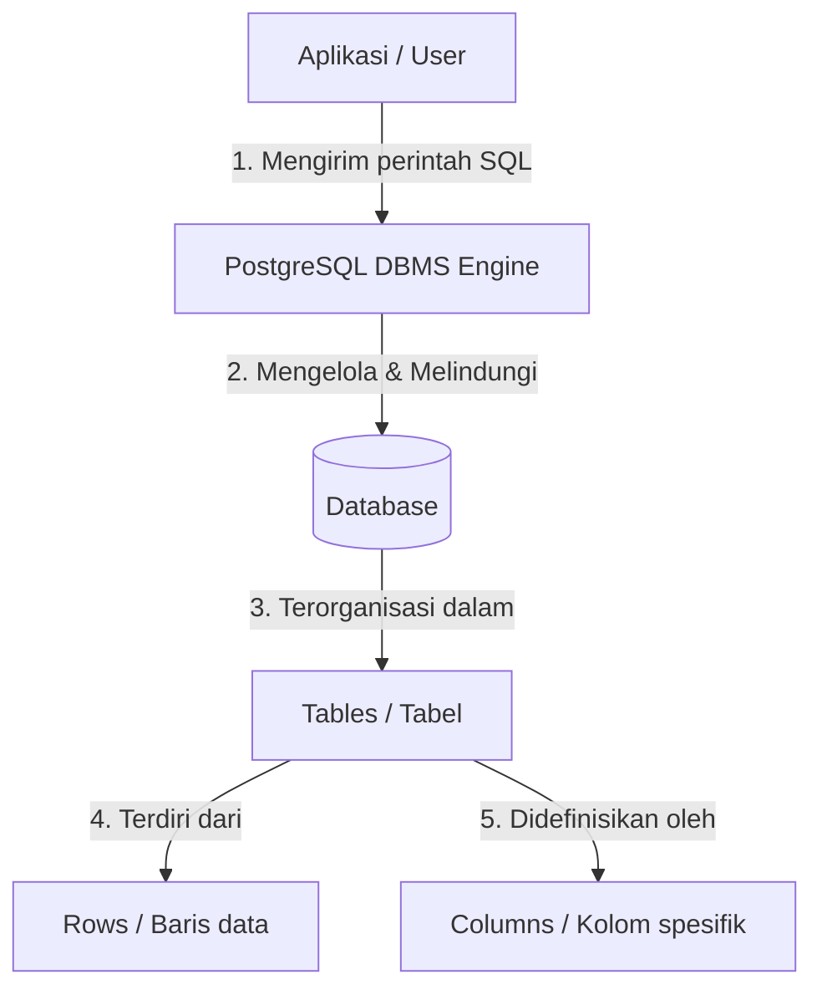

# 01 - BAB 01 APA ITU POSTGRESQL

Status: DRAFT
Rak: Orientasi, Sejarah, dan Fondasi PostgreSQL
Buku: Orientasi PostgreSQL
Level: Level 0 - Level 1
Tipe Materi: Tutorial
Target: Pemula yang baru mengenal PostgreSQL.
Estimasi Baca: 10 Menit
Terakhir Diperiksa: 2026-05-17

Sumber Utama: PostgreSQL Official Documentation
Versi Referensi: PostgreSQL docs/current
Status Verifikasi Sumber: REVIEW

---

## 1. Tujuan Belajar
Di akhir bab ini, pembaca diharapkan mampu:
- Memahami definisi PostgreSQL sebagai Object-Relational Database Management System (ORDBMS).
- Menjelaskan fungsi utama PostgreSQL dalam menyimpan, mengelola, dan mengambil data secara aman.
- Membedakan komponen dasar data: database, DBMS, table, row, dan column.
- Menyadari peran penting PostgreSQL dalam ekosistem pengembangan aplikasi modern.

## 2. Prasyarat
Tidak ada prasyarat teknis khusus untuk bab orientasi ini. Cukup dengan pemahaman dasar tentang cara komputer menyimpan informasi secara sederhana (seperti file teks `.txt` atau lembar kerja spreadsheet).

## 3. Ringkasan Cepat
PostgreSQL (biasa disebut Postgres) adalah sistem manajemen database relasional-objek (ORDBMS) gratis dan open-source yang sangat andal, stabil, dan kaya fitur. PostgreSQL bertindak sebagai mesin utama ("pengawal") di belakang layar yang mengurus seluruh data penting aplikasi Anda, menjamin data tersebut tetap konsisten, aman, dan dapat dicari dalam waktu milidetik menggunakan bahasa terstandarisasi yang disebut SQL.

## 4. Istilah Penting di Bab Ini

| Istilah | Arti Singkat |
|---|---|
| Database | Sekumpulan data terorganisir yang disimpan secara digital di komputer. |
| DBMS | Database Management System; software yang digunakan untuk membuat, mengelola, dan memanipulasi database. |
| RDBMS | Relational DBMS; DBMS yang menyimpan data dalam bentuk tabel-tabel terstruktur yang saling berhubungan. |
| ORDBMS | Object-Relational DBMS; RDBMS yang mendukung fitur-fitur berorientasi objek (seperti pewarisan tabel dan tipe data kustom). |
| Table | Struktur baris dan kolom yang mengelompokkan data sejenis (entitas). |
| Row / Record | Satu baris data tunggal yang merepresentasikan satu entitas spesifik di dalam tabel. |
| Column / Field | Satu atribut atau karakteristik data yang didefinisikan dalam tabel (memiliki tipe data tertentu). |
| Open Source | Software yang kode sumbernya terbuka secara bebas untuk digunakan, dimodifikasi, dan didistribusikan tanpa biaya lisensi. |

## 5. Analogi Sehari-hari
Bayangkan Anda adalah pemilik sebuah perpustakaan besar yang sangat sibuk:
- **Database** adalah *gedung perpustakaan* itu sendiri, wadah fisik di mana semua arsip, kartu, dan buku disimpan.
- **DBMS (PostgreSQL)** adalah *kepala pustakawan super cerdas dan disiplin*. Dialah yang bertugas merapikan lemari arsip, menjaga agar tidak ada dokumen yang hilang, mengizinkan siapa saja yang boleh masuk, dan mencarikan informasi buku dalam sekejap ketika ada pengunjung bertanya.
- **Table** adalah *lemari arsip khusus* di dalam gedung. Misalnya, Anda punya satu lemari arsip berlabel "Data Anggota", dan lemari lain berlabel "Katalog Buku".
- **Row (Baris)** adalah *satu lembar formulir pendaftaran fisik* milik seorang anggota (misalnya Budi) di dalam lemari "Data Anggota".
- **Column (Kolom)** adalah *kotak-kotak kosong isian* di dalam formulir tersebut, seperti: "Nama", "Alamat", "Tanggal Lahir", dan "No Handphone".

## 6. Batas Analogi
Di dunia fisik perpustakaan, kepala pustakawan memerlukan waktu nyata untuk berjalan menyusuri lorong lemari dan mencari kertas formulir secara manual. Jika perpustakaan ramai, pengunjung harus mengantre panjang. 

Di dalam PostgreSQL, proses pencarian dibantu oleh teknologi digital berkecepatan tinggi bernama "indeks", membuat pencarian jutaan data selesai dalam hitungan milidetik. Selain itu, PostgreSQL dapat melayani ribuan "pengunjung" (koneksi aplikasi) secara bersamaan tanpa membuat sistem macet, dan memiliki sistem pencatatan khusus (Write-Ahead Logging / WAL) yang menjamin catatan tidak akan rusak atau hilang meskipun listrik server mendadak padam di tengah proses pencatatan.

## 7. Ilustrasi Konsep

Status Ilustrasi: DRAFT



## 8. Penjelasan Ilustrasi
Bagan di atas menggambarkan alur interaksi sederhana pengguna dengan data. Aplikasi atau User tidak pernah menyentuh file data secara langsung. Mereka mengirim perintah terstandar (SQL) kepada **PostgreSQL DBMS Engine**. PostgreSQL kemudian memproses perintah tersebut secara aman, mengakses berkas penyimpanan fisik **Database**, lalu mengarahkan operasi ke **Tables** yang dituju. Di dalam tabel, PostgreSQL akan menulis atau mengambil data pada level baris (**Rows**) berdasarkan struktur kolom (**Columns**) yang sudah ditentukan sebelumnya.

## 9. Batas Ilustrasi
Ilustrasi ini menyederhanakan arsitektur internal PostgreSQL demi kemudahan pemahaman level awal. Pada kenyataannya, PostgreSQL DBMS Engine terdiri dari banyak komponen internal yang rumit seperti: *Parser* (penerjemah SQL), *Optimizer/Query Planner* (pencari jalur eksekusi query tercepat), *Buffer Manager* (pengelola memori RAM), dan *Storage Manager* (penulis data ke media penyimpanan fisik/SSD).

## 10. Konsep Inti
PostgreSQL dikelompokkan sebagai **Object-Relational Database Management System (ORDBMS)**. 
- **Relasional**: Data disimpan dalam tabel yang memiliki kolom kaku, dan antar tabel dapat saling dihubungkan menggunakan referensi terstandarisasi (disebut *foreign key*).
- **Objek**: PostgreSQL tidak hanya menyimpan data teks atau angka sederhana, tetapi juga mendukung konsep pemrograman berorientasi objek langsung di tingkat database. Hal ini mencakup kemampuan pewarisan tabel (*table inheritance*) di mana sebuah tabel dapat mewarisi struktur tabel lainnya, dan dukungan tipe data kustom kompleks yang dibuat sendiri oleh developer.

## 11. Penjelasan Detail
PostgreSQL berakar dari proyek **POSTGRES** di University of California, Berkeley pada tahun 1986, dipimpin oleh ilmuwan komputer legendaris Michael Stonebraker. Awalnya dirancang untuk mengatasi keterbatasan sistem database relasional masa itu. Pada tahun 1996, dukungan bahasa SQL modern ditambahkan secara penuh, melahirkan nama resmi **PostgreSQL**.

PostgreSQL beroperasi menggunakan arsitektur **Client-Server**:
1. **Server**: Program utama bernama `postgres` berjalan terus-menerus di latar belakang (*background service*) pada server fisik atau cloud, menunggu permintaan koneksi.
2. **Client**: Program apa pun yang terhubung ke server untuk meminta data. Client bisa berupa aplikasi CLI seperti `psql`, aplikasi GUI seperti *pgAdmin* or *DBeaver*, atau kode program backend (Node.js, Go, Python, Java, dll.) yang berjalan di server aplikasi.

## 12. Contoh SQL Dasar
Berikut adalah perintah SQL dasar yang dikirimkan client ke PostgreSQL untuk mendefinisikan dan memanipulasi data:

```sql
-- 1. Membuat tabel lemari arsip 'anggota'
CREATE TABLE anggota (
    id SERIAL PRIMARY KEY,
    nama VARCHAR(100) NOT NULL,
    tanggal_gabung DATE DEFAULT CURRENT_DATE
);

-- 2. Memasukkan satu baris data anggota baru
INSERT INTO anggota (nama) VALUES ('Budi Santoso');

-- 3. Mengambil semua data dari tabel anggota
SELECT * FROM anggota;
```

## 13. Contoh SQL Praktik Project
Dalam skenario pembuatan aplikasi nyata (misalnya sistem kasir toko), kita merancang tabel produk dengan validasi agar data yang masuk tidak boleh minus:

```sql
CREATE TABLE produk (
    produk_id SERIAL PRIMARY KEY,
    nama_produk VARCHAR(150) NOT NULL,
    harga NUMERIC(12, 2) NOT NULL CHECK (harga >= 0),
    stok INT DEFAULT 0 CHECK (stok >= 0),
    dibuat_pada TIMESTAMP DEFAULT CURRENT_TIMESTAMP
);
```

## 14. Kesalahan Umum
- **Mengacaukan istilah Database dengan DBMS**: Banyak pemula berkata, "Saya membuat PostgreSQL baru untuk aplikasi saya." Padahal yang benar adalah, "Saya membuat *Database* baru di dalam *DBMS PostgreSQL*."
- **Menganggap PostgreSQL sama dengan NoSQL (seperti MongoDB)**: PostgreSQL secara *default* menggunakan skema relasional yang kaku (harus mendefinisikan tabel dan kolom sebelum memasukkan data). Namun uniknya, PostgreSQL memiliki tipe data khusus `JSONB` yang memungkinkannya berfungsi dengan fleksibilitas ala NoSQL jika dibutuhkan.

## 15. Catatan Interview
- **Pertanyaan**: "Apa yang membedakan PostgreSQL dari RDBMS tradisional lainnya seperti MySQL?"
- **Jawaban**: "PostgreSQL adalah ORDBMS yang sangat patuh pada standar SQL resmi (highly SQL-compliant). Keunggulan utamanya terletak pada ekstensibilitasnya yang luar biasa (bisa ditambahkan plugin seperti PostGIS untuk data geografis), dukungan tipe data modern yang melimpah (JSONB, Array, UUID), arsitektur MVCC yang sangat efisien untuk menangani beban konkurensi tinggi, serta keandalan penyimpanan data berkat kepatuhan penuh pada prinsip ACID."

## 16. Catatan Diskusi User
- **Pertanyaan Umum**: "Kapan saya harus memakai PostgreSQL dan kapan saya memakai MySQL?"
- **Diskusikan**: MySQL sangat populer untuk web portal sederhana, blog, atau CMS (seperti WordPress) karena kemudahan instalasi dan kecepatannya pada kueri baca sederhana. Namun, untuk aplikasi skala enterprise yang membutuhkan query analitis kompleks, transaksi keuangan sensitif, integritas data tinggi, atau membutuhkan pemrosesan data non-relasional (JSON), PostgreSQL adalah pilihan standar industri yang jauh lebih unggul dan aman.

## 17. Latihan Kecil
1. Jelaskan dengan bahasa Anda sendiri, apa perbedaan fungsi utama antara **Database Engine (DBMS)** dan **Tabel**!
2. Buatlah draf perintah `CREATE TABLE` sederhana untuk menyimpan daftar `buku` yang memiliki kolom `id`, `judul`, dan `penulis`!

## 18. Checklist Pemahaman
- [ ] Mampu membedakan perbedaan Database, DBMS, Table, Row, dan Column.
- [ ] Memahami alasan PostgreSQL dikategorikan sebagai ORDBMS (Object-Relational).
- [ ] Mengetahui bahwa PostgreSQL beroperasi dalam model Client-Server.
- [ ] Menyadari pentingnya database engine dalam menjaga keamanan data aplikasi.

## 19. Hubungan dengan Materi Lain

### Posisi Materi
- Rak: [01 - Orientasi, Sejarah, dan Fondasi PostgreSQL](../../README.md)
- Buku: [Orientasi PostgreSQL](../)

### Prasyarat
- Tidak ada.

### Materi Sebelumnya
- Tidak ada (Ini adalah Bab Pembuka).

### Materi Berikutnya
- [Kenapa PostgreSQL Penting](./bab-02-kenapa-postgresql-penting.md)

### Materi Terkait
- [Arsitektur dan Internals PostgreSQL](../../11-arsitektur-dan-internals-postgresql/)

### Istilah Terkait
- RDBMS, SQL, Table, Record, Field, ACID.

## 20. Referensi Resmi
Jangan membuka tautan berikut pada batch ini, cukup cantumkan sebagai referensi resmi yang ditargetkan untuk verifikasi nanti:
- PostgreSQL Official Documentation - What is PostgreSQL?
  https://www.postgresql.org/docs/current/intro-whatis.html

## 21. Catatan Pribadi / Project Notes
*   *Catatan Draft*: Draft awal ini disusun berdasarkan pengetahuan umum tepercaya tentang PostgreSQL demi memberikan pemahaman dasar bagi pemula, tanpa mengakses dokumen eksternal secara aktif selama penulisan. Status verifikasi diatur ke REVIEW untuk audit kecocokan teks dokumentasi resmi di masa mendatang.
