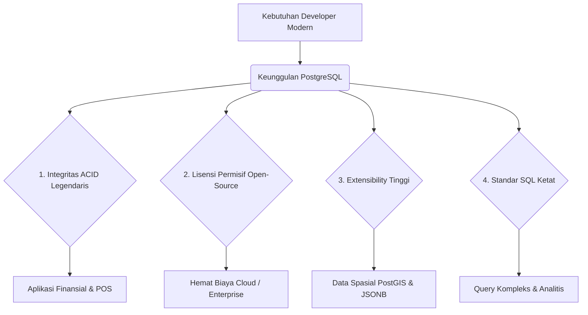

# 02 - BAB 02 KENAPA POSTGRESQL PENTING

Status: DRAFT
Rak: Orientasi, Sejarah, dan Fondasi PostgreSQL
Buku: Orientasi PostgreSQL
Level: Level 0 - Level 1
Tipe Materi: Tutorial
Target: Pemula yang baru mengenal PostgreSQL.
Estimasi Baca: 10 Menit
Terakhir Diperiksa: 2026-05-17

Sumber Utama: PostgreSQL Official Documentation
Versi Referensi: PostgreSQL docs/current
Status Verifikasi Sumber: REVIEW

---

## 1. Tujuan Belajar
Di akhir bab ini, pembaca diharapkan mampu:
- Menjelaskan faktor-faktor utama yang membuat PostgreSQL menjadi standar industri untuk developer modern.
- Mengidentifikasi keunggulan PostgreSQL dari segi stabilitas, kepatuhan SQL, ekstensibilitas, dan lisensi open-source.
- Memahami skenario penggunaan terbaik PostgreSQL dalam proyek nyata (aplikasi finansial, backend modular, analitik menengah).

## 2. Prasyarat
- Memahami apa itu database, DBMS, dan bagaimana PostgreSQL beroperasi secara umum (baca: [Apa Itu PostgreSQL](./bab-01-apa-itu-postgresql.md)).

## 3. Ringkasan Cepat
PostgreSQL adalah salah satu database paling tepercaya di dunia. Developer memilihnya bukan hanya karena gratis, melainkan karena keandalannya yang legendaris dalam melindungi data dari kerusakan, kepatuhannya yang sangat tinggi terhadap standar SQL, kemampuannya menangani struktur data kompleks, serta sifat ekstensibelnya (bisa dimodifikasi/ditambah fitur) yang tak tertandingi oleh database relasional gratis lainnya.

## 4. Istilah Penting di Bab Ini

| Istilah | Arti Singkat |
|---|---|
| Extensible | Kemampuan sistem untuk ditambahkan fitur baru (tipe data, indeks, plugin) tanpa merusak kode inti database. |
| Relational Integrity | Jaminan bahwa hubungan antar data di berbagai tabel tetap konsisten dan tidak rusak secara logika. |
| ACID Compliance | Standar keandalan database untuk memastikan semua transaksi data berhasil penuh atau gagal penuh demi keamanan data. |
| Open Source | Lisensi bebas mirip MIT/BSD yang membebaskan siapa saja menggunakan, memodifikasi, dan menjual PostgreSQL tanpa royalti. |
| Data Typology | Ragam jenis tipe data yang didukung oleh database (seperti teks, koordinat GPS, JSONB, array). |

## 5. Analogi Sehari-hari
Bayangkan Anda sedang membangun sebuah **Gedung Pencakar Langit (Aplikasi Bisnis Modern)**:
- **PostgreSQL** adalah **Struktur Fondasi Beton Bertulang Baja (Database Core)** yang ditanam sangat dalam di bawah tanah. Fondasi ini dirancang dengan kalkulasi matematika yang super presisi oleh insinyur sipil profesional. 
- Fondasi ini tidak terlihat dari luar, tetapi ia menjamin gedung di atasnya tetap tegak berdiri kokoh menghadapi gempa bumi, banjir, dan beban ribuan orang yang lalu-lalang setiap hari. 

Anda tidak akan membangun gedung pencakar langit berlantai 100 di atas fondasi kayu sederhana, bukan? PostgreSQL adalah jaminan fondasi kokoh tersebut agar bisnis Anda aman dari risiko kehilangan atau kerusakan data penting.

## 6. Batas Analogi
Fondasi fisik gedung terbuat dari beton mati yang kaku dan tidak bisa diubah strukturnya setelah dicor. Jika ingin memperlebar ruangan di bawah tanah, Anda harus membobok beton yang sangat sulit dan berbahaya. 

Di dalam PostgreSQL, "fondasi data" Anda bersifat dinamis dan elastis. Anda dapat memperluas struktur skema (*extensible*), membuat tipe data kustom, mengoptimalkan indeks, dan meningkatkan skala performa secara vertikal maupun horizontal bahkan ketika aplikasi sedang berjalan aktif melayani jutaan pengguna tanpa menghentikan sistem (*zero downtime*).

## 7. Ilustrasi Konsep

Status Ilustrasi: DRAFT



## 8. Penjelasan Ilustrasi
Bagan di atas menggambarkan bagaimana keunggulan utama PostgreSQL menjawab kebutuhan riil developer modern. Kepatuhan ACID yang sangat ketat menjamin keamanan transaksi finansial. Lisensi bebas open-source yang mirip lisensi MIT/BSD menghilangkan biaya lisensi database komersil yang sangat mahal. Ekstensibilitas yang tinggi memungkinkan integrasi data geografis (PostGIS) dan data semi-terstruktur (JSONB) dalam satu database. Kepatuhan standar SQL mempermudah developer menulis query analitis yang rumit dengan aman.

## 9. Batas Ilustrasi
Ilustrasi ini menyederhanakan keunggulan PostgreSQL demi kemudahan pembelajaran tingkat pemula. Pada kenyataannya, keunggulan PostgreSQL mencakup aspek performa lanjutan seperti *Multi-Version Concurrency Control* (MVCC) untuk menghindari penguncian baris (*locking*) saat proses baca-tulis bersamaan, serta arsitektur replikasi canggih yang dibahas pada Rak tingkat lanjut (Rak 06 ke atas).

## 10. Konsep Inti
Empat pilar utama yang menjadikan PostgreSQL sangat penting bagi industri teknologi modern:
1.  **Keandalan Data (Data Reliability)**: PostgreSQL mengimplementasikan standar ACID secara sangat ketat. Sekali data Anda berhasil disimpan (*committed*), data tersebut dijamin aman dari mati listrik mendadak atau kegagalan sistem.
2.  **Kepatuhan SQL Standar (SQL Standards Compliance)**: PostgreSQL mematuhi lebih dari 160 fitur standar ANSI-SQL, memudahkan developer menerapkan logika kueri standar industri tanpa perlu belajar fungsi aneh yang menyimpang dari standar.
3.  **Ekstensibilitas Tinggi (Extensibility)**: PostgreSQL dirancang dinamis. Developer dapat menambahkan ekstensi (seperti *PostGIS* untuk koordinat peta atau *pg_trgm* untuk pencarian teks) secara langsung.
4.  **Lisensi Bebas Sempurna**: Lisensi PostgreSQL membebaskan perusahaan menggunakannya untuk skala apa pun tanpa batasan komersialisasi, berbeda dengan database komersial lain yang mengenakan biaya per core processor.

## 11. Penjelasan Detail
PostgreSQL sangat unggul pada skenario-skenario berikut:
*   **Aplikasi Finansial / POS**: Memerlukan akurasi data desimal tanpa toleransi kesalahan pembulatan. PostgreSQL menyediakan tipe data `NUMERIC` yang presisi tinggi dan constraint validasi yang sangat kuat.
*   **Backend Web Skala Enterprise**: Menangani beban transaksi concurrent tinggi. PostgreSQL memanfaatkan arsitektur MVCC sehingga pembacaan data (`SELECT`) tidak terhambat oleh proses penulisan data (`INSERT`/`UPDATE`) yang sedang berlangsung.
*   **Data Campuran (Relasional & Dokumen)**: Menggabungkan tabel terstruktur dengan data semi-terstruktur. PostgreSQL memiliki tipe data `JSONB` yang efisien dan dapat diindeks, menyatukan kekuatan SQL dan Fleksibilitas NoSQL.

## 12. Contoh SQL Dasar
Berikut menunjukkan bagaimana PostgreSQL mendukung tipe data lanjutan seperti **Array** secara native (tidak didukung di banyak RDBMS biasa):

```sql
-- Membuat tabel artikel dengan kolom bertipe Array (kumpulan teks)
CREATE TABLE artikel (
    id SERIAL PRIMARY KEY,
    judul VARCHAR(200) NOT NULL,
    tags VARCHAR(50)[] NOT NULL -- Kolom Array Teks
);

-- Memasukkan data dengan format array
INSERT INTO artikel (judul, tags) VALUES 
('Belajar PostgreSQL Dasar', ARRAY['database', 'sql', 'pemula']);
```

## 13. Contoh SQL Praktik Project
Dalam skenario website berita, kita ingin menampilkan artikel yang memiliki kategori tag tertentu. PostgreSQL menyediakan fungsi pencarian array yang sangat efisien:

```sql
-- Mengambil semua artikel yang memiliki tag 'sql' di dalam array 'tags'
SELECT judul, tags 
FROM artikel 
WHERE 'sql' = ANY(tags);
```

## 14. Kesalahan Umum
- **Menganggap PostgreSQL Terlalu Berat**: Developer pemula sering memilih database relasional yang lebih sederhana demi kemudahan setup awal, tetapi mengorbankan keamanan data jangka panjang. PostgreSQL modern sebenarnya berjalan sangat ringan di RAM kecil dan sangat mudah dideploy.
- **Membuat Sistem Database Terpisah untuk JSON**: Memelihara database NoSQL tambahan hanya untuk menyimpan data berformat dokumen dinamis, padahal PostgreSQL mampu menangani data relasional dan `JSONB` sekaligus secara efisien dalam satu koneksi backend.

## 15. Catatan Interview
- **Pertanyaan**: "Apa arti dari pernyataan bahwa PostgreSQL adalah database yang *extensible*?"
- **Jawaban**: "Artinya PostgreSQL dirancang agar developer dapat memperluas fungsionalitas database secara dinamis tanpa harus mengubah kode sumber inti atau melakukan kompilasi ulang engine PostgreSQL. Kita dapat menambahkan tipe data baru, membuat operator kustom, mendesain tipe indeks kustom (seperti GIN/GiST), menulis fungsi dalam bahasa selain SQL (seperti Python atau PL/pgSQL), serta memasang extension siap pakai seperti PostGIS yang berjalan secepat fitur bawaan database."

## 16. Catatan Diskusi User
- **Pertanyaan Umum**: "Mengapa startup besar seperti Uber, Figma, dan Netflix mengandalkan PostgreSQL sebagai database inti mereka?"
- **Diskusikan**: Selain karena lisensinya yang bebas biaya tanpa batasan skala komersial, perusahaan teknologi memilih PostgreSQL karena keandalannya dalam menangani beban baca-tulis yang masif secara stabil, dukungan tipe data modern yang melimpah (seperti JSONB, UUID), serta ekosistem extension-nya yang sangat kuat untuk beradaptasi dengan kebutuhan bisnis yang berubah cepat.

## 17. Latihan Kecil
1. Tuliskan 3 perbedaan fungsionalitas antara database relasional tradisional dengan PostgreSQL terkait dukungan tipe data lanjutan!
2. Jelaskan secara singkat mengapa keandalan ACID sangat penting bagi sistem database aplikasi perbankan atau kasir toko!

## 18. Checklist Pemahaman
- [ ] Memahami alasan PostgreSQL disebut sangat patuh pada standar SQL.
- [ ] Mengetahui konsep *extensibility* dan pemakaian ekstensi populer (misal PostGIS).
- [ ] Memahami perbedaan keunggulan lisensi PostgreSQL dengan database komersial berbayar.
- [ ] Mengetahui skenario aplikasi yang paling tepat untuk menggunakan PostgreSQL.

## 19. Hubungan dengan Materi Lain

### Posisi Materi
- Rak: [01 - Orientasi, Sejarah, dan Fondasi PostgreSQL](../../README.md)
- Buku: [Orientasi PostgreSQL](../)

### Prasyarat
- [Apa Itu PostgreSQL](./bab-01-apa-itu-postgresql.md)

### Materi Sebelumnya
- [Apa Itu PostgreSQL](./bab-01-apa-itu-postgresql.md)

### Materi Berikutnya
- [Database, Table, Row, dan Column](../buku-04-fondasi-konsep-database/bab-01-database-table-row-dan-column.md)

### Materi Terkait
- [Fitur PostgreSQL Lanjutan](../../05-fitur-postgresql-lanjutan/)
- [Transaksi, Concurrency, dan MVCC](../../06-transaksi-concurrency-dan-mvcc/)

### Istilah Terkait
- ACID, Extensibility, MVCC, PostGIS, JSONB, Array Type.

## 20. Referensi Resmi
Jangan membuka tautan berikut pada batch ini, cukup cantumkan sebagai referensi resmi yang ditargetkan untuk verifikasi nanti:
- PostgreSQL Official Documentation - What is PostgreSQL?
  https://www.postgresql.org/docs/current/intro-whatis.html

## 21. Catatan Pribadi / Project Notes
*   *Catatan Draft*: Draft ini disusun untuk menginspirasi developer agar peduli pada keamanan dan integritas data sejak awal belajar. Gunakan gaya bahasa yang netral tanpa menjelekkan database lain agar materi tetap obyektif. Status verifikasi diatur ke REVIEW.
