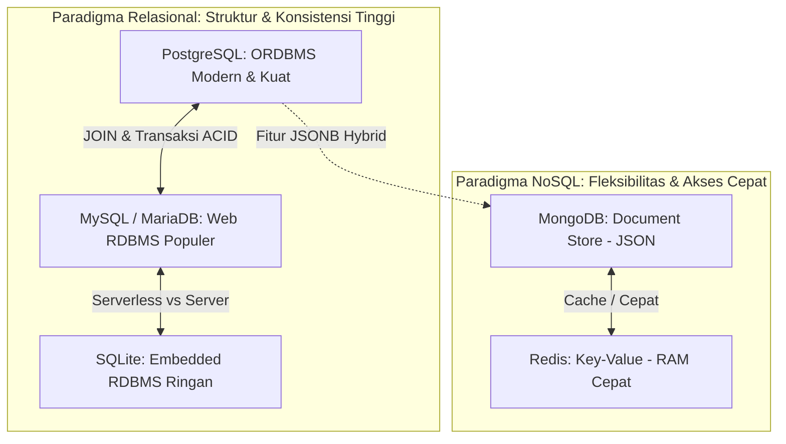

# 03 - BAB 03 POSISI POSTGRESQL DI DUNIA DATABASE

Status: DRAFT
Rak: Orientasi, Sejarah, dan Fondasi PostgreSQL
Buku: Orientasi PostgreSQL
Level: Level 0 - Level 1
Tipe Materi: Tutorial
Target: Pemula yang baru mengenal PostgreSQL.
Estimasi Baca: 10 Menit
Terakhir Diperiksa: 2026-05-17

Sumber Utama: PostgreSQL Official Documentation
Versi Referensi: PostgreSQL docs/current
Status Verifikasi Sumber: REVIEW

---

## 1. Tujuan Belajar
Di akhir bab ini, pembaca diharapkan mampu:
- Memahami posisi konseptual PostgreSQL sebagai Object-Relational Database Management System (ORDBMS) modern.
- Membedakan use-case konseptual antara PostgreSQL dengan RDBMS lain (MySQL/MariaDB), embedded database (SQLite), Document-oriented database (MongoDB), dan In-memory data store (Redis).
- Mengidentifikasi kriteria pemilihan database yang tepat berdasarkan kebutuhan struktur data, konsistensi transaksi, kecepatan akses, dan skalabilitas aplikasi.
- Menyadari peran penting paradigma penyimpanan data dalam menentukan stabilitas arsitektur sistem informasi backend.

## 2. Prasyarat
- Memahami konsep dasar apa itu database dan DBMS (baca: [Apa Itu PostgreSQL](./bab-01-apa-itu-postgresql.md)).
- Mengetahui bahwa database digunakan oleh aplikasi backend untuk menyimpan data secara permanen.

## 3. Ringkasan Cepat
Di dalam semesta pengembangan software, tidak ada satu database pun yang sempurna untuk semua kebutuhan. PostgreSQL memosisikan diri di puncak spektrum keandalan, kepatuhan standar SQL, dan fleksibilitas fitur (extensibility). Sebagai ORDBMS, PostgreSQL menggabungkan ketangguhan model relasional murni dengan kemampuan pemrosesan objek tingkat lanjut (seperti tipe data kustom, penanganan JSONB dokumen, dan array). Pilihan database tidak dinilai dari mana yang terbaik secara absolut, melainkan mana yang paling selaras dengan karakteristik model data dan kebutuhan integritas aplikasi Anda.

## 4. Istilah Penting di Bab Ini

| Istilah | Arti Singkat |
|---|---|
| ORDBMS | Object-Relational Database Management System; database relasional yang mendukung fitur pemrograman berorientasi objek (seperti pewarisan tabel dan tipe data kustom). |
| RDBMS | Relational Database Management System; sistem database tradisional yang mengelola data dalam tabel dua dimensi yang saling berhubungan. |
| Embedded Database | Database yang menyatu langsung di dalam aplikasi klien tanpa memerlukan server database terpisah yang independen. |
| Document Database | Jenis database NoSQL yang menyimpan data dalam format dokumen semi-terstruktur (seperti JSON/BSON) tanpa skema kaku. |
| In-Memory Data Store | Sistem database yang menyimpan seluruh data aktifnya di memori RAM utama untuk akses super cepat, bersifat volatil (mudah hilang saat mati daya). |
| ACID | Transaksi yang aman dan andal melalui empat pilar: Atomicity, Consistency, Isolation, dan Durability. |

## 5. Analogi Sehari-hari
Mari kita analogikan jenis-jenis database populer di dunia dengan **Kendaraan Pengangkut Logistik**:

- **PostgreSQL (Kereta Api Kargo Modern)**: Sangat andal, berjalan kokoh di atas rel baja yang kaku (skema tabel/relasional). Mampu menarik kontainer barang raksasa, tangki bahan kimia khusus (tipe data lanjutan seperti JSONB/Array), dengan pengamanan super ketat dari stasiun ke stasiun (transaksi ACID). Kereta api sangat tangguh untuk kargo kompleks dan berharga tinggi, namun memerlukan stasiun besar dan infrastruktur rel yang matang (server setup mandiri).
- **MySQL/MariaDB (Truk Kontainer Jalan Raya)**: Sangat populer, fleksibel, mudah dijalankan di hampir semua kondisi jalan raya (mudah dideploy di berbagai hosting). Sangat cepat untuk pengantaran barang umum sehari-hari (kueri baca-tulis web standar). Namun, ia tidak sekuat kereta api dalam memproses muatan analitik super berat atau menangani kargo aneh yang membutuhkan spesifikasi rel khusus.
- **SQLite (Sepeda Motor Kurir Box)**: Sangat ringan, lincah, bisa masuk ke gang-gang kecil (embedded langsung di aplikasi HP atau software desktop). Tidak membutuhkan sopir tambahan atau kru stasiun (serverless/tanpa server terpisah). Sangat efisien untuk pengiriman satu paket tunggal, namun otomatis kolaps jika dipaksa mengangkut kargo logistik seberat ratusan ton secara bersamaan (multi-user concurrency tinggi).
- **MongoDB (Helikopter Kargo Serbaguna)**: Bebas terbang tanpa perlu jalur aspal atau rel baja (schema-less / tanpa skema kaku). Bisa mendarat di mana saja membawa barang dengan bentuk yang terus berubah-ubah (flexible JSON documents). Sangat cepat berpindah rute secara dinamis, namun biaya operasionalnya mahal dan rentan mengalami kecelakaan kargo tercecer (risiko inkonsistensi relasi data) jika pilot/developer tidak waspada mengunci koordinat koordinasi data.
- **Redis (Kurir Lari Cepat Estafet)**: Hanya membawa barang kecil di tangannya sendiri tanpa menaruhnya di gudang bawah tanah (menyimpan data langsung di memori RAM / In-memory). Mampu berlari super cepat dalam milidetik untuk menyerahkan barang berulang kali. Namun, jika kurir tersebut mendadak lelah atau mati lampu di gedung (server crash/listrik padam), barang yang didekap di tangannya rentan jatuh dan hilang (data volatil) kecuali jika ia didampingi asisten pencatat khusus.

## 6. Batas Analogi
Di dunia transportasi nyata, kereta api kargo tidak akan pernah bisa melewati jalan raya aspal biasa atau masuk ke gang sempit. 

Di dunia database digital, batasan ini lebih lentur. PostgreSQL yang dioptimalisasi dengan baik tetap berjalan sangat efisien untuk aplikasi berskala kecil hingga menengah (tidak kaku seperti kereta api kargo asli). Namun, untuk aplikasi mobile mandiri yang terpasang langsung di perangkat Android/iOS tanpa internet, PostgreSQL tetap tidak bisa menggantikan peran SQLite yang tertanam langsung di sistem operasi handphone.

## 7. Ilustrasi Konsep

Status Ilustrasi: DRAFT



## 8. Penjelasan Ilustrasi
Bagan di atas memetakan pembagian ekosistem database menjadi dua paradigma besar. Sisi kiri diisi oleh kelompok Relasional yang berfokus pada struktur tabel dan konsistensi tinggi (PostgreSQL, MySQL, SQLite). Sisi kanan diisi oleh kelompok NoSQL yang mengutamakan fleksibilitas dokumen dan kecepatan akses memori (MongoDB, Redis). PostgreSQL memiliki jembatan unik (garis putus-putus) ke arah MongoDB karena kemampuannya memproses tipe data `JSONB` secara hibrida, menggabungkan ketangguhan relasional dengan fleksibilitas dokumen NoSQL.

## 9. Batas Ilustrasi
Ilustrasi di atas mengelompokkan database berdasarkan paradigma penyimpanan dominannya secara umum. Ia tidak menampilkan jenis database khusus lainnya seperti Graph Database (Neo4j), Time-Series Database (TimescaleDB), atau Vector Database (untuk AI/LLM), meskipun uniknya PostgreSQL dapat diubah fungsinya menjadi time-series atau vector database melalui pemasangan extension resmi (seperti `pgvector`).

## 10. Konsep Inti

### 1. PostgreSQL sebagai ORDBMS (Object-Relational)
Berbeda dengan MySQL yang merupakan RDBMS murni, PostgreSQL dirancang dengan konsep Object-Oriented. Hal ini memungkinkan PostgreSQL untuk:
- Mendukung tipe data kustom bentukan developer sendiri.
- Mendukung fitur **Pewarisan Tabel** (*Table Inheritance*), di mana sebuah tabel anak dapat mewarisi struktur kolom tabel induk.
- Memiliki fungsi dan prosedur tersimpan (*stored procedures*) yang ditulis dalam berbagai bahasa pemrograman kustom (seperti PL/pgSQL, Python, atau Perl).

### 2. Peta Perbandingan Konseptual Antar Database

| Fitur / Karakteristik | PostgreSQL | MySQL | SQLite | MongoDB | Redis |
|---|---|---|---|---|---|
| **Model Data** | Relasional + Objek (Tabel + JSONB) | Relasional (Tabel) | Relasional (Tabel) | Dokumen (JSON/BSON) | Key-Value Store |
| **Penyimpanan Utama**| Disk (Hard Drive / SSD) | Disk (Hard Drive / SSD) | File Tunggal di Disk | Disk (Hard Drive / SSD) | RAM (Memori Utama) |
| **Skema Tabel** | Kaku (Wajib didefinisikan) | Kaku (Wajib didefinisikan) | Kaku (Wajib didefinisikan) | Sangat Fleksibel (Dynamic) | Tanpa Skema |
| **Relasi & JOIN** | Sangat Kuat & Kompleks | Kuat & Cepat | Cukup Kuat (Sederhana) | Lemah (Gunakan Embed/Lookup) | Tidak Mendukung |
| **Kepatuhan ACID** | Mutlak & Sangat Ketat | Kuat (Engine InnoDB) | Cukup Kuat | Parsial (Tingkat Dokumen) | Terbatas |
| **Use Case Terbaik** | Data kompleks, keuangan, analitik, multi-modal. | Website umum, CMS, e-commerce standar. | Aplikasi mobile, IoT, pengujian lokal. | Data dinamis, katalog produk berubah-ubah. | Caching, session store, real-time leaderboard. |

## 11. Penjelasan Detail

### Kapan Anda Harus Memilih PostgreSQL?
PostgreSQL adalah pilihan mutlak jika sistem Anda memenuhi kondisi berikut:
1.  **Akurasi Data adalah Harga Mati**: Aplikasi keuangan, perbankan, inventori stok barang, atau sistem pembayaran di mana data rusak bernilai 1 rupiah saja akan mengacaukan audit laporan keuangan perusahaan.
2.  **KueriJOIN yang Kompleks**: Sistem analitik bisnis (BI) yang harus menggabungkan puluhan tabel database secara simultan untuk menghasilkan laporan operasional yang presisi.
3.  **Membutuhkan Data Multi-paradigma**: Anda ingin menyimpan data transaksi yang rapi (Relasional), tetapi di saat yang sama Anda juga harus menampung data log eksternal yang strukturnya dinamis (JSON) dalam satu database tunggal yang stabil.

### Kapan Anda Harus Memilih Database Lain?
- Gunakan **MySQL** jika Anda membangun website profil perusahaan atau blog sederhana berbasis CMS (seperti WordPress) karena dokumentasi pemasangan hosting-nya sangat melimpah bagi pemula.
- Gunakan **SQLite** jika Anda merancang aplikasi handphone yang harus bisa diakses secara offline (luring) oleh pengguna tanpa koneksi internet ke server.
- Gunakan **MongoDB** jika struktur data Anda terus berubah dengan cepat setiap hari dan Anda tidak ingin direpotkan oleh migrasi skema tabel yang kaku pada fase awal startup.
- Gunakan **Redis** jika Anda membutuhkan penyimpanan sementara untuk sesi login pengguna (*session storage*) atau sistem antrean (*queue*) yang wajib merespons di bawah 1 milidetik.

## 12. Contoh SQL Dasar
Sebagai database ORDBMS, PostgreSQL memiliki keunikan mampu menyimpan dan mengueri data semi-terstruktur JSON secara hibrida di dalam kolom tabel relasional biasa menggunakan tipe data `JSONB`.

```sql
-- 1. Membuat tabel profil pengguna dengan kolom JSONB hibrida
CREATE TABLE profil_pengguna (
    id SERIAL PRIMARY KEY,
    nama_lengkap VARCHAR(150) NOT NULL,
    metadata JSONB -- Menyimpan data dinamis seperti preferensi tema, dll.
);

-- 2. Memasukkan data relasional sekaligus dokumen JSONB
INSERT INTO profil_pengguna (nama_lengkap, metadata) 
VALUES ('Syah Putra', '{"tema": "gelap", "notifikasi": true, "bahasa": "id"}');

-- 3. Mengambil data khusus dari dalam dokumen JSONB menggunakan operator panah '->>'
SELECT nama_lengkap, metadata->>'tema' AS tema_pilihan 
FROM profil_pengguna 
WHERE metadata->>'notifikasi' = 'true';
```

## 13. Contoh SQL Praktik Project
Dalam skenario perancangan database e-commerce, kita seringkali memiliki atribut produk yang sangat dinamis (misalnya produk baju memiliki ukuran dan warna, sedangkan produk HP memiliki RAM dan memori). PostgreSQL memungkinkan kita menangani fleksibilitas ini tanpa merusak relasi integritas database:

```sql
-- Pembuatan tabel katalog produk e-commerce hibrida
CREATE TABLE produk_katalog (
    produk_id INT GENERATED ALWAYS AS IDENTITY PRIMARY KEY,
    nama_produk VARCHAR(200) NOT NULL,
    harga NUMERIC(12, 2) NOT NULL,
    spesifikasi JSONB -- Menampung detail RAM, Warna, Ukuran secara dinamis
);

-- Mengambil produk handphone yang memiliki spesifikasi RAM 8GB secara instan
SELECT nama_produk, harga, spesifikasi->>'warna' AS warna 
FROM produk_katalog 
WHERE spesifikasi->>'ram' = '8GB' AND harga < 5000000.00;
```

## 14. Kesalahan Umum
- **"One Size Fits All" Mindset (Satu untuk Semua)**: Memaksakan seluruh bagian aplikasi menggunakan satu jenis database saja hanya karena kenyamanan pribadi. Contohnya menyimpan data keuangan sensitif di dalam MongoDB (yang rentan kehilangan relasi antar dokumen), atau sebaliknya memaksakan PostgreSQL menyimpan miliaran data log sementara yang ditulis setiap mili-detik (sebaiknya gunakan Redis atau Time-Series DB).
- **Meremehkan Setup Resource PostgreSQL**: Menganggap PostgreSQL berat karena membandingkannya dengan SQLite. PostgreSQL membutuhkan konfigurasi memori server (*shared buffers*) yang disesuaikan dengan kapasitas RAM komputer Anda agar performanya melesat cepat.

## 15. Catatan Interview
- **Pertanyaan**: "Apa perbedaan konseptual terbesar antara PostgreSQL dengan database NoSQL seperti MongoDB, dan kapan kita menggabungkan keduanya?"
- **Jawaban**: "Perbedaan terbesarnya terletak pada struktur skema dan integritas relasi. PostgreSQL adalah ORDBMS relasional yang menegakkan integritas referensial (Foreign Key) dan transaksi ACID secara mutlak di tingkat database, sangat cocok untuk data transaksional sensitif. MongoDB adalah Document DB NoSQL tanpa skema kaku (schema-less) yang mengutamakan kecepatan tulis dan fleksibilitas bentuk dokumen JSON. Kita bisa menggabungkan keduanya dalam satu sistem dengan menaruh data transaksi keuangan dan profil inti user di PostgreSQL (sebagai Single Source of Truth), sedangkan data log aktivitas mentah yang sangat dinamis disimpan di MongoDB."

## 16. Catatan Diskusi User
- **Pertanyaan Umum**: "Apakah dengan adanya fitur JSONB di PostgreSQL, kita tidak memerlukan MongoDB lagi sama sekali?"
- **Diskusikan**: Bagi sebagian besar aplikasi startup, fitur `JSONB` di PostgreSQL sudah lebih dari cukup untuk menangani data dinamis, sehingga developer tidak perlu menambah beban biaya sewa server dan kompleksitas operasional dengan menjalankan server MongoDB terpisah. Namun, untuk aplikasi skala raksasa yang membutuhkan penyimpanan horizontal terdistribusi (*automatic sharding*) dalam skala puluhan Terabyte data dokumen mentah tanpa relasi sama sekali, MongoDB orisinal tetap menawarkan keunggulan skalabilitas bawaan yang sulit ditandingi.

## 17. Latihan Kecil
1. Jika Anda membangun aplikasi *Smart Home* yang merekam data sensor suhu dari 100 perangkat setiap 10 detik, manakah database yang paling cocok sebagai penyimpanan data mentahnya? Mengapa?
2. Jika Anda membuat game mobile offline sederhana tanpa koneksi internet sama sekali untuk disimpan di HP pemain, database apa yang paling tepat dipasang langsung di dalam game tersebut?

## 18. Checklist Pemahaman
- [ ] Memahami arti dari istilah ORDBMS yang disematkan pada PostgreSQL.
- [ ] Mampu membedakan perbedaan use-case konseptual antara PostgreSQL, MySQL, SQLite, MongoDB, dan Redis.
- [ ] Mampu menuliskan kueri SELECT dasar untuk mengekstrak data dari kolom bertipe JSONB di PostgreSQL.
- [ ] Mengetahui kriteria utama saat harus memilih PostgreSQL dibandingkan database NoSQL.

## 19. Hubungan dengan Materi Lain

### Posisi Materi
- Rak: [01 - Orientasi, Sejarah, dan Fondasi PostgreSQL](../../README.md)
- Buku: [Orientasi PostgreSQL](../)

### Prasyarat
- [Kenapa PostgreSQL Penting](./bab-02-kenapa-postgresql-penting.md)

### Materi Sebelumnya
- [Kenapa PostgreSQL Penting](./bab-02-kenapa-postgresql-penting.md)

### Materi Berikutnya
- [Filosofi Relational Database](../buku-03-filosofi-dan-mental-model-postgresql/bab-01-filosofi-relational-database.md)

### Materi Terkait
- [Fitur PostgreSQL Lanjutan](../../05-fitur-postgresql-lanjutan/) (Membahas kueri JSONB tingkat dalam)

### Istilah Terkait
- ORDBMS, Document-store, Embedded Database, Key-value, ACID Compliance.

## 20. Referensi Resmi
Jangan membuka tautan berikut pada batch ini, cukup cantumkan sebagai referensi resmi yang ditargetkan untuk verifikasi nanti:
- PostgreSQL Official Documentation — perlu diverifikasi pada batch official docs verification.
- SQL standard / relational database concept — perlu diverifikasi jika nanti masuk fase source verification.

## 21. Catatan Pribadi / Project Notes
*   *Catatan Draft*: Draft ini disusun untuk memberikan gambaran arsitektur yang bijaksana bagi developer pemula. Hindari fanatisme buta terhadap satu database. Jelaskan posisi masing-masing database secara adil dan objektif berdasarkan karakteristik komputasi dan kebutuhan integritas bisnis. Status verifikasi diatur ke REVIEW.
