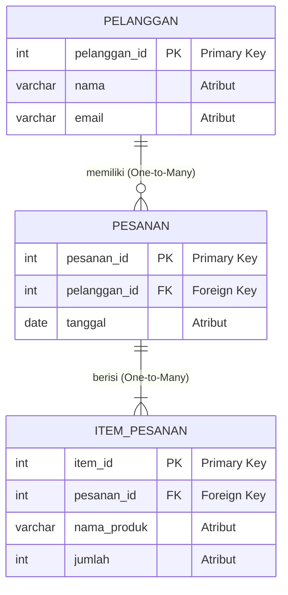

# 01 - BAB 01 FILOSOFI RELATIONAL DATABASE

Status: DRAFT
Rak: Orientasi, Sejarah, dan Fondasi PostgreSQL
Buku: Filosofi dan Mental Model PostgreSQL
Level: Level 0 - Level 1
Tipe Materi: Tutorial
Target: Pemula yang baru mengenal PostgreSQL.
Estimasi Baca: 10 Menit
Terakhir Diperiksa: 2026-05-17

Sumber Utama: PostgreSQL Official Documentation
Versi Referensi: PostgreSQL docs/current
Status Verifikasi Sumber: REVIEW

---

## 1. Tujuan Belajar
Di akhir bab ini, pembaca diharapkan mampu:
- Menjelaskan prinsip filosofi dasar di balik model database relasional secara konseptual.
- Memahami alasan pentingnya pengorganisasian data ke dalam struktur tabel, kolom, baris, dan relasi dua dimensi.
- Membangun mental model yang tepat bahwa database relasional bukan sekadar "folder penyimpanan data mentah", melainkan sebuah **sistem penegakan aturan integritas data**.
- Mengidentifikasi skenario relasi data sederhana seperti satu-ke-banyak (*one-to-many*) pada entitas bisnis nyata.

## 2. Prasyarat
- Memahami dasar konsep sistem database (baca: [Apa Itu PostgreSQL](../../buku-01-orientasi-postgresql/bab-01-apa-itu-postgresql.md)).
- Mengetahui posisi konseptual PostgreSQL dibanding jenis database lainnya (baca: [Posisi PostgreSQL di Dunia Database](../../buku-01-orientasi-postgresql/bab-03-posisi-postgresql-di-dunia-database.md)).

## 3. Ringkasan Cepat
Filosofi dasar database relasional adalah memisahkan cara data disimpan secara fisik di memori/disk komputer dari cara data direpresentasikan secara logis kepada program aplikasi. Data disusun ke dalam tabel dua dimensi (relasi) yang kaku dan teratur. Manfaat terbesar dari sistem database relasional (RDBMS) bukanlah pada kapasitas penyimpanannya, melainkan pada kemampuannya untuk menjamin bahwa data Anda selalu konsisten, terbebas dari duplikasi yang sia-sia, dan patuh terhadap aturan logika matematika yang presisi.

## 4. Istilah Penting di Bab Ini

| Istilah | Arti Singkat |
|---|---|
| Relational Model | Model data berbasis teori himpunan matematika di mana data diorganisasikan ke dalam relasi (tabel). |
| Tuple | Istilah matematika untuk satu baris data (*record* / *row*) di dalam sebuah tabel. |
| Attribute | Istilah matematika untuk satu kolom data (*field* / *column*) yang merepresentasikan karakteristik data. |
| Schema | Struktur cetakan cetak biru database yang mendefinisikan tabel, kolom, tipe data, dan aturan relasi. |
| Join | Operasi penggabungan baris data dari dua tabel atau lebih berdasarkan kolom kunci yang cocok. |
| Normalization | Proses pengorganisasian skema database untuk meminimalkan redundansi (data kembar) dan anomali data. |

## 5. Analogi Sehari-hari
Mari kita analogikan filosofi database relasional dengan **Sistem Lemari Arsip Berkas Kantor Sekolah Terstandardisasi**:

- **Sebelum Menggunakan Sistem Relasional**: Semua catatan sekolah ditulis bebas di lemari arsip dalam bentuk buku harian kosong bergaris (mirip database *schema-less*). Guru bebas menulis apa saja secara acak. Pada halaman 1 ditulis: *"Siswa Budi, lahir di Jakarta, alamat Jalan Mangga, mengambil kelas Matematika."* Di halaman 5 ditulis kembali: *"Siswa Budi (alamat Jalan Mangga 2) mengambil kelas Fisika."* 
  Akibatnya, data alamat Budi menjadi ganda dan membingungkan (redudansi), serta rentan salah ketik nama (inkonsistensi).
- **Setelah Menerapkan Sistem Relasional**: Kantor administrasi sekolah mendesain **formulir cetak resmi yang kaku**:
  - **Formulir Pendaftaran Siswa (Tabel Siswa)**: Memiliki kolom wajib: Nama, Tanggal Lahir, Alamat. Setiap formulir diberikan nomor urut unik di pojok kanan atas yang disebut **Nomor Induk Siswa (Primary Key)**.
  - **Formulir Kelas Pembelajaran (Tabel Kelas)**: Berisi daftar nama kelas seperti Matematika, Fisika, Kimia.
  - **Formulir Rapor Hasil Belajar (Tabel Nilai)**: Alih-alih menulis ulang seluruh nama lengkap, tanggal lahir, dan alamat rumah Budi di setiap kertas rapor baru, petugas administrasi cukup menuliskan **Nomor Induk Siswa (Foreign Key)** dan **ID Kelas** pada kolom yang disediakan.
- **Proses JOIN**: Jika kepala sekolah ingin melihat daftar nilai rapor Budi beserta alamat rumahnya, ia cukup meletakkan lembaran *Formulir Rapor* di atas meja berdampingan dengan *Formulir Pendaftaran Siswa*, lalu mencocokkan *Nomor Induk Siswa* yang tertera pada kedua kertas tersebut secara fisik. Tindakan mencocokkan lembaran berkas di atas meja berdasarkan kolom pengenal inilah yang dinamakan operasi **JOIN** di database.

## 6. Batas Analogi
Di kantor sekolah fisik nyata, jika Anda harus mencocokkan 10.000 lembar kertas formulir pendaftaran siswa dengan 100.000 lembar kertas rapor di atas meja kerja, proses tersebut akan memakan waktu berhari-hari, melelahkan mata petugas, dan rawan lembaran robek atau terselip.

Di dalam mesin database digital PostgreSQL, pencarian dan pencocokan jutaan baris data tuple tersebut dilakukan secara instan dalam hitungan milidetik oleh engine kueri yang memanfaatkan struktur memori indeks super cepat tanpa risiko data robek secara fisik.

## 7. Ilustrasi Konsep

Status Ilustrasi: DRAFT



## 8. Penjelasan Ilustrasi
Diagram Entity-Relationship (ERD) di atas menggambarkan filosofi relasional dalam memetakan data transaksi e-commerce. Data tidak ditumpuk dalam satu tabel raksasa, melainkan dipecah menjadi tiga entitas logis yang bersih: `PELANGGAN`, `PESANAN`, dan `ITEM_PESANAN`. Relasi digambarkan dengan garis penghubung: satu pelanggan dapat melakukan banyak pesanan (`One-to-Many`), dan satu transaksi pesanan dapat menampung banyak item produk belanjaan (`One-to-Many`). Penautan antar tabel dilakukan secara aman menggunakan kolom `pelanggan_id` dan `pesanan_id` sebagai jembatan kunci (Foreign Key).

## 9. Batas Ilustrasi
Ilustrasi ERD di atas memvisualisasikan struktur relasional tingkat logis yang bersih dan ideal bagi aplikasi pemula. Bagian ini tidak menggambarkan relasi kompleks seperti *Many-to-Many* yang membutuhkan tabel penghubung (*junction table*), penanganan pewarisan skema (*schema inheritance*), atau penanganan penyimpanan riwayat data (*temporal tables*) yang akan dibahas pada buku desain data tingkat lanjut.

## 10. Konsep Inti

### 1. Sejarah Singkat: Lahirnya Model Relasional
Model database relasional pertama kali dicetuskan oleh seorang ilmuwan komputer IBM bernama **Edgar F. Codd** pada tahun 1970. Sebelum era relasional, database menyimpan data dalam bentuk struktur pohon (*hierarchical model*) atau jaringan kabel labirin (*network model*). Jika developer ingin membaca data, mereka harus menulis kode program rumit yang mengetahui rute fisik harddisk penyimpanan data tersebut. Codd menawarkan filosofi revolusioner: **"Biarkan developer hanya fokus pada apa data yang mereka butuhkan secara logis, dan biarkan sistem database yang berpikir bagaimana cara mengambilnya secara fisik di memori disk."**

### 2. Tiga Pilar Utama Sistem Relasional
Database relasional ditopang oleh tiga pilar filosofi yang kokoh:
1.  **Struktur (Tabel)**: Semua data direpresentasikan sebagai nilai di dalam baris dan kolom tabel. Struktur ini memaksa keteraturan format data.
2.  **Integritas (Aturan/Constraint)**: Menjamin data yang masuk ke dalam tabel selalu valid. Contohnya memastikan kolom email harus unik, atau memastikan data pesanan tidak boleh dibuat jika ID pelanggan tidak terdaftar di database.
3.  **Manipulasi (SQL)**: Menyediakan bahasa deklaratif yang universal (SQL) untuk membaca dan memodifikasi data berdasarkan operasi aljabar relasional matematika.

### 3. Mental Model: Database sebagai "Sistem Aturan"
Kesalahan terbesar pemula adalah menganggap database hanyalah folder tempat membuang berkas teks (seperti file Excel raksasa). 

Mental model yang benar: **Database relasional adalah penjaga gerbang aturan bisnis Anda.**
Aplikasi backend Anda bisa memiliki *bug* kode pemrograman yang lolos pengujian, namun jika skema database Anda dikunci dengan aturan relasional yang ketat, data yang rusak atau tidak valid tidak akan pernah bisa menembus masuk ke dalam media penyimpanan harddisk server Anda.

## 11. Penjelasan Detail

### Mengapa Redundansi (Data Kembar) Sangat Berbahaya?
Normalisasi data adalah filosofi untuk memisahkan tabel guna menghindari penulisan data yang sama berulang-ulang. Perhatikan contoh buruk berikut jika kita menyatukan semua data dalam satu tabel tunggal:

| Pelanggan | Alamat Pelanggan | Tanggal Pesanan | Nama Produk |
|---|---|---|---|
| Budi | Jl. Sudirman | 2026-05-15 | Kopi Hitam |
| Budi | Jl. Sudirman | 2026-05-16 | Susu Sapi |

Jika Budi pindah rumah, backend Anda harus memperbarui alamat Budi di **seluruh** baris transaksi pesanan miliknya yang mungkin berjumlah ribuan baris. Jika ada satu baris saja yang terlewat diperbarui akibat gangguan jaringan, sistem Anda akan mengalami **Anomali Update** (Budi memiliki dua alamat berbeda di sistem). Dengan filosofi relasional, alamat Budi hanya ditulis **satu kali saja** di tabel `pelanggan`, sehingga proses pembaruan alamat cukup dilakukan pada satu baris tunggal di tabel pelanggan tersebut.

## 12. Contoh SQL Dasar
Berikut adalah implementasi filosofi relasional dalam membuat struktur tabel `pelanggan` dan `pesanan` yang saling terhubung menggunakan jembatan Foreign Key di PostgreSQL:

```sql
-- 1. Membuat tabel pelanggan (Induk)
CREATE TABLE pelanggan (
    pelanggan_id SERIAL PRIMARY KEY, -- Primary Key sebagai pengenal unik
    nama VARCHAR(100) NOT NULL,
    email VARCHAR(150) UNIQUE NOT NULL -- Kunci unik untuk mencegah email kembar
);

-- 2. Membuat tabel pesanan (Anak)
CREATE TABLE pesanan (
    pesanan_id SERIAL PRIMARY KEY,
    pelanggan_id INT NOT NULL, -- Kolom untuk menampung ID pelanggan
    tanggal_pesan DATE DEFAULT CURRENT_DATE,
    
    -- Menegakkan integritas relasi: pesanan wajib merujuk ke id pelanggan yang valid
    CONSTRAINT fk_pelanggan_pesanan 
        FOREIGN KEY (pelanggan_id) 
        REFERENCES pelanggan(pelanggan_id)
);
```

## 13. Contoh SQL Praktik Project
Bagaimana aplikasi backend mengambil data relasional di atas untuk ditampilkan di layar dashboard pengguna? Kita menggunakan operasi `INNER JOIN` untuk menyatukan kembali lembaran formulir terpisah tersebut secara instan:

```sql
-- Membaca data pesanan lengkap dengan nama pelanggan pemilik pesanan tersebut
SELECT 
    p.pesanan_id,
    c.nama AS nama_pelanggan,
    c.email AS email_pelanggan,
    p.tanggal_pesan
FROM pesanan p
INNER JOIN pelanggan c ON p.pelanggan_id = c.pelanggan_id;
```

## 14. Kesalahan Umum
- **Menolak Normalisasi Data**: Membuat satu tabel raksasa berisi puluhan kolom (misal menyatukan kolom data user, alamat, transaksi, detail item, dan log pengiriman dalam satu tabel `transaksi_all`) karena malas menulis kueri `JOIN`. Desain ini akan memperlambat performa server database secara ekstrem saat volume transaksi membesar.
- **Mengabaikan Foreign Key**: Menghubungkan tabel hanya melalui variabel kode backend tanpa mendaftarkan batasan `FOREIGN KEY` resmi di skema PostgreSQL. Akibatnya, saat data pelanggan dihapus, data pesanan lamanya tertinggal di database sebagai data yatim piatu (*orphan data*) yang merusak laporan analitik sistem.

## 15. Catatan Interview
- **Pertanyaan**: "Apa tujuan utama dari proses Normalisasi Database, dan apa konsekuensi buruknya jika kita melakukan normalisasi secara berlebihan (*over-normalization*)?"
- **Jawaban**: "Tujuan utama normalisasi adalah meminimalkan redundansi data (duplikasi data kembar) untuk mencegah anomali pembaruan data, serta menjaga integritas struktur skema agar tetap konsisten. Namun, konsekuensi jika kita melakukan normalisasi secara berlebihan adalah terpecahnya data menjadi terlalu banyak tabel-tabel kecil. Akibatnya, kueri pembacaan data akan membutuhkan operasi `JOIN` yang sangat banyak dan kompleks, yang justru dapat menurunkan performa kecepatan respons kueri database server."

## 16. Catatan Diskusi User
- **Pertanyaan Umum**: "Apakah database NoSQL seperti MongoDB tidak memiliki relasi sama sekali?"
- **Diskusikan**: MongoDB tetap bisa menghubungkan data (misalnya dengan teknik referensi manual `$lookup` atau teknik menanamkan dokumen langsung di dalam dokumen lain / *embedded document*). Namun, perbedaannya adalah database NoSQL menyerahkan seluruh tanggung jawab penegakan aturan relasi tersebut kepada baris program kode backend developer. Jika kode backend Anda berantakan, data NoSQL Anda rentan rusak. Sebaliknya, database relasional memikul tanggung jawab penegakan aturan tersebut langsung di jantung engine database server.

## 17. Latihan Kecil
1. Gambarkan struktur rancangan tabel relasional sederhana untuk mengelola data **Perpustakaan Buku**: Tentukan entitas apa saja yang dibutuhkan (misal: Buku, Anggota, Transaksi Peminjaman) beserta kolom kunci penghubungnya!
2. Apa yang akan terjadi jika Anda mencoba memasukkan baris data baru ke tabel `pesanan` dengan nilai `pelanggan_id = 999`, sedangkan di tabel `pelanggan` belum ada pelanggan yang memiliki ID 999 tersebut? Jelaskan aturan apa yang menolaknya!

## 18. Checklist Pemahaman
- [ ] Memahami perbedaan cara berfikir database relasional (terstruktur kaku) dibanding database non-relasional.
- [ ] Mampu menerangkan pengertian Primary Key dan Foreign Key sebagai pilar relasi data.
- [ ] Mengetahui bahaya yang ditimbulkan akibat redundansi data di dalam tabel.
- [ ] Memahami peran operasi `INNER JOIN` dalam merekatkan data lintas tabel.

## 19. Hubungan dengan Materi Lain

### Posisi Materi
- Rak: [01 - Orientasi, Sejarah, dan Fondasi PostgreSQL](../../README.md)
- Buku: [Filosofi dan Mental Model PostgreSQL](../)

### Prasyarat
- [Posisi PostgreSQL di Dunia Database](../../buku-01-orientasi-postgresql/bab-03-posisi-postgresql-di-dunia-database.md)

### Materi Sebelumnya
- [Posisi PostgreSQL di Dunia Database](../../buku-01-orientasi-postgresql/bab-03-posisi-postgresql-di-dunia-database.md)

### Materi Berikutnya
- [PostgreSQL sebagai Penjaga Integritas Data](./bab-02-postgresql-sebagai-penjaga-integritas-data.md)

### Materi Terkait
- [Desain Data dan Schema](../../03-desain-data-dan-schema/) (Membahas normalisasi tingkat mendalam)

### Istilah Terkait
- Relational Algebra, Edgar F. Codd, Tuple, Attribute, Schema, Inner Join, Redundancy.

## 20. Referensi Resmi
Jangan membuka tautan berikut pada batch ini, cukup cantumkan sebagai referensi resmi yang ditargetkan untuk verifikasi nanti:
- SQL standard / relational database concept — perlu diverifikasi jika nanti masuk fase source verification.
- PostgreSQL Official Documentation — perlu diverifikasi pada batch official docs verification.

## 21. Catatan Pribadi / Project Notes
*   *Catatan Draft*: Draft ini berfokus untuk menanamkan mental model "database sebagai penegak aturan bisnis" kepada pemula. Ini sangat penting karena banyak developer pemula mengabaikan constraint database dan memindahkan seluruh validasi ke kode aplikasi, yang rawan menimbulkan kebocoran data di masa mendatang. Status verifikasi diatur ke REVIEW.
