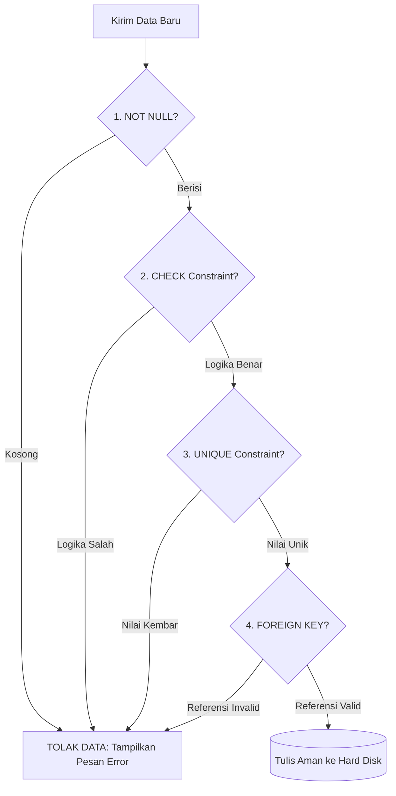

# 02 - BAB 02 POSTGRESQL SEBAGAI PENJAGA INTEGRITAS DATA

Status: DRAFT
Rak: Orientasi, Sejarah, dan Fondasi PostgreSQL
Buku: Filosofi dan Mental Model PostgreSQL
Level: Level 0 - Level 1
Tipe Materi: Tutorial
Target: Pemula yang baru mengenal PostgreSQL.
Estimasi Baca: 10 Menit
Terakhir Diperiksa: 2026-05-17

Sumber Utama: PostgreSQL Official Documentation
Versi Referensi: PostgreSQL docs/current
Status Verifikasi Sumber: REVIEW

---

## 1. Tujuan Belajar
Di akhir bab ini, pembaca diharapkan mampu:
- Menjelaskan mengapa penegakan integritas data wajib ditangani langsung di tingkat database (bukan hanya mengandalkan kode backend).
- Menyebutkan dan menjelaskan fungsi 5 jenis batasan data (*constraints*) utama di PostgreSQL.
- Menerangkan konsep Transaksi Database secara sederhana serta memahami pilar dasar **ACID** secara intuitif.
- Membaca kueri transaksi SQL dasar yang menggunakan perintah pembatalan (*rollback*) dan pengesahan (*commit*).

## 2. Prasyarat
- Memahami dasar filosofi database relasional berbasis tabel (baca: [Filosofi Relational Database](./bab-01-filosofi-relational-database.md)).
- Mengetahui bahwa database berinteraksi dengan SQL kueri (baca: [Struktur Perintah SELECT](../../buku-01-orientasi-postgresql/bab-01-apa-itu-postgresql.md)).

## 3. Ringkasan Cepat
Integritas data adalah fondasi utama dari keandalan arsitektur backend sistem informasi. Di PostgreSQL, penegakan kebenaran data tidak diserahkan sepenuhnya ke kode aplikasi luar yang rentan mengalami kesalahan kode (*bug*), melainkan dikunci rapat di tingkat database melalui mekanisme **Constraints** (batasan nilai) dan **Transactions** (proses penulisan aman). Dengan jaminan kepatuhan penuh pada prinsip transaksi **ACID**, PostgreSQL memastikan data Anda selalu utuh, valid, konsisten, dan aman dari kerusakan meskipun server database mendadak mati lampu di tengah jalan.

## 4. Istilah Penting di Bab Ini

| Istilah | Arti Singkat |
|---|---|
| Integrity Constraint | Aturan pembatasan nilai yang dipasang di kolom tabel untuk menolak data yang tidak valid. |
| Null / Not Null | Kondisi kolom yang mengizinkan data kosong (Null) atau melarang keras data kosong (Not Null). |
| Unique Constraint | Batasan yang menjamin tidak boleh ada nilai kembar pada kolom yang sama di seluruh baris tabel. |
| Check Constraint | Batasan logika khusus untuk menyaring kelayakan nilai data berdasarkan rumus matematika sederhana. |
| Transaction | Satu paket rangkaian instruksi SQL yang wajib dieksekusi seutuhnya (semua sukses atau semua batal). |
| ACID | Pilar standar keandalan transaksi database: Atomicity, Consistency, Isolation, Durability. |

## 5. Analogi Sehari-hari
Mari kita analogikan aturan integritas data database dengan **Aturan Masuk Pintu Stasiun Kereta Api Listrik**:

- **Not Null Constraint (Tiket Fisik)**: Setiap penumpang yang ingin melewati gerbang stasiun wajib menunjukkan tiket fisik (nilai kolom tidak boleh dibiarkan kosong/null).
- **Unique Constraint (Nomor Kursi Gerbong)**: Di dalam tiket tertera nomor kursi gerbong yang spesifik. Sistem stasiun melarang keras mencetak dua tiket dengan nomor kursi yang persis sama di hari yang sama agar tidak ada penumpang yang berebut kursi (menolak data kembar).
- **Check Constraint (Alat Ukur Tinggi Badan)**: Pintu masuk peron anak-anak memiliki penggaris pengukur tinggi badan. Anak-anak hanya diperbolehkan masuk gratis jika tinggi badan mereka di bawah 120 cm (pembatasan nilai berdasarkan rumus logika matematis sederhana).
- **Foreign Key Constraint (Gelang Pengenal Anak)**: Seorang anak kecil (Tabel Anak/Tabel Anak) tidak diizinkan masuk ke area peron sendirian tanpa didampingi orang tua (Tabel Orang Tua/Tabel Induk) yang memiliki tiket dewasa valid. Jika orang tuanya keluar dari stasiun, anak kecil tersebut juga secara otomatis harus ikut keluar (analogi dari pengaturan `ON DELETE CASCADE` di database).
- **Transaction (Proses Pembelian Tiket di Kasir)**:
  Proses pembelian tiket terdiri atas 3 langkah yang berurutan: (1) Kasir menerima uang dari Anda, (2) Kasir mencetak tiket fisik, (3) Kasir memperbarui data stok tiket di komputer stasiun.
  - Jika printer tiket macet di langkah kedua, kasir wajib membatalkan seluruh transaksi: uang dikembalikan ke tangan Anda, dan stok tiket di komputer stasiun tidak jadi berkurang. Proses ini harus berjalan sukses 100% atau dibatalkan total 0% (prinsip **Atomicity**). Tidak boleh ada kondisi gantung di mana uang Anda diambil kasir, tetapi tiket Anda gagal dicetak.

## 6. Batas Analogi
Di stasiun kereta fisik dunia nyata, kasir manusia mungkin saja melakukan kesalahan akibat mengantuk (human error) sehingga lupa mengembalikan uang Anda saat mesin printer tiket macet.

Di dalam mesin PostgreSQL digital, engine manajemen transaksi menjamin pembatalan (*rollback*) data berjalan 100% aman tanpa sisa sampah data tersisa di memori penyimpanan, serta tidak terpengaruh oleh faktor kelalaian manusia.

## 7. Ilustrasi Konsep

Status Ilustrasi: DRAFT



## 8. Penjelasan Ilustrasi
Bagan alir di atas menggambarkan pos-pos pemeriksaan keamanan data di PostgreSQL. Setiap kali program aplikasi backend mengirimkan data baru (misal registrasi akun), data tersebut tidak langsung ditulis ke media penyimpanan fisik. Data wajib melewati gerbang validasi berlapis: mulai dari verifikasi keberadaan data (`NOT NULL`), penyaringan logika data (`CHECK`), pengecekan duplikasi data (`UNIQUE`), hingga verifikasi hubungan data (`FOREIGN KEY`). Jika ada satu gerbang saja yang gagal meloloskan data, kueri akan langsung digagalkan secara instan dan data ditolak sebelum masuk ke disk.

## 9. Batas Ilustrasi
Bagan alir di atas disederhanakan untuk tingkat pemula. Proses validasi yang sesungguhnya di dalam PostgreSQL berjalan secara paralel dan melibatkan pemeriksaan tipe data (*data type constraints*), aturan pemicu kustom (*trigger constraints*), serta validasi indeks pendukung (*index validation*) yang bekerja secara simultan di belakang layar.

## 10. Konsep Inti

### 1. Mengapa Validasi Database Mutlak Diperlukan?
Banyak developer pemula beranggapan: *"Saya sudah memvalidasi format email dan batas harga di kode JavaScript backend saya, jadi tabel database saya buat polos tanpa constraint saja."*

Ini adalah **bencana besar** di dunia nyata karena:
- Kode backend Anda bisa mengalami *bug* akibat perubahan logika atau salah ketik kode program oleh anggota tim developer lain.
- Database seringkali diakses oleh banyak pintu gerbang: backend utama, script migrasi data manual, atau aplikasi analisis data milik divisi lain. Validasi di tingkat database adalah **benteng pertahanan terakhir** yang dijamin 100% selalu aktif siapa pun pihak yang mencoba memasukkan data.

### 2. Lima Jenis Constraints Utama di PostgreSQL

1.  **NOT NULL**: Memaksa agar kolom wajib diisi nilai (dilarang dibiarkan kosong/null).
2.  **UNIQUE**: Menjamin nilai pada kolom tersebut tidak boleh kembar di seluruh baris tabel (contoh: nomor HP, email).
3.  **PRIMARY KEY**: Gabungan dari `NOT NULL` dan `UNIQUE`. Digunakan sebagai kartu tanda pengenal utama baris data di tabel.
4.  **FOREIGN KEY**: Menjamin nilai kolom merujuk secara valid ke baris data di tabel induk (menjaga integritas referensial).
5.  **CHECK**: Memastikan nilai kolom mematuhi ekspresi kondisi matematika tertentu (contoh: kolom harga harus > 0).

### 3. Pilar ACID dalam Transaksi Database secara Sederhana
Transaksi adalah satu bundel perintah SQL yang harus dieksekusi bersamaan. Keandalan transaksi ini dijamin oleh standar **ACID**:
- **Atomicity (Atomik)**: Transaksi seperti atom terkecil yang tidak bisa dibagi. Semua langkah kueri harus berhasil dieksekusi seutuhnya, atau dibatalkan total tanpa ada sisa (Prinsip: *All or Nothing*).
- **Consistency (Konsisten)**: Transaksi hanya boleh memindahkan database dari satu kondisi valid ke kondisi valid lainnya mengikuti aturan *constraints* yang dipasang.
- **Isolation (Terisolasi)**: Jika ada dua transaksi berjalan bersamaan, transaksi A dilarang mengintip atau mengganggu proses yang sedang dilakukan transaksi B hingga transaksi B selesai.
- **Durability (Tahan Lama)**: Sekali transaksi dinyatakan sukses (*committed*), datanya dijamin tersimpan permanen di disk baja dan tidak akan hilang meskipun setelah itu server mati total akibat korsleting listrik.

## 11. Penjelasan Detail

### Bagaimana PostgreSQL Menjamin Durability (Daya Tahan)?
Ketika Anda menekan tombol transfer uang, PostgreSQL tidak langsung menulis data tersebut ke dalam file tabel utama di harddisk karena proses menulis ke harddisk fisik memakan waktu lambat.

Sebagai gantinya, PostgreSQL menulis catatan transaksi tersebut ke dalam buku log khusus yang sangat cepat bernama **Write-Ahead Log (WAL)** di memori disk. Jika server mendadak mati listrik tepat setelah transaksi sukses, saat menyala kembali, PostgreSQL akan membaca berkas **WAL** tersebut dan menulis ulang data yang sempat tertunda ke tabel utama (*recovery process*). Hal inilah yang menjamin data Anda tetap aman 100%.

## 12. Contoh SQL Dasar
Berikut adalah pembuatan tabel `produk` yang menggunakan 5 pilar constraint utama untuk mengunci kelayakan data di PostgreSQL:

```sql
-- Membuat tabel produk dengan validasi ketat tingkat database
CREATE TABLE produk (
    produk_id INT GENERATED ALWAYS AS IDENTITY PRIMARY KEY, -- Primary Key otomatis
    nama_produk VARCHAR(150) NOT NULL, -- Kolom tidak boleh kosong
    kode_barcode VARCHAR(50) UNIQUE, -- Kode barcode tidak boleh kembar
    harga NUMERIC(12, 2) NOT NULL,
    stok INT DEFAULT 0,
    
    -- CHECK constraint menjamin harga dan stok tidak boleh bernilai negatif
    CONSTRAINT chk_harga_positif CHECK (harga > 0),
    CONSTRAINT chk_stok_positif CHECK (stok >= 0)
);
```

## 13. Contoh SQL Praktik Project
Berikut adalah simulasi nyata transaksi perbankan untuk transfer saldo antar rekening guna menunjukkan cara kerja pilar **Atomicity** menggunakan transaksi aman di PostgreSQL:

```sql
-- Memulai blok transaksi aman
BEGIN;

-- 1. Mengurangi saldo Budi sebesar Rp 100.000
UPDATE rekening 
SET saldo = saldo - 100000 
WHERE nama_pemilik = 'Budi';

-- 2. Menambah saldo Ani sebesar Rp 100.000
UPDATE rekening 
SET saldo = saldo + 100000 
WHERE nama_pemilik = 'Ani';

-- Kueri di bawah ini opsional untuk disimulasikan:
-- Jika saldo Budi ternyata kurang dari Rp 100.000 (memicu check constraint), 
-- PostgreSQL akan membatalkan seluruh transaksi secara otomatis.
-- Namun jika sukses, kita mengesahkan penulisan data ke disk:
COMMIT;
```

## 14. Kesalahan Umum
- **Membiarkan Skema Tabel Polos**: Membuat database tanpa constraints sama sekali dengan alasan agar proses tulis data terasa lebih fleksibel dan cepat saat coding awal. Kebiasaan ini akan melahirkan "data sampah" (misal ada transaksi bernilai minus, email kembar, data tanpa pemilik) yang memicu *crash* aplikasi backend di kemudian hari.
- **Transaksi Terlalu Panjang**: Membiarkan blok transaksi (`BEGIN` ... `COMMIT`) terbuka terlalu lama di backend (misal menunggu proses panggilan API pihak ketiga di dalam transaksi). Hal ini akan mengunci (*lock*) tabel database dan membuat pengguna lain tidak bisa bertransaksi.

## 15. Catatan Interview
- **Pertanyaan**: "Mengapa kita harus menggunakan transaksi (`BEGIN` & `COMMIT`) saat melakukan operasi transfer saldo bank, dan apa yang terjadi jika kita hanya mengirim kueri UPDATE biasa satu per satu tanpa blok transaksi?"
- **Jawaban**: "Jika kita menggunakan kueri UPDATE biasa satu per satu tanpa transaksi, kita melanggar prinsip *Atomicity*. Jika kueri pertama sukses (saldo pengirim berkurang), lalu tiba-tiba server mati listrik atau koneksi jaringan terputus sebelum kueri kedua dijalankan (saldo penerima bertambah), uang tersebut akan hilang menguap dari sistem. Dengan blok transaksi, PostgreSQL menjamin jika kueri kedua gagal dijalankan, kueri pertama yang sempat sukses akan dibatalkan total (*rollback*) sehingga saldo pengirim kembali utuh."

## 16. Catatan Diskusi User
- **Pertanyaan Umum**: "Apakah penegakan constraints di PostgreSQL dapat memperlambat proses penulisan data?"
- **Diskusikan**: Ya, ada sedikit beban komputasi tambahan (*overhead*) karena PostgreSQL harus memvalidasi aturan setiap kali ada data masuk. Namun, penurunan performa ini sangat kecil (hampir tidak terasa untuk skala aplikasi umum) dibandingkan dengan tingginya nilai keamanan data yang diperoleh. Di dunia industri profesional, kecepatan tanpa akurasi data adalah kesia-siaan yang berbahaya.

## 17. Latihan Kecil
1. Tuliskan query untuk membuat tabel `karyawan` dengan ketentuan: kolom `email` harus unik, `gaji` minimal Rp 3.000.000, dan kolom `nama` tidak boleh kosong!
2. Jelaskan dengan pemahaman Anda sendiri, apa perbedaan fungsional antara perintah `COMMIT` dengan `ROLLBACK` di akhir blok transaksi SQL!

## 18. Checklist Pemahaman
- [ ] Memahami alasan mengapa validasi di sisi aplikasi backend saja tidak cukup untuk menjaga keamanan data.
- [ ] Mampu menyebutkan dan menjelaskan fungsi 5 jenis constraint utama di PostgreSQL.
- [ ] Mampu menerangkan pengertian empat pilar ACID transaksi database secara sederhana.
- [ ] Mengetahui cara kerja Write-Ahead Log (WAL) dalam menjaga daya tahan (*durability*) data.

## 19. Hubungan dengan Materi Lain

### Posisi Materi
- Rak: [01 - Orientasi, Sejarah, dan Fondasi PostgreSQL](../../README.md)
- Buku: [Filosofi dan Mental Model PostgreSQL](../)

### Prasyarat
- [Filosofi Relational Database](./bab-01-filosofi-relational-database.md)

### Materi Sebelumnya
- [Filosofi Relational Database](./bab-01-filosofi-relational-database.md)

### Materi Berikutnya
- [Analogi PostgreSQL untuk Pemula](./bab-03-analogi-postgresql-untuk-pemula.md)

### Materi Terkait
- [Transaksi, Concurrency, dan MVCC](../../06-transaksi-concurrency-dan-mvcc/) (Membahas isolasi transaksi tingkat mendalam)

### Istilah Terkait
- Integrity Constraints, Atomicity, Durability, Write-Ahead Log, Commit, Rollback, Foreign Key Cascade.

## 20. Referensi Resmi
Jangan membuka tautan berikut pada batch ini, cukup cantumkan sebagai referensi resmi yang ditargetkan untuk verifikasi nanti:
- PostgreSQL Official Documentation — perlu diverifikasi pada batch official docs verification.
- SQL standard / relational database concept — perlu diverifikasi jika nanti masuk fase source verification.

## 21. Catatan Pribadi / Project Notes
*   *Catatan Draft*: Draft ini dirancang untuk menanamkan rasa hormat terhadap integritas data. Developer harus mengerti bahwa data yang rusak adalah mimpi buruk terbesar di arsitektur backend, dan PostgreSQL menyediakan fitur pengamanan terbaik di kelasnya untuk mencegah hal tersebut. Status verifikasi diatur ke REVIEW.
