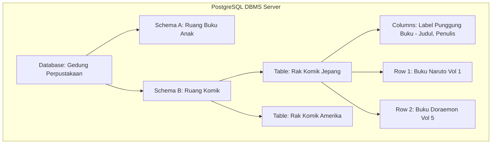

# 03 - BAB 03 ANALOGI POSTGRESQL UNTUK PEMULA

Status: DRAFT
Rak: Orientasi, Sejarah, dan Fondasi PostgreSQL
Buku: Filosofi dan Mental Model PostgreSQL
Level: Level 0 - Level 1
Tipe Materi: Tutorial
Target: Pemula yang baru mengenal PostgreSQL.
Estimasi Baca: 10 Menit
Terakhir Diperiksa: 2026-05-17

Sumber Utama: PostgreSQL Official Documentation
Versi Referensi: PostgreSQL docs/current
Status Verifikasi Sumber: REVIEW

---

## 1. Tujuan Belajar
Di akhir bab ini, pembaca diharapkan mampu:
- Membangun mental model (*mental model*) yang kuat mengenai komponen-komponen database relasional menggunakan analogi dunia nyata.
- Menghubungkan istilah teknis abstrak (database, schema, table, row, column, constraint, transaction) dengan objek konkret sehari-hari secara tepat.
- Mengidentifikasi batasan dari setiap analogi agar terhindar dari kesalahpahaman konsep teknis yang sesungguhnya.
- Meningkatkan kemampuan komunikasi teknis dalam menjelaskan konsep database kepada orang awam atau rekan kerja non-teknis.

## 2. Prasyarat
- Memahami peran PostgreSQL sebagai penjaga integritas data (baca: [PostgreSQL sebagai Penjaga Integritas Data](./bab-02-postgresql-sebagai-penjaga-integritas-data.md)).
- Mengetahui bahwa database relasional terdiri atas struktur tabel dan relasi data (baca: [Filosofi Relational Database](./bab-01-filosofi-relational-database.md)).

## 3. Ringkasan Cepat
Mempelajari istilah teknologi baru seringkali terasa membingungkan jika langsung dihadapkan pada tumpukan istilah teknis yang kering dan abstrak. Bab ini menyajikan serangkaian analogi sederhana—mulai dari gedung perpustakaan kota hingga kasir swalayan—untuk membantu Anda memvisualisasikan bagaimana komponen-komponen utama PostgreSQL bekerja sama secara harmonis. Namun, ingatlah selalu bahwa analogi hanyalah jembatan visualisasi sementara; memahami batas analogi adalah kunci mutlak untuk menguasai konsep teknis yang sesungguhnya secara mendalam.

## 4. Istilah Penting di Bab Ini

| Istilah | Arti Singkat |
|---|---|
| Mental Model | Pola pikir atau representasi intuitif di dalam benak manusia untuk memahami cara kerja suatu sistem. |
| Database | Kontainer utama tingkat sistem operasi yang mengisolasi seluruh data dan konfigurasi aplikasi. |
| Schema | Folder pembagi logis di dalam database untuk merapikan kelompok tabel agar tidak saling bercampur. |
| Table | Struktur penyimpan data dua dimensi yang memiliki baris dan kolom dengan tema sejenis. |
| Row | Satu baris data tunggal yang memuat satu record informasi utuh dari suatu objek nyata. |
| Column | Atribut penjelas yang mendefinisikan jenis data spesifik yang wajib diisi oleh setiap baris tabel. |

## 5. Analogi Sehari-hari
Mari kita visualisasikan arsitektur PostgreSQL dengan menganalogikannya sebagai **Gedung Perpustakaan Kota Raksasa**:

- **Database = Gedung Perpustakaan Utama**: Sebuah gedung mandiri yang terpisah kokoh. Di dalam kota, Anda bisa memiliki Gedung Perpustakaan Sekolah, Gedung Perpustakaan Umum, dan Gedung Arsip Negara (analogi dari memiliki banyak *databases* mandiri di server PostgreSQL Anda). Pengunjung di satu gedung tidak bisa melihat buku di gedung lain kecuali jika mereka keluar dan berpindah gedung secara fisik.
- **Schema = Ruang Kategori Khusus di Dalam Gedung**: Di dalam perpustakaan, buku-buku dipecah ke dalam beberapa ruangan khusus agar tidak berantakan: ada *Ruang Buku Anak-anak*, *Ruang Referensi Sejarah*, dan *Ruang Komik Populer* (analogi dari *schemas*). Ruangan-ruangan ini memisahkan isi buku agar tidak tercampur baur, meskipun semuanya masih berada di dalam satu atap gedung yang sama.
- **Table = Lemari Rak Buku Khusus**: Di dalam Ruang Komik Populer, terdapat lemari khusus bertuliskan *Rak Komik Jepang* (analogi dari *tables*). Rak ini dirancang dengan ukuran spesifik untuk menyimpan tumpukan komik dengan tema sejenis saja, terpisah dari rak komik Amerika.
- **Row = Satu Buku Fisik Utuh**: Di atas lemari rak komik Jepang, berbaris rapi buku-buku komik. Setiap satu buku fisik komik (misal: Komik Naruto Volume 1) adalah analogi dari satu baris data (*rows/tuples*). Buku tersebut menyimpan satu informasi lengkap tentang satu objek komik tertentu dari awal hingga akhir halaman.
- **Column = Label Informasi di Punggung Buku**: Setiap buku yang diletakkan di rak komik Jepang wajib memiliki label informasi yang tertulis seragam di punggung bukunya: Judul, Penulis, Penerbit, dan Jumlah Halaman (analogi dari *columns/attributes*). Tidak boleh ada buku di rak tersebut yang memiliki label punggung buku yang berbeda formatnya (misalnya ada buku yang menuliskan "Jenis Mesin" di punggungnya, karena itu bukan atribut komik).
- **Constraint = Aturan Peminjaman Buku**: Penjaga perpustakaan menetapkan aturan ketat: Anda dilarang meminjam buku jika tidak membawa kartu anggota (Not Null), atau Anda hanya diperbolehkan meminjam maksimal 3 buku sekaligus (Check Constraint). Jika Anda melanggar aturan ini, penjaga akan menolak proses peminjaman Anda di pintu keluar.
- **Transaction = Meja Kasir Peminjaman Buku**: Proses peminjaman buku oleh petugas kasir harus melalui 3 langkah wajib: (1) Petugas men-scan kartu anggota Anda, (2) Petugas men-scan kode barcode buku, (3) Petugas menempelkan stempel tanggal pengembalian di lembar belakang buku.
  Jika saat langkah ketiga tinta stempel habis atau komputer kasir mendadak mati lampu, petugas kasir wajib membatalkan seluruh proses dari awal: buku tidak boleh Anda bawa pulang, dan status kartu anggota Anda dikembalikan seperti semula seolah-olah tidak pernah terjadi peminjaman (Rollback).

## 6. Batas Analogi
Meskipun analogi Perpustakaan Kota sangat membantu visualisasi awal, terdapat batas-batas penting yang membedakannya dengan PostgreSQL digital:

- **Batas Database / Gedung Perpustakaan**: Gedung perpustakaan fisik memiliki batasan dinding beton yang kaku dan batas kapasitas berat beban buku. Di PostgreSQL digital, database tidak memiliki batas kapasitas fisik ruangan; ia dapat menyimpan miliaran baris data lintas server tanpa batas fisik ruang, selama media harddisk server terus ditambah kapasitas penyimpanannya.
- **Batas Row / Buku**: Buku fisik di perpustakaan nyata dapat usang digigit rayap, kertasnya menguning, robek, atau hilang dicuri pengunjung. Data baris (*row*) di PostgreSQL tersimpan secara bit digital yang tidak akan pernah lapuk oleh usia, aman dari pencurian fisik, dan dapat diduplikasi miliaran kali secara instan tanpa menurunkan kualitas data aslinya.
- **Batas Transaction / Kasir**: Petugas kasir manusia di meja perpustakaan fisik mungkin saja melakukan kesalahan mencatat akibat kelelahan bekerja (human error). Sistem transaksi PostgreSQL dikendalikan oleh algoritma matematika murni tingkat rendah yang dijamin bebas dari faktor kelelahan manusia.

## 7. Ilustrasi Konsep

Status Ilustrasi: DRAFT



## 8. Penjelasan Ilustrasi
Bagan hierarki di atas menggambarkan bagaimana komponen-komponen PostgreSQL terstruktur secara modular mirip dengan pembagian area di perpustakaan fisik. DBMS server bertindak sebagai kompleks wilayahnya, di mana di dalamnya kita bisa membuat kontainer mandiri bernama `Database`. Di dalam database, kita membagi ruang lingkup secara logis menggunakan `Schema`. Di dalam skema, kita membangun cetakan wadah bernama `Table`. Tabel tersebut mendefinisikan aturan kolom (`Columns`) sebagai cetakan kolom informasi, dan menampung barisan data nyata berbentuk baris (`Rows`).

## 9. Batas Ilustrasi
Hierarki visual di atas disederhanakan untuk menggambarkan hubungan struktural satu arah. Bagian ini tidak menampilkan hubungan lintas skema (misalnya jika buku di Ruang Anak memiliki referensi silang ke Ruang Komik), proses pembagian indeks memori (*indexes*), atau pengaturan hak akses keamanan (*roles/permissions*) yang membatasi pengunjung stasiun masuk ke ruangan tertentu.

## 10. Konsep Inti

### Peta Koreksi Istilah: Analogi vs Teknis Medis

| Komponen Analogi | Istilah Teknis PostgreSQL | Karakteristik Teknis Sesungguhnya |
|---|---|---|
| Gedung Perpustakaan | **Database** | Ruang isolasi memori dan katalog sistem utama. Transaksi lintas database secara *default* dilarang di PostgreSQL. |
| Ruang Kategori Buku | **Schema** | Namespace logis. Digunakan untuk merapikan otorisasi akses dan menghindari bentrokan nama tabel yang sama. |
| Lemari Rak Buku | **Table** | Entitas relasional. Kumpulan baris data terstruktur yang disimpan secara berurutan di dalam disk media penyimpanan. |
| Satu Buku Fisik | **Row / Tuple** | Satu baris data mentah utuh yang diidentifikasi oleh Primary Key unik. |
| Label Punggung Buku | **Column / Attribute** | Variabel data yang memiliki tipe data kustom tertentu (seperti Integer, Varchar, Date) dan aturan constraints. |
| Aturan Peminjaman | **Constraint** | Filter logika tingkat rendah (Not Null, Unique, Check, Foreign Key) yang dipasang di mesin database. |
| Proses Kasir | **Transaction** | Unit kerja logis (BEGIN ... COMMIT/ROLLBACK) untuk menjamin pilar konsistensi ACID database. |

## 11. Penjelasan Detail

### Mengapa Pemula Harus Memahami Konsep "Schema"?
Banyak pemula yang bermigrasi dari MySQL merasa bingung dengan istilah "Schema" di PostgreSQL. Di MySQL, perintah `CREATE DATABASE` dan `CREATE SCHEMA` adalah hal yang sama persis (sinonim). 

Di PostgreSQL, keduanya berbeda secara hierarki filosofi:
- **Database** adalah entitas yang terisolasi total secara fisik. Anda tidak bisa melakukan kueri `JOIN` lintas database dengan mudah.
- **Schema** adalah folder di dalam database tersebut. Anda dapat membuat puluhan skema di dalam satu database yang sama (misal skema `keuangan`, skema `sumber_daya_manusia`) dan Anda **sangat mudah** melakukan kueri `JOIN` lintas skema tersebut karena mereka masih berada di dalam satu database yang sama. Memahami analogi "Ruangan di dalam Gedung" membantu Anda merancang arsitektur database multi-tenant yang sangat rapi.

## 12. Contoh SQL Dasar
Berikut adalah cara menerjemahkan analogi perpustakaan dan ruang buku anak ke dalam baris perintah SQL nyata di PostgreSQL:

```sql
-- 1. Membuat skema (Ruangan Kategori Buku)
CREATE SCHEMA kategori_komik;

-- 2. Membuat tabel di dalam skema tersebut (Rak Komik Jepang di dalam Ruang Komik)
CREATE TABLE kategori_komik.rak_komik_jepang (
    id SERIAL PRIMARY KEY,
    judul VARCHAR(200) NOT NULL, -- Kolom label punggung buku
    penulis VARCHAR(150) NOT NULL,
    jumlah_halaman INT CHECK (jumlah_halaman > 0) -- Constraint aturan halaman
);
```

## 13. Contoh SQL Praktik Project
Bagaimana aplikasi backend memasukkan data buku baru (buku Naruto) dan membacanya kembali dari skema khusus di atas menggunakan SQL?

```sql
-- Memasukkan baris data (buku komik Naruto) ke rak komik Jepang di dalam ruang komik
INSERT INTO kategori_komik.rak_komik_jepang (judul, penulis, jumlah_halaman) 
VALUES ('Naruto Vol 1', 'Masashi Kishimoto', 192);

-- Membaca seluruh daftar buku yang berada di rak komik Jepang tersebut
SELECT judul, penulis, jumlah_halaman 
FROM kategori_komik.rak_komik_jepang;
```

## 14. Kesalahan Umum
- **Menganggap Analogi Sebagai Batasan Teknis**: Mengira bahwa membuat skema (*schema*) baru di PostgreSQL adalah proses yang lambat dan memakan biaya memori RAM server yang besar seperti halnya membangun dinding beton fisik ruangan baru di perpustakaan asli. Padahal di PostgreSQL, membuat skema baru terjadi dalam hitungan milidetik dan gratis tanpa memakan beban server sama sekali.
- **Tercampurnya Skema Publik**: Menumpuk seluruh tabel aplikasi di dalam skema bawaan default bernama `public`. Seiring berjalannya proyek membesar, database akan berantakan dan sulit dikelola tingkat keamanannya. Manfaatkan skema kustom untuk merapikan kelompok tabel Anda.

## 15. Catatan Interview
- **Pertanyaan**: "Bagaimana Anda menjelaskan perbedaan antara konsep Database dengan Schema di PostgreSQL kepada seorang klien bisnis non-teknis yang awam?"
- **Jawaban**: "Saya akan menganalogikannya sebagai Gedung Perusahaan dan Divisi Kerja di dalamnya. Database adalah Gedung Perusahaan yang berdiri mandiri; satu gedung terisolasi total dari gedung perusahaan lain demi alasan keamanan dan privasi. Sedangkan Schema adalah Divisi Kerja (seperti Divisi Keuangan dan Divisi Pemasaran) yang berada di dalam satu atap gedung yang sama. Karyawan antar divisi kerja tersebut dapat saling berkolaborasi dan bertukar data dengan mudah (kueri JOIN lintas skema), namun mereka tetap diatur dalam batas ruangan kerja masing-masing agar rapi."

## 16. Catatan Diskusi User
- **Pertanyaan Umum**: "Apakah kita bisa mengakses tabel dari skema lain tanpa menuliskan nama skemanya di depan nama tabel?"
- **Diskusikan**: Bisa. PostgreSQL memiliki pengaturan konfigurasi bernama `search_path` (mirip seperti variabel PATH di sistem operasi Windows/Linux). Kita bisa mendaftarkan nama-nama skema tepercaya di dalam `search_path` tersebut, sehingga saat kita menuliskan kueri `SELECT * FROM rak_komik_jepang`, PostgreSQL akan otomatis mencari lemari rak tersebut di dalam daftar ruangan skema yang sudah didaftarkan secara berurutan.

## 17. Latihan Kecil
1. Buatlah analogi tandingan mandiri menggunakan imajinasi Anda sendiri untuk menggambarkan komponen-komponen database relasional menggunakan skenario **Gedung Rumah Sakit** (Petunjuk: Hubungkan Gedung RS, Poli Dokter, Lemari Berkas Pasien, Nama Pasien, Aturan Umur Pasien, dan Proses Administrasi Kasir)!
2. Tuliskan query SQL untuk membuat skema baru bernama `kategori_novel` di PostgreSQL!

## 18. Checklist Pemahaman
- [ ] Mampu memetakan korelasi antara objek perpustakaan fisik dengan istilah teknis database relasional.
- [ ] Memahami perbedaan filosofi hierarki antara konsep Database dengan Schema di PostgreSQL.
- [ ] Mengetahui bahaya kesalahan pemahaman akibat keterbatasan analogi dunia nyata.
- [ ] Mampu menuliskan sintaks pemanggilan tabel yang berada di dalam skema kustom secara presisi.

## 19. Hubungan dengan Materi Lain

### Posisi Materi
- Rak: [01 - Orientasi, Sejarah, dan Fondasi PostgreSQL](../../README.md)
- Buku: [Filosofi dan Mental Model PostgreSQL](../)

### Prasyarat
- [PostgreSQL sebagai Penjaga Integritas Data](./bab-02-postgresql-sebagai-penjaga-integritas-data.md)

### Materi Sebelumnya
- [PostgreSQL sebagai Penjaga Integritas Data](./bab-02-postgresql-sebagai-penjaga-integritas-data.md)

### Materi Berikutnya
- [Database, Table, Row, dan Column](../buku-04-fondasi-konsep-database/bab-01-database-table-row-dan-column.md)

### Materi Terkait
- [Desain Data dan Schema](../../03-desain-data-dan-schema/) (Membahas skema tingkat mendalam)

### Istilah Terkait
- Database Instance, Logical Namespace, Relational Table, Search Path, Database Transaction.

## 20. Referensi Resmi
Jangan membuka tautan berikut pada batch ini, cukup cantumkan sebagai referensi resmi yang ditargetkan untuk verifikasi nanti:
- PostgreSQL Official Documentation — perlu diverifikasi pada batch official docs verification.
- SQL standard / relational database concept — perlu diverifikasi jika nanti masuk fase source verification.

## 21. Catatan Pribadi / Project Notes
*   *Catatan Draft*: Bab analogi ini sengaja diletakkan di akhir Buku 3 Rak 1 untuk merekatkan seluruh pemahaman abstrak yang telah dipelajari di bab-bab sebelumnya. Penggunaan gaya bercerita analogi terbukti sangat efektif untuk mempercepat penyerapan konsep arsitektur database relasional bagi pemula backend. Status verifikasi diatur ke REVIEW.
