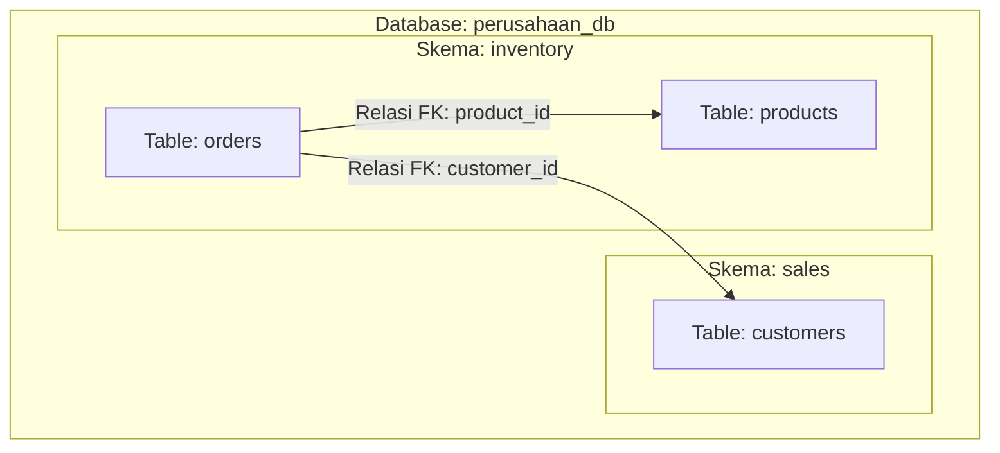

# 02 - BAB 02 SCHEMA DAN RELASI

Status: DRAFT
Rak: Orientasi, Sejarah, dan Fondasi PostgreSQL
Buku: Fondasi Konsep Database
Level: Level 0 - Level 1
Tipe Materi: Tutorial
Target: Pemula yang baru mengenal PostgreSQL.
Estimasi Baca: 10 Menit
Terakhir Diperiksa: 2026-05-17

Sumber Utama: PostgreSQL Official Documentation
Versi Referensi: PostgreSQL docs/current
Status Verifikasi Sumber: REVIEW

---

## 1. Tujuan Belajar
Di akhir bab ini, pembaca diharapkan mampu:
- Memahami konsep Schema sebagai namespace pengelompokan logis objek database di PostgreSQL.
- Menjelaskan perbedaan fungsional dan batas hierarki antara Database, Schema, Table, dan Relasi.
- Memahami konsep Relasi (*relationship*) sebagai jembatan logis yang menghubungkan tabel-tabel terpisah berbasis key.
- Mampu menuliskan perintah SQL pembuatan schema baru dan pembuatan tabel relasional lintas skema menggunakan *Dot Notation*.

## 2. Prasyarat
- Memahami konsep dasar Database, Table, Row, dan Column (baca: [Database, Table, Row, dan Column](./bab-01-database-table-row-dan-column.md)).
- Memahami pentingnya Primary Key dan Foreign Key sebagai dasar relasi data (baca: [Pentingnya Primary Key](../../03-desain-data-dan-schema/buku-02-primary-key-foreign-key-dan-constraint/bab-01-pentingnya-primary-key.md) dan [Foreign Key dan Referential Integrity](../../03-desain-data-dan-schema/buku-02-primary-key-foreign-key-dan-constraint/bab-02-foreign-key-dan-referential-integrity.md)).

## 3. Ringkasan Cepat
PostgreSQL mengorganisasikan data secara sangat rapi dan berstruktur tinggi. Di bawah tingkat **Database** fisik utama, terdapat kontainer logis bernama **Schema** yang berfungsi sebagai namespace (folder pembagi) untuk mengelompokkan tabel-tabel aplikasi secara rapi. Di dalam skema tersebut, tabel-tabel (**Table**) saling dihubungkan secara matematis menggunakan **Relasi** berbasis Primary Key dan Foreign Key untuk membentuk satu kesatuan arsitektur data bisnis yang kokoh.

## 4. Istilah Penting di Bab Ini

| Istilah | Arti Singkat |
|---|---|
| Schema | Namespace/kontainer logis di dalam database untuk merapikan objek tabel (seperti folder berkas). |
| Namespace | Batasan nama objek database agar tidak bentrok dengan nama objek sama di skema yang berbeda. |
| Relationship (Relasi) | Hubungan logis yang mengikat keterkaitan data di satu tabel dengan data di tabel lain. |
| Dot Notation | Format standar pemanggilan nama objek database menggunakan tanda titik pemisah (`skema.tabel`). |
| search_path | Konfigurasi urutan skema yang akan dicari oleh PostgreSQL jika kita memanggil tabel tanpa nama skema. |

## 5. Analogi Sehari-hari
Bayangkan Anda sedang mengunjungi sebuah **Gedung Perkantoran Perusahaan Besar (Database)**:
- **Database** adalah **Gedung Kantor Pusat**. Gedung ini mandiri secara fisik dan memiliki sistem gerbang keamanan terluar tersendiri.
- **Schema** adalah **Ruangan Divisi Kerja** di dalam gedung tersebut, seperti "Ruang Divisi Keuangan" dan "Ruang Divisi Gudang". Ruangan ini membatasi wilayah kerja. Di Divisi Keuangan diperbolehkan memiliki lemari arsip bernama "Buku Kas", dan di Divisi Gudang juga boleh memiliki lemari arsip bernama "Buku Kas" tanpa bentrok atau tertukar karena posisinya di ruangan berbeda.
- **Table** adalah **Lemari Arsip** bertopik khusus yang diletakkan di dalam masing-masing ruangan divisi tersebut.
- **Relationship / Relasi** adalah **Benang Merah Hubungan Formulir**: Di dalam lemari "Transaksi Penjualan" (Divisi Keuangan), terdapat formulir kuitansi yang memuat kolom "Nomor Rak Barang: A-12". Kolom ini memiliki benang merah yang merujuk langsung ke berkas detail posisi rak di lemari "Peta Lokasi Gudang" (Divisi Gudang) agar staf keuangan bisa mengetahui lokasi fisik barang tersebut secara akurat.

## 6. Batas Analogi
Di dunia fisik, staf Keuangan harus berjalan kaki keluar ruangan, membuka pintu ruangan Gudang secara manual, dan mencari berkas kertas satu per satu dengan risiko tersesat atau membuang waktu.

Di dalam PostgreSQL, penggabungan data lintas skema yang saling berelasi terjadi secara elektronik dalam hitungan milidetik. Melalui kueri *JOIN* dan penulisan *Dot Notation* (`keuangan.transaksi JOIN gudang.posisi`), database melompati batasan skema di tingkat memori RAM tanpa degradasi performa karena seluruh skema dalam satu database berbagi memori fisik yang sama (*shared buffers*).

## 7. Ilustrasi Konsep

Status Ilustrasi: DRAFT



## 8. Penjelasan Ilustrasi
Bagan di atas memperlihatkan struktur database perusahaan bernama `perusahaan_db`. Di dalamnya terdapat dua skema terpisah: skema `sales` (menampung tabel `customers`) dan skema `inventory` (menampung tabel `products` dan `orders`). Meskipun tabel-tabel tersebut berada di skema/namespace yang berbeda, mereka tetap dapat saling dihubungkan secara erat melalui **Relasi** Foreign Key dari tabel `orders` ke `customers` dan `products`.

## 9. Batas Ilustrasi
Diagram di atas hanya menampilkan relasi konseptual tingkat skema. Diagram ini tidak memperlihatkan konfigurasi hak akses keamanan (*privileges*) di mana user database tertentu bisa saja dilarang membaca data di skema `inventory` meskipun diizinkan membaca skema `sales`.

## 10. Konsep Inti
### Membedakan Empat Pilar Organisasi Data
1.  **Database (Isolasi Tertinggi)**: Batas fisik dan keamanan tertinggi server. Berbagi resource antar database sulit dan terisolasi ketat secara default.
2.  **Schema (Namespace Logis)**: Folder pengelompokan tabel di dalam database. Memudahkan pembagian hak akses per tim developer dan merapikan ratusan tabel modul agar tidak menumpuk di skema bawaan (`public`).
3.  **Table (Model Bisnis)**: Wadah fisik tempat baris-baris data disimpan berdasarkan topik entitas bisnis.
4.  **Relasi (Integrasi Data)**: Keterikatan logis antar tabel berbasis key constraint (Primary Key & Foreign Key) untuk menjaga agar tidak ada data rusak.

### Cara Memanggil Tabel Lintas Skema (*Dot Notation*)
Jika sebuah tabel tidak berada di dalam skema bawaan `public`, kita wajib memanggilnya dengan menyertakan nama skema di depan nama tabelnya menggunakan titik pemisah:
```text
nama_skema.nama_tabel
```
*Contoh*: `sales.customers` atau `inventory.products`.

## 11. Penjelasan Detail
### Merancang Arsitektur Skema yang Bersih
Secara default, jika Anda tidak membuat skema baru, PostgreSQL akan menaruh seluruh tabel Anda di skema bawaan bernama `public`. Menaruh ratusan tabel aplikasi di skema `public` secara terus-menerus adalah praktik buruk yang membuat administrasi database menjadi sangat kacau (seperti menaruh ribuan file pekerjaan langsung di desktop komputer tanpa folder). 

Dengan membagi tabel ke skema modular (seperti skema `sales`, skema `logistics`, skema `billing`), kita mendapatkan keuntungan:
*   Merapikan visualisasi struktur tabel untuk kolaborasi tim.
*   Mempermudah backup/restore per modul bisnis tertentu.
*   Mempermudah pembagian hak akses pengguna database (misal: user billing hanya boleh mengakses skema `billing` dan dilarang menyentuh skema `logistics`).

## 12. Contoh SQL Dasar
Berikut adalah cara menulis perintah SQL untuk mendefinisikan skema baru dan membuat tabel di dalamnya:

```sql
-- 1. Membuat skema baru bernama 'sales'
CREATE SCHEMA sales;

-- 2. Membuat tabel pelanggan di dalam skema 'sales' menggunakan Dot Notation
CREATE TABLE sales.pelanggan (
    pelanggan_id INT GENERATED ALWAYS AS IDENTITY PRIMARY KEY,
    nama VARCHAR(150) NOT NULL
);
```

## 13. Contoh SQL Praktik Project
Dalam skenario database e-commerce modular, kita memisahkan skema logistik (`logistics`) dengan skema penjualan (`sales`), lalu menghubungkannya menggunakan Foreign Key lintas skema secara presisi:

```sql
-- 1. Membuat skema untuk modul bisnis terpisah
CREATE SCHEMA logistics;
CREATE SCHEMA sales;

-- 2. Membuat tabel produk di skema logistics
CREATE TABLE logistics.produk (
    produk_id INT GENERATED ALWAYS AS IDENTITY PRIMARY KEY,
    nama_produk VARCHAR(150) NOT NULL,
    stok INT DEFAULT 0
);

-- 3. Membuat tabel pesanan di skema sales yang berelasi lintas skema ke logistics
CREATE TABLE sales.pesanan (
    pesanan_id INT GENERATED ALWAYS AS IDENTITY PRIMARY KEY,
    produk_id INT NOT NULL,
    jumlah_beli INT NOT NULL,
    CONSTRAINT fk_produk_logistics FOREIGN KEY (produk_id) 
        REFERENCES logistics.produk(produk_id) ON DELETE RESTRICT
);
```

## 14. Kesalahan Umum
- **Mengira Lintas Skema Tidak Bisa Berelasi**: Berasumsi bahwa tabel di skema berbeda tidak bisa digabungkan (*JOIN*) atau dihubungkan dengan Foreign Key. Padahal, selama masih berada di dalam **satu database yang sama**, relasi dan query lintas skema didukung penuh secara native oleh PostgreSQL tanpa kendala performa.
- **Malas Membuat Folder Skema**: Menolak membuat skema baru dan membiarkan ratusan tabel aplikasi bertumpuk berantakan di skema `public`.

## 15. Catatan Interview
- **Pertanyaan**: "Apa perbedaan mendasar antara memisahkan data menggunakan Multi-Database dengan memisahkan data menggunakan Multi-Schema di PostgreSQL?"
- **Jawaban**: "Multi-Database memberikan tingkat isolasi fisik dan keamanan tertinggi, di mana kita tidak bisa melakukan kueri *JOIN* langsung antar database tanpa ekstensi khusus (seperti dblink/postgres_fdw), dan mereka tidak berbagi koneksi memori yang sama. Sedangkan Multi-Schema adalah pemisahan logis (namespace) di dalam satu database tunggal; kita bisa melakukan *JOIN* lintas skema secara instan dan bebas tanpa penalti performa karena mereka berbagi resource memori (*shared buffers*) dan koneksi yang sama."

## 16. Catatan Diskusi User
- **Pertanyaan Umum**: "Bagaimana PostgreSQL tahu skema mana yang harus dicari jika saya menulis query tanpa menuliskan awalan nama skemanya secara lengkap?"
- **Diskusikan**: PostgreSQL memiliki konfigurasi sistem bernama `search_path`. Secara default, search_path diatur ke `"$user", public`. Artinya, jika Anda menulis `SELECT * FROM produk`, PostgreSQL pertama-tama akan mencari tabel tersebut di skema yang namanya sama dengan nama user Anda saat ini, dan jika tidak ada, ia mencari di skema `public`. Agar aman dari kesalahan cari, disarankan selalu menggunakan penulisan *Dot Notation* yang eksplisit untuk tabel non-public.

## 17. Latihan Kecil
1. Tuliskan query SQL untuk membuat skema baru bernama `finance`, lalu buat tabel `invoice` di dalam skema tersebut dengan kolom ID bertipe `IDENTITY`!
2. Jika Anda ingin menggabungkan (*JOIN*) tabel `invoice` di skema `finance` dengan tabel `pelanggan` di skema `sales`, tuliskan format penamaannya menggunakan *Dot Notation*!

## 18. Checklist Pemahaman
- [ ] Memahami perbedaan fungsi dan batas ruang lingkup Database, Schema, Table, dan Relasi.
- [ ] Mampu membuat skema baru menggunakan perintah `CREATE SCHEMA`.
- [ ] Mampu menuliskan pemanggilan tabel di luar skema public menggunakan *Dot Notation*.
- [ ] Mengetahui bahwa tabel lintas skema dapat saling dihubungkan dengan Foreign Key secara bebas.

## 19. Hubungan dengan Materi Lain

### Posisi Materi
- Rak: [01 - Orientasi, Sejarah, dan Fondasi PostgreSQL](../../README.md)
- Buku: [Fondasi Konsep Database](../)

### Prasyarat
- [Database, Table, Row, dan Column](./bab-01-database-table-row-dan-column.md)
- [Mengenal Schema PostgreSQL](../../03-desain-data-dan-schema/buku-01-konsep-table-schema-dan-relasi/bab-01-mengenal-schema-postgresql.md)

### Materi Sebelumnya
- [Database, Table, Row, dan Column](./bab-01-database-table-row-dan-column.md)

### Materi Berikutnya
- Selesai (Ini adalah Bab Penutup Buku Fondasi Konsep Database).

### Materi Terkait
- [Desain Data dan Schema](../../03-desain-data-dan-schema/)

### Istilah Terkait
- Namespace, Dot Notation, Shared Buffers, ERD, Join.

## 20. Referensi Resmi
Jangan membuka tautan berikut pada batch ini, cukup cantumkan sebagai referensi resmi yang ditargetkan untuk verifikasi nanti:
- PostgreSQL Official Documentation - Schemas
  https://www.postgresql.org/docs/current/ddl-schemas.html
- PostgreSQL Official Documentation - Foreign Keys
  https://www.postgresql.org/docs/current/tutorial-fk.html

## 21. Catatan Pribadi / Project Notes
*   *Catatan Draft*: Bab ini berfungsi sebagai integrasi pemahaman modular. Rancang analogi gedung kantor dan ruangan divisi kerja secara menarik agar developer pemula memahami mengapa penataan struktur database ber-skema sangat menguntungkan di dunia industri nyata. Status verifikasi diatur ke REVIEW.
