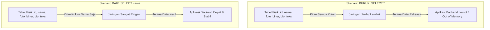

# 02 - BAB 02 MENGAMBIL SELURUH KOLOM

Status: DRAFT
Rak: SQL dan Querying
Buku: Dasar SQL dan Query SELECT
Level: Level 1 - Level 2
Tipe Materi: Tutorial
Target: Developer yang ingin mahir menulis query PostgreSQL.
Estimasi Baca: 10 Menit
Terakhir Diperiksa: 2026-05-17

Sumber Utama: PostgreSQL Official Documentation
Versi Referensi: PostgreSQL docs/current
Status Verifikasi Sumber: REVIEW

---

## 1. Tujuan Belajar
Di akhir bab ini, pembaca diharapkan mampu:
- Memahami fungsi, sintaksis, dan cara kerja dari kueri wildcard `SELECT *`.
- Mengidentifikasi kasus penggunaan yang tepat dan aman untuk menggunakan `SELECT *` (eksplorasi data cepat, debugging).
- Menjelaskan risiko teknis dan penurunan performa database akibat penggunaan `SELECT *` di lingkungan produksi.
- Mengubah kueri wildcard menjadi kueri proyeksi kolom yang eksplisit dan efisien.

## 2. Prasyarat
- Memahami struktur dasar penulisan perintah SELECT (baca: [Struktur Perintah SELECT](./bab-01-struktur-perintah-select.md)).

## 3. Ringkasan Cepat
Kueri `SELECT *` (dibaca: *SELECT ALL* atau *SELECT Asterisk*) adalah cara instan untuk mengambil seluruh kolom yang tersedia di dalam sebuah tabel. Cara ini sangat membantu ketika proses belajar, eksplorasi data awal, atau debugging cepat. Namun, menggunakan `SELECT *` di dalam kode aplikasi produksi adalah sebuah **anti-pattern** (praktik buruk) yang wajib dihindari karena memboroskan jaringan, memperlambat aplikasi, dan rentan merusak sistem saat struktur tabel diperbarui.

## 4. Istilah Penting di Bab Ini

| Istilah | Arti Singkat |
|---|---|
| Asterisk (*) | Karakter bintang yang berfungsi sebagai wildcard untuk mewakili seluruh kolom tabel. |
| Wildcard Query | Kueri database yang menggunakan karakter khusus untuk menarik seluruh data secara otomatis. |
| Explicit Query | Kueri yang menuliskan nama-nama kolom secara jelas satu per satu demi keamanan dan akurasi. |
| Schema Drift | Perubahan struktur database (seperti menambah atau menghapus kolom) seiring waktu. |
| Index-Only Scan | Fitur optimasi di mana PostgreSQL membaca data langsung dari indeks memori tanpa menyentuh disk tabel fisik. |

## 5. Analogi Sehari-hari
Bayangkan Anda adalah seorang manajer kantor yang mengutus seorang **kurir (koneksi backend ke database)** untuk mengambil arsip data:
- Di dalam gudang penyimpanan, terdapat lemari **Data Karyawan (Tabel)** yang berisi berkas tebal setiap staf. Di dalamnya ada detail nama, foto ukuran besar, riwayat medis, scan ijazah asli, dan nomor kontak darurat.
- Suatu hari, Anda hanya butuh **Nomor Kontak** staf untuk dihubungi secara darurat.
- Jika Anda malas menjelaskan secara detail, Anda menyuruh kurir: *"Bawa seluruh lemari berkas karyawan ke meja saya!"* (**`SELECT *`**). Akibatnya, kurir akan kelelahan memindahkan lemari berat, meja Anda menjadi sangat penuh sesak dengan berkas medis dan foto raksasa yang tidak Anda butuhkan, dan prosesnya memakan waktu lama.
- Seharusnya, Anda berkata secara spesifik: *"Tolong salinkan nama lengkap dan nomor kontak staf saja!"* (**`SELECT nama, kontak`**). Kurir cukup membawa selembar kertas catatan kecil yang sangat ringan, dan pekerjaan selesai dalam hitungan detik.

## 6. Batas Analogi
Di dunia fisik, membawa lemari berkas merusak keindahan ruangan secara visual dan melelahkan staf secara fisik. 

Di dalam sistem PostgreSQL, "kelelahan kurir" dan "meja penuh sesak" diterjemahkan sebagai **pemborosan bandwidth jaringan** (karena mengirimkan data biner/teks yang tidak perlu melalui kabel LAN/Internet), serta peningkatan beban pemakaian memori RAM pada server backend untuk menampung data virtual raksasa tersebut sebelum akhirnya dibuang oleh logika program aplikasi Anda.

## 7. Ilustrasi Konsep

Status Ilustrasi: DRAFT



## 8. Penjelasan Ilustrasi
Bagan di atas membandingkan dua skenario kueri. Skenario buruk menggunakan `SELECT *` yang memaksa pengiriman kolom berat (`foto_biner`, `bio_teks`) melewati jaringan, memicu kelambatan aplikasi backend. Skenario baik melakukan proyeksi eksplisit (`SELECT nama`) sehingga jaringan sangat ringan dan aplikasi berjalan cepat serta stabil.

## 9. Batas Ilustrasi
Ilustrasi di atas hanya menggambarkan perbandingan dari sisi ukuran data (bandwidth). Ia tidak menampilkan beban internal engine PostgreSQL seperti pencarian blok data di disk atau bagaimana PostgreSQL terpaksa membatalkan optimasi pencarian indeks jika seluruh kolom diminta.

## 10. Konsep Inti
### Kapan Boleh Menggunakan `SELECT *`?
- **Eksplorasi Data Interaktif**: Saat Anda baru pertama kali mengakses database menggunakan CLI (`psql`) atau GUI tool (seperti DBeaver/pgAdmin) dan ingin melihat kolom apa saja yang ada di tabel tersebut beserta contoh isinya.
- **Debugging Cepat**: Untuk memeriksa nilai data suatu baris secara keseluruhan saat mencari bug.
- **Klausa EXISTS**: Di dalam subquery dengan operator `EXISTS` (contoh: `WHERE EXISTS (SELECT * FROM ...)`), karena engine optimizer PostgreSQL cukup pintar untuk hanya memeriksa keberadaan baris data tanpa benar-benar menarik data kolom ke jaringan.

### Mengapa Harus Dihindari di Kode Aplikasi Produksi?
1.  **Pemborosan Bandwidth (Network Overhead)**: Menarik data yang tidak diperlukan (seperti kolom biner atau teks panjang) memperlambat waktu respons aplikasi.
2.  **Kerapuhan Kode (Schema Drift)**: Jika tabel diperbarui dan ditambahkan kolom baru, kueri `SELECT *` di backend otomatis ikut menarik kolom tersebut. Hal ini dapat merusak pemetaan data (*data mapping*) di backend.
3.  **Kebocoran Data Sensitif**: Kolom rahasia (seperti `password_hash` atau `pin_keamanan`) rentan ikut terkirim dalam respons JSON API ke client publik jika developer lalai memfilternya di tingkat backend.
4.  **Menggagalkan Optimasi Indeks**: Menghalangi fitur *Index-Only Scan* karena database terpaksa membaca blok tabel fisik di disk untuk menarik semua kolom non-indeks.

## 11. Penjelasan Detail
Sebagai perbandingan nyata, mari kita lihat transformasi kueri dari yang buruk menjadi eksplisit dan aman:

*Skenario Buruk (Wildcard SELECT)*:
```sql
-- Mengambil seluruh kolom termasuk data biner foto dan alamat lengkap yang tidak diperlukan
SELECT * FROM pengguna;
```

*Skenario Baik (Explicit SELECT)*:
```sql
-- Hanya mengambil kolom nama dan email yang benar-benar dibutuhkan oleh halaman profil
SELECT nama_lengkap, email FROM pengguna;
```

## 12. Contoh SQL Dasar
Berikut adalah contoh penggunaan yang aman saat Anda melakukan eksplorasi struktur data di PostgreSQL:

```sql
-- 1. Menggunakan asterisk untuk melihat isi tabel secara cepat (hanya untuk eksplorasi)
SELECT * FROM produk;

-- 2. Menggunakan eksplisit kolom untuk query di dalam kode aplikasi backend
SELECT produk_id, nama_produk, harga FROM produk;
```

## 13. Contoh SQL Praktik Project
Dalam aplikasi blog atau e-commerce, kita seringkali memiliki kolom deskripsi artikel atau ulasan produk yang sangat panjang. Query berikut dirancang eksplisit untuk halaman daftar artikel agar tidak membebani performa load halaman beranda:

```sql
-- Query aman untuk memuat daftar kartu artikel di halaman beranda
SELECT artikel_id, judul, penulis, tanggal_publikasi 
FROM artikel;
```

## 14. Kesalahan Umum
- **Menggunakan `SELECT *` di API Endpoint**: Mengirimkan seluruh kolom database langsung ke frontend. Saat backend memperbarui tabel untuk menambahkan kolom internal seperti `is_admin` atau `catatan_rahasia_admin`, kolom tersebut secara tidak sengaja ikut terekspos ke publik.
- **Lupa Mengubah Wildcard ke Eksplisit**: Membiarkan kueri `SELECT *` yang ditulis saat fase *development* (uji coba) tetap terpasang di kode aplikasi produksi.

## 15. Catatan Interview
- **Pertanyaan**: "Mengapa penggunaan `SELECT *` dianggap sebagai anti-pattern dalam pengembangan API backend enterprise?"
- **Jawaban**: "Ada tiga alasan utama. Pertama, efisiensi bandwidth; mengambil data yang tidak diperlukan (seperti kolom biner atau teks panjang) membebani jaringan. Kedua, stabilitas skema (*schema drift*); perubahan skema tabel di masa depan bisa memicu *runtime error* pada backend yang memetakan kolom secara kaku. Ketiga, performa database; menghalangi optimalisasi kueri seperti *Index-Only Scan* karena database terpaksa membaca blok tabel fisik di disk untuk menarik semua kolom non-indeks."

## 16. Catatan Diskusi User
- **Pertanyaan Umum**: "Apakah query `SELECT *` memiliki performa yang buruk meskipun jumlah baris di tabel hanya sedikit?"
- **Diskusikan**: Ya, dampaknya mungkin tidak terlalu terasa pada tabel kecil dengan 10 baris. Namun, membangun kebiasaan menulis kueri secara eksplisit sejak awal sangat penting. Ketika aplikasi Anda tumbuh, tabel tersebut mungkin akan menyimpan jutaan baris atau ditambahkan kolom tipe biner besar. Memperbaiki kueri `SELECT *` yang sudah telanjur tersebar di ribuan baris kode backend akan menjadi pekerjaan migrasi yang sangat berat dan melelahkan.

## 17. Latihan Kecil
1. Ubahlah query `SELECT * FROM transaksi;` menjadi query eksplisit yang hanya mengambil kolom `transaksi_id`, `total_harga`, dan `status`!
2. Jelaskan secara singkat mengapa performa query `SELECT nama_produk FROM produk;` bisa jauh lebih cepat dibanding `SELECT * FROM produk;` jika kolom `nama_produk` telah dipasang indeks!

## 18. Checklist Pemahaman
- [ ] Memahami peran tanda asterisk (`*`) dalam kueri SELECT.
- [ ] Mampu menyebutkan kasus di mana penggunaan `SELECT *` diperbolehkan.
- [ ] Mengetahui minimal 3 dampak buruk pemakaian `SELECT *` di lingkungan produksi.
- [ ] Mampu menuliskan kueri SELECT secara eksplisit untuk optimalisasi performa.

## 19. Hubungan dengan Materi Lain

### Posisi Materi
- Rak: [02 - SQL dan Querying](../../README.md)
- Buku: [Dasar SQL dan Query SELECT](../)

### Prasyarat
- [Struktur Perintah SELECT](./bab-01-struktur-perintah-select.md)

### Materi Sebelumnya
- [Struktur Perintah SELECT](./bab-01-struktur-perintah-select.md)

### Materi Berikutnya
- Filtering Data dengan WHERE *(Segera Datang)*

### Materi Terkait
- [Indexing, Query Planner, dan Performance](../../07-indexing-query-planner-dan-performance/)

### Istilah Terkait
- Wildcard, Schema Drift, Network Overhead, Index-Only Scan.

## 20. Referensi Resmi
Jangan membuka tautan berikut pada batch ini, cukup cantumkan sebagai referensi resmi yang ditargetkan untuk verifikasi nanti:
- PostgreSQL Official Documentation - Tutorial SELECT
  https://www.postgresql.org/docs/current/tutorial-select.html
- PostgreSQL Official Documentation - SELECT
  https://www.postgresql.org/docs/current/sql-select.html

## 21. Catatan Pribadi / Project Notes
*   *Catatan Draft*: Hubungkan bab ini erat dengan Bab 1. Tanamkan pola pikir bahwa efisiensi kueri di tingkat database berdampak langsung pada stabilitas dan kecepatan aplikasi backend secara keseluruhan. Status verifikasi diatur ke REVIEW.
