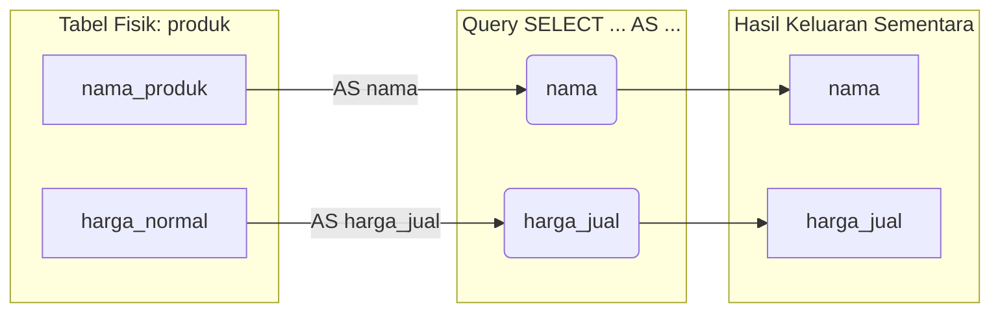

# 03 - BAB 03 ALIAS KOLOM DAN TABEL

Status: DRAFT
Rak: SQL dan Querying
Buku: Dasar SQL dan Query SELECT
Level: Level 1 - Level 2
Tipe Materi: Tutorial
Target: Developer yang ingin mahir menulis query PostgreSQL.
Estimasi Baca: 10 Menit
Terakhir Diperiksa: 2026-05-17

Sumber Utama: PostgreSQL Official Documentation
Versi Referensi: PostgreSQL docs/current
Status Verifikasi Sumber: REVIEW

---

## 1. Tujuan Belajar
Di akhir bab ini, pembaca diharapkan mampu:
- Menjelaskan fungsi penggunaan alias kolom dan alias tabel di dalam query SELECT PostgreSQL.
- Menerapkan kata kunci `AS` secara tepat untuk mengubah nama kolom keluaran pada hasil query (*result set*).
- Menggunakan alias tabel secara taktis untuk menyederhanakan penulisan query yang panjang dan mempersiapkan dasar pemahaman query relasional (`JOIN`).
- Mengidentifikasi batasan penggunaan nama alias dalam siklus urutan eksekusi logika query SQL (*query execution order*).

## 2. Prasyarat
- Memahami konsep dasar kueri SELECT dan pengambilan kolom data (baca: [Mengambil Seluruh Kolom](./bab-02-mengambil-seluruh-kolom.md)).
- Mengetahui bahwa hasil kueri dikembalikan dalam bentuk baris dan kolom tabular (*result set*).

## 3. Ringkasan Cepat
Alias adalah nama panggilan sementara yang diberikan pada kolom atau tabel dalam satu kueri SQL menggunakan kata kunci `AS`. Alias kolom digunakan untuk mempercantik judul tabel hasil keluaran (*result set*) agar lebih representatif dan mudah dibaca oleh dashboard pengguna atau aplikasi backend. Sementara itu, alias tabel bertindak sebagai singkatan praktis untuk menghemat ketikan jari saat memanggil tabel yang namanya panjang, yang nantinya akan sangat krusial saat kita melangkah mempelajari kueri relasional lintas tabel (`JOIN`).

## 4. Istilah Penting di Bab Ini

| Istilah | Arti Singkat |
|---|---|
| Alias | Nama samaran atau nama panggilan sementara untuk kolom atau tabel di dalam kueri SQL. |
| AS | Kata kunci resmi (keyword) SQL yang digunakan untuk mendeklarasikan nama alias. |
| Result Set | Tabel hasil keluaran kueri yang ditampilkan ke layar pengguna setelah kueri sukses dieksekusi. |
| Syntactic Sugar | Fitur penulisan kode pemrograman yang dirancang untuk mempermudah penulisan bagi manusia tanpa mengubah fungsi teknisnya. |
| Query Execution Order | Urutan langkah logis yang dilakukan engine database dalam memproses komponen-komponen kueri SQL di balik layar. |

## 5. Analogi Sehari-hari
Mari kita analogikan konsep alias kolom dan tabel dengan **Nama Panggilan Akrab dan Singkatan Nama Instansi Resmi**:

- **Alias Kolom (Nama Panggilan Akrab)**:
  Bayangkan nama resmi Anda di akta kelahiran (nama fisik kolom di tabel database) adalah `raden_mas_danang_wiratmoko_pamungkas` (nama kolom sangat panjang dan rumit). Saat Anda berkenalan dengan teman baru di komunitas (dashboard aplikasi klien), Anda berkata: *"Panggil saya **Danang** saja"* (`AS danang`). Nama asli Anda di akta kelahiran tetap utuh tidak berubah sedikit pun, namun teman-teman Anda sekarang memanggil Anda dengan nama panggilan yang jauh lebih singkat dan mudah diingat.
- **Alias Tabel (Singkatan Nama Instansi)**:
  Bayangkan Anda sedang menyusun dokumen kontrak kerja sama resmi dengan instansi pemerintah bernama **"Kementerian Koordinator Bidang Kemaritiman dan Investasi"** (nama tabel sangat panjang). Agar tidak lelah mengetik nama kementerian yang sangat panjang tersebut secara berulang-ulang di ratusan baris surat kontrak, Anda membuat kesepakatan di baris pertama kontrak: *"Selanjutnya di dalam dokumen ini disebut sebagai **KemenkoMarves**"* (alias tabel). Setiap kali merujuk ke aset milik instansi tersebut, Anda cukup mengetik: `KemenkoMarves.aset_gedung` alih-alih menulis seluruh nama kementerian dari awal.

## 6. Batas Analogi
Di dunia hukum nyata, jika Anda menandatangani dokumen penting hanya menggunakan nama panggilan gaul tanpa mendaftarkan nama akta resmi secara formal, dokumen tersebut bisa dinyatakan tidak sah demi hukum.

Di dalam SQL PostgreSQL, alias yang dideklarasikan menggunakan `AS` (atau spasi) adalah mekanisme yang dijamin sah secara komputasi. Engine PostgreSQL akan memahami nama panggilan tersebut secara presisi di sepanjang siklus pengeksekusian kueri berjalan, tanpa risiko merusak integritas struktur tabel aslinya.

## 7. Ilustrasi Konsep

Status Ilustrasi: DRAFT



## 8. Penjelasan Ilustrasi
Bagan di atas menggambarkan alur pemetaan alias kolom di PostgreSQL. Data fisik yang tersimpan di dalam harddisk memiliki nama kolom asli `nama_produk` dan `harga_normal`. Saat developer menjalankan kueri SELECT dengan perintah `AS nama` dan `AS harga_jual`, engine PostgreSQL memetakan judul kolom tersebut secara dinamis di memori sementara. Hasil keluaran (*result set*) yang tampil di dashboard aplikasi pengguna akan menggunakan judul baru yang cantik, bersih, dan mudah dibaca tanpa mengubah struktur fisik tabel aslinya di disk.

## 9. Batas Ilustrasi
Ilustrasi ini menyederhanakan alur keluaran kolom tunggal. Pada kenyataannya, alias kolom juga dapat digunakan untuk menampung hasil perhitungan matematika (misal: `harga * stok AS total_nilai`), penyatuan string kustom, atau kueri bertingkat (*subqueries*) yang melibatkan pemetaan kolom yang jauh lebih kompleks.

## 10. Konsep Inti

### 1. Deklarasi Alias Kolom dengan Kata Kunci `AS`
Sintaks dasar memasang alias pada kolom adalah dengan meletakkan kata kunci `AS` setelah nama kolom asli, diikuti dengan nama alias pilihan Anda:

```sql
SELECT kolom_asli AS nama_alias FROM nama_tabel;
```

#### Aturan Penulisan Alias:
- Sangat disarankan menggunakan format huruf kecil dan penghubung garis bawah (*snake_case*), contoh: `AS harga_diskon`.
- Jika nama alias Anda terpaksa menggunakan spasi (sangat tidak disarankan bagi backend developer), Anda wajib membungkus alias tersebut menggunakan **tanda petik ganda** (`""`), contoh: `AS "Harga Diskon Toko"`. Jangan gunakan tanda petik tunggal (`''`) karena petik tunggal di SQL hanya digunakan untuk nilai string teks biasa.

### 2. Alias Tanpa Kata Kunci `AS` (Implisit)
Standar SQL mengizinkan penulisan alias secara langsung hanya dengan menggunakan spasi tanpa menuliskan kata kunci `AS`:

```sql
SELECT nama_produk nama FROM produk; -- Valid, namun rawan membingungkan pemula
```

> [!WARNING]
> Sangat disarankan bagi pemula untuk selalu menuliskan kata kunci `AS` secara eksplisit demi menghindari bahaya kesalahan pembacaan kueri. Jika Anda lupa menulis koma (`,`) di antara dua kolom asli, PostgreSQL akan mengira kolom kedua adalah alias dari kolom pertama!

### 3. Deklarasi Alias Tabel
Alias tabel sangat berguna ketika nama tabel asli terlalu panjang atau ketika kita menghubungkan tabel dengan dirinya sendiri. Alias dideklarasikan di bagian klausa `FROM`:

```sql
SELECT p.nama_produk FROM produk AS p; -- 'p' adalah alias dari tabel produk
```

## 11. Penjelasan Detail

### Mengapa Kita Tidak Bisa Memakai Alias Kolom di Klausa `WHERE`?
Ini adalah salah satu jebakan paling sering yang dialami oleh developer pemula. Perhatikan contoh query yang **SALAH** berikut:

```sql
-- QUERY INI AKAN ERROR DI POSTGRESQL!
SELECT nama_produk AS nama, harga AS harga_jual 
FROM produk 
WHERE harga_jual > 10000;
```

#### Alasan Error (Urutan Logika Eksekusi Kueri):
Di balik layar, PostgreSQL tidak mengeksekusi kueri dari atas ke bawah (dari SELECT ke WHERE). Urutan eksekusi logika kueri sesungguhnya adalah:
1.  **FROM**: Database mencari tabel target (`produk`).
2.  **WHERE**: Database menyaring baris data (`harga_jual > 10000`).
3.  **SELECT**: Database mengambil kolom dan mengevaluasi alias (`AS harga_jual`).

Karena langkah **WHERE** dijalankan sebelum langkah **SELECT**, PostgreSQL belum mengenali apa itu variabel `harga_jual` saat penyaringan data berlangsung. Solusinya, Anda wajib menggunakan nama kolom asli di dalam klausa `WHERE`:

```sql
-- QUERY YANG BENAR
SELECT nama_produk AS nama, harga AS harga_jual 
FROM produk 
WHERE harga > 10000;
```

## 12. Contoh SQL Dasar
Berikut adalah contoh kueri dasar penggunaan alias kolom di PostgreSQL:

```sql
-- 1. Memberikan nama alias sederhana untuk kebersihan tampilan
SELECT nama_produk AS nama, stok AS sisa_stok 
FROM produk;

-- 2. Menggunakan tanda petik ganda untuk alias yang mengandung spasi
SELECT nama_produk AS "Nama Barang Toko" 
FROM produk;
```

## 13. Contoh SQL Praktik Project
Dalam skenario kalkulasi e-commerce backend, kita seringkali perlu menghitung nilai total inventori stok barang secara instan tanpa menuliskan logika perhitungan tersebut di sisi kode backend aplikasi Node.js/Go kita:

```sql
-- Menghitung total aset produk di gudang secara otomatis dengan alias cantik
SELECT 
    p.nama_produk AS nama_barang,
    p.harga AS harga_satuan,
    p.stok AS jumlah_gudang,
    (p.harga * p.stok) AS total_aset_gudang -- Perhitungan matematika di SQL
FROM produk AS p; -- Menggunakan alias tabel 'p' untuk kesederhanaan
```

## 14. Kesalahan Umum
- **Menggunakan Petik Tunggal untuk Alias**: Menulis `SELECT nama AS 'nama_user'`. Di PostgreSQL, ini akan memicu error fatal karena petik tunggal (`'`) mewakili nilai data teks literal, bukan penamaan kolom alias. Gunakan tanpa petik atau gunakan petik ganda (`""`).
- **Lupa Koma yang Menjelma Jadi Alias**:
  ```sql
  -- Niatnya mengambil kolom 'id' dan 'nama', tapi lupa koma di antaranya:
  SELECT id nama FROM pengguna;
  -- Hasilnya: Hanya kolom 'id' yang keluar, tetapi judul kolomnya berubah nama menjadi 'nama'!
  ```

## 15. Catatan Interview
- **Pertanyaan**: "Sebutkan urutan eksekusi logika (*logical query processing*) di dalam SQL, dan jelaskan di klausa mana saja kita diperbolehkan memanggil alias kolom yang kita buat di bagian `SELECT`!"
- **Jawaban**: "Urutan logika eksekusi kueri utama adalah: `FROM` -> `JOIN` -> `WHERE` -> `GROUP BY` -> `HAVING` -> `SELECT` -> `DISTINCT` -> `ORDER BY` -> `LIMIT`. Karena alias kolom didefinisikan di bagian `SELECT`, kita dilarang memanggil alias tersebut di klausa yang dieksekusi sebelumnya seperti `WHERE`, `GROUP BY`, dan `HAVING`. Namun, kita diperbolehkan memanggil alias tersebut di klausa yang dieksekusi setelah SELECT, yaitu di klausa `ORDER BY`."

## 16. Catatan Diskusi User
- **Pertanyaan Umum**: "Apakah alias tabel dapat digunakan di kueri SELECT jika kita tidak menuliskan alias tersebut di FROM?"
- **Diskusikan**: Tidak bisa. Pendefinisian alias tabel wajib diletakkan di klausa `FROM` terlebih dahulu sebelum kolom-kolomnya bisa dipanggil menggunakan awalan alias tersebut di bagian `SELECT`. Kueri akan langsung error dengan pesan `missing FROM-clause entry for table` jika Anda memanggil alias tabel yang belum didaftarkan di bagian bawah kueri.

## 17. Latihan Kecil
1. Tuliskan kueri SQL untuk mengambil data dari tabel `karyawan` dengan menampilkan kolom `gaji_pokok` diubah nama aliasnya menjadi `gaji_bersih`, serta hitunglah nilai bonus tahunan (`gaji_pokok * 2`) dengan nama alias `bonus_tahunan`!
2. Temukan kesalahan pada kueri berikut dan jelaskan cara memperbaikinya:
   `SELECT nama AS nama_lengkap FROM siswa WHERE nama_lengkap = 'Budi';`

## 18. Checklist Pemahaman
- [ ] Memahami arti dan fungsi penggunaan kata kunci `AS` di dalam kueri SELECT.
- [ ] Mampu menuliskan alias kolom yang menggunakan spasi secara aman menggunakan petik ganda (`""`).
- [ ] Mengetahui perbedaan use-case antara alias kolom dengan alias tabel.
- [ ] Mampu menjelaskan alasan mengapa alias kolom dilarang digunakan di dalam klausa `WHERE`.

## 19. Hubungan dengan Materi Lain

### Posisi Materi
- Rak: [02 - SQL dan Querying](../../README.md)
- Buku: [Dasar SQL dan Query SELECT](../)

### Prasyarat
- [Mengambil Seluruh Kolom](./bab-02-mengambil-seluruh-kolom.md)

### Materi Sebelumnya
- [Mengambil Seluruh Kolom](./bab-02-mengambil-seluruh-kolom.md)

### Materi Berikutnya
- [Klausa WHERE Dasar](../buku-02-filtering-sorting-dan-limit/bab-01-klausa-where-dasar.md)

### Materi Terkait
- [Inner Join](../buku-03-join-dan-relasi-query/bab-02-inner-join.md) (Menerapkan alias tabel secara masif)

### Istilah Terkait
- Column Alias, Table Alias, AS Keyword, Query Execution Order, Syntactic Sugar.

## 20. Referensi Resmi
Jangan membuka tautan berikut pada batch ini, cukup cantumkan sebagai referensi resmi yang ditargetkan untuk verifikasi nanti:
- PostgreSQL Official Documentation — perlu diverifikasi pada batch official docs verification.
- SQL standard / relational database concept — perlu diverifikasi jika nanti masuk fase source verification.

## 21. Catatan Pribadi / Project Notes
*   *Catatan Draft*: Penting untuk menekankan konsep Query Execution Order di bab ini. Pemula sering bingung mengapa alias di SELECT tidak bisa dipakai di WHERE, dan penjelasan logis ini akan melekatkan pemahaman mental model SQL yang benar sejak awal belajar. Status verifikasi diatur ke REVIEW.
