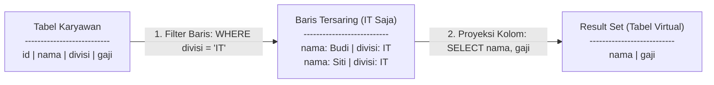

# 01 - BAB 01 KLAUSA WHERE DASAR

Status: DRAFT
Rak: SQL dan Querying
Buku: Filtering Sorting dan Limit
Level: Level 1 - Level 2
Tipe Materi: Tutorial
Target: Developer yang ingin mahir menulis query PostgreSQL.
Estimasi Baca: 10 Menit
Terakhir Diperiksa: 2026-05-17

Sumber Utama: PostgreSQL Official Documentation
Versi Referensi: PostgreSQL docs/current
Status Verifikasi Sumber: REVIEW

---

## 1. Tujuan Belajar
Di akhir bab ini, pembaca diharapkan mampu:
- Memahami peran utama klausa `WHERE` sebagai mekanisme penyaringan (*filtering*) baris data di PostgreSQL.
- Membedakan konsep proyeksi kolom (klausa `SELECT`) dengan seleksi baris (klausa `WHERE`).
- Menggunakan operator perbandingan dasar (`=`, `<>`, `>`, `<`, `>=`, `<=`) untuk menulis kueri penyaringan data terstruktur.

## 2. Prasyarat
- Memahami cara kerja perintah pengambilan data dasar (baca: [Struktur Perintah SELECT](../../02-sql-dan-querying/buku-01-dasar-sql-dan-query-select/bab-01-struktur-perintah-select.md)).
- Mengetahui cara mengambil kolom secara eksplisit (baca: [Mengambil Seluruh Kolom](../../02-sql-dan-querying/buku-01-dasar-sql-dan-query-select/bab-02-mengambil-seluruh-kolom.md)).

## 3. Ringkasan Cepat
Klausa `WHERE` adalah fitur penyaring (*filter*) baris pada kueri SQL. Berfungsi untuk menyaring data yang dikembalikan oleh database agar hanya baris-baris data yang memenuhi kriteria atau kondisi perbandingan tertentu saja yang dimasukkan ke dalam *result set*, mengabaikan data lainnya yang tidak relevan.

## 4. Istilah Penting di Bab Ini

| Istilah | Arti Singkat |
|---|---|
| WHERE | Klausa SQL yang digunakan untuk menyaring baris data berdasarkan kondisi logis tertentu. |
| Operator Perbandingan | Simbol matematika yang digunakan untuk membandingkan dua nilai data (misal: `=`, `<>`). |
| Proyeksi (Projection) | Tindakan memilih kolom vertikal tertentu yang ingin ditampilkan (diatur di klausa `SELECT`). |
| Seleksi (Selection) | Tindakan menyaring baris horizontal tertentu yang memenuhi kriteria (diatur di klausa `WHERE`). |
| Non-equal Operator (<>) | Operator perbandingan SQL standar untuk menyatakan kondisi "tidak sama dengan". |

## 5. Analogi Sehari-hari
Bayangkan Anda adalah pemilik **Toko Sepatu Raksasa (Tabel Database)**:
- Di dalam toko Anda, terdapat rak panjang berisi ribuan pasang sepatu dari berbagai merk, ukuran, warna, dan harga.
- **SELECT** adalah **Proses Memilih Informasi**: Anda memutuskan hanya ingin menuliskan data "Merk" dan "Ukuran" saja ke dalam kertas catatan kecil Anda saat berkeliling toko.
- **WHERE** adalah **Tindakan Penyaringan Fisik**: Anda menyuruh asisten toko Anda: *"Tolong ambilkan semua sepatu yang harganya di bawah 500 ribu rupiah!"* (**`WHERE harga < 500000`**).
- Asisten toko Anda akan memindai seluruh rak sepatu, mengabaikan sepatu-sepatu mahal, dan hanya mengumpulkan sepatu murah. Anda kemudian mencatat merk dan ukuran dari tumpukan sepatu murah tersebut.

## 6. Batas Analogi
Di toko sepatu fisik, asisten toko membutuhkan waktu fisik untuk melihat label harga satu per satu secara berurutan dan mengangkut kotak sepatu yang berat secara manual. Jika asisten lelah atau terburu-buru, ia bisa melewatkan beberapa sepatu murah yang terselip.

Di dalam PostgreSQL, penyaringan jutaan data dilakukan secara elektronik dalam milidetik. Jika kolom yang disaring (seperti `harga`) memiliki indeks, PostgreSQL tidak perlu memindai seluruh baris tabel secara berurutan (*Sequential Scan*), melainkan langsung melompat secara instan menggunakan indeks (*Index Scan*) untuk menarik baris data yang tepat tanpa risiko terlewat atau salah analisis.

## 7. Ilustrasi Konsep

Status Ilustrasi: DRAFT



## 8. Penjelasan Ilustrasi
Bagan di atas menggambarkan alur logis pemrosesan kueri `SELECT nama, gaji FROM karyawan WHERE divisi = 'IT';`. Pertama-tama, database melakukan **seleksi baris** menggunakan klausa `WHERE` untuk menyaring dan membuang seluruh baris karyawan yang bukan divisi 'IT'. Setelah baris tersaring, database melakukan **proyeksi kolom** menggunakan klausa `SELECT` untuk mengekstrak kolom `nama` dan `gaji` saja ke dalam *result set* akhir yang dikirimkan ke client.

## 9. Batas Ilustrasi
Ilustrasi di atas hanya menggambarkan urutan logis pemrosesan data. Di dalam internal mesin PostgreSQL, Optimizer database bisa saja mengubah urutan pembacaan data fisik berdasarkan struktur indeks yang tersedia (misalnya mencari via indeks divisi terlebih dahulu) demi efisiensi eksekusi kueri, meskipun hasil akhir *result set* virtual yang diterima aplikasi client tetap persis sama.

## 10. Konsep Inti
### Urutan Penulisan Klausa SQL
Dalam menulis query SQL, urutan penulisan klausa bersifat mutlak dan tidak boleh ditukar-tukar:
1.  `SELECT` (Pilih kolom apa yang mau ditampilkan).
2.  `FROM` (Pilih dari tabel mana data diambil).
3.  `WHERE` (Pilih kriteria penyaringan baris data).

### Operator Perbandingan Dasar di PostgreSQL
Berikut adalah 6 operator dasar untuk membangun kondisi penyaringan di klausa WHERE:
*   `=` : Sama dengan (mencari kecocokan nilai eksak).
*   `<>` atau `!=` : Tidak sama dengan (mengabaikan nilai tertentu).
*   `>` : Lebih besar dari.
*   `<` : Lebih kecil dari.
*   `>=` : Lebih besar atau sama dengan.
*   `<=` : Lebih kecil atau sama dengan.

## 11. Penjelasan Detail
### Aturan Penulisan Nilai String/Teks di Klausa WHERE
Di PostgreSQL, saat membandingkan kolom bertipe teks (seperti `VARCHAR` atau `TEXT`), nilainya wajib diapit oleh **tanda petik tunggal (`'`)**. Jika Anda menggunakan tanda petik ganda (`"`), PostgreSQL akan menganggapnya sebagai nama kolom lain dan memunculkan error.

*Sintaks Salah*:
```sql
SELECT * FROM pengguna WHERE status = aktif;   -- Error: column "aktif" does not exist
SELECT * FROM pengguna WHERE status = "aktif"; -- Error: column "aktif" does not exist
```

*Sintaks Benar*:
```sql
SELECT * FROM pengguna WHERE status = 'aktif'; -- Sukses
```

## 12. Contoh SQL Dasar
Berikut adalah beberapa variasi penggunaan operator perbandingan dasar pada kueri SELECT:

```sql
-- 1. Menyaring produk yang harganya di bawah 20 ribu (Lebih Kecil)
SELECT nama_produk, harga FROM produk WHERE harga < 20000.00;

-- 2. Menyaring pengguna yang berstatus aktif (Sama Dengan)
SELECT nama, email FROM pengguna WHERE status = 'aktif';

-- 3. Menyaring transaksi bernilai besar (Lebih Besar atau Sama Dengan)
SELECT transaksi_id, total FROM transaksi WHERE total >= 500000.00;

-- 4. Menyaring karyawan di luar divisi HR (Tidak Sama Dengan)
SELECT nama, divisi FROM karyawan WHERE divisi <> 'HR';
```

## 13. Contoh SQL Praktik Project
Dalam skenario backend aplikasi e-commerce, kita ingin menyaring ulasan produk (*review*) yang mendapatkan rating buruk (di bawah 3 bintang) untuk dilaporkan ke tim layanan pelanggan agar ditindaklanjuti secara presisi:

```sql
-- Mengambil data ulasan produk bermasalah untuk ditindaklanjuti CS
SELECT produk_id, rating, komentar 
FROM ulasan_produk 
WHERE rating <= 2;
```

## 14. Kesalahan Umum
- **Salah Menulis Urutan Klausa**: Menuliskan klausa `WHERE` sebelum klausa `FROM`.
  *Salah*: `SELECT nama WHERE status = 'aktif' FROM pengguna;` (Memicu syntax error).
- **Lupa Tanda Petik Teks**: Lupa menyertakan tanda petik tunggal pada pencarian teks, yang memicu database mengira nilai tersebut sebagai nama kolom database.

## 15. Catatan Interview
- **Pertanyaan**: "Apa perbedaan mendasar antara operasi *Selection* dengan *Projection* dalam teori relational algebra database?"
- **Jawaban**: "*Selection* (Seleksi) adalah operasi untuk menyaring subset horizontal (baris-baris data) yang memenuhi kriteria logis tertentu, diwakili oleh klausa `WHERE` dalam SQL. Sementara *Projection* (Proyeksi) adalah operasi untuk memilih subset vertikal (kolom-kolom tertentu) yang ingin ditampilkan, diwakili oleh klausa `SELECT` dalam SQL."

## 16. Catatan Diskusi User
- **Pertanyaan Umum**: "Bagaimana jika saya ingin menyaring data dengan beberapa kondisi sekaligus (misalnya mencari produk yang harganya murah DAN stoknya masih tersedia)?"
- **Diskusikan**: Menyatukan beberapa kondisi logis sekaligus adalah kebutuhan standar aplikasi nyata. Hal ini dilakukan dengan menghubungkan kondisi-kondisi tersebut menggunakan operator logika seperti `AND`, `OR`, dan `NOT`. Pembahasan mendalam mengenai filter multi-kondisi serta operator pencarian khusus (seperti `LIKE`, `IN`, atau `BETWEEN`) akan kita bahas secara lengkap pada bab berikutnya (Bab 2: Filter Lanjutan).

## 17. Latihan Kecil
1. Tuliskan query SQL yang valid untuk mengambil kolom `nama_produk` dari tabel `produk` yang memiliki `stok` sama dengan 0!
2. Ubahlah query berikut agar menyaring karyawan yang gajinya *tidak sama dengan* 4.500.000 rupiah: `SELECT nama, gaji FROM karyawan ...`

## 18. Checklist Pemahaman
- [ ] Memahami perbedaan peran klausa `SELECT` (memilih kolom) dengan `WHERE` (menyaring baris).
- [ ] Mampu menggunakan 6 operator perbandingan dasar secara tepat pada kueri SQL.
- [ ] Mengetahui urutan penulisan klausa SQL yang benar (`SELECT` $\rightarrow$ `FROM` $\rightarrow$ `WHERE`).
- [ ] Memahami kewajiban pemakaian tanda petik tunggal untuk nilai pencarian teks/string.

## 19. Hubungan dengan Materi Lain

### Posisi Materi
- Rak: [02 - SQL dan Querying](../../README.md)
- Buku: [Filtering Sorting dan Limit](../)

### Prasyarat
- [Mengambil Seluruh Kolom](../../02-sql-dan-querying/buku-01-dasar-sql-dan-query-select/bab-02-mengambil-seluruh-kolom.md)

### Materi Sebelumnya
- [Mengambil Seluruh Kolom](../../02-sql-dan-querying/buku-01-dasar-sql-dan-query-select/bab-02-mengambil-seluruh-kolom.md)

### Materi Berikutnya
- Operator Logika AND, OR, dan NOT *(Segera Datang)*

### Materi Terkait
- [Indexing, Query Planner, dan Performance](../../07-indexing-query-planner-dan-performance/)

### Istilah Terkait
- Selection, Projection, Comparison Operators, Boolean Evaluation.

## 20. Referensi Resmi
Jangan membuka tautan berikut pada batch ini, cukup cantumkan sebagai referensi resmi yang ditargetkan untuk verifikasi nanti:
- PostgreSQL Official Documentation - Tutorial SELECT
  https://www.postgresql.org/docs/current/tutorial-select.html
- PostgreSQL Official Documentation - SELECT
  https://www.postgresql.org/docs/current/sql-select.html

## 21. Catatan Pribadi / Project Notes
*   *Catatan Draft*: Draft ini dirancang untuk membangun mental model pemrosesan data dua dimensi secara logis (filter baris dahulu baru potong kolom). Penjelasan mengenai aturan penulisan petik string ditekankan karena merupakan salah satu jebakan error paling sering dialami developer pemula. Status verifikasi diatur ke REVIEW.
