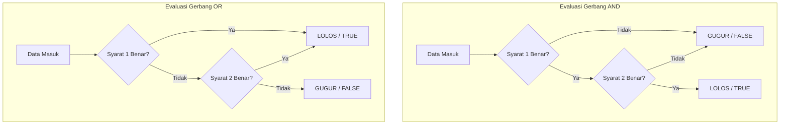

# 02 - BAB 02 OPERATOR PERBANDINGAN DAN LOGIKA

Status: DRAFT
Rak: SQL dan Querying
Buku: Filtering Sorting dan Limit
Level: Level 1 - Level 2
Tipe Materi: Tutorial
Target: Developer yang ingin mahir menulis query PostgreSQL.
Estimasi Baca: 10 Menit
Terakhir Diperiksa: 2026-05-17

Sumber Utama: PostgreSQL Official Documentation
Versi Referensi: PostgreSQL docs/current
Status Verifikasi Sumber: REVIEW

---

## 1. Tujuan Belajar
Di akhir bab ini, pembaca diharapkan mampu:
- Menyusun kueri penyaringan data yang kompleks menggunakan kombinasi operator perbandingan dan operator logika (`AND`, `OR`, `NOT`).
- Memahami urutan prioritas evaluasi logika (*operator precedence*) di dalam engine database PostgreSQL.
- Menggunakan tanda kurung `()` secara tepat untuk mengontrol prioritas logika kueri agar terhindar dari bias data.

## 2. Prasyarat
- Memahami konsep dasar penyaringan baris data menggunakan klausa WHERE (baca: [Klausa WHERE Dasar](./bab-01-klausa-where-dasar.md)).

## 3. Ringkasan Cepat
Aplikasi bisnis nyata memerlukan kriteria penyaringan data yang jauh lebih cerdas dibanding sekadar perbandingan tunggal. Operator logika **`AND`** (kedua syarat wajib bernilai benar), **`OR`** (salah satu syarat boleh bernilai benar), dan **`NOT`** (membalikkan kebenaran syarat) digunakan untuk menyatukan banyak kondisi di klausa `WHERE`. Penggunaan tanda kurung `()` wajib dikuasai secara disiplin untuk mengunci prioritas logika agar database mengembalikan data yang benar dan akurat.

## 4. Istilah Penting di Bab Ini

| Istilah | Arti Singkat |
|---|---|
| Operator Logika | Kata kunci SQL (`AND`, `OR`, `NOT`) untuk menggabungkan atau mengecualikan kondisi penyaringan. |
| Operator Precedence | Urutan prioritas evaluasi yang digunakan engine database untuk memproses logika kueri (default: `NOT` $\rightarrow$ `AND` $\rightarrow$ `OR`). |
| Logic Bias | Kesalahan logika kueri akibat hilangnya tanda kurung pelindung, menghasilkan data yang salah sasaran. |
| Truth Table | Tabel acuan logika matematika untuk menentukan hasil akhir perpaduan kondisi benar/salah. |

## 5. Analogi Sehari-hari
Bayangkan Anda menjabat sebagai **staf HRD (Database Administrator)** yang bertugas menyaring berkas fisik pelamar kerja:
- **Kondisi AND**: *"Saya mencari pelamar yang memiliki gelar S1 **DAN** pengalaman kerja minimal 3 tahun."* (Hanya berkas pelamar yang memenuhi **kedua** kriteria tersebut sekaligus yang Anda ambil).
- **Kondisi OR**: *"Saya mencari pelamar yang menguasai bahasa pemrograman Python **ATAU** menguasai bahasa Go."* (Jika pelamar menguasai salah satunya saja, berkasnya sudah lolos seleksi Anda).
- **Kondisi NOT**: *"Bawakan saya semua berkas pelamar, **KECUALI (NOT)** yang berdomisili di luar kota."* (Mengecualikan kelompok tertentu).
- **Kondisi Tanda Kurung**: *"Saya butuh: (Lulusan S1 **DAN** pengalaman 3 tahun) **ATAU** (Memiliki sertifikat keahlian khusus)."* Tanpa tanda kurung pemisah yang jelas di lembar panduan, asisten Anda bisa salah paham menyeleksi kandidat yang tidak memenuhi syarat.

## 6. Batas Analogi
Di dunia nyata, menyaring ribuan berkas kertas menggunakan multi-kriteria yang rumit sangat melelahkan mata staf HRD, dan kita rentan salah menafsirkan gabungan kata "dan/atau" secara manual karena faktor kelelahan fisik.

Di dalam PostgreSQL, proses evaluasi tabel kebenaran (*Truth Table*) dikerjakan menggunakan gerbang logika elektronik komputer yang super presisi, konsisten, dan sangat cepat. PostgreSQL tidak akan pernah lelah memproses miliaran baris data dengan ribuan kondisi logika bercabang, selama formula kueri yang Anda tulis mematuhi aturan prioritas operator database.

## 7. Ilustrasi Konsep

Status Ilustrasi: DRAFT



## 8. Penjelasan Ilustrasi
Bagan di atas memvisualisasikan perbedaan alur evaluasi gerbang logika. Pada skenario `AND` (kiri), baris data hanya dinyatakan lolos (*TRUE*) jika kedua syarat terbukti benar secara bersamaan; jika salah satu syarat salah, data langsung gugur. Pada skenario `OR` (kanan), baris data langsung lolos begitu salah satu syarat terdeteksi benar, dan hanya akan gugur jika kedua syarat terbukti salah sekaligus.

## 9. Batas Ilustrasi
Ilustrasi di atas hanya menampilkan logika biner sederhana (`TRUE`/`FALSE`). Di dunia nyata, database PostgreSQL mendukung sistem logika tiga nilai (*Three-Valued Logic*) karena keberadaan nilai kosong `NULL`. Jika salah satu kolom yang dievaluasi bernilai `NULL`, hasil akhirnya bisa berupa `UNKNOWN` (akan dibahas secara khusus pada Rak lanjutan).

## 10. Konsep Inti
### Urutan Prioritas Bawaan Database (*Operator Precedence*)
Jika Anda menulis kueri multi-kondisi tanpa menggunakan tanda kurung, PostgreSQL akan mengevaluasi kondisi tersebut berdasarkan urutan prioritas bawaan:
1.  **`NOT`** (Prioritas tertinggi, dievaluasi pertama kali).
2.  **`AND`** (Prioritas menengah).
3.  **`OR`** (Prioritas terendah, dievaluasi paling akhir).

### Bahaya Logic Bias (Bias Logika) Tanpa Tanda Kurung
Skenario: Anda ingin mencari produk yang harganya di bawah 15 ribu rupiah, bernomor stok tersedia, DAN bermerk 'Indo' atau 'Maju'.

*Kueri Tanpa Kurung (SALAH & BERBAHAYA)*:
```sql
SELECT * FROM produk WHERE harga < 15000 AND merk = 'Indo' OR merk = 'Maju';
```
PostgreSQL akan mengevaluasi kueri di atas seolah-olah ditulis:
`(harga < 15000 AND merk = 'Indo') OR (merk = 'Maju')`.
**Dampak Buruk**: Produk bermerk 'Maju' yang harganya 10 juta rupiah akan otomatis ikut lolos filter dan tampil di daftar belanjaan murah!

*Kueri Dengan Kurung Pelindung (BENAR & AMAN)*:
```sql
SELECT * FROM produk WHERE harga < 15000 AND (merk = 'Indo' OR merk = 'Maju');
```

## 11. Penjelasan Detail
Mari kita pelajari contoh kasus penulisan operator perbandingan dan logika dasar di PostgreSQL:

### A. Menggunakan Operator `AND`
Syarat: Produk harus murah DAN stoknya masih ada.
```sql
SELECT nama_produk, harga, stok 
FROM produk 
WHERE harga < 50000.00 AND stok > 0;
```

### B. Menggunakan Operator `OR`
Syarat: Pengguna yang berstatus aktif ATAU ulasannya berstatus ditangguhkan (pending).
```sql
SELECT nama, email 
FROM pengguna 
WHERE status = 'aktif' OR status = 'pending';
```

### C. Menggunakan Operator `NOT`
Syarat: Mengambil seluruh pesanan kecuali yang berstatus dibatalkan (cancelled).
```sql
SELECT pesanan_id, total 
FROM pesanan 
WHERE NOT status = 'cancelled';
```

## 12. Contoh SQL Dasar
Berikut adalah contoh penggabungan kondisi dasar di dalam query SELECT:

```sql
-- Menyaring ulasan bintang 5 yang memiliki stok di atas 10 unit
SELECT nama_produk, harga 
FROM produk 
WHERE harga < 100000.00 AND stok >= 10;
```

## 13. Contoh SQL Praktik Project
Dalam backend aplikasi e-commerce, kita ingin memfilter produk untuk promosi musiman akhir tahun. Kita mencari produk kategori 'Makanan' atau 'Minuman' yang harganya di bawah 100 ribu DAN stoknya di atas 10 unit secara aman:

```sql
-- Query aman terlindungi dengan tanda kurung prioritas
SELECT nama_produk, kategori, harga, stok 
FROM produk 
WHERE (kategori = 'Makanan' OR kategori = 'Minuman') 
  AND harga < 100000.00 
  AND stok >= 10;
```

## 14. Kesalahan Umum
- **Meremehkan Tanda Kurung**: Menganggap tanda kurung hanya opsional untuk keindahan kode. Banyak bug fatal di industri nyata (seperti kebocoran data rahasia user lain) terjadi murni karena developer lupa menuliskan kurung pelindung saat menggabungkan filter data privasi dengan filter pencarian publik.
- **Kondisi Kontradiktif (Always False)**: Menuliskan kueri seperti `WHERE status = 'aktif' AND status = 'nonaktif'`. Satu baris data tidak mungkin memiliki dua nilai status yang berbeda sekaligus pada kolom yang sama, sehingga kueri ini akan selalu menghasilkan nol baris data kosong.

## 15. Catatan Interview
- **Pertanyaan**: "Jika terdapat kueri `WHERE kondisi_a OR kondisi_b AND kondisi_c`, bagaimana PostgreSQL mengevaluasinya secara default dan bagaimana cara memaksanya agar kondisi `OR` dievaluasi terlebih dahulu?"
- **Jawaban**: "Secara default, PostgreSQL mematuhi urutan prioritas operator (*precedence*) di mana `AND` memiliki prioritas lebih tinggi dibanding `OR`. Maka kueri tersebut akan dievaluasi sebagai `kondisi_a OR (kondisi_b AND kondisi_c)`. Untuk memaksa agar kondisi `OR` dikerjakan terlebih dahulu, kita wajib membungkus kondisi tersebut menggunakan tanda kurung menjadi `(kondisi_a OR kondisi_b) AND kondisi_c`."

## 16. Catatan Diskusi User
- **Pertanyaan Umum**: "Saya melihat ada operator pencarian bernama `IN` dan `BETWEEN`. Apakah fungsinya sama dengan operator logika di atas?"
- **Diskusikan**: Operator `IN` dan `BETWEEN` adalah jalan pintas penulisan (*syntactic sugar*) yang sangat berguna. Kueri `status = 'aktif' OR status = 'pending'` bisa ditulis lebih ringkas menjadi `status IN ('aktif', 'pending')`, dan kueri `harga >= 10000 AND harga <= 50000` bisa ditulis `harga BETWEEN 10000 AND 50000`. Kita akan membahas kedua operator tersebut secara mendalam pada bab berikutnya setelah Anda menguasai gerbang logika dasar ini secara matang.

## 17. Latihan Kecil
1. Tuliskan query SQL untuk menyaring data pengguna dari tabel `users` yang memiliki divisi 'IT' **DAN** berstatus 'aktif' **DAN** berumur di atas 25 tahun!
2. Perbaiki kueri bias berikut agar tidak memunculkan produk mahal bermerk 'Maju': `SELECT * FROM produk WHERE harga < 15000 AND merk = 'Indo' OR merk = 'Maju';`

## 18. Checklist Pemahaman
- [ ] Memahami cara kerja evaluasi operator logika `AND`, `OR`, dan `NOT`.
- [ ] Mengetahui urutan prioritas bawaan database (`NOT` $\rightarrow$ `AND` $\rightarrow$ `OR`).
- [ ] Mampu mendeteksi bias logika kueri akibat hilangnya tanda kurung pelindung.
- [ ] Mampu menuliskan kueri multi-kondisi yang aman secara presisi.

## 19. Hubungan dengan Materi Lain

### Posisi Materi
- Rak: [02 - SQL dan Querying](../../README.md)
- Buku: [Filtering Sorting dan Limit](../)

### Prasyarat
- [Klausa WHERE Dasar](./bab-01-klausa-where-dasar.md)

### Materi Sebelumnya
- [Klausa WHERE Dasar](./bab-01-klausa-where-dasar.md)

### Materi Berikutnya
- [Mengenal Schema PostgreSQL](../../03-desain-data-dan-schema/buku-01-konsep-table-schema-dan-relasi/bab-01-mengenal-schema-postgresql.md)

### Materi Terkait
- [Indexing, Query Planner, dan Performance](../../07-indexing-query-planner-dan-performance/)

### Istilah Terkait
- Logical Precedence, Boolean Algebra, Truth Table, Logic Bias.

## 20. Referensi Resmi
Jangan membuka tautan berikut pada batch ini, cukup cantumkan sebagai referensi resmi yang ditargetkan untuk verifikasi nanti:
- PostgreSQL Official Documentation - Comparison Functions and Operators
  https://www.postgresql.org/docs/current/functions-comparison.html
- PostgreSQL Official Documentation - Logical Operators
  https://www.postgresql.org/docs/current/functions-logical.html
- PostgreSQL Official Documentation - SELECT WHERE
  https://www.postgresql.org/docs/current/sql-select.html

## 21. Catatan Pribadi / Project Notes
*   *Catatan Draft*: Tekankan konsep "keselamatan kueri". Sampaikan bahaya bias logika tanpa kurung secara dramatis melalui contoh skenario produk toko agar pembaca memahami bahwa kesalahan kecil tanda kurung berakibat fatal pada keakuratan data bisnis aplikasi. Status verifikasi diatur ke REVIEW.
