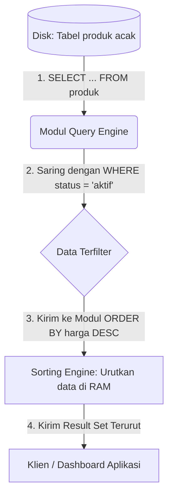

# 03 - BAB 03 SORTING DENGAN ORDER BY

Status: DRAFT
Rak: SQL dan Querying
Buku: Filtering Sorting dan Limit
Level: Level 1 - Level 2
Tipe Materi: Tutorial
Target: Developer yang ingin mahir menulis query PostgreSQL.
Estimasi Baca: 10 Menit
Terakhir Diperiksa: 2026-05-17

Sumber Utama: PostgreSQL Official Documentation
Versi Referensi: PostgreSQL docs/current
Status Verifikasi Sumber: REVIEW

---

## 1. Tujuan Belajar
Di akhir bab ini, pembaca diharapkan mampu:
- Menjelaskan pentingnya menyusun urutan keluaran kueri database secara eksplisit menggunakan klausa `ORDER BY`.
- Menerapkan pengurutan data secara menaik (*ascending* / `ASC`) dan menurun (*descending* / `DESC`) pada berbagai tipe data.
- Melakukan kueri pengurutan data bertingkat memanfaatkan kombinasi beberapa kolom sekaligus.
- Memahami penanganan posisi nilai kosong (`NULL`) dalam proses pengurutan menggunakan perintah `NULLS FIRST` atau `NULLS LAST`.
- Menyadari bahwa tanpa `ORDER BY`, PostgreSQL tidak menjamin kestabilan urutan data keluaran (*result set order stability*).

## 2. Prasyarat
- Memahami dasar kueri penulisan SELECT dan filtering data (baca: [Operator Perbandingan dan Logika](./bab-02-operator-perbandingan-dan-logika.md)).
- Mengetahui bahwa database relasional menyimpan data secara acak tanpa urutan bawaan yang permanen.

## 3. Ringkasan Cepat
Klausa `ORDER BY` digunakan untuk mengurutkan hasil keluaran kueri SELECT berdasarkan satu atau beberapa kolom tertentu, baik secara menaik (`ASC` - default) maupun menurun (`DESC`). Di dalam database relasional, baris data disimpan sebagai himpunan matematika tanpa urutan inheren yang stabil. Tanpa menyertakan klausa `ORDER BY` secara eksplisit, urutan hasil keluaran kueri Anda tidak boleh diasumsikan stabil dan dapat berubah sewaktu-waktu tergantung pada kondisi internal pengolahan memori server database.

## 4. Istilah Penting di Bab Ini

| Istilah | Arti Singkat |
|---|---|
| ORDER BY | Klausa resmi SQL untuk mengurutkan baris hasil kueri berdasarkan kolom tertentu. |
| Ascending (ASC) | Metode pengurutan data dari nilai terkecil ke terbesar (cth: A-Z, 1-10, tanggal lampau ke masa depan). |
| Descending (DESC) | Metode pengurutan data dari nilai terbesar ke terkecil (cth: Z-A, 10-1, masa depan ke tanggal lampau). |
| Result Set Stability | Jaminan bahwa kueri akan selalu mengembalikan baris data dengan urutan yang sama setiap kali dijalankan. |
| Collations | Aturan standar budaya atau bahasa yang digunakan database untuk membandingkan dan mengurutkan tipe data teks/string. |
| NULLS FIRST / LAST | Sintaks khusus PostgreSQL untuk mengatur apakah nilai kosong (NULL) diletakkan di bagian paling atas atau paling bawah hasil sorting. |

## 5. Analogi Sehari-hari
Mari kita analogikan baris data di database dengan **Tumpukan Lembar Formulir Ujian Siswa di Dalam Kotak Plastik Raksasa**:

- **Tanpa Pengurutan**:
  Bayangkan seluruh lembar kertas jawaban ujian dari 1.000 siswa dikumpulkan ke dalam sebuah kotak plastik besar (tabel database). Lembar-lembar tersebut ditumpuk begitu saja secara acak tanpa urutan tertentu. Jika kepala sekolah meminta: *"Tolong ambilkan berkas laporan nilai ujian siswa"* (SELECT query), dan Anda langsung merogoh kotak tersebut begitu saja, urutan kertas yang keluar di tangan Anda akan acak-acakan. Urutannya bisa berubah jika kotak tersebut sempat berguncang atau digeser (analogi dari tidak stabilnya kueri tanpa `ORDER BY`).
- **Menerapkan ORDER BY (Sorting)**:
  Untuk merapikannya, kepala sekolah memberi instruksi: *"Tolong urutkan tumpukan lembaran tersebut berdasarkan nilai ujian tertinggi ke terendah"* (`ORDER BY nilai DESC`). Sekarang Anda berdiri di depan meja, mengambil seluruh lembaran kertas, menyusunnya secara teratur satu per satu sesuai instruksi tersebut, lalu menyerahkannya dengan rapi.
- **Sorting Bertingkat**:
  Jika ada beberapa siswa yang mendapatkan nilai yang sama persis (misal 5 orang mendapat nilai 90), Anda menambahkan aturan pengurutan kedua agar tidak bingung: *"Jika nilainya sama, urutkan secara alfabetis berdasarkan nama depan mereka"* (`ORDER BY nilai DESC, nama_depan ASC`).

## 6. Batas Analogi
Di dunia fisik nyata, merapikan tumpukan kertas formulir setebal ribuan lembar di atas meja kerja membutuhkan tenaga fisik manusia yang melelahkan, area meja yang luas, dan waktu pengerjaan yang lama.

Di dalam PostgreSQL, pengurutan jutaan baris data dilakukan secepat kilat secara elektronik menggunakan alokasi memori RAM khusus (*work_mem*) atau memanfaatkan struktur indeks pencarian cepat (*B-Tree Index*) yang bekerja otomatis di belakang layar.

## 7. Ilustrasi Konsep

Status Ilustrasi: DRAFT



## 8. Penjelasan Ilustrasi
Bagan di atas menggambarkan urutan pengolahan data saat kueri sorting dijalankan. PostgreSQL pertama-tama mengambil data dari disk, lalu menyaringnya menggunakan kriteria klausa `WHERE`. Setelah data yang lolos saringan terkumpul, barulah data tersebut dimasukkan ke dalam modul sorting `ORDER BY` untuk diurutkan di dalam memori RAM server berdasarkan aturan kolom yang diminta, sebelum akhirnya dikirimkan sebagai tabel terurut yang rapi ke dashboard aplikasi pengguna.

## 9. Batas Ilustrasi
Ilustrasi di atas menggambarkan alur sorting sederhana yang muat di dalam memori RAM. Jika volume data yang diurutkan sangat besar hingga melebihi batas alokasi memori sortir server database (*work_mem*), PostgreSQL akan melakukan pemisahan sortir menggunakan media penyimpanan sementara di disk (*temporary files on disk*) yang berjalan lebih lambat, yang tidak divisualisasikan dalam bagan sederhana ini.

## 10. Konsep Inti

### 1. Ketiadaan Urutan Bawaan yang Stabil
Di dalam teori database relasional, tabel adalah representasi dari sebuah **himpunan** (*set*) matematika. Anggota himpunan tidak memiliki urutan bawaan. 

PostgreSQL menyimpan baris data baru di bagian slot kosong mana pun yang ia temukan di dalam disk. Saat data diperbarui (`UPDATE`) atau dihapus (`DELETE`), urutan fisik baris data di disk pasti akan bergeser akibat mekanisme MVCC PostgreSQL. Oleh karena itu: **Satu-satunya cara untuk menjamin hasil kueri Anda selalu keluar dengan urutan yang sama adalah wajib menuliskan klausa `ORDER BY`.**

### 2. Sintaks Dasar ORDER BY
Klausa `ORDER BY` diletakkan di bagian paling bawah kueri SELECT (sebelum klausa LIMIT):

```sql
SELECT kolom1, kolom2 
FROM nama_tabel 
ORDER BY kolom_sortir [ASC|DESC];
```
- **ASC (Ascending)**: Mengurutkan dari kecil ke besar. Ini adalah perilaku bawaan (*default*) jika Anda tidak menuliskan instruksi arah sorting.
- **DESC (Descending)**: Mengurutkan dari besar ke kecil.

### 3. Pengurutan Bertingkat (Multi-kolom)
Anda dapat mengurutkan hasil berdasarkan beberapa kolom sekaligus dengan memisahkannya menggunakan koma. Database akan mengurutkan berdasarkan kolom pertama terlebih dahulu. Jika ditemukan nilai yang sama persis, database baru akan beralih menggunakan kolom kedua untuk memecah kebuntuan urutan tersebut:

```sql
ORDER BY kolom_utama DESC, kolom_kedua ASC;
```

## 11. Penjelasan Detail

### Bagaimana PostgreSQL Menangani Urutan Nilai Kosong (`NULL`)?
Nilai `NULL` mewakili data yang tidak diketahui (*unknown*). Saat melakukan pengurutan, timbul pertanyaan: apakah `NULL` dianggap lebih kecil atau lebih besar dari nilai biasa?

Secara *default*, PostgreSQL menganut aturan: **Nilai NULL dianggap sebagai nilai paling besar di alam semesta database.**
Akibatnya:
- Jika Anda mengurutkan secara menaik (`ASC`), nilai `NULL` akan diletakkan di **bagian paling bawah** (*NULLS LAST*).
- Jika Anda mengurutkan secara menurun (`DESC`), nilai `NULL` akan diletakkan di **bagian paling atas** (*NULLS FIRST*).

Anda dapat mengubah perilaku bawaan ini secara manual menggunakan instruksi `NULLS FIRST` atau `NULLS LAST` di akhir klausa sorting:

```sql
-- Memaksa nilai NULL berada di paling bawah meskipun diurutkan DESC
SELECT nama_produk, harga 
FROM produk 
ORDER BY harga DESC NULLS LAST;
```

## 12. Contoh SQL Dasar
Berikut adalah contoh kueri dasar pengurutan data di PostgreSQL:

```sql
-- 1. Mengurutkan produk dari yang termurah ke termahal (ASC)
SELECT nama_produk, harga 
FROM produk 
ORDER BY harga; -- Secara default adalah ASC

-- 2. Mengurutkan produk dari yang termahal ke termurah (DESC)
SELECT nama_produk, harga 
FROM produk 
ORDER BY harga DESC;
```

## 13. Contoh SQL Praktik Project
Dalam skenario operasional toko online backend, kita ingin menampilkan daftar transaksi pelanggan aktif yang disaring berdasarkan status pembayaran, lalu diurutkan dari transaksi dengan nilai tagihan terbesar, dan jika tagihannya sama, tampilkan transaksi yang paling baru terjadi:

```sql
-- Kueri dashboard admin e-commerce
SELECT 
    invoice_no AS nomor_tagihan,
    customer_id AS id_pelanggan,
    total_amount AS total_bayar,
    created_at AS tanggal_transaksi
FROM orders
WHERE status_pembayaran = 'PAID' -- Menyaring data terlebih dahulu
ORDER BY total_amount DESC, created_at DESC; -- Pengurutan bertingkat
```

## 14. Kesalahan Umum
- **Mengasumsikan Urutan Stabil Tanpa ORDER BY**: Membuat kueri paginasi website (halaman 1, 2, 3) tanpa menyertakan `ORDER BY`. Akibatnya, user bisa melihat data yang sama berulang kali di halaman berbeda saat berpindah halaman karena urutan data bergeser secara dinamis di server database.
- **Menggunakan Nomor Urut Kolom**: Menulis `ORDER BY 3` (mengurutkan berdasarkan kolom urutan ketiga di SELECT). Meskipun kueri ini valid, cara penulisan ini sangat dilarang dalam standar industri karena jika ada developer lain mengubah urutan kolom di bagian `SELECT`, kueri sorting akan langsung salah mengurutkan kolom tanpa memicu pesan error.

## 15. Catatan Interview
- **Pertanyaan**: "Jika kita mengurutkan kolom bertipe teks menggunakan `ORDER BY`, aturan apa yang digunakan PostgreSQL untuk menentukan bahwa huruf 'A' lebih kecil dari huruf 'b' (huruf kecil), dan bagaimana cara mengubah perilakunya?"
- **Jawaban**: "PostgreSQL menggunakan aturan **Collation** yang terpasang di sistem operasi server untuk menentukan urutan karakter teks. Secara default, collation bawaan umumnya bersifat *case-sensitive* (membedakan huruf besar dan kecil). Jika kita ingin melakukan pengurutan teks tanpa memedulikan perbedaan huruf besar dan kecil (*case-insensitive sorting*), kita bisa menggunakan fungsi pembantu `LOWER()` pada kolom teks di klausa sorting, contohnya: `ORDER BY LOWER(nama_produk) ASC`."

## 16. Catatan Diskusi User
- **Pertanyaan Umum**: "Apakah kita bisa menggunakan alias kolom yang dibuat di SELECT pada klausa ORDER BY?"
- **Diskusikan**: Ya, sangat bisa. Berbeda dengan klausa `WHERE`, klausa `ORDER BY` dieksekusi oleh database **setelah** klausa `SELECT` selesai diproses. Oleh karena itu, PostgreSQL sudah mengenali nama alias kolom tersebut secara sempurna. Contoh: `SELECT harga * 0.9 AS harga_diskon FROM produk ORDER BY harga_diskon ASC;` adalah kueri yang sepenuhnya valid dan bersih.

## 17. Latihan Kecil
1. Tuliskan kueri SQL untuk mengambil data dari tabel `anggota_perpustakaan` disaring berdasarkan `kota = 'Jakarta'`, lalu diurutkan berdasarkan `tanggal_daftar` dari yang paling lama ke yang terbaru!
2. Jika Anda memiliki tabel `siswa` dengan kolom `nilai_ujian` yang memiliki banyak data kosong (`NULL`), buatlah kueri untuk mengurutkan nilai dari yang tertinggi ke terendah, tetapi letakkan siswa yang belum ujian (`NULL`) di bagian paling bawah hasil kueri!

## 18. Checklist Pemahaman
- [ ] Memahami alasan mengapa urutan hasil kueri database tidak boleh diasumsikan stabil tanpa klausa `ORDER BY`.
- [ ] Mampu membedakan hasil pengurutan menggunakan kata kunci `ASC` dan `DESC`.
- [ ] Mampu menuliskan kueri pengurutan bertingkat menggunakan lebih dari satu kolom.
- [ ] Mengetahui perilaku bawaan PostgreSQL terhadap penanganan nilai kosong (`NULL`) saat disortir.

## 19. Hubungan dengan Materi Lain

### Posisi Materi
- Rak: [02 - SQL dan Querying](../../README.md)
- Buku: [Filtering Sorting dan Limit](../)

### Prasyarat
- [Operator Perbandingan dan Logika](./bab-02-operator-perbandingan-dan-logika.md)

### Materi Sebelumnya
- [Operator Perbandingan dan Logika](./bab-02-operator-perbandingan-dan-logika.md)

### Materi Berikutnya
- [Konsep Relasi Antar Tabel](../buku-03-join-dan-relasi-query/bab-01-konsep-relasi-antar-tabel.md)

### Materi Terkait
- [Indexing, Query Planner, dan Performance](../../07-indexing-query-planner-dan-performance/) (Membahas optimasi sorting menggunakan B-Tree Index)

### Istilah Terkait
- Ascending Sort, Descending Sort, NULLS FIRST/LAST, Collation, Sort Key, Order Stability.

## 20. Referensi Resmi
Jangan membuka tautan berikut pada batch ini, cukup cantumkan sebagai referensi resmi yang ditargetkan untuk verifikasi nanti:
- PostgreSQL Official Documentation — perlu diverifikasi pada batch official docs verification.
- SQL standard / relational database concept — perlu diverifikasi jika nanti masuk fase source verification.

## 21. Catatan Pribadi / Project Notes
*   *Catatan Draft*: Tekankan mengenai bahaya kueri paginasi tanpa ORDER BY di bab ini. Banyak developer junior membuat bug web di mana data meloncat-loncat di tabel halaman dashboard karena mereka lupa bahwa database relasional bersifat tidak berurutan secara fisik. Status verifikasi diatur ke REVIEW.
