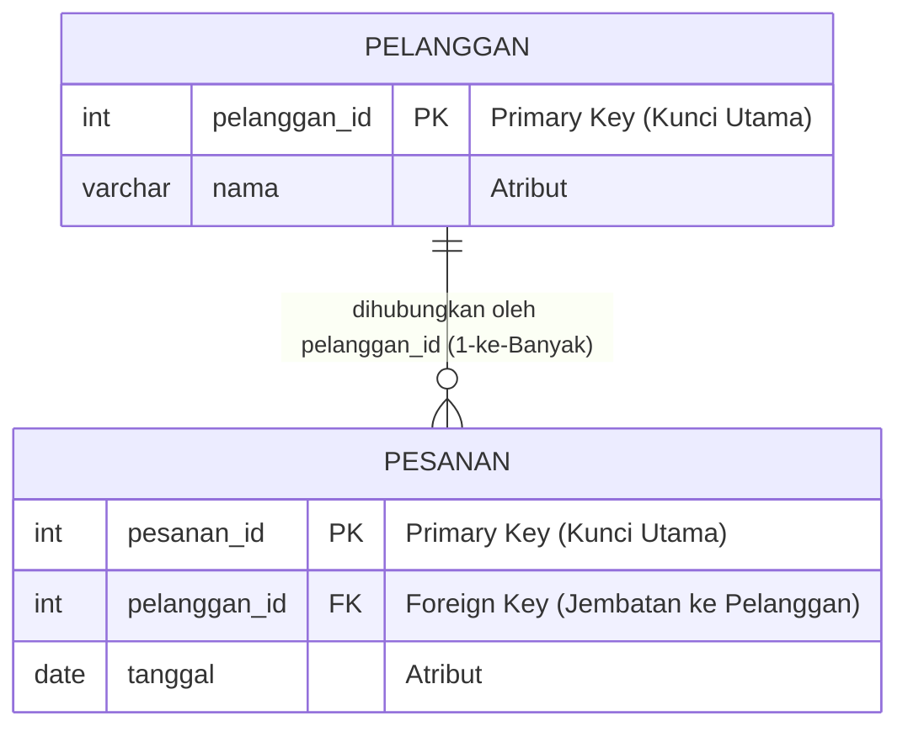

# 01 - BAB 01 KONSEP RELASI ANTAR TABEL

Status: DRAFT
Rak: SQL dan Querying
Buku: Join dan Relasi Query
Level: Level 1 - Level 2
Tipe Materi: Tutorial
Target: Developer yang ingin mahir menulis query PostgreSQL.
Estimasi Baca: 10 Menit
Terakhir Diperiksa: 2026-05-17

Sumber Utama: PostgreSQL Official Documentation
Versi Referensi: PostgreSQL docs/current
Status Verifikasi Sumber: REVIEW

---

## 1. Tujuan Belajar
Di akhir bab ini, pembaca diharapkan mampu:
- Menjelaskan alasan logis mengapa data di dalam database relasional harus dipecah ke dalam beberapa tabel terpisah.
- Memahami konsep relasi data tingkat kueri SQL melalui pemanfaatan jembatan **Primary Key** dan **Foreign Key**.
- Mengidentifikasi bahaya serta risiko anomali data (insert, update, delete) yang muncul akibat menggabungkan seluruh informasi dalam satu tabel raksasa (*flat table*).
- Memahami peran mendasar operasi **JOIN** sebagai metode untuk merekatkan kembali lembaran data lintas tabel dalam hasil kueri.

## 2. Prasyarat
- Memahami dasar filosofi penyimpanan data relasional (baca: [Filosofi Relational Database](../../01-orientasi-sejarah-dan-fondasi-postgresql/buku-03-filosofi-dan-mental-model-postgresql/bab-01-filosofi-relational-database.md)).
- Mampu melakukan kueri pengurutan data menggunakan klausa ORDER BY (baca: [Sorting dengan ORDER BY](../buku-02-filtering-sorting-dan-limit/bab-03-sorting-dengan-order-by.md)).

## 3. Ringkasan Cepat
Di dalam sistem database relasional (RDBMS) seperti PostgreSQL, data tidak disimpan di dalam satu tabel raksasa (mirip seperti file Excel tunggal yang datar). Data dipecah secara logis ke dalam beberapa tabel spesifik (seperti pelanggan, pesanan, dan produk) demi menghindari data kembar yang tidak efisien (redundansi) serta meminimalkan anomali pembaruan data. Penautan data antar tabel dilakukan secara aman menggunakan jembatan **Primary Key** dan **Foreign Key**. Operasi **JOIN** adalah cara kueri SQL menyatukan kembali lembaran-lembaran tabel terpisah tersebut menjadi satu kesatuan laporan informasi yang utuh saat dipanggil oleh aplikasi.

## 4. Istilah Penting di Bab Ini

| Istilah | Arti Singkat |
|---|---|
| Redundancy | Duplikasi atau penulisan data yang sama secara berulang-ulang di dalam database, yang memicu pemborosan kapasitas harddisk. |
| Primary Key (PK) | Kolom khusus yang bertindak sebagai kartu tanda pengenal unik yang mutlak membedakan satu baris data dengan baris lainnya di satu tabel. |
| Foreign Key (FK) | Kolom di tabel anak yang menyimpan nilai Primary Key dari tabel induk untuk menghubungkan kedua tabel tersebut. |
| Flat Table | Desain tabel tunggal raksasa yang menampung seluruh kolom informasi tanpa memecahnya ke dalam struktur relasional. |
| Referential Integrity | Aturan konsistensi database yang menjamin tidak boleh ada Foreign Key yang menunjuk ke Primary Key yang tidak eksis di tabel induk. |
| Join | Instruksi SQL untuk menggabungkan baris data dari dua tabel atau lebih berdasarkan kecocokan nilai kolom kunci relasi. |

## 5. Analogi Sehari-hari
Mari kita analogikan konsep pemecahan tabel database dengan **Pengorganisasian Lemari Pakaian Rumah Tangga**:

- **Sebelum Menerapkan Relasi (Satu Tabel Raksasa)**:
  Bayangkan Anda menyimpan baju kaos kaki, celana jin, jaket wol tebal, dasi sutra, sabuk kulit, dan jas formal di dalam **satu buah kotak kardus besar yang sama secara bertumpuk-tumpuk**. 
  - Saat Anda ingin mencari dasi sutra merah, Anda terpaksa harus membongkar seluruh isi kardus raksasa tersebut dari atas ke bawah (analogi dari kueri lambat membaca tabel raksasa).
  - Selain itu, jika Anda memiliki 10 jaket tebal yang identik bahan pembuatnya, Anda terpaksa harus menempelkan kertas instruksi cara mencuci bahan wol tersebut di setiap gantungan jaket secara berulang-ulang (redundansi data).
- **Setelah Menerapkan Relasi (Tabel Terpisah)**:
  Anda memutuskan membeli lemari pakaian modern yang terbagi-bagi secara rapi:
  - **Tabel Jaket (Gantungan Utama)**: khusus digantung tumpukan jaket. Setiap gantungan diberikan nomor urut unik (`Primary Key`).
  - **Tabel Aturan Cuci (Laci Bawah)**: khusus menyimpan lembar instruksi mencuci berbagai bahan (Wool, Sutra, Jeans). Di sini, aturan mencuci bahan Wool hanya ditulis **satu kali saja**.
  - **Jembatan Relasi**: Di setiap gantungan jaket wol, Anda cukup menyematkan **label kertas kecil bertuliskan nomor laci aturan cuci** tersebut (`Foreign Key`).
  - **Proses JOIN**: Ketika ingin mencuci jaket wol tertentu, Anda melihat nomor gantungan jaket tersebut, membaca label kecil di gantungan (Foreign Key), lalu berjalan menuju laci aturan cuci (Tabel Aturan Cuci) untuk mencocokkan nomor lacinya dan membaca detail instruksinya. Proses berjalan mencocokkan gantungan dengan laci inilah kueri **JOIN**.

## 6. Batas Analogi
Di dalam lemari pakaian fisik dunia nyata, Anda harus melangkah secara manual menggunakan kaki dan mata kepala untuk mencocokkan gantungan baju ke laci, yang memakan waktu beberapa detik dan melelahkan jika pakaiannya berjumlah ribuan.

Di dalam mesin database PostgreSQL digital, pencocokan jutaan baris gantungan (Primary Key) dengan laci (Foreign Key) dilakukan secepat kilat secara komputasi dalam satuan milidetik oleh engine pengeksekusi kueri tanpa memerlukan gerakan fisik sama sekali.

## 7. Ilustrasi Konsep

Status Ilustrasi: DRAFT



## 8. Penjelasan Ilustrasi
Diagram Entity-Relationship (ERD) sederhana di atas menggambarkan jembatan relasi antara tabel `PELANGGAN` dan `PESANAN`. Data pelanggan diisolasi di tabelnya sendiri dengan pengenal unik `pelanggan_id` sebagai **Primary Key**. Ketika pelanggan melakukan transaksi belanja, data transaksi dicatat di tabel `PESANAN` dengan menyertakan kolom `pelanggan_id` milik pelanggan tersebut sebagai **Foreign Key**. Dengan cara ini, database mengetahui secara presisi transaksi tersebut milik siapa tanpa perlu menulis ulang nama pelanggan di setiap baris transaksi pesanan.

## 9. Batas Ilustrasi
Visualisasi di atas berfokus pada tipe relasi satu-ke-banyak (*one-to-many*) antara pelanggan dan pesanan yang merupakan relasi paling umum di database backend. Ilustrasi ini tidak memvisualisasikan relasi satu-ke-satu (*one-to-one*) atau relasi banyak-ke-banyak (*many-to-many*) yang membutuhkan perantara tabel ketiga (*junction table*).

## 10. Konsep Inti

### 1. Bahaya Desain "Satu Tabel Raksasa" (Flat Table)
Bayangkan Anda memaksakan sistem e-commerce Anda menggunakan satu tabel tunggal raksasa bernama `katalog_penjualan`:

| Pelanggan_ID | Nama_Pelanggan | Alamat | Invoice_ID | Tanggal_Pesan | Nama_Produk | Harga |
|---|---|---|---|---|---|---|
| 1 | Syah Putra | Jakarta | INV-001 | 2026-05-15 | Kopi Hitam | 15000 |
| 1 | Syah Putra | Jakarta | INV-002 | 2026-05-16 | Susu Sapi | 20000 |

#### Risiko Anomali yang Muncul:
1.  **Anomali Pembaruan (Update Anomaly)**: Jika Syah Putra pindah alamat ke Bandung, Anda harus memperbarui kolom alamat di **seluruh** baris transaksi miliknya yang mungkin sudah berjumlah ribuan baris. Jika ada satu baris saja yang gagal diperbarui akibat gangguan jaringan, data alamat Syah Putra akan menjadi rancu dan membingungkan (inkonsisten).
2.  **Anomali Penghapusan (Delete Anomaly)**: Jika Anda memutuskan untuk menghapus data transaksi `INV-001` milik Syah Putra karena pembatalan transaksi, dan itu adalah satu-satunya transaksi yang ia miliki, secara tidak sengaja Anda juga akan menghapus data nama dan alamat Syah Putra dari sistem. Kita kehilangan informasi pelanggan hanya karena menghapus transaksi!

### 2. Primary Key dan Foreign Key sebagai Perekat Relasi
- **Primary Key (PK)**: Bertindak sebagai pengenal utama. Syarat PK wajib unik di seluruh baris tabel dan dilarang keras bernilai kosong (`NOT NULL`).
- **Foreign Key (FK)**: Kolom penunjuk di tabel anak. Nilai yang diisi di kolom Foreign Key **harus** cocok dengan salah satu nilai Primary Key yang sudah eksis di tabel induk. Aturan ini disebut **Referential Integrity** (Integritas Referensial).

## 11. Penjelasan Detail

### Bagaimana Kueri SQL "JOIN" Menyatukan Kembali Data?
Ketika kita memecah data ke dalam tabel terpisah, aplikasi backend Anda (misal dashboard Admin) seringkali tetap membutuhkan tampilan informasi yang menyatu (misalnya menampilkan Nomor Invoice beserta Nama Pelanggannya secara berdampingan).

Di sinilah peran operasi **JOIN** bekerja. JOIN adalah instruksi di kueri SQL yang meminta engine PostgreSQL untuk:
1.  Membuka Tabel A (`pesanan`) dan Tabel B (`pelanggan`).
2.  Berdiri di setiap baris Tabel A, lalu membaca nilai `pelanggan_id` (Foreign Key).
3.  Berjalan menuju Tabel B, lalu mencari baris yang memiliki `pelanggan_id` yang sama persis (Primary Key).
4.  Menggabungkan kolom-kolom terpilih dari kedua baris tersebut secara horizontal ke dalam satu baris hasil keluaran sementara (*result set*) untuk dikirim ke aplikasi.

## 12. Contoh SQL Dasar
Berikut adalah contoh pembuatan struktur tabel relasional `kategori` dan `produk` yang saling bertautan melalui Primary Key dan Foreign Key di PostgreSQL:

```sql
-- 1. Membuat tabel induk (Kategori)
CREATE TABLE kategori (
    kategori_id INT GENERATED ALWAYS AS IDENTITY PRIMARY KEY, -- Primary Key
    nama_kategori VARCHAR(100) NOT NULL
);

-- 2. Membuat tabel anak (Produk) yang merujuk ke Kategori
CREATE TABLE produk (
    produk_id INT GENERATED ALWAYS AS IDENTITY PRIMARY KEY,
    nama_produk VARCHAR(150) NOT NULL,
    harga NUMERIC(12, 2) NOT NULL,
    kategori_id INT, -- Kolom penampung jembatan relasi
    
    -- Menegakkan integritas referensial Foreign Key secara fisik
    CONSTRAINT fk_produk_kategori 
        FOREIGN KEY (kategori_id) 
        REFERENCES kategori(kategori_id)
);
```

## 13. Contoh SQL Praktik Project
Berikut adalah kueri SELECT dasar untuk membuktikan bahwa data `kategori_id` di tabel anak `produk` merujuk ke data `kategori_id` yang valid di tabel induk `kategori`:

```sql
-- Memanggil data produk beserta kode kategori id-nya
SELECT 
    p.nama_produk AS nama_barang,
    p.harga AS harga_jual,
    p.kategori_id AS kode_kategori_produk -- Kolom Foreign Key
FROM produk AS p;
```

## 14. Kesalahan Umum
- **Mengabaikan Constraint Foreign Key Resmi**: Menghubungkan dua tabel hanya melalui nama kolom yang mirip secara logis di backend, tanpa mendaftarkan batasan `FOREIGN KEY` resmi di skema PostgreSQL. Hal ini memicu risiko munculnya data yatim piatu (*orphan data*), di mana ada baris data produk yang memiliki `kategori_id = 99`, padahal di tabel kategori tidak ada kategori dengan ID 99 tersebut.
- **Menggunakan Tipe Data Berbeda untuk Kunci Relasi**: Membuat kolom Primary Key di tabel induk bertipe `INT`, tetapi membuat kolom Foreign Key-nya di tabel anak bertipe `VARCHAR` (teks). PostgreSQL akan langsung menolak pembuatan tabel tersebut karena jembatan relasi wajib memiliki tipe data yang identik secara komputasi.

## 15. Catatan Interview
- **Pertanyaan**: "Apa yang dimaksud dengan Integritas Referensial (*Referential Integrity*), dan bagaimana PostgreSQL melindunginya jika kita mencoba menghapus baris data di tabel induk yang masih memiliki anak di tabel lain?"
- **Jawaban**: "Integritas Referensial adalah aturan yang menjamin hubungan antar tabel selalu konsisten dan tidak ada data anak yang merujuk ke data induk yang tidak eksis. Jika kita mencoba menghapus baris di tabel induk (cth: menghapus pelanggan) yang masih memiliki baris terhubung di tabel anak (cth: pesanan), PostgreSQL secara default akan menolak penghapusan tersebut dengan pesan error `foreign key constraint`. Kita bisa mengatur perilakunya menggunakan opsi `ON DELETE CASCADE` (menghapus anak secara otomatis jika induk dihapus) atau `ON DELETE SET NULL` (mengosongkan nilai FK di anak jika induk dihapus)."

## 16. Catatan Diskusi User
- **Pertanyaan Umum**: "Apakah memecah tabel dan melakukan JOIN dapat memperlambat kueri database?"
- **Diskusikan**: Melakukan operasi `JOIN` memang membutuhkan komputasi tambahan bagi server database. Namun, di dalam PostgreSQL, hal ini dioptimalisasi secara cerdas menggunakan pembuatan **Indeks** pada kolom Primary Key dan Foreign Key. Dengan indeks yang tepat, operasi JOIN jutaan baris data berjalan super cepat. Desain tabel terpisah (ternormalisasi) jauh lebih direkomendasikan karena menghemat memori penyimpanan disk dan mencegah terjadinya kerusakan data yang berbiaya mahal.

## 17. Latihan Kecil
1. Rancanglah skema tabel relasional sederhana untuk mengelola data **Klinik Dokter**: Tentukan kolom Primary Key dan Foreign Key yang menghubungkan tabel `dokter` dengan tabel `pasien_pendaftaran`!
2. Apa perbedaan fungsional utama antara Primary Key dengan Foreign Key berdasarkan aturan keunikan (*uniqueness*) nilainya?

## 18. Checklist Pemahaman
- [ ] Memahami alasan mengapa tabel tunggal raksasa (*flat table*) berbahaya bagi konsistensi data.
- [ ] Mampu menerangkan pengertian Primary Key dan Foreign Key sebagai pilar relasi database.
- [ ] Mengetahui arti dari istilah Integritas Referensial (*Referential Integrity*).
- [ ] Memahami peran operasi `JOIN` dalam merekatkan kembali data terpisah di tingkat kueri SQL.

## 19. Hubungan dengan Materi Lain

### Posisi Materi
- Rak: [02 - SQL dan Querying](../../README.md)
- Buku: [Join dan Relasi Query](../)

### Prasyarat
- [Sorting dengan ORDER BY](../buku-02-filtering-sorting-dan-limit/bab-03-sorting-dengan-order-by.md)

### Materi Sebelumnya
- [Sorting dengan ORDER BY](../buku-02-filtering-sorting-dan-limit/bab-03-sorting-dengan-order-by.md)

### Materi Berikutnya
- [INNER JOIN](./bab-02-inner-join.md)

### Materi Terkait
- [Primary Key, Foreign Key, dan Constraint](../../03-desain-data-dan-schema/buku-02-primary-key-foreign-key-dan-constraint/) (Membahas desain skema tingkat mendalam)

### Istilah Terkait
- Normalization, Flat Table, Referential Integrity, Cascade Delete, Parent Table, Child Table.

## 20. Referensi Resmi
Jangan membuka tautan berikut pada batch ini, cukup cantumkan sebagai referensi resmi yang ditargetkan untuk verifikasi nanti:
- PostgreSQL Official Documentation — perlu diverifikasi pada batch official docs verification.
- SQL standard / relational database concept — perlu diverifikasi jika nanti masuk fase source verification.

## 21. Catatan Pribadi / Project Notes
*   *Catatan Draft*: Bab ini berfungsi untuk meletakkan pemikiran mendasar mengapa JOIN itu dibutuhkan sebelum pemula dicekoki rumus sintaks INNER JOIN yang kering. Dengan memahami bahaya anomali data di tabel raksasa, pemula akan mengapresiasi keindahan desain relasional. Status verifikasi diatur ke REVIEW.
