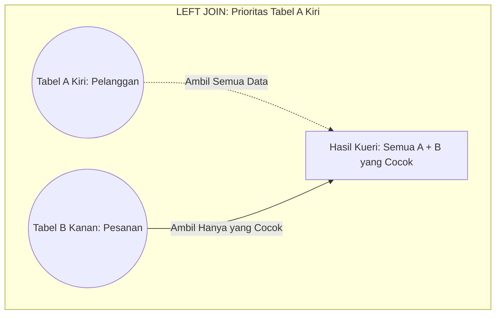

# 03 - BAB 03 LEFT DAN RIGHT JOIN

Status: DRAFT
Rak: SQL dan Querying
Buku: Join dan Relasi Query
Level: Level 1 - Level 2
Tipe Materi: Tutorial
Target: Developer yang ingin mahir menulis query PostgreSQL.
Estimasi Baca: 10 Menit
Terakhir Diperiksa: 2026-05-17

Sumber Utama: PostgreSQL Official Documentation
Versi Referensi: PostgreSQL docs/current
Status Verifikasi Sumber: REVIEW

---

## 1. Tujuan Belajar
Di akhir bab ini, pembaca diharapkan mampu:
- Menjelaskan perbedaan konseptual antara `LEFT JOIN`, `RIGHT JOIN`, dan `INNER JOIN`.
- Menuliskan sintaks `LEFT JOIN` dan `RIGHT JOIN` untuk menangani data yang tidak berpasangan di PostgreSQL.
- Menganalisis mengapa penggunaan `LEFT JOIN` jauh lebih umum digunakan dalam standar industri backend dibandingkan `RIGHT JOIN`.
- Menemukan data yang tidak memiliki relasi (misalnya: pelanggan pasif, kategori kosong) menggunakan trik filter `IS NULL` setelah operasi `LEFT JOIN`.

## 2. Prasyarat
- Memahami cara kerja `INNER JOIN` dan klausa `ON` (baca: [INNER JOIN](./bab-02-inner-join.md)).
- Mengetahui konsep dasar nilai kosong (`NULL`) di database (baca: [Sorting dengan ORDER BY](../../buku-02-filtering-sorting-dan-limit/bab-03-sorting-dengan-order-by.md)).

## 3. Ringkasan Cepat
`LEFT JOIN` dan `RIGHT JOIN` (dikelompokkan sebagai Outer Joins) digunakan untuk menampilkan seluruh data dari satu tabel (tabel kiri atau tabel kanan) beserta data yang cocok dari tabel pasangannya. Jika ada baris data di tabel prioritas utama yang tidak memiliki pasangan di tabel tujuan, kueri akan tetap menampilkan baris data utama tersebut, sementara kolom-kolom milik tabel pasangan akan otomatis diisi dengan nilai `NULL`. Di industri pemrograman, `LEFT JOIN` jauh lebih disukai karena arah pembacaan kueri mengalir secara alami dari kiri ke kanan.

## 4. Istilah Penting di Bab Ini

| Istilah | Arti Singkat |
|---|---|
| Outer Join | Istilah umum untuk JOIN yang tetap mempertahankan data yang tidak memiliki pasangan cocok (LEFT, RIGHT, FULL). |
| LEFT JOIN | Operasi yang memprioritaskan tabel kiri; menampilkan semua baris tabel kiri dan baris yang cocok dari tabel kanan. |
| RIGHT JOIN | Operasi yang memprioritaskan tabel kanan; menampilkan semua baris tabel kanan dan baris yang cocok dari tabel kiri. |
| NULL | Nilai penanda di database yang menyatakan bahwa data tersebut tidak eksis atau kosong. |
| Left / Right Table | Tabel kiri adalah tabel yang ditulis SEBELUM keyword JOIN; tabel kanan adalah tabel yang ditulis SETELAH keyword JOIN. |

## 5. Analogi Sehari-hari
Mari kita analogikan kembali proses kerja Outer Join dengan **Acara Makan Malam dengan Aturan Tamu VVIP**:

Kembali ke pesta restoran Couple Dinner. Di `INNER JOIN`, satpam hanya memperbolehkan masuk pasangan suami-istri yang membawa sertifikat nikah lengkap. Kali ini, penyelenggara mengubah aturan untuk memprioritaskan tamu VVIP:

- **Aturan LEFT JOIN (Suami VVIP - Prioritas Kiri)**:
  Satpam restoran menetapkan aturan: *"Semua Suami (Tabel Kiri) wajib diperbolehkan masuk pesta tanpa kecuali."*
  - **Budi dan Ani** datang bersama membawa sertifikat nikah. Mereka diperbolehkan masuk dan duduk berdampingan di satu meja makan romantis (baris data sukses berpasangan).
  - **Joko** (Suami) datang sendirian karena istrinya dinas luar kota. Joko **tetap diperbolehkan masuk** stasiun pesta karena ia adalah Suami (Tabel Kiri). Ia duduk di meja makan, tetapi kursi di hadapannya dibiarkan melayang kosong (`NULL`).
  - **Fitri** (Istri) datang sendirian tanpa suami. Karena pesta kali ini memprioritaskan Suami (tabel kiri), Fitri **ditolak masuk** stasiun pesta karena ia berada di tabel kanan dan tidak didampingi suami VVIP.
- **Aturan RIGHT JOIN (Istri VVIP - Prioritas Kanan)**:
  Kebalikan dari LEFT JOIN. Satpam menetapkan seluruh Istri (Tabel Kanan) wajib masuk tanpa kecuali. Fitri yang datang sendiri diperbolehkan masuk dengan kursi suaminya kosong (`NULL`), sedangkan Joko yang datang sendiri langsung ditolak masuk.

## 6. Batas Analogi
Di dunia sosial nyata, membeda-bedakan hak masuk berdasarkan status suami saja atau istri saja dapat memicu kecaman diskriminasi sosial.

Di dalam database SQL PostgreSQL, pembagian prioritas tabel kiri/kanan diatur murni secara logis demi kebutuhan ekstraksi informasi bisnis (misalnya menampilkan seluruh daftar inventori gudang yang belum laku terjual sama sekali).

## 7. Ilustrasi Konsep

Status Ilustrasi: DRAFT



## 8. Penjelasan Ilustrasi
Bagan Venn di atas menggambarkan logika penyerapan data pada `LEFT JOIN`. Seluruh daerah lingkaran Tabel A (Kiri) diarsir penuh, menunjukkan semua baris data pelanggan akan masuk ke hasil kueri tanpa kecuali. Sementara itu, lingkaran Tabel B (Kanan) hanya diambil bagian irisannya saja yang menempel dengan lingkaran A. Jika ada bagian lingkaran A yang tidak bersentuhan dengan B (pelanggan pasif), ia tetap masuk ke hasil kueri dengan menyandang status kolom dari B bernilai `NULL`.

## 9. Batas Ilustrasi
Visualisasi ini memetakan relasi statis antara dua set data. Ia tidak menggambarkan skenario saat kita melakukan rantai join berturut-turut (*chained joins*), misalnya menggabungkan Tabel A `LEFT JOIN` Tabel B lalu dilanjutkan `LEFT JOIN` Tabel C, di mana penanganan nilai `NULL` harus dipantau secara hati-hati agar tidak merusak penyaringan data di bagian bawah kueri.

## 10. Konsep Inti

### 1. Sintaks Dasar LEFT JOIN
Sintaks formal penulisan `LEFT JOIN` meletakkan tabel utama di sebelah kiri (setelah `FROM`), diikuti dengan keyword `LEFT JOIN` dan tabel pasangan di sebelah kanan:

```sql
SELECT 
    p.nama AS nama_pelanggan,
    o.invoice_no AS nomor_invoice
FROM pelanggan AS p -- Tabel Kiri (Utama)
LEFT JOIN pesanan AS o ON p.pelanggan_id = o.pelanggan_id; -- Tabel Kanan
```

### 2. RIGHT JOIN: Kebalikan yang Jarang Dipakai
Sintaks `RIGHT JOIN` secara logika melakukan hal yang sama namun memprioritaskan tabel yang ditulis di sebelah kanan:

```sql
SELECT 
    p.nama AS nama_pelanggan,
    o.invoice_no AS nomor_invoice
FROM pesanan AS o -- Tabel Kiri
RIGHT JOIN pelanggan AS p ON o.pelanggan_id = p.pelanggan_id; -- Tabel Kanan (Utama)
```
Kueri `RIGHT JOIN` di atas menghasilkan data yang **sama persis** dengan kueri `LEFT JOIN` sebelumnya.

> [!TIP]
> Di industri backend, developer 99% selalu menggunakan `LEFT JOIN` dan menghindari `RIGHT JOIN`. Manusia membaca dari kiri ke kanan, sehingga menuliskan tabel utama di awal (`FROM pelanggan`) jauh lebih intuitif dan mempermudah pemeliharaan kode kueri di masa depan.

### 3. Jaminan Hasil NULL
Kolom-kolom yang ditarik dari tabel pasangan akan diisi nilai `NULL` secara otomatis oleh PostgreSQL jika tidak ditemukan kecocokan baris data. Nilai `NULL` ini bukan teks string tulisan `"NULL"`, melainkan penanda khusus kekosongan data.

## 11. Penjelasan Detail

### Trik Emas: Mencari Data yang Tidak Memiliki Pasangan (IS NULL)
Salah satu kegunaan terbesar `LEFT JOIN` adalah untuk menjawab pertanyaan analitik bisnis seperti: *"Siapa saja pelanggan terdaftar yang belum pernah belanja sama sekali di sistem kita?"*

Kita menyelesaikan ini dengan melakukan `LEFT JOIN` pelanggan dengan pesanan, lalu menyaring baris hasil yang kolom pesanannya bernilai `NULL` menggunakan klausa `WHERE ... IS NULL`:

```sql
SELECT 
    p.pelanggan_id,
    p.nama AS nama_pelanggan
FROM pelanggan AS p
LEFT JOIN pesanan AS o ON p.pelanggan_id = o.pelanggan_id
WHERE o.pesanan_id IS NULL; -- Menyaring hanya yang tidak punya pesanan
```

#### Cara Berpikir Engine:
1. Engine melakukan `LEFT JOIN`. Pelanggan aktif mendapatkan data nomor invoice, sedangkan pelanggan pasif mendapatkan `NULL` di kolom `pesanan_id`.
2. Engine memproses klausa `WHERE o.pesanan_id IS NULL`. Pelanggan aktif yang memiliki transaksi disaring keluar.
3. Hanya pelanggan pasif (yang kolom pesanannya berisi `NULL`) yang tersisa di hasil akhir kueri.

## 12. Contoh SQL Dasar
Berikut adalah contoh kueri dasar penggunaan `LEFT JOIN` di PostgreSQL:

```sql
-- 1. Menampilkan seluruh pelanggan beserta nomor transaksinya (jika ada)
SELECT p.nama, o.invoice_no 
FROM pelanggan AS p
LEFT JOIN pesanan AS o ON p.pelanggan_id = o.pelanggan_id;

-- 2. Menggunakan RIGHT JOIN (hanya sebagai contoh perbandingan konseptual)
SELECT p.nama, o.invoice_no 
FROM pesanan AS o
RIGHT JOIN pelanggan AS p ON o.pelanggan_id = p.pelanggan_id;
```

## 13. Contoh SQL Praktik Project
Dalam skenario inventori e-commerce, kita ingin menyajikan daftar seluruh kategori produk di layar admin, lengkap dengan jumlah stok produk yang ada di kategori tersebut. Kita harus memastikan kategori yang belum memiliki produk sama sekali tetap tampil di daftar layar dengan status kosong:

```sql
-- Kueri dashboard inventori kategori produk
SELECT 
    c.nama_kategori AS nama_kategori,
    p.nama_produk AS nama_barang,
    p.stok AS sisa_stok
FROM kategori AS c -- Menjamin semua kategori tampil
LEFT JOIN produk AS p ON c.kategori_id = p.kategori_id
ORDER BY c.nama_kategori ASC;
```

## 14. Kesalahan Umum
- **Jebakan Memicu Inner Join Secara Tidak Sengaja**:
  Menulis filter di klausa `WHERE` pada kolom tabel kanan setelah `LEFT JOIN`. Contoh:
  ```sql
  -- QUERY INI AKAN MENJELMA MENJADI INNER JOIN KARENA BLUNDER WHERE!
  SELECT p.nama, o.invoice_no 
  FROM pelanggan AS p
  LEFT JOIN pesanan AS o ON p.pelanggan_id = o.pelanggan_id
  WHERE o.status = 'PAID';
  ```
  *Mengapa salah?* Karena jika pelanggan pasif menghasilkan data pesanan bernilai `NULL`, kueri `WHERE o.status = 'PAID'` akan mengevaluasi `NULL = 'PAID'` sebagai salah (*false*), sehingga pelanggan pasif tersebut langsung dibuang.
  *Cara memperbaikinya*: Pindahkan filter tersebut ke bagian syarat `ON`:
  ```sql
  -- PERBAIKAN YANG BENAR
  SELECT p.nama, o.invoice_no 
  FROM pelanggan AS p
  LEFT JOIN pesanan AS o ON p.pelanggan_id = o.pelanggan_id AND o.status = 'PAID';
  ```

## 15. Catatan Interview
- **Pertanyaan**: "Apa perbedaan fungsional terbesar antara `INNER JOIN` dengan `LEFT JOIN`, dan berikan contoh kasus nyata di mana Anda wajib memilih `LEFT JOIN`!"
- **Jawaban**: "Perbedaan terbesarnya adalah penanganan baris data yang tidak memiliki pasangan. `INNER JOIN` hanya mengembalikan data yang memiliki kecocokan di kedua tabel (irisan murni), sedangkan `LEFT JOIN` mengembalikan seluruh data dari tabel kiri ditambah data yang cocok dari tabel kanan, dengan kolom kanan berisi `NULL` jika tidak cocok. Contoh kasus nyata wajib `LEFT JOIN` adalah ketika kita merancang halaman dashboard promosi e-commerce untuk mencari produk-produk yang belum pernah laku terjual sama sekali di sistem agar bisa kita berikan diskon cuci gudang."

## 16. Catatan Diskusi User
- **Pertanyaan Umum**: "Apakah performa `LEFT JOIN` lebih lambat dibandingkan `INNER JOIN`?"
- **Diskusikan**: Secara umum, `LEFT JOIN` memiliki sedikit beban komputasi tambahan bagi server karena engine tidak boleh langsung membuang baris data yang tidak memiliki pasangan dan harus memformat nilai `NULL` di memori. Namun, perbedaannya sangat tipis pada server modern. Pilihan antara keduanya harus didasarkan pada kebutuhan kebenaran logika bisnis data, bukan murni optimasi mikro prematur.

## 17. Latihan Kecil
1. Tuliskan kueri SQL untuk menampilkan daftar seluruh `karyawan` (tabel kiri) beserta data `aset_komputer` (tabel kanan) yang dipinjamkannya! Saring hasil kueri untuk menampilkan daftar karyawan mana saja yang belum dipinjamkan komputer kerja sama sekali!
2. Jika tabel `siswa` memiliki 10 baris data dan tabel `detail_prestasi` memiliki 5 baris data, dan hanya ada 4 siswa yang memiliki catatan prestasi, berapakah jumlah baris data yang akan keluar jika kita menggunakan kueri `LEFT JOIN` (siswa sebagai tabel kiri)? Jelaskan hitungannya!

## 18. Checklist Pemahaman
- [ ] Memahami perbedaan logika cara kerja `LEFT JOIN` dan `RIGHT JOIN` terhadap data kosong.
- [ ] Mampu menuliskan sintaks `LEFT JOIN` lengkap dengan instruksi syarat kecocokan `ON`.
- [ ] Mengetahui alasan mengapa developer industri 99% lebih menyukai `LEFT JOIN` dibanding `RIGHT JOIN`.
- [ ] Mampu mendeteksi dan menyelesaikan kasus data yatim piatu menggunakan trik filter `IS NULL`.

## 19. Hubungan dengan Materi Lain

### Posisi Materi
- Rak: [02 - SQL dan Querying](../../README.md)
- Buku: [Join dan Relasi Query](../)

### Prasyarat
- [INNER JOIN](./bab-02-inner-join.md)

### Materi Sebelumnya
- [INNER JOIN](./bab-02-inner-join.md)

### Materi Berikutnya
- [Pembuatan Table dan Data Type](../../../03-desain-data-dan-schema/buku-01-konsep-table-schema-dan-relasi/bab-02-pembuatan-table-dan-data-type.md)

### Materi Terkait
- [Normalisasi Form 1-2-3](../../../03-desain-data-dan-schema/buku-03-normalisasi-dan-denormalisasi/bab-01-normal-form-1-2-3.md) (Membahas pemecahan tabel terstruktur)

### Istilah Terkait
- Outer Join, Left Join, Right Join, Null Value, Intersection, Result Set, Column Ambiguity.

## 20. Referensi Resmi
Jangan membuka tautan berikut pada batch ini, cukup cantumkan sebagai referensi resmi yang ditargetkan untuk verifikasi nanti:
- PostgreSQL Official Documentation — perlu diverifikasi pada batch official docs verification.
- SQL standard / relational database concept — perlu diverifikasi jika nanti masuk fase source verification.

## 21. Catatan Pribadi / Project Notes
*   *Catatan Draft*: Penting untuk mengajarkan jebakan WHERE filter pada kolom kanan di bab ini. Banyak developer junior membuat bug sistem di mana data yang diniatkan LEFT JOIN berubah menjadi INNER JOIN secara sunyi akibat meletakkan filter status di WHERE. Status verifikasi diatur ke REVIEW.
