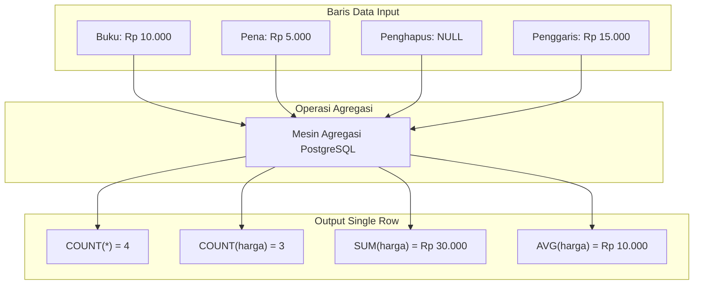

# 01 - BAB 01 FUNGSI AGREGASI COUNT SUM AVG

Status: DRAFT
Rak: SQL dan Querying
Buku: Agregasi Grouping dan Having
Level: Level 1 - Level 2
Tipe Materi: Tutorial
Target: Developer yang ingin mahir menulis query PostgreSQL.
Estimasi Baca: 10 Menit
Terakhir Diperiksa: 2026-05-18

Sumber Utama: PostgreSQL Official Documentation
Versi Referensi: PostgreSQL docs/current
Status Verifikasi Sumber: REVIEW

---

## 1. Tujuan Belajar
Di akhir bab ini, pembaca diharapkan mampu:
- Memahami konsep dasar agregasi data di PostgreSQL.
- Menjelaskan perbedaan fungsi `COUNT`, `SUM`, `AVG`, `MIN`, dan `MAX`.
- Menganalisis perbedaan krusial antara `COUNT(*)` dan `COUNT(nama_kolom)` dalam memperlakukan nilai `NULL`.
- Mengaplikasikan fungsi agregasi dasar untuk membuat rangkuman data bisnis riil.

## 2. Prasyarat
- Memahami kueri data dasar menggunakan `SELECT`, `WHERE`, dan `ORDER BY`.
- Memahami relasi tabel dasar dan penggabungan dengan `LEFT JOIN` (baca: [LEFT JOIN dan RIGHT JOIN](../buku-03-join-dan-relasi-query/bab-03-left-dan-right-join.md)).

## 3. Ringkasan Cepat
Fungsi agregasi (`Aggregate Functions`) di PostgreSQL adalah fungsi khusus yang memproses sekumpulan baris data (*multiple rows*) dan meringkasnya menjadi satu nilai tunggal (*single value*). Fungsi dasar yang paling sering digunakan meliputi `COUNT` (menghitung jumlah baris), `SUM` (menjumlahkan nilai numerik), `AVG` (menghitung rata-rata), serta `MIN` dan `MAX` (menemukan nilai terkecil dan terbesar). Secara default, fungsi-fungsi ini (kecuali `COUNT(*)`) mengabaikan nilai `NULL` dalam perhitungannya.

## 4. Istilah Penting di Bab Ini

| Istilah | Arti Singkat |
|---|---|
| Agregasi | Proses menyatukan beberapa elemen atau data menjadi satu kesatuan ringkasan. |
| COUNT | Fungsi untuk menghitung jumlah kemunculan baris data. |
| SUM | Fungsi untuk menghitung total kumulatif nilai numerik. |
| AVG (Average) | Fungsi untuk menghitung rata-rata nilai numerik. |
| MIN / MAX | Fungsi untuk mencari nilai minimum (terkecil) dan maksimum (terbesar) dari suatu set data. |
| NULL | Representasi data kosong, belum diisi, atau tidak terdefinisi di database. |

## 5. Analogi Sehari-hari
Bayangkan Anda adalah seorang **Kasir Supermarket** yang sedang melayani seorang pelanggan dengan sekeranjang penuh barang belanjaan:

- **COUNT**: Anda menghitung total *berapa item barang* yang ada di dalam keranjang (misalnya: "Ada 5 barang di keranjang ini"). Anda tidak peduli apakah barang itu permen seharga Rp500 atau susu formula seharga Rp150.000, Anda hanya menghitung kuantitas fisiknya.
- **SUM**: Anda menjumlahkan harga *seluruh barang* tersebut untuk mendapatkan total tagihan belanjaan (misalnya: "Total belanjaan Anda adalah Rp185.000").
- **AVG**: Anda menghitung rata-rata harga barang yang dibeli oleh pelanggan tersebut (misalnya: "Rata-rata harga per item barang yang Anda beli adalah Rp37.000").
- **MIN / MAX**: Anda mencari barang mana yang harganya *paling murah* (MIN - permen Rp500) dan barang mana yang *paling mahal* (MAX - susu Rp150.000).

## 6. Batas Analogi
Di supermarket nyata, Anda menghitung semua barang fisik satu per satu secara manual berurutan. Di database PostgreSQL, proses agregasi dilakukan secara paralel dan sangat cepat di tingkat mesin penyimpanan (*storage engine*). 

Selain itu, kasir supermarket tidak akan pernah menemukan barang belanjaan "gaib" bernilai `NULL` (tidak ada label harganya sama sekali), sedangkan database harus memiliki aturan ketat untuk menangani kolom yang bernilai `NULL`.

## 7. Ilustrasi Konsep

Status Ilustrasi: DRAFT



## 8. Penjelasan Ilustrasi
Bagan di atas menggambarkan bagaimana PostgreSQL menerima empat baris data input produk. Salah satu produk (Penghapus) tidak memiliki informasi harga (`NULL`). Ketika diumpankan ke mesin agregasi:
- `COUNT(*)` menghasilkan 4 karena ia menghitung jumlah total fisik baris data tanpa memedulikan isinya.
- `COUNT(harga)` menghasilkan 3 karena ia mendeteksi dan mengabaikan baris Penghapus yang bernilai `NULL` pada kolom harga.
- `SUM(harga)` menghasilkan Rp 30.000 (10k + 5k + 15k). Nilai `NULL` diabaikan begitu saja (bukan dianggap 0, melainkan diloncati).
- `AVG(harga)` menghasilkan Rp 10.000 (Rp 30.000 dibagi 3 item yang bernilai), bukan dibagi 4.

## 9. Batas Ilustrasi
Ilustrasi ini menggambarkan pemrosesan baris tunggal dari satu tabel datar. Di dunia nyata, data agregasi sering kali dipadukan dengan pengelompokan (`GROUP BY`) dan penggabungan banyak tabel (`JOIN`) yang menghasilkan matriks rangkuman yang lebih kompleks.

## 10. Konsep Inti

### 1. COUNT(*) vs COUNT(nama_kolom)
- `COUNT(*)`: Menghitung total semua baris yang dikembalikan oleh kueri, termasuk baris yang seluruh kolomnya berisi `NULL` atau duplikat.
- `COUNT(nama_kolom)`: Menghitung jumlah baris di mana nilai pada kolom tersebut **tidak NULL**. Jika ada nilai `NULL` pada kolom yang ditentukan, baris tersebut dilewati dari perhitungan.
- `COUNT(DISTINCT nama_kolom)`: Menghitung jumlah nilai unik yang tidak duplikat dan tidak `NULL` pada kolom tersebut.

### 2. SUM(nama_kolom)
Menjumlahkan seluruh baris data numerik pada kolom tersebut. Jika semua baris bernilai `NULL`, maka `SUM` akan mengembalikan `NULL`.

### 3. AVG(nama_kolom)
Menhitung nilai rata-rata aritmetika. PostgreSQL menghitung ini dengan rumus `SUM(kolom) / COUNT(kolom)`. Ingat bahwa pembaginya adalah jumlah baris yang memiliki nilai non-NULL.

### 4. MIN(nama_kolom) dan MAX(nama_kolom)
Mencari nilai terkecil dan terbesar. Berguna untuk tipe data numerik, tanggal (`date/timestamp`), dan string (berdasarkan urutan abjad/collation).

## 11. Penjelasan Detail

### Bagaimana PostgreSQL Menangani NULL dalam Agregasi?
Kecuali fungsi `COUNT(*)`, semua fungsi agregasi PostgreSQL akan **mengabaikan nilai NULL**.

Sebagai contoh, jika Anda memiliki data [10, 20, NULL, 30]:
- `SUM` = 60 (10 + 20 + 30)
- `COUNT(kolom)` = 3
- `AVG` = 20 (60 / 3)

Jika Anda ingin menganggap `NULL` sebagai `0` dalam perhitungan rata-rata (sehingga pembaginya tetap 4), Anda harus menggunakan fungsi `COALESCE` untuk mengganti `NULL` menjadi `0` sebelum dilakukan agregasi:

```sql
SELECT AVG(COALESCE(harga, 0)) AS rata_rata_disesuaikan FROM produk;
-- Hasilnya: 15 (60 / 4)
```

## 12. Contoh SQL Dasar
Berikut adalah contoh kueri dasar penggunaan fungsi agregasi di PostgreSQL:

```sql
-- 1. Menghitung total produk terdaftar
SELECT COUNT(*) AS total_produk FROM produk;

-- 2. Menghitung jumlah produk yang memiliki deskripsi (deskripsi non-NULL)
SELECT COUNT(deskripsi) AS produk_berdeskripsi FROM produk;

-- 3. Menjumlahkan seluruh stok produk
SELECT SUM(stok) AS total_stok_gudang FROM produk;

-- 4. Mencari rata-rata harga produk
SELECT AVG(harga) AS rata_rata_harga FROM produk;

-- 5. Mencari harga termurah dan termahal
SELECT MIN(harga) AS harga_terendah, MAX(harga) AS harga_tertinggi FROM produk;
```

## 13. Contoh SQL Praktik Project
Dalam proyek e-commerce, kita ingin membuat laporan ringkasan penjualan harian untuk dashboard eksekutif:

```sql
-- Ringkasan penjualan harian
SELECT 
    COUNT(*) AS total_transaksi,
    COUNT(catatan_pelanggan) AS transaksi_dengan_catatan,
    SUM(total_belanja) AS total_omset_kotor,
    AVG(total_belanja) AS rata_rata_nilai_keranjang,
    MIN(total_belanja) AS transaksi_terkecil,
    MAX(total_belanja) AS transaksi_terbesar
FROM pesanan
WHERE tanggal_transaksi = '2026-05-18';
```

## 14. Kesalahan Umum
- **Blunder Tipe Data Pada AVG/SUM**: Mencoba menjalankan `SUM` atau `AVG` pada kolom bertipe data non-numerik seperti `VARCHAR` atau `TEXT` (misalnya nomor invoice atau nama produk). PostgreSQL akan memuntahkan error:
  `ERROR: operator does not exist: sum(character varying)`
- **Jebakan Asumsi Rata-Rata pada NULL**: Berasumsi bahwa `AVG` akan membagi total jumlah dengan total seluruh baris fisik secara default. Jika dari 10 baris, ada 5 baris yang bernilai `NULL`, `AVG` hanya membagi hasil penjumlahan dengan 5 baris berharga, bukan 10. Jika ingin membagi dengan 10, gunakan `COALESCE(kolom, 0)`.
- **Mencampur Kolom Non-Agregat Tanpa GROUP BY**: Menulis `SELECT nama_produk, SUM(stok) FROM produk;` tanpa klausa `GROUP BY`. PostgreSQL akan mengeluarkan error terkenal:
  `ERROR: column "produk.nama_produk" must appear in the GROUP BY clause or be used in an aggregate function`
  *(Konsep pengelompokan ini akan dibahas secara detail di bab berikutnya)*

## 15. Catatan Interview
- **Pertanyaan**: "Apa perbedaan hasil dari `COUNT(*)` dengan `COUNT(nama_kolom)` jika tabel memiliki baris yang bernilai NULL pada kolom tersebut?"
- **Jawaban**: "`COUNT(*)` akan menghitung seluruh baris data di tabel tersebut tanpa memedulikan apakah kolom-kolomnya berisi nilai `NULL` atau tidak. Sedangkan `COUNT(nama_kolom)` hanya akan menghitung baris yang nilai pada kolom `nama_kolom` tersebut **tidak bernilai NULL**. Jika ada 10 baris data dan 2 di antaranya bernilai `NULL` di kolom tersebut, `COUNT(*)` mengembalikan 10 sedangkan `COUNT(nama_kolom)` mengembalikan 8."

## 16. Catatan Diskusi User
- **Pertanyaan Umum**: "Apakah `COUNT(1)` lebih cepat dibandingkan `COUNT(*)` di PostgreSQL?"
- **Diskusikan**: Ini adalah mitos kuno yang berasal dari database lain di masa lalu. Di PostgreSQL modern, query planner memperlakukan `COUNT(1)` dan `COUNT(*)` secara identik dan menghasilkan execution plan yang sama persis. Tidak ada perbedaan performa sedikit pun. Praktik terbaik yang dianjurkan oleh komunitas SQL adalah menggunakan `COUNT(*)` karena lebih ekspresif dan merupakan standar SQL resmi.

## 17. Latihan Kecil
1. Tuliskan query SQL untuk menghitung total nilai inventori (stok dikalikan harga) dari seluruh produk yang ada di tabel `produk`!
2. Jika tabel `pelanggan` memiliki total 100 baris, di mana 80 memiliki email terisi, dan 20 lainnya `NULL`. Berapakah hasil dari query `SELECT COUNT(*), COUNT(email) FROM pelanggan;`?

## 18. Checklist Pemahaman
- [ ] Memahami konsep dasar bahwa fungsi agregasi merangkum banyak baris menjadi satu nilai.
- [ ] Mampu membedakan perilaku `COUNT(*)` dan `COUNT(nama_kolom)` terhadap nilai `NULL`.
- [ ] Mengetahui cara kerja fungsi `SUM`, `AVG`, `MIN`, dan `MAX`.
- [ ] Memahami bahwa nilai `NULL` dilewati/diabaikan oleh fungsi `SUM` dan `AVG`.

## 19. Hubungan dengan Materi Lain

### Posisi Materi
- Rak: [02 - SQL dan Querying](../../README.md)
- Buku: [Agregasi Grouping dan Having](../)

### Prasyarat
- [LEFT JOIN dan RIGHT JOIN](../buku-03-join-dan-relasi-query/bab-03-left-dan-right-join.md)

### Materi Sebelumnya
- [LEFT JOIN dan RIGHT JOIN](../buku-03-join-dan-relasi-query/bab-03-left-dan-right-join.md)

### Materi Berikutnya
- [Mengelompokkan Data dengan GROUP BY](./bab-02-mengelompokkan-data-dengan-group-by.md)

### Materi Terkait
- [Sorting dengan ORDER BY](../../buku-02-filtering-sorting-dan-limit/bab-03-sorting-dengan-order-by.md)

### Istilah Terkait
- Aggregate Function, Count Star, Count Column, Summation, Average, Min Max, Null Handling, Coalesce.

## 20. Referensi Resmi
Jangan membuka tautan berikut pada batch ini, cukup cantumkan sebagai referensi resmi yang ditargetkan untuk verifikasi nanti:
- PostgreSQL Official Documentation — perlu diverifikasi pada batch official docs verification.
- SQL standard / relational database concept — perlu diverifikasi jika nanti masuk fase source verification.

## 21. Catatan Pribadi / Project Notes
*   *Catatan Draft*: Menulis materi dasar ini dengan penekanan pada penanganan `NULL` sangat krusial, karena di dunia industri sering kali developer salah menghitung rata-rata karena tidak menyadari baris `NULL` diabaikan dari pembagi. Status verifikasi diatur ke REVIEW.
