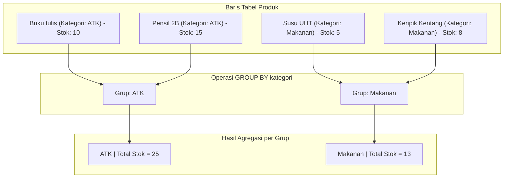

# 02 - BAB 02 MENGELOMPOKKAN DATA DENGAN GROUP BY

Status: DRAFT
Rak: SQL dan Querying
Buku: Agregasi Grouping dan Having
Level: Level 1 - Level 2
Tipe Materi: Tutorial
Target: Developer yang ingin mahir menulis query PostgreSQL.
Estimasi Baca: 10 Menit
Terakhir Diperiksa: 2026-05-18

Sumber Utama: PostgreSQL Official Documentation
Versi Referensi: PostgreSQL docs/current
Status Verifikasi Sumber: REVIEW

---

## 1. Tujuan Belajar
Di akhir bab ini, pembaca diharapkan mampu:
- Memahami logika pengelompokan baris data menggunakan klausul `GROUP BY`.
- Mengombinasikan `GROUP BY` dengan fungsi agregasi untuk melakukan analisis data multi-dimensi.
- Menguasai aturan sintaksis PostgreSQL mengenai kolom non-agregasi di dalam klausa `SELECT`.
- Merancang kueri laporan bisnis (misal: statistik per kategori atau per pelanggan).

## 2. Prasyarat
- Memahami fungsi agregasi dasar seperti `COUNT`, `SUM`, dan `AVG` (baca: [Fungsi Agregasi COUNT, SUM, AVG](./bab-01-fungsi-agregasi-count-sum-avg.md)).
- Mengetahui cara menggabungkan data dari beberapa tabel menggunakan `LEFT JOIN` atau `INNER JOIN` (baca: [LEFT JOIN dan RIGHT JOIN](../buku-03-join-dan-relasi-query/bab-03-left-dan-right-join.md)).

## 3. Ringkasan Cepat
Klausul `GROUP BY` di PostgreSQL digunakan untuk mengelompokkan baris data yang memiliki nilai yang sama pada satu atau lebih kolom tertentu ke dalam baris-baris ringkasan. Ketika kita menggunakan fungsi agregasi bersama kolom biasa dalam satu pernyataan `SELECT`, kita **wajib** menggunakan `GROUP BY`. Semua kolom non-agregasi yang tertulis di klausa `SELECT` harus didaftarkan di dalam klausa `GROUP BY`, jika tidak, PostgreSQL akan menolak mengeksekusi kueri tersebut demi menjaga konsistensi data.

## 4. Istilah Penting di Bab Ini

| Istilah | Arti Singkat |
|---|---|
| GROUP BY | Klausa SQL untuk mengelompokkan baris berdasarkan nilai kolom tertentu. |
| Grouping Column | Kolom yang dijadikan acuan dasar pengelompokan baris data. |
| Aggregated Column | Kolom hasil kalkulasi fungsi agregasi di dalam kelompok. |
| Deterministic Mapping | Kepastian pemetaan data di mana setiap baris hasil kueri memiliki satu nilai yang jelas dan tidak ambigu. |

## 5. Analogi Sehari-hari
Bayangkan Anda adalah seorang **Pekerja Laundry** yang dihadapkan pada tumpukan pakaian kotor dari berbagai jenis:

- Jika Anda hanya menggunakan fungsi agregasi tanpa grouping (baca Bab 1), Anda hanya menghitung total seluruh baju (misal: "Ada 100 baju kotor").
- Dengan `GROUP BY`, pertama-tama Anda menyortir pakaian tersebut ke dalam ember-ember terpisah berdasarkan **Warna** (Grouping Column):
  - **Ember A**: Pakaian Putih
  - **Ember B**: Pakaian Hitam
  - **Ember C**: Pakaian Berwarna/Warni
- Setelah pakaian terbagi dalam kelompok-kelompok ember tersebut, barulah Anda melakukan perhitungan agregasi untuk masing-masing ember:
  - Di Ember Putih, Anda menghitung jumlah baju (`COUNT`) -> menghasilkan 30 baju.
  - Di Ember Hitam, Anda menghitung jumlah baju (`COUNT`) -> menghasilkan 20 baju.
  - Di Ember Berwarna, Anda menghitung jumlah baju (`COUNT`) -> menghasilkan 50 baju.

## 6. Batas Analogi
Di laundry fisik, pakaian dipisahkan secara nyata ke dalam wadah ember berbeda sebelum dicuci. Di PostgreSQL, `GROUP BY` adalah operasi logis di dalam memori server. 

Mesin database melakukan pencarian indeks atau pengurutan sementara (*hash aggregation* atau *group aggregation*) untuk membagi data ke dalam kelompok-kelompok sebelum mengembalikan hasil ringkasannya ke hadapan Anda.

## 7. Ilustrasi Konsep

Status Ilustrasi: DRAFT



## 8. Penjelasan Ilustrasi
Bagan di atas menggambarkan alur kerja PostgreSQL saat kita mengeksekusi kueri `GROUP BY kategori`. Empat baris data produk yang bercampur disaring berdasarkan nilai kolom `kategori`. PostgreSQL mengelompokkan produk bermerek ATK ke dalam Grup ATK, dan produk Makanan ke dalam Grup Makanan. Setelah pengelompokan selesai, fungsi `SUM(stok)` dijalankan di masing-masing kelompok secara independen, menghasilkan output ringkasan per kategori.

## 9. Batas Ilustrasi
Ilustrasi di atas hanya menampilkan pengelompokan berdasarkan satu kolom (`kategori`). PostgreSQL sebenarnya mampu melakukan pengelompokan multi-kolom (misalnya `GROUP BY kategori, pemasok`), di mana grup baru akan terbentuk jika kombinasi nilai kedua kolom tersebut unik.

## 10. Konsep Inti

### Aturan Emas GROUP BY
Ketika menulis kueri SQL dengan agregasi, ada satu aturan mutlak di PostgreSQL:

> [!IMPORTANT]
> Semua kolom yang tercantum di bagian `SELECT` yang **tidak** dibungkus oleh fungsi agregasi (seperti `COUNT`, `SUM`, `AVG`, dll.) **harus** dicantumkan di bagian `GROUP BY`.

Mengapa aturan ini wajib? Bayangkan Anda menulis kueri berikut:

```sql
-- INI AKAN ERROR DI POSTGRESQL!
SELECT nama_kategori, SUM(stok) 
FROM produk;
```

Engine database akan bingung: *"Anda meminta saya menjumlahkan stok seluruh produk menjadi 1 angka, tapi di saat yang sama Anda meminta saya menampilkan nama kategori individual secara berbaris-baris. Bagaimana cara saya menyejajarkan 1 angka total stok dengan 10 nama kategori yang berbeda dalam satu tabel hasil?"*

Dengan menambahkan `GROUP BY nama_kategori`, Anda memberikan instruksi yang logis: *"Kelompokkan data berdasarkan nama kategori terlebih dahulu, lalu hitung total stok untuk masing-masing kelompok kategori tersebut."*

## 11. Penjelasan Detail

### 1. Grouping Multi-Kolom
Kita bisa mengelompokkan data berdasarkan lebih dari satu dimensi. Misalnya, ingin melihat total produk berdasarkan `kategori_id` DAN `kondisi_barang` (Baru/Bekas):

```sql
SELECT kategori_id, kondisi_barang, COUNT(*) AS jumlah_produk
FROM produk
GROUP BY kategori_id, kondisi_barang;
```
Hasil kueri di atas akan merinci data hingga kombinasi terunik dari kedua kolom tersebut.

### 2. GROUP BY dengan JOIN
Sering kali kita perlu menyajikan nama kategori yang berada di tabel `kategori`, sedangkan data produk ada di tabel `produk`. Kita menggabungkan kedua tabel dengan `JOIN` sebelum melakukan `GROUP BY`:

```sql
SELECT c.nama_kategori, COUNT(p.produk_id) AS jumlah_produk
FROM kategori c
LEFT JOIN produk p ON c.kategori_id = p.kategori_id
GROUP BY c.kategori_id, c.nama_kategori;
```

*Tips*: Menyertakan primary key (`c.kategori_id`) di klausa `GROUP BY` membantu menjamin keunikan pengelompokan meskipun ada kategori dengan nama yang kebetulan sama.

## 12. Contoh SQL Dasar
Berikut adalah contoh kueri dasar penggunaan `GROUP BY` di PostgreSQL:

```sql
-- 1. Menghitung jumlah produk per kategori_id
SELECT kategori_id, COUNT(*) AS jumlah_item
FROM produk
GROUP BY kategori_id;

-- 2. Menghitung rata-rata harga produk per kategori_id
SELECT kategori_id, AVG(harga) AS rata_rata_harga
FROM produk
GROUP BY kategori_id;

-- 3. Mencari stok minimum dan maksimum per kategori_id
SELECT kategori_id, MIN(stok) AS stok_terkecil, MAX(stok) AS stok_terbesar
FROM produk
GROUP BY kategori_id;
```

## 13. Contoh SQL Praktik Project
Dalam project sistem kasir/penjualan, kita ingin memantau total omset belanjaan dan total transaksi yang dilakukan oleh masing-masing pelanggan sepanjang bulan ini untuk menentukan pelanggan prioritas:

```sql
-- Statistik belanja per pelanggan
SELECT 
    p.pelanggan_id,
    p.nama AS nama_pelanggan,
    COUNT(o.pesanan_id) AS total_transaksi,
    SUM(o.total_belanja) AS total_belanja_akumulatif,
    AVG(o.total_belanja) AS rata_rata_belanja_per_invoice
FROM pelanggan p
INNER JOIN pesanan o ON p.pelanggan_id = o.pelanggan_id
GROUP BY p.pelanggan_id, p.nama
ORDER BY total_belanja_akumulatif DESC;
```

## 14. Kesalahan Umum
- **Error Terkenal: Column must appear in the GROUP BY clause**:
  ```sql
  -- SALAH
  SELECT nama, email, COUNT(*) 
  FROM pelanggan 
  GROUP BY nama; 
  -- Error karena kolom 'email' ada di SELECT tapi tidak ada di GROUP BY!
  ```
  *Solusi*: Masukkan `email` ke dalam klausa `GROUP BY` -> `GROUP BY nama, email;`
- **Mencoba Melakukan GROUP BY pada Fungsi Agregasi**:
  ```sql
  -- SALAH
  SELECT kategori_id, SUM(stok) 
  FROM produk 
  GROUP BY kategori_id, SUM(stok);
  ```
  *Mengapa salah?* Fungsi agregasi seperti `SUM(stok)` dihitung *setelah* pengelompokan terjadi. Anda tidak bisa mengelompokkan data berdasarkan hasil kalkulasi yang belum selesai dihitung!
- **Kebingungan antara GROUP BY dan ORDER BY**:
  `GROUP BY` menyatukan baris data sejenis menjadi satu baris ringkasan, sedangkan `ORDER BY` hanya mengurutkan tampilan baris data agar rapi dibaca (tidak menyatukan/meringkas apa pun).

## 15. Catatan Interview
- **Pertanyaan**: "Mengapa PostgreSQL mewajibkan semua kolom non-agregat di klausul SELECT untuk dicantumkan di klausul GROUP BY? Dan apakah ada pengecualian untuk aturan ini?"
- **Jawaban**: "PostgreSQL mewajibkan hal tersebut untuk mencegah keambiguan data. Jika suatu kolom non-agregat tidak dimasukkan ke dalam `GROUP BY`, database tidak tahu nilai dari baris mana yang harus ditampilkan karena ada banyak baris data dalam satu grup tersebut. Pengecualian di PostgreSQL: Jika kita melakukan `GROUP BY` pada kolom primary key dari suatu tabel, kita diperbolehkan menampilkan kolom non-agregat lain dari tabel yang sama tanpa harus menuliskannya di `GROUP BY`, karena PostgreSQL secara pintar mengetahui secara fungsional (*functional dependency*) bahwa primary key secara unik menentukan nilai dari kolom-kolom lainnya di tabel tersebut."

## 16. Catatan Diskusi User
- **Pertanyaan Umum**: "Apakah urutan kolom di GROUP BY memengaruhi hasil perhitungan?"
- **Diskusikan**: Urutan kolom di `GROUP BY` tidak memengaruhi nilai kalkulasi matematika agregasi (seperti total `SUM` atau `COUNT`). Namun, urutan tersebut memengaruhi bagaimana PostgreSQL membuat hirarki kelompok data dan memengaruhi urutan default baris data yang ditampilkan jika kita tidak menggunakan `ORDER BY` secara eksplisit. Selalu gunakan `ORDER BY` untuk mengontrol urutan tampilan akhir secara konsisten.

## 17. Latihan Kecil
1. Tuliskan query untuk menampilkan daftar seluruh `pemasok` beserta total kuantitas produk yang mereka suplai dari tabel `produk`!
2. Perbaiki kueri berikut agar dapat dieksekusi tanpa error di PostgreSQL:
   ```sql
   SELECT departemen_id, jabatan, AVG(gaji) 
   FROM karyawan 
   GROUP BY departemen_id;
   ```

## 18. Checklist Pemahaman
- [ ] Memahami kegunaan utama klausa `GROUP BY` untuk pengelompokan data.
- [ ] Mampu mematuhi Aturan Emas penulisan kolom non-agregat di klausa `GROUP BY`.
- [ ] Mampu menggabungkan teknik `JOIN` dan `GROUP BY` untuk menyusun laporan relasional.
- [ ] Mengetahui perbedaan mendasar peran `GROUP BY` (pengelompokan) dan `ORDER BY` (pengurutan).

## 19. Hubungan dengan Materi Lain

### Posisi Materi
- Rak: [02 - SQL dan Querying](../../README.md)
- Buku: [Agregasi Grouping dan Having](../)

### Prasyarat
- [Fungsi Agregasi COUNT, SUM, AVG](./bab-01-fungsi-agregasi-count-sum-avg.md)

### Materi Sebelumnya
- [Fungsi Agregasi COUNT, SUM, AVG](./bab-01-fungsi-agregasi-count-sum-avg.md)

### Materi Berikutnya
- [Menyaring Grup dengan HAVING](./bab-03-menyaring-grup-dengan-having.md)

### Materi Terkait
- [INNER JOIN](../buku-03-join-dan-relasi-query/bab-02-inner-join.md) (Penggabungan tabel sebelum grouping)

### Istilah Terkait
- Group By, Grouping Key, Hash Aggregate, Group Aggregate, Row Consolidation, Deterministic Output.

## 20. Referensi Resmi
Jangan membuka tautan berikut pada batch ini, cukup cantumkan sebagai referensi resmi yang ditargetkan untuk verifikasi nanti:
- PostgreSQL Official Documentation — perlu diverifikasi pada batch official docs verification.
- SQL standard / relational database concept — perlu diverifikasi jika nanti masuk fase source verification.

## 21. Catatan Pribadi / Project Notes
*   *Catatan Draft*: Sangat penting bagi pemula untuk memahami kaitan erat primary key dengan kelonggaran aturan GROUP BY di PostgreSQL. Ini adalah fitur canggih PostgreSQL yang sesuai dengan standar SQL-99 yang sering kali tidak diketahui oleh developer database lain (seperti MySQL versi lama). Status verifikasi diatur ke REVIEW.
