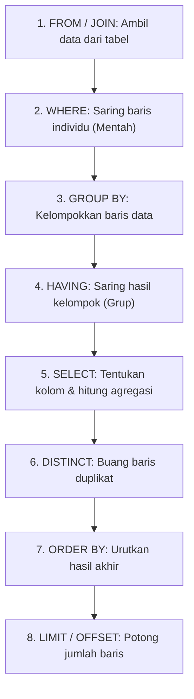

# 03 - BAB 03 MENYARING GRUP DENGAN HAVING

Status: DRAFT
Rak: SQL dan Querying
Buku: Agregasi Grouping dan Having
Level: Level 1 - Level 2
Tipe Materi: Tutorial
Target: Developer yang ingin mahir menulis query PostgreSQL.
Estimasi Baca: 10 Menit
Terakhir Diperiksa: 2026-05-18

Sumber Utama: PostgreSQL Official Documentation
Versi Referensi: PostgreSQL docs/current
Status Verifikasi Sumber: REVIEW

---

## 1. Tujuan Belajar
Di akhir bab ini, pembaca diharapkan mampu:
- Memahami fungsi klausul `HAVING` untuk menyaring grup hasil agregasi.
- Membedakan peran dan urutan eksekusi antara klausa `WHERE` dan `HAVING`.
- Menggunakan filter kombinasi `WHERE` dan `HAVING` dalam satu kueri terpadu.
- Menghindari kesalahan sintaksis akibat salah meletakkan fungsi agregasi di kueri SQL.

## 2. Prasyarat
- Memahami konsep dasar `GROUP BY` dan hubungannya dengan fungsi agregasi (baca: [Mengelompokkan Data dengan GROUP BY](./bab-02-mengelompokkan-data-dengan-group-by.md)).

## 3. Ringkasan Cepat
Klausa `HAVING` di PostgreSQL digunakan khusus untuk menyaring kelompok data (*group*) yang dihasilkan oleh klausa `GROUP BY`. Perbedaan mutlak antara `WHERE` dan `HAVING` terletak pada **kapan** penyaringan dilakukan: `WHERE` menyaring baris data individual *sebelum* pengelompokan terjadi, sedangkan `HAVING` menyaring hasil kelompok data *setelah* `GROUP BY` dievaluasi. Oleh karena itu, fungsi agregasi (seperti `SUM`, `COUNT`, `AVG`) dapat diletakkan di klausa `HAVING`, namun haram digunakan di klausa `WHERE`.

## 4. Istilah Penting di Bab Ini

| Istilah | Arti Singkat |
|---|---|
| HAVING | Klausa SQL untuk menyaring grup/kelompok data berdasarkan kondisi tertentu (biasanya kondisi agregasi). |
| WHERE | Klausa SQL untuk menyaring baris data individu berdasarkan kondisi non-agregasi. |
| Siklus Kueri (Query Lifecycle) | Urutan logis bagaimana engine database memproses bagian-bagian dari kueri SQL dari awal hingga akhir. |

## 5. Analogi Sehari-hari
Bayangkan Anda adalah seorang **Penyelenggara Kompetisi Paduan Suara Sekolah**:

- **Langkah 1 (WHERE - Saring Individu)**:
  Sebelum latihan dimulai, Anda menerapkan syarat di pintu masuk gedung: *"Hanya siswa dengan tinggi badan di atas 150 cm yang boleh masuk ruang audisi."* Ini adalah filter `WHERE`. Siswa yang terlalu pendek langsung disaring keluar sebelum mereka sempat dikelompokkan.
- **Langkah 2 (GROUP BY - Pengelompokan)**:
  Siswa tinggi yang berhasil masuk ruangan kemudian Anda kelompokkan berdasarkan **Kelas** mereka (misalnya Kelas 10, Kelas 11, dan Kelas 12).
- **Langkah 3 (HAVING - Saring Kelompok)**:
  Setelah kelompok terbentuk, Anda menghitung jumlah anggota masing-masing kelompok paduan suara kelas tersebut. Anda kemudian menetapkan aturan: *"Hanya kelompok kelas yang memiliki anggota minimal 10 orang yang berhak lanjut ke babak final."* Aturan ini adalah filter `HAVING` (filter terhadap kelompok yang dihitung dengan `COUNT(siswa) >= 10`). Kelompok kelas yang anggotanya sedikit langsung didiskualifikasi secara berkelompok.

## 6. Batas Analogi
Dalam kompetisi paduan suara fisik, proses penyaringan di pintu luar dan pintu dalam melibatkan panitia yang sama yang bekerja berurutan. 

Di PostgreSQL, perbedaan ini diatur sangat ketat di tingkat mesin parser SQL. Jika Anda salah menaruh syarat kelompok di pintu luar (`WHERE COUNT(siswa) >= 10`), PostgreSQL akan langsung mogok kerja dan memuntahkan error syntax sebelum kueri sempat dijalankan.

## 7. Ilustrasi Konsep

Status Ilustrasi: DRAFT



## 8. Penjelasan Ilustrasi
Bagan di atas menggambarkan urutan eksekusi logis kueri SQL di PostgreSQL (*Logical Query Processing Order*). 
1. Database mengidentifikasi tabel sumber (`FROM`) dan menerapkan relasi (`JOIN`).
2. Baris data individual disaring berdasarkan klausa `WHERE`. Di tahap ini, fungsi agregasi belum dihitung.
3. Baris yang lolos dikelompokkan oleh `GROUP BY`.
4. Kelompok-kelompok tersebut disaring menggunakan `HAVING`.
5. Kolom-kolom hasil diformat di `SELECT`, dan di sinilah alias kolom dibuat.
6. Hasil akhir diurutkan (`ORDER BY`) dan dibatasi jumlah tampilannya (`LIMIT`).

## 9. Batas Ilustrasi
Urutan di atas adalah urutan eksekusi *logis*. Secara fisik, query planner PostgreSQL yang cerdas dapat mengubah urutan eksekusi sebenarnya (misalnya melakukan optimasi filter lebih awal) selama hasil akhirnya dijamin sama secara matematis demi performa yang lebih cepat.

## 10. Konsep Inti

### 1. Sintaks Dasar HAVING
Klausa `HAVING` ditulis setelah klausa `GROUP BY` dan sebelum `ORDER BY`:

```sql
SELECT kategori_id, SUM(stok) AS total_stok
FROM produk
GROUP BY kategori_id
HAVING SUM(stok) > 50; -- Menyaring grup kategori yang stoknya di atas 50
```

### 2. WHERE vs HAVING: Perbedaan Utama

| Parameter | WHERE | HAVING |
|---|---|---|
| **Target Filter** | Baris data individual / mentah | Kelompok data (*group*) |
| **Kapan Dieksekusi** | Sebelum `GROUP BY` | Setelah `GROUP BY` |
| **Fungsi Agregasi** | **Dilarang** (misal: `WHERE SUM(stok) > 10` -> Error) | **Diperbolehkan** (misal: `HAVING SUM(stok) > 10`) |
| **Kinerja** | Lebih efisien untuk menyaring kolom biasa | Memiliki overhead pengelompokan terlebih dahulu |

## 11. Penjelasan Detail

### Trik Kinerja: Jangan Menyaring Kolom Biasa di HAVING!
Meskipun PostgreSQL secara sintaksis mengizinkan Anda menyaring kolom biasa di klausa `HAVING`, ini adalah praktik penulisan kueri yang sangat buruk (*bad practice*).

Perhatikan perbedaan kedua kueri berikut:

```sql
-- PENULISAN BURUK (TIDAK EFISIEN)
SELECT kategori_id, COUNT(*)
FROM produk
GROUP BY kategori_id
HAVING kategori_id = 3;

-- PENULISAN BAGUS (SANGAT EFISIEN)
SELECT kategori_id, COUNT(*)
FROM produk
WHERE kategori_id = 3
GROUP BY kategori_id;
```

#### Mengapa kueri kedua jauh lebih cepat?
Pada kueri pertama (Buruk), PostgreSQL terpaksa mengelompokkan **seluruh** produk dari semua kategori yang ada di database ke dalam memori, lalu baru menyaring dan membuang kategori yang bukan nomor 3 di bagian `HAVING`.

Pada kueri kedua (Bagus), PostgreSQL langsung membuang produk dari kategori lain sejak awal di klausa `WHERE`. Proses `GROUP BY` di memori hanya bekerja untuk satu kategori saja, menghemat memori dan CPU server secara signifikan.

## 12. Contoh SQL Dasar
Berikut adalah contoh kueri dasar menyaring kelompok dengan `HAVING` di PostgreSQL:

```sql
-- 1. Mencari kategori_id yang memiliki lebih dari 10 jenis produk
SELECT kategori_id, COUNT(*) AS jumlah_produk
FROM produk
GROUP BY kategori_id
HAVING COUNT(*) > 10;

-- 2. Mencari kategori_id yang memiliki rata-rata harga produk di atas Rp50.000
SELECT kategori_id, AVG(harga) AS rata_harga
FROM produk
GROUP BY kategori_id
HAVING AVG(harga) > 50000;
```

## 13. Contoh SQL Praktik Project
Dalam sistem e-commerce, kita ingin mencari siapa saja pelanggan setia (*loyal customers*) yang telah melakukan transaksi belanja lebih dari 5 kali DAN total nilai belanjanya melebihi Rp1.000.000 sepanjang tahun 2026:

```sql
-- Mencari pelanggan loyal berbelanja besar
SELECT 
    p.pelanggan_id,
    p.nama AS nama_pelanggan,
    COUNT(o.pesanan_id) AS total_transaksi,
    SUM(o.total_belanja) AS total_belanja_akumulatif
FROM pelanggan p
INNER JOIN pesanan o ON p.pelanggan_id = o.pelanggan_id
WHERE o.tanggal_transaksi >= '2026-01-01' -- Filter baris (WHERE)
GROUP BY p.pelanggan_id, p.nama
HAVING COUNT(o.pesanan_id) > 5 AND SUM(o.total_belanja) > 1000000 -- Filter grup (HAVING)
ORDER BY total_belanja_akumulatif DESC;
```

## 14. Kesalahan Umum
- **Error: Aggregate functions are not allowed in WHERE**:
  ```sql
  -- SALAH
  SELECT kategori_id, SUM(stok)
  FROM produk
  WHERE SUM(stok) > 100 -- Blunder!
  GROUP BY kategori_id;
  ```
  *Solusi*: Pindahkan filter agregasi ke klausa `HAVING` setelah `GROUP BY`.
- **Mencoba Menggunakan Alias Kolom SELECT di HAVING**:
  ```sql
  -- SALAH DI BEBERAPA RDBMS / VERSI
  SELECT kategori_id, SUM(stok) AS total_stok
  FROM produk
  GROUP BY kategori_id
  HAVING total_stok > 100; -- Blunder!
  ```
  *Mengapa salah?* Berdasarkan urutan eksekusi logis (lihat Ilustrasi Konsep), klausa `HAVING` dieksekusi **sebelum** klausa `SELECT`. Karena `SELECT` belum diproses, alias kolom `total_stok` belum tercipta bagi `HAVING`.
  *Solusi*: Gunakan fungsi agregasi aslinya di `HAVING` -> `HAVING SUM(stok) > 100`.

## 15. Catatan Interview
- **Pertanyaan**: "Kapan kita harus menggunakan `WHERE` dan kapan kita harus menggunakan `HAVING`?"
- **Jawaban**: "Kita menggunakan `WHERE` ketika ingin menyaring data berdasarkan kolom mentah individual sebelum data tersebut dikelompokkan (misalnya menyaring produk aktif saja). Kita menggunakan `HAVING` ketika ingin menyaring hasil pengelompokan yang nilainya didapatkan dari kalkulasi fungsi agregasi (misalnya menyaring kategori yang total stoknya di atas 100 item). Selalu dahulukan penyaringan di `WHERE` jika memungkinkan untuk menghemat kinerja server."

## 16. Catatan Diskusi User
- **Pertanyaan Umum**: "Apakah kita bisa menggunakan HAVING tanpa menulis GROUP BY?"
- **Diskusikan**: Secara sintaksis SQL, kita diperbolehkan menulis `HAVING` tanpa `GROUP BY`. Jika dilakukan, PostgreSQL akan menganggap seluruh tabel tersebut sebagai **satu grup global tunggal**. Namun, ini sangat jarang dilakukan secara praktis karena hasil kuerinya akan mengagregasi seluruh tabel menjadi satu baris saja.

## 17. Latihan Kecil
1. Tuliskan query untuk menampilkan daftar `pemasok` (tabel `produk`) yang menyuplai produk dengan rata-rata stok di bawah 5 unit!
2. Temukan letak kesalahan logis dan sintaksis dari query berikut, lalu tuliskan perbaikannya:
   ```sql
   SELECT kategori_id, COUNT(*) AS jumlah
   FROM produk
   WHERE COUNT(*) >= 3
   GROUP BY kategori_id
   HAVING harga > 10000;
   ```

## 18. Checklist Pemahaman
- [ ] Memahami fungsi utama klausa `HAVING` untuk menyaring hasil grup data.
- [ ] Mampu membedakan urutan pemrosesan logis antara `WHERE` dan `HAVING`.
- [ ] Mengetahui alasan mengapa fungsi agregasi dilarang ditulis di dalam klausa `WHERE`.
- [ ] Mampu menuliskan kueri kompleks yang memadukan filter `WHERE`, `GROUP BY`, dan `HAVING` secara efisien.

## 19. Hubungan dengan Materi Lain

### Posisi Materi
- Rak: [02 - SQL dan Querying](../../README.md)
- Buku: [Agregasi Grouping dan Having](../)

### Prasyarat
- [Mengelompokkan Data dengan GROUP BY](./bab-02-mengelompokkan-data-dengan-group-by.md)

### Materi Sebelumnya
- [Mengelompokkan Data dengan GROUP BY](./bab-02-mengelompokkan-data-dengan-group-by.md)

### Materi Berikutnya
- [Kapan Harus Denormalisasi](../../../03-desain-data-dan-schema/buku-03-normalisasi-dan-denormalisasi/bab-02-kapan-harus-denormalisasi.md) (Menghubungkan agregasi query laporan dengan keputusan denormalisasi database)

### Materi Terkait
- [Sorting dengan ORDER BY](../../buku-02-filtering-sorting-dan-limit/bab-03-sorting-dengan-order-by.md)

### Istilah Terkait
- Having Clause, Where Clause, Query Parsing Order, Logical Execution, Group Filter, Performance Optimization.

## 20. Referensi Resmi
Jangan membuka tautan berikut pada batch ini, cukup cantumkan sebagai referensi resmi yang ditargetkan untuk verifikasi nanti:
- PostgreSQL Official Documentation — perlu diverifikasi pada batch official docs verification.
- SQL standard / relational database concept — perlu diverifikasi jika nanti masuk fase source verification.

## 21. Catatan Pribadi / Project Notes
*   *Catatan Draft*: Memahami urutan pemrosesan logis (*Logical Query Processing Order*) sangat penting diajarkan di bab ini karena merupakan jangkar pemahaman mengapa alias kolom SELECT tidak bisa langsung dipanggil di HAVING. Status verifikasi diatur ke REVIEW.
