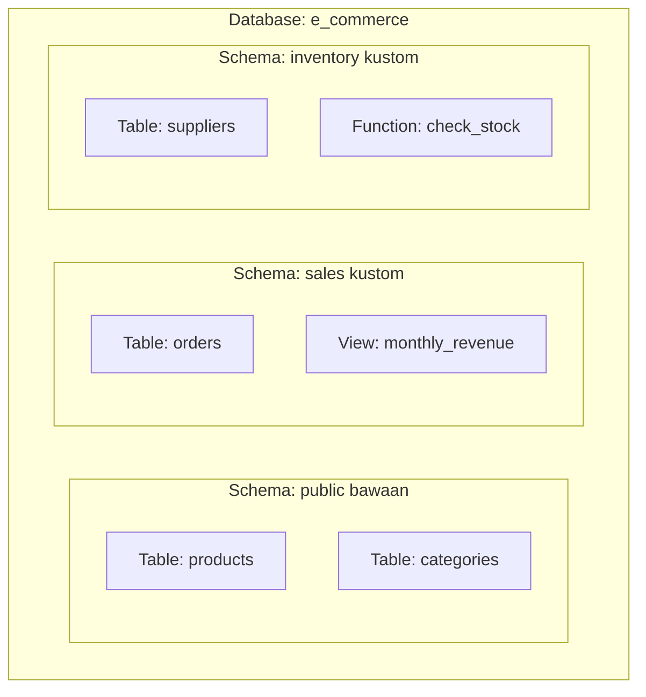

# 01 - BAB 01 MENGENAL SCHEMA POSTGRESQL

Status: DRAFT
Rak: Desain Data dan Schema
Buku: Konsep Table Schema dan Relasi
Level: Level 2 - Level 3
Tipe Materi: Tutorial
Target: Developer atau Data Modeler yang merancang struktur database.
Estimasi Baca: 10 Menit
Terakhir Diperiksa: 2026-05-17

Sumber Utama: PostgreSQL Official Documentation
Versi Referensi: PostgreSQL docs/current
Status Verifikasi Sumber: REVIEW

---

## 1. Tujuan Belajar
Di akhir bab ini, pembaca diharapkan mampu:
- Memahami konsep schema sebagai namespace (ruang nama) logis di PostgreSQL.
- Menjelaskan perbedaan mendasar dan batas isolasi antara database dengan schema.
- Mengidentifikasi berbagai objek database yang dapat diwadahi di dalam schema (table, view, function, dll.).
- Menggunakan schema untuk merancang organisasi objek database yang rapi dan aman pada aplikasi skala besar.

## 2. Prasyarat
- Memahami konsep dasar database, DBMS, tabel, dan kolom (baca: [Apa Itu PostgreSQL](../../01-orientasi-sejarah-dan-fondasi-postgresql/buku-01-orientasi-postgresql/bab-01-apa-itu-postgresql.md)).
- Mengetahui cara menulis perintah SQL dasar (baca: [Struktur Perintah SELECT](../../02-sql-dan-querying/buku-01-dasar-sql-dan-query-select/bab-01-struktur-perintah-select.md)).

## 3. Ringkasan Cepat
Di PostgreSQL, **Schema** adalah folder virtual atau namespace di dalam database yang mengelompokkan objek database (seperti tabel, view, tipe data, indeks, dan fungsi) secara logis. Schema membantu mencegah bentrokan nama objek, mempermudah pengelolaan hak akses keamanan multi-user, dan menjaga kerapian struktur data seiring berkembangnya modul aplikasi Anda.

## 4. Istilah Penting di Bab Ini

| Istilah | Arti Singkat |
|---|---|
| Schema | Namespace virtual di dalam database untuk mengelompokkan objek secara logis. |
| Namespace | Batasan logis yang menjamin keamanan nama objek agar tidak bentrok dengan nama objek yang sama di namespace lain. |
| Public Schema | Skema bawaan default yang otomatis dibuat PostgreSQL pada setiap database baru. |
| Fully-Qualified Name | Cara pemanggilan nama objek secara lengkap dengan awalan skemanya (contoh: `nama_schema.nama_tabel`). |
| Search Path | Parameter konfigurasi yang menentukan urutan skema yang akan dicari database saat nama tabel dipanggil tanpa nama skema. |

## 5. Analogi Sehari-hari
Bayangkan Anda adalah pemilik sebuah **Gedung Perkantoran Besar (Database)** yang menjadi markas utama perusahaan Anda.
- Di dalam gedung besar ini, Anda membaginya menjadi beberapa **Ruangan Departemen (Schema)** yang terpisah, seperti departemen "Keuangan (Finance)", "Sumber Daya Manusia (HR)", dan "Operasional (Operations)".
- Di dalam masing-masing departemen tersebut, terdapat lemari-lemari **Arsip Dokumen (Table)**.
- Menariknya, di departemen Keuangan Anda boleh memiliki lemari arsip bernama "Laporan_Bulanan". Dan di departemen HR, Anda juga boleh memiliki lemari arsip dengan nama yang persis sama, "Laporan_Bulanan". Keduanya tidak akan tertukar atau bentrok karena berada di ruangan departemen yang berbeda.
- Jika ada seseorang di tengah lobi gedung berteriak, "Tolong ambilkan data Laporan_Bulanan!", semua orang akan bingung. Anda harus menyebutkan dengan jelas: "Ambilkan data `Keuangan.Laporan_Bulanan`!".

## 6. Batas Analogi
Di dunia fisik perpustakaan atau kantor, ruangan departemen dibatasi oleh dinding beton tebal dan pintu berkunci fisik. Staf membutuhkan waktu nyata untuk berjalan berpindah ruangan. 

Di dalam PostgreSQL, pembatasan skema sepenuhnya bersifat logis di dalam sistem database. Hubungan keamanan dan hak akses diatur secara dinamis menggunakan perintah SQL (`GRANT` dan `REVOKE`). Keunggulan luar biasa dari PostgreSQL adalah satu kueri SQL dapat dengan instan menggabungkan (*JOIN*) data tabel dari dua skema berbeda (misal menggabungkan data tabel keuangan dan tabel HR) dalam milidetik tanpa hambatan fisik.

## 7. Ilustrasi Konsep

Status Ilustrasi: DRAFT



## 8. Penjelasan Ilustrasi
Bagan di atas menggambarkan satu database bernama `e_commerce`. Di dalamnya terdapat tiga skema terpisah secara logis. Skema `public` menampung tabel produk dan kategori yang diakses secara umum oleh publik. Skema `sales` mengelompokkan tabel pesanan dan view laporan pendapatan bulanan untuk modul transaksi. Skema `inventory` menyimpan tabel penyuplai serta fungsi khusus pemeriksaan stok. Setiap skema berfungsi sebagai kontainer khusus untuk merapikan objek yang sejenis.

## 9. Batas Ilustrasi
Ilustrasi di atas hanya menggambarkan pemisahan objek database secara organisasi struktur. Ilustrasi ini tidak memperlihatkan konfigurasi hak akses keamanan yang sebenarnya (misalnya user API kasir hanya boleh membaca skema `sales` tapi dilarang keras menyentuh skema `inventory`), serta tidak menunjukkan relasi antar tabel (seperti *foreign key* dari tabel `sales.orders` ke tabel `public.products`).

## 10. Konsep Inti
Perbedaan fundamental antara **Database** dengan **Schema** di PostgreSQL:
- **Database**: Merupakan batas isolasi fisik tertinggi. Dua database berbeda di server yang sama tidak dapat saling berinteraksi secara langsung dalam satu query standar (memerlukan extension khusus seperti `postgres_fdw`). Koneksi aplikasi harus diarahkan ke satu database spesifik.
- **Schema**: Merupakan pembagian logis di dalam satu database. Aplikasi Anda terhubung ke satu database, dan dari koneksi tersebut Anda dapat langsung berinteraksi dengan seluruh skema yang ada di database tersebut selama memiliki hak akses.

## 11. Penjelasan Detail
### 1. Skema Bawaan: `public`
Setiap kali Anda membuat database baru di PostgreSQL, sistem secara otomatis membuatkan sebuah skema bernama `public`. Jika Anda membuat tabel dengan perintah biasa:
```sql
CREATE TABLE produk ( ... );
```
Tanpa menyebutkan nama skema, PostgreSQL akan meletakkan tabel tersebut di dalam skema `public`.

### 2. Memahami `search_path`
Bagaimana PostgreSQL mencari tabel jika kita memanggilnya tanpa nama skema? PostgreSQL memiliki variabel konfigurasi bernama `search_path`. Anda bisa memeriksanya dengan query:
```sql
SHOW search_path;
```
Secara default, outputnya adalah `"$user", public`. Artinya, jika Anda mencari tabel `produk`, PostgreSQL pertama-tama akan mencari skema yang namanya sama dengan nama user Anda saat login (`$user`). Jika tidak ditemukan, ia akan mencari di skema `public`. Jika tetap tidak ada, PostgreSQL memunculkan error.

### 3. Fully-Qualified Name
Untuk mengakses tabel di luar skema default dengan aman, gunakan nama lengkap objek yang dipisahkan tanda titik:
```sql
SELECT * FROM nama_schema.nama_tabel;
```
Menggunakan *fully-qualified name* sangat disarankan dalam penulisan kode aplikasi backend untuk menghindari kesalahan pencarian tabel jika konfigurasi `search_path` server database berubah.

## 12. Contoh SQL Dasar
Berikut adalah perintah SQL dasar untuk memanipulasi dan berinteraksi dengan skema:

```sql
-- 1. Membuat skema baru bernama 'sales'
CREATE SCHEMA sales;

-- 2. Membuat tabel di dalam skema 'sales'
CREATE TABLE sales.orders (
    order_id SERIAL PRIMARY KEY,
    total_harga NUMERIC(12, 2) NOT NULL,
    tanggal_transaksi TIMESTAMP DEFAULT CURRENT_TIMESTAMP
);

-- 3. Membaca data dari tabel di dalam skema 'sales'
SELECT * FROM sales.orders;
```

## 13. Contoh SQL Praktik Project
Dalam arsitektur backend nyata, kita sering memisahkan data operasional utama dengan data pencatatan sistem (*audit log*). Kita buat skema `audit` khusus agar terhindar dari ketidaksengajaan modifikasi data oleh API reguler aplikasi:

```sql
-- 1. Membuat skema khusus audit
CREATE SCHEMA audit;

-- 2. Membuat tabel log di dalam skema audit
CREATE TABLE audit.activity_logs (
    log_id SERIAL PRIMARY KEY,
    user_id INT NOT NULL,
    aksi VARCHAR(150) NOT NULL,
    detail TEXT,
    dibuat_pada TIMESTAMP DEFAULT CURRENT_TIMESTAMP
);
```

## 14. Kesalahan Umum
- **Menumpuk Semua Tabel di Skema `public`**: Banyak developer menaruh ratusan tabel aplikasi di dalam skema `public`. Untuk aplikasi besar, hal ini membuat struktur database menjadi sangat semrawut dan menyulitkan pembagian tugas tim developer (misal tim billing hanya boleh memodifikasi tabel transaksi).
- **Lupa Menuliskan Nama Skema**: Mencoba mengakses tabel non-public tanpa nama skema bawaan sehingga memicu error: `ERROR: relation "orders" does not exist`.

## 15. Catatan Interview
- **Pertanyaan**: "Apakah di PostgreSQL kita bisa melakukan JOIN tabel yang berada di skema berbeda? Dan apakah ada perbedaan performa dibanding JOIN di skema yang sama?"
- **Jawaban**: "Ya, kita bisa melakukan JOIN antar tabel di skema berbeda dengan menggunakan fully-qualified name (contoh: `sales.orders JOIN public.products`). Terkait performa, sama sekali tidak ada penurunan performa karena seluruh skema tersebut berada dalam satu database fisik yang sama dan berbagi memori RAM (*shared buffers*) yang sama."

## 16. Catatan Diskusi User
- **Pertanyaan Umum**: "Di MySQL, saya sering membuat database baru untuk memisahkan data. Apakah di PostgreSQL saya harus melakukan hal yang sama?"
- **Diskusikan**: Di MySQL, `DATABASE` dan `SCHEMA` adalah hal yang sama (sinonim). Namun di PostgreSQL keduanya berbeda. Di PostgreSQL, jika tabel-tabel Anda masih saling berhubungan erat dan berada dalam satu aplikasi terintegrasi, sangat disarankan menggunakan **satu database saja**, lalu pisahkan modul-modul data Anda menggunakan **skema terpisah**. Ini mempermudah pemeliharaan koneksi backend dan transaksi ACID lintas modul.

## 17. Latihan Kecil
1. Tuliskan query SQL untuk membuat skema baru bernama `inventory`!
2. Tuliskan kueri SQL untuk memindahkan pencarian default database agar mendahulukan skema `sales` sebelum `public` menggunakan `SET search_path`! (Cari tahu cara penulisannya secara mandiri sebagai tantangan draft ini).

## 18. Checklist Pemahaman
- [ ] Memahami peran utama Schema sebagai pengelompok objek database secara logis.
- [ ] Mampu membedakan perbedaan tingkat isolasi Database vs Schema.
- [ ] Mengetahui cara membuat skema kustom dan membuat tabel di dalamnya.
- [ ] Memahami konsep `search_path` dan bahaya memanggil tabel tanpa awalan skema.

## 19. Hubungan dengan Materi Lain

### Posisi Materi
- Rak: [03 - Desain Data dan Schema](../../README.md)
- Buku: [Konsep Table Schema dan Relasi](../)

### Prasyarat
- [Apa Itu PostgreSQL](../../01-orientasi-sejarah-dan-fondasi-postgresql/buku-01-orientasi-postgresql/bab-01-apa-itu-postgresql.md)

### Materi Sebelumnya
- [Operator Perbandingan dan Logika](../../02-sql-dan-querying/buku-02-filtering-sorting-dan-limit/bab-02-operator-perbandingan-dan-logika.md)

### Materi Berikutnya
- [Pentingnya Primary Key](../buku-02-primary-key-foreign-key-dan-constraint/bab-01-pentingnya-primary-key.md)

### Materi Terkait
- [Security, Role Permission, dan Governance](../../10-security-role-permission-dan-governance/)

### Istilah Terkait
- Namespace, Fully-Qualified Name, Public Schema, Search Path.

## 20. Referensi Resmi
Jangan membuka tautan berikut pada batch ini, cukup cantumkan sebagai referensi resmi yang ditargetkan untuk verifikasi nanti:
- PostgreSQL Official Documentation - Schemas
  https://www.postgresql.org/docs/current/ddl-schemas.html

## 21. Catatan Pribadi / Project Notes
*   *Catatan Draft*: Menulis materi ini membutuhkan kejelasan diksi yang kuat agar pembaca eks-MySQL tidak kebingungan. Fokus utama draft ini adalah menanamkan pentingnya pemisahan logis (*namespace*) untuk pengembangan aplikasi modular modern. Status verifikasi diatur ke REVIEW.
