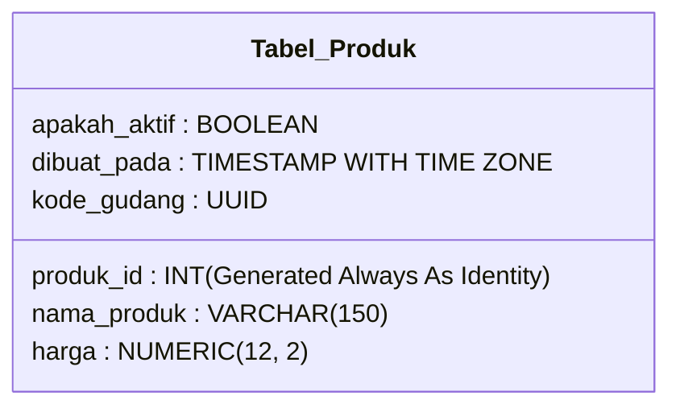

# 02 - BAB 02 PEMBUATAN TABLE DAN DATA TYPE

Status: DRAFT
Rak: Desain Data dan Schema
Buku: Konsep Table Schema dan Relasi
Level: Level 2 - Level 3
Tipe Materi: Tutorial
Target: Developer atau Data Modeler yang merancang struktur database.
Estimasi Baca: 10 Menit
Terakhir Diperiksa: 2026-05-17

Sumber Utama: PostgreSQL Official Documentation
Versi Referensi: PostgreSQL docs/current
Status Verifikasi Sumber: REVIEW

---

## 1. Tujuan Belajar
Di akhir bab ini, pembaca diharapkan mampu:
- Menuliskan kueri deklarasi `CREATE TABLE` secara mandiri untuk membuat tabel baru di PostgreSQL.
- Menjelaskan karakteristik, batas jangkauan nilai, dan fungsi dari tipe data dasar di PostgreSQL (integer, bigint, varchar, text, boolean, numeric, timestamp, uuid).
- Memilih tipe data yang paling efisien, aman, dan tepat untuk berbagai skenario atribut bisnis nyata.
- Menyadari bahaya fatal salah memilih tipe data, terutama pada penyimpanan data transaksi keuangan.

## 2. Prasyarat
- Memahami konsep namespace logis dan search path skema di PostgreSQL (baca: [Mengenal Schema PostgreSQL](./bab-01-mengenal-schema-postgresql.md)).
- Mengetahui bahwa tabel terhubung satu sama lain melalui relasi logis (baca: [Konsep Relasi Antar Tabel](../../02-sql-dan-querying/buku-03-join-dan-relasi-query/bab-01-konsep-relasi-antar-tabel.md)).

## 3. Ringkasan Cepat
Membuat tabel adalah langkah pertama dalam merealisasikan cetak biru desain sistem informasi menjadi struktur penyimpanan fisik nyata di dalam media harddisk server. Melalui perintah `CREATE TABLE`, kita menetapkan nama tabel, kolom-kolom atribut, tipe data, serta aturan batasan nilainya (*constraints*). Pemilihan tipe data yang presisi (seperti menggunakan `NUMERIC` untuk uang, `VARCHAR` untuk teks dinamis, dan `UUID` untuk keamanan identitas global) sangat menentukan efisiensi ruang penyimpanan harddisk dan kecepatan performa kueri sistem Anda.

## 4. Istilah Penting di Bab Ini

| Istilah | Arti Singkat |
|---|---|
| CREATE TABLE | Perintah DDL (Data Definition Language) SQL untuk membuat tabel baru di skema database. |
| Data Type | Karakteristik yang menetapkan jenis nilai data yang boleh disimpan oleh sebuah kolom. |
| Numeric | Tipe data desimal dengan presisi mutlak, sangat direkomendasikan untuk perhitungan keuangan. |
| Varchar(N) | Tipe data teks dinamis dengan batas panjang maksimal sebanyak N karakter. |
| UUID | Universally Unique Identifier; nilai string acak 128-bit yang dijamin unik secara global di dunia. |
| Bigint | Tipe data angka bulat dengan kapasitas penyimpanan raksasa (64-bit), aman untuk ID transaksi skala besar. |
| Timestamp | Tipe data penunjuk waktu lengkap yang mencatat tanggal, jam, menit, detik, hingga mikrodetik. |

## 5. Analogi Sehari-hari
Mari kita analogikan pembuatan tabel dan tipe data dengan **Mendesain Cetakan Wadah Organizer Laci Perkakas di Bengkel**:

- **CREATE TABLE (Mendesain Cetakan Laci)**:
  Tindakan Anda merancang dan mencetak wadah plastik organizer baru menggunakan printer 3D untuk diletakkan di laci meja bengkel. Wadah tersebut memiliki sekat-sekat kompartemen khusus (kolom) agar perkakas tidak saling tercampur.
- **Tipe Data (Spesifikasi Bentuk Sekat Wadah)**:
  Aturan bentuk sekat wadah dirancang secara kaku agar selaras dengan jenis perkakas yang disimpan:
  - **Sekat Obeng Bulat (Integer)**: Hanya muat untuk obeng/paku besi bulat biasa (angka bulat standar). Jika Anda memaksakan memasukkan palu raksasa, sekat plastik akan patah atau menolak masuk (error batas nilai).
  - **Sekat Karet Elastis (Varchar)**: Dirancang elastis untuk menampung gulungan kabel listrik dengan panjang yang bervariasi (teks dinamis). Sekat ini menghemat ruang karena menyusut jika kabelnya pendek.
  - **Sekat Presisi Timbangan Emas (Numeric)**: Sekat khusus yang memiliki sensor timbangan digital super presisi hingga 6 angka di belakang koma untuk menyimpan serbuk emas bernilai tinggi (keuangan/presisi desimal).
  - **Sekat Slot Kunci Pengaman Sandi Acak (UUID)**: Sekat rahasia yang hanya bisa dibuka oleh anak kunci berkode acak super rumit yang dijamin tidak ada kembarannya di seluruh bengkel lain di dunia (keamanan kunci global).

## 6. Batas Analogi
Di bengkel fisik dunia nyata, jika Anda salah mendesain sekat wadah organizer plastik, Anda harus membuang wadah plastik tersebut ke tempat sampah dan mencetak ulang dari awal yang memakan biaya bahan baku plastik baru.

Di dalam PostgreSQL digital, jika Anda melakukan kesalahan mendesain tipe data kolom, Anda dapat mengubah tipe data kolom tersebut secara instan menggunakan perintah `ALTER TABLE` tanpa perlu merusak fisik server atau membuang data yang sudah eksis sebelumnya.

## 7. Ilustrasi Konsep

Status Ilustrasi: DRAFT



## 8. Penjelasan Ilustrasi
Bagan kelas di atas menggambarkan struktur cetak biru skema tabel `produk` di PostgreSQL. Setiap kolom diberikan jenis tipe data khusus yang selaras dengan nilai dunianya: ID produk bertipe angka bulat (`INT`), nama produk bertipe teks berbatas panjang (`VARCHAR`), harga bertipe desimal presisi tinggi (`NUMERIC`), status keaktifan bertipe logika ya/tidak (`BOOLEAN`), tanggal pembuatan bertipe waktu global (`TIMESTAMP WITH TIME ZONE`), dan kode gudang menggunakan pengenal acak global (`UUID`).

## 9. Batas Ilustrasi
Visualisasi di atas berfokus pada pemetaan tipe data dasar logis yang umum digunakan. Ia tidak memvisualisasikan penanganan tipe data tingkat lanjut di PostgreSQL seperti penyimpanan tipe data dokumen (`JSONB`), tipe data koordinat peta geospesifik (`GEOMETRY`), tipe data himpunan nilai (`ENUM`), atau tipe data array (`ARRAY`) yang dibahas pada buku terpisah.

## 10. Konsep Inti

### 1. Sintaks Dasar CREATE TABLE
Sintaks formal penulisan kueri untuk membuat tabel baru di PostgreSQL adalah sebagai berikut:

```sql
CREATE TABLE nama_tabel (
    nama_kolom_1 tipe_data_1 constraint_kolom,
    nama_kolom_2 tipe_data_2,
    ...
);
```

### 2. Breakdown 6 Tipe Data Utama PostgreSQL

1.  **Angka Bulat (Integer & Bigint)**:
    - `INT` / `INTEGER`: Menyimpan angka bulat biasa. Kapasitas 4-byte (jangkauan dari -2 miliar hingga +2 miliar). Cocok untuk ID tabel kecil, kuantitas stok barang, dll.
    - `BIGINT`: Kapasitas 8-byte (jangkauan super raksasa). Sangat direkomendasikan untuk ID tabel utama transaksi e-commerce yang baris datanya bisa tumbuh hingga miliaran baris.
2.  **Angka Desimal Presisi Tinggi (Numeric / Decimal)**:
    - `NUMERIC(P, S)`: Mengunci presisi matematika desimal secara mutlak. `P` (*Precision*) adalah total digit angka, `S` (*Scale*) adalah jumlah digit di belakang koma. Contoh: `NUMERIC(12, 2)` dapat menampung nilai hingga `9999999999.99` secara presisi. Wajib untuk nominal uang.
3.  **Karakter & Teks (Varchar & Text)**:
    - `VARCHAR(N)`: Menyimpan teks dinamis dengan batas maksimal N karakter. Sangat efisien karena menghemat penyimpanan jika teks yang dimasukkan lebih pendek dari batas N.
    - `TEXT`: Menyimpan teks dengan panjang tanpa batas (hingga 1 GB per kolom). Sangat cocok untuk deskripsi produk, artikel, atau log aktivitas sistem.
4.  **Logika (Boolean)**:
    - `BOOLEAN`: Hanya menampung dua nilai logis: `TRUE` (Benar) atau `FALSE` (Salah).
5.  **Tanggal & Waktu (Date & Timestamp)**:
    - `DATE`: Hanya mencatat tanggal saja (Tahun-Bulan-Hari).
    - `TIMESTAMP WITH TIME ZONE` (atau `TIMESTAMPTZ`): Mencatat tanggal, jam, menit, detik lengkap beserta informasi zona waktu. Sangat penting untuk aplikasi global agar waktu pencatatan transaksi konsisten lintas benua.
6.  **Identitas Acak Global (UUID)**:
    - `UUID`: Nilai pengenal acak 128-bit unik global. Sangat berguna untuk menggantikan ID integer berurutan demi keamanan API agar ID transaksi tidak mudah ditebak oleh pihak luar.

## 11. Penjelasan Detail

### Bahaya Fatal Menggunakan Float untuk Uang
Kesalahan paling sering (dan sangat fatal) di kalangan developer pemula adalah menyimpan nilai uang/saldo menggunakan tipe data `FLOAT`, `REAL`, atau `DOUBLE PRECISION`.

#### Mengapa FLOAT Dilarang untuk Uang?
Tipe data `FLOAT` dirancang untuk kalkulasi ilmiah (seperti mengukur jarak astronomi atau simulasi fisika) yang mengutamakan kecepatan hitung dibanding presisi mutlak. `FLOAT` menggunakan representasi biner pecahan yang bersifat **aproksimasi** (perkiraan pendekatan matematika).

Akibatnya, jika Anda melakukan penjumlahan miliaran saldo e-commerce menggunakan `FLOAT`, database Anda akan mengalami **bug pembulatan** (misalnya `0.1 + 0.2` menghasilkan `0.30000000000000004`). Hal ini akan memicu selisih nilai uang perusahaan saat diaudit oleh divisi keuangan. Selalu gunakan `NUMERIC` untuk uang!

## 12. Contoh SQL Dasar
Berikut adalah contoh kueri dasar pembuatan tabel `pelanggan` menggunakan tipe data dasar di PostgreSQL:

```sql
-- Membuat tabel pelanggan sederhana
CREATE TABLE pelanggan (
    pelanggan_id INT GENERATED ALWAYS AS IDENTITY PRIMARY KEY, -- ID Otomatis
    nama_lengkap VARCHAR(150) NOT NULL, -- Nama maksimal 150 karakter
    email VARCHAR(150) UNIQUE NOT NULL,
    apakah_aktif BOOLEAN DEFAULT TRUE, -- Logika status aktif
    dibuat_pada TIMESTAMP WITH TIME ZONE DEFAULT CURRENT_TIMESTAMP -- Waktu pembuatan
);
```

## 13. Contoh SQL Praktik Project
Berikut adalah perancangan tabel katalog `produk` untuk aplikasi e-commerce backend sesungguhnya yang menerapkan berbagai kaidah tipe data secara presisi dan aman:

```sql
-- Membuat tabel produk e-commerce profesional
CREATE TABLE produk (
    produk_id BIGINT GENERATED ALWAYS AS IDENTITY PRIMARY KEY, -- Menggunakan BIGINT untuk skalabilitas
    nama_produk VARCHAR(200) NOT NULL,
    deskripsi TEXT, -- Deskripsi produk tanpa batas panjang
    harga_jual NUMERIC(12, 2) NOT NULL, -- Mengunci presisi uang (10 digit utuh, 2 desimal)
    apakah_tersedia BOOLEAN DEFAULT TRUE,
    tanggal_masuk DATE DEFAULT CURRENT_DATE, -- Hanya mencatat tanggal saja
    uuid_referensi UUID DEFAULT gen_random_uuid(), -- ID acak aman untuk dikirim ke API luar
    
    -- Constraint tambahan menjaga kewajaran harga
    CONSTRAINT chk_harga_positif CHECK (harga_jual > 0)
);
```

## 14. Kesalahan Umum
- **Float untuk Uang**: Menggunakan tipe data `FLOAT` atau `DOUBLE PRECISION` untuk menyimpan saldo tagihan, saldo dompet digital (*e-wallet*), atau harga produk.
- **Varchar yang Terlalu Boros atau Terlalu Sempit**: Mengatur panjang `VARCHAR` secara asal-asalan, misalnya menetapkan `VARCHAR(5)` untuk nama jalan (terlalu sempit sehingga aplikasi akan crash saat alamat panjang dimasukkan) atau memberikan `VARCHAR(8000)` untuk kolom nama panggilan pendek (kurang disiplin membatasi panjang input).

## 15. Catatan Interview
- **Pertanyaan**: "Apa perbedaan fungsional antara tipe data `VARCHAR(N)` dengan `CHAR(N)` di PostgreSQL, dan manakah yang lebih hemat memori penyimpanan disk?"
- **Jawaban**: "Perbedaan terbesarnya terletak pada penanganan karakter kosong. `VARCHAR(N)` akan menyimpan teks secara dinamis sesuai panjang teks asli yang dimasukkan (misal memasukkan teks 3 karakter pada `VARCHAR(100)` hanya akan memakai 3 karakter penyimpanan). Sedangkan `CHAR(N)` bersifat kaku (fixed-length); jika kita memasukkan teks 3 karakter pada `CHAR(10)`, database akan memaksakan menambah 7 spasi kosong di belakangnya agar panjangnya genap 10 karakter. Oleh karena itu, `VARCHAR(N)` jauh lebih hemat memori untuk data yang panjang teksnya berubah-ubah, sedangkan `CHAR(N)` hanya cocok untuk data yang panjangnya dijamin selalu sama (cth: kode negara 2 digit seperti 'ID', 'US')."

## 16. Catatan Diskusi User
- **Pertanyaan Umum**: "Kapan kita harus beralih dari menggunakan ID Integer (`INT`/`BIGINT`) menjadi `UUID`?"
- **Diskusikan**: Menggunakan ID berurutan (`BIGINT`) sangat efisien dari sisi kecepatan pencarian kueri dan penggunaan memori indeks disk yang kecil. Namun, ID berurutan rawan disalahgunakan oleh kompetitor atau peretas (misalnya peretas dapat membaca data invoice dengan menebak URL API `/api/invoice/1` diubah menjadi `/api/invoice/2`). `UUID` memecahkan masalah keamanan ini karena nilainya acak dan mustahil ditebak secara berurutan. Praktik terbaik: tetap gunakan `BIGINT` sebagai kunci utama relasi internal database (`PRIMARY KEY`), namun gunakan kolom `UUID` sebagai pengenal transaksi yang diekspos ke dunia luar aplikasi API.

## 17. Latihan Kecil
1. Tuliskan kueri SQL `CREATE TABLE` untuk membuat tabel `karyawan` dengan spesifikasi kolom: `id` (bigint otomatis), `nama` (maksimal 100 karakter), `tanggal_lahir` (date), `gaji` (numeric 12 digit utuh, 2 desimal), dan `status_kontrak` (boolean)!
2. Jika Anda membuat kolom untuk menyimpan data **Nomor HP Klien**, manakah tipe data yang paling tepat antara `INTEGER` dengan `VARCHAR`? Jelaskan alasan logisnya! (Petunjuk: Apakah Anda akan menjumlahkan nomor HP?).

## 18. Checklist Pemahaman
- [ ] Mampu menuliskan sintaks perintah `CREATE TABLE` secara mandiri tanpa error.
- [ ] Memahami perbedaan batasan kapasitas antara tipe data `INT` dengan `BIGINT`.
- [ ] Mengetahui bahaya fatal penggunaan tipe data `FLOAT` untuk mencatat nominal keuangan.
- [ ] Memahami kegunaan tipe data `UUID` dalam menjaga keamanan pertukaran data API luar.

## 19. Hubungan dengan Materi Lain

### Posisi Materi
- Rak: [03 - Desain Data dan Schema](../../README.md)
- Buku: [Konsep Table Schema dan Relasi](../)

### Prasyarat
- [Mengenal Schema PostgreSQL](./bab-01-mengenal-schema-postgresql.md)

### Materi Sebelumnya
- [Mengenal Schema PostgreSQL](./bab-01-mengenal-schema-postgresql.md)

### Materi Berikutnya
- [Relasi One-to-One dan One-to-Many](./bab-03-relasi-one-to-one-dan-one-to-many.md)

### Materi Terkait
- [Check dan Unique Constraint](../buku-02-primary-key-foreign-key-dan-constraint/bab-03-check-dan-unique-constraint.md) (Membahas batasan keamanan kolom tabel)

### Istilah Terkait
- DDL Command, Data Type, Fixed-length Character, Arbitrary Precision, Timestamp with Time Zone, B-Tree Indexing.

## 20. Referensi Resmi
Jangan membuka tautan berikut pada batch ini, cukup cantumkan sebagai referensi resmi yang ditargetkan untuk verifikasi nanti:
- PostgreSQL Official Documentation — perlu diverifikasi pada batch official docs verification.
- SQL standard / relational database concept — perlu diverifikasi jika nanti masuk fase source verification.

## 21. Catatan Pribadi / Project Notes
*   *Catatan Draft*: Tekankan konsep pelarangan FLOAT untuk uang secara tegas dan lantang di bab ini. Masalah pembulatan float adalah salah satu blunder paling umum yang dilakukan developer pemula yang memicu kerugian finansial bisnis nyata. Status verifikasi diatur ke REVIEW.
