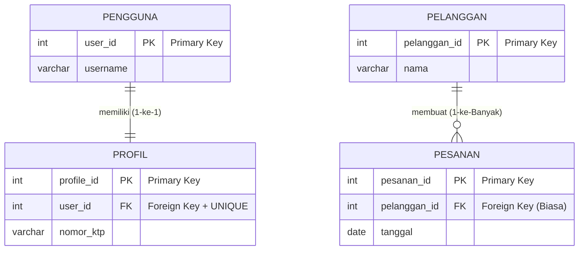

# 03 - BAB 03 RELASI ONE TO ONE DAN ONE TO MANY

Status: DRAFT
Rak: Desain Data dan Schema
Buku: Konsep Table Schema dan Relasi
Level: Level 2 - Level 3
Tipe Materi: Tutorial
Target: Developer atau Data Modeler yang merancang struktur database.
Estimasi Baca: 10 Menit
Terakhir Diperiksa: 2026-05-17

Sumber Utama: PostgreSQL Official Documentation
Versi Referensi: PostgreSQL docs/current
Status Verifikasi Sumber: REVIEW

---

## 1. Tujuan Belajar
Di akhir bab ini, pembaca diharapkan mampu:
- Menjelaskan perbedaan konseptual antara relasi satu-ke-satu (*one-to-one*) dan satu-ke-banyak (*one-to-many*).
- Menentukan posisi penempatan kolom kunci tamu (*Foreign Key*) secara tepat untuk mewujudkan kedua jenis relasi tersebut di PostgreSQL.
- Mengunci keunikan relasi *one-to-one* secara aman menggunakan pembatasan indeks `UNIQUE` pada kolom Foreign Key.
- Mengidentifikasi risiko kerusakan arah logika bisnis akibat salah memosisikan jembatan kunci relasi pada skema database.

## 2. Prasyarat
- Mampu membuat tabel dan memahami peruntukan berbagai tipe data di PostgreSQL (baca: [Pembuatan Table dan Data Type](./bab-02-pembuatan-table-dan-data-type.md)).
- Memahami teori dasar kegunaan Primary Key dan Foreign Key (baca: [Konsep Relasi Antar Tabel](../../../02-sql-dan-querying/buku-03-join-dan-relasi-query/bab-01-konsep-relasi-antar-tabel.md)).

## 3. Ringkasan Cepat
Relasi data mendefinisikan bagaimana tabel-tabel di database saling berhubungan secara logis untuk merepresentasikan relasi objek dunia nyata. Relasi **One-to-One** (satu-ke-satu) menjamin satu baris di Tabel A hanya terhubung dengan maksimal satu baris di Tabel B (dibuat dengan memasang constraint `UNIQUE` pada Foreign Key). Sementara itu, relasi **One-to-Many** (satu-ke-banyak) mengizinkan satu baris di Tabel A terhubung dengan banyak baris di Tabel B (merupakan relasi paling populer di database). Salah menempatkan Foreign Key akan mengacaukan arah logika bisnis aplikasi Anda secara fatal.

## 4. Istilah Penting di Bab Ini

| Istilah | Arti Singkat |
|---|---|
| One-to-One | Relasi di mana satu baris di tabel pertama hanya berpasangan dengan maksimal satu baris di tabel kedua. |
| One-to-Many | Relasi di mana satu baris di tabel induk dapat berpasangan dengan banyak baris di tabel anak. |
| Foreign Key (FK) | Kolom penunjuk di tabel anak untuk mencatat Primary Key tabel induk guna menghubungkan keduanya. |
| Unique Constraint | Aturan pembatasan yang menjamin nilai kolom dilarang kembar di seluruh baris tabel. |
| Cardinality | Istilah desain database yang merujuk pada batasan jumlah hubungan numerik antar data (cth: 1:1, 1:N). |

## 5. Analogi Sehari-hari
Mari kita analogikan kedua jenis relasi ini menggunakan **Skenario Kamar Hotel Mewah dan Keluarga Kucing**:

- **One-to-One (Kamar Hotel Mewah dan Tamu VVIP)**:
  Bayangkan Anda mengelola hotel mewah eksklusif. Hotel menetapkan aturan ketat: *Satu kamar mewah (Tabel Kamar) hanya boleh ditempati oleh tepat satu orang tamu VVIP utama (Tabel Tamu), dan satu orang tamu hanya boleh menempati tepat satu kamar saja.*
  - Untuk menghubungkannya, resepsionis menuliskan **Nomor Kamar** (Foreign Key) pada **Gelang Tamu** yang dipakai di tangan tamu.
  - Agar tidak ada tamu lain yang mendapatkan kamar yang sama secara tidak sengaja, sistem komputer memasang sensor kunci keamanan otomatis: *"Nomor Kamar yang tertera pada gelang tamu dilarang keras kembar di gelang tamu mana pun di sistem!"* (Constraint `UNIQUE` pada Foreign Key).
- **One-to-Many (Induk Kucing dan Anak-Anak Kucing di Peternakan)**:
  Bayangkan sebuah keluarga kucing di peternakan hewan:
  - **Induk Kucing (Tabel Induk - "One")**: Boleh melahirkan dan memiliki banyak anak kucing sekaligus.
  - **Anak Kucing (Tabel Anak - "Many")**: Secara hukum biologi alam hanya diperbolehkan memiliki tepat **satu induk kandung saja**.
  - Untuk menghubungkannya, setiap anak kucing dipasangi **kalung leher kecil bertuliskan ID Induk Kucing** (`Foreign Key`). Di kalung leher anak-anak kucing tersebut, ID Induk yang sama boleh ditulis berulang kali (misal anak kucing A, B, dan C semuanya menuliskan ID Induk 1 di kalungnya). Ini adalah relasi satu-ke-banyak tanpa pembatasan keunikan (`UNIQUE`) pada Foreign Key di tabel anak kucing.

## 6. Batas Analogi
Di dunia sosial nyata, anak kucing bisa saja diadopsi secara sosial oleh induk kucing pengganti lainnya sehingga memiliki dua induk sekaligus. Tamu hotel mewah juga bisa menyewa kamar kedua secara diam-diam menggunakan nama palsu.

Di dalam mesin PostgreSQL digital, aturan *cardinality* data diatur secara matematika biner kaku. Anak kucing hanya boleh merujuk ke satu induk tunggal yang tercatat di kolom kunci secara mutlak demi menjamin akurasi laporan silsilah data sistem informasi.

## 7. Ilustrasi Konsep

Status Ilustrasi: DRAFT



## 8. Penjelasan Ilustrasi
Diagram ERD di atas membedakan rancangan relasi secara visual:
- Bagian atas menggambarkan relasi **One-to-One** antara `PENGGUNA` dan `PROFIL`. Tautannya dilambangkan dengan simbol garis tunggal (`||--||`). Kolom `user_id` di tabel profil bertindak sebagai Foreign Key sekaligus dipasangi constraint `UNIQUE` untuk membatasi satu user hanya boleh memiliki satu profil.
- Bagian bawah menggambarkan relasi **One-to-Many** antara `PELANGGAN` dan `PESANAN`. Tautannya dilambangkan dengan simbol kaki tiga (`||--o{`). Kolom `pelanggan_id` di tabel pesanan bertindak sebagai Foreign Key biasa tanpa constraint `UNIQUE`, mengizinkan satu pelanggan melakukan banyak transaksi pesanan.

## 9. Batas Ilustrasi
Visualisasi di atas berfokus pada dua jenis relasi struktural terpopuler. Ia tidak menampilkan relasi banyak-ke-banyak (*many-to-many*, cth: produk dan transaksi pesanan) yang membutuhkan pembuatan tabel ketiga (*junction table*) sebagai jembatan relasi berantai.

## 10. Konsep Inti

### 1. Relasi One-to-One (Satu-ke-Satu)
Relasi di mana satu baris di Tabel A hanya terhubung dengan maksimal satu baris di Tabel B.
- **Cara Membuat**: Letakkan kolom Foreign Key di salah satu tabel (biasanya di tabel anak/detail), lalu wajib pasangkan constraint **`UNIQUE`** pada kolom Foreign Key tersebut.
- **Kasus Nyata**: Pemisahan kolom tabel `pengguna` (untuk kredensial login sensitif) dengan tabel `detail_profil` (untuk biodata umum) agar performa pencarian login user tetap ringan.

### 2. Relasi One-to-Many (Satu-ke-Banyak)
Relasi di mana satu baris di Tabel A (Induk) dapat terhubung dengan banyak baris di Tabel B (Anak).
- **Cara Membuat**: Letakkan kolom Foreign Key di tabel anak (Tabel B / Sisi "Many") sebagai kolom biasa tanpa constraint `UNIQUE`.
- **Kasus Nyata**: Hubungan antara `kategori` produk dengan `produk` (satu kategori memiliki banyak produk), atau `pelanggan` dengan `pesanan` (satu pelanggan memiliki banyak invoice transaksi).

### 3. Bahaya Salah Posisi Kunci (Foreign Key)
Pada relasi One-to-Many pelanggan dan pesanan, Foreign Key wajib diletakkan di sisi "Many" (tabel `pesanan`). 

Jika Anda melakukan kesalahan meletakkan Foreign Key `pesanan_id` di dalam tabel `pelanggan` (Sisi "One"), maka secara logika database Anda akan memaksa aturan bisnis: **Satu pelanggan hanya diperbolehkan melakukan maksimal satu kali transaksi pesanan seumur hidup!** Hal ini karena satu baris data pelanggan hanya memiliki satu slot kolom untuk mencatat ID pesanan.

## 11. Penjelasan Detail

### Mengapa Kita Menggunakan Relasi One-to-One?
Jika satu baris hanya berpasangan dengan satu baris lainnya, mengapa kita tidak menyatukan seluruh kolom tersebut di dalam satu tabel yang sama saja? Kenapa harus repot membaginya menjadi dua tabel terpisah?

Ada beberapa alasan logis yang mendasarinya:
1.  **Faktor Keamanan Data**: Kolom sensitif seperti password, pin e-wallet, atau token API ditaruh di tabel `kredensial`, sedangkan nama panggilan dan foto ditaruh di tabel `profil_publik`. Divisi pemasaran hanya diberikan izin akses membaca tabel profil publik, mengunci akses ke tabel kredensial demi privasi.
2.  **Efisiensi Performa Memori (Vertical Partitioning)**: PostgreSQL membaca data baris per baris ke RAM. Jika sebuah tabel memiliki 100 kolom (termasuk teks biografi yang sangat panjang), proses kueri membaca data login user akan menjadi sangat lambat. Memotong kolom panjang ke tabel terpisah (One-to-One) menjaga tabel login utama tetap berukuran ultra kecil dan cepat diakses di RAM.

## 12. Contoh SQL Dasar
Berikut adalah cara merancang relasi **One-to-One** secara aman di PostgreSQL dengan mengunci keunikan kolom Foreign Key menggunakan constraint `UNIQUE`:

```sql
-- 1. Membuat tabel induk (User Kredensial)
CREATE TABLE pengguna (
    user_id INT GENERATED ALWAYS AS IDENTITY PRIMARY KEY,
    username VARCHAR(50) UNIQUE NOT NULL,
    password_hash VARCHAR(255) NOT NULL
);

-- 2. Membuat tabel anak (Profil) dengan relasi One-to-One
CREATE TABLE profil_pengguna (
    profile_id INT GENERATED ALWAYS AS IDENTITY PRIMARY KEY,
    nama_lengkap VARCHAR(150) NOT NULL,
    alamat TEXT,
    
    -- Jembatan relasi One-to-One
    user_id INT NOT NULL,
    
    CONSTRAINT fk_profil_pengguna 
        FOREIGN KEY (user_id) 
        REFERENCES pengguna(user_id),
        
    -- KUNCI UTAMA ONE-TO-ONE: Memaksa user_id tidak boleh kembar di tabel profil
    CONSTRAINT uq_user_profile UNIQUE (user_id)
);
```

## 13. Contoh SQL Praktik Project
Berikut adalah cara merancang relasi **One-to-Many** e-commerce antara tabel `pelanggan` dengan `pesanan` secara aman:

```sql
-- 1. Membuat tabel induk (Pelanggan)
CREATE TABLE pelanggan (
    pelanggan_id INT GENERATED ALWAYS AS IDENTITY PRIMARY KEY,
    nama VARCHAR(100) NOT NULL
);

-- 2. Membuat tabel anak (Pesanan) dengan relasi One-to-Many
CREATE TABLE pesanan (
    pesanan_id INT GENERATED ALWAYS AS IDENTITY PRIMARY KEY,
    tanggal_pesan DATE DEFAULT CURRENT_DATE,
    
    -- Jembatan relasi One-to-Many (tanpa constraint UNIQUE)
    pelanggan_id INT NOT NULL,
    
    CONSTRAINT fk_pesanan_pelanggan 
        FOREIGN KEY (pelanggan_id) 
        REFERENCES pelanggan(pelanggan_id)
);
```

## 14. Kesalahan Umum
- **Lupa UNIQUE pada One-to-One**: Tidak menuliskan constraint `UNIQUE` pada kolom Foreign Key di tabel detail/profil. Akibatnya, satu akun pengguna tanpa sengaja bisa memiliki 5 baris data detail profil yang berbeda di database, memicu kekacauan saat kueri backend mencoba membaca profil pengguna tersebut.
- **FK Salah Kamar pada One-to-Many**: Menaruh Foreign Key di sisi "One". Misalnya, menaruh kolom `kategori_id` di dalam tabel `produk` (sudah benar), tetapi malah menaruh kolom `produk_id` di dalam tabel `kategori` (salah). Hal ini akan membatasi satu kategori produk hanya boleh memiliki maksimal satu produk saja di dalam sistem toko online Anda.

## 15. Catatan Interview
- **Pertanyaan**: "Bagaimana cara fisik Anda membedakan pembuatan relasi One-to-One dengan One-to-Many saat menuliskan perintah CREATE TABLE di PostgreSQL?"
- **Jawaban**: "Kedua jenis relasi tersebut sama-sama menggunakan jembatan kolom Foreign Key yang merujuk ke Primary Key tabel induk. Perbedaan fisiknya terletak pada aturan keunikan kolom. Pada relasi **One-to-One**, kita wajib mendaftarkan constraint **`UNIQUE`** pada kolom Foreign Key di tabel anak untuk memastikan satu induk hanya memiliki maksimal satu anak. Sedangkan pada relasi **One-to-Many**, kita membiarkan kolom Foreign Key tersebut tanpa constraint `UNIQUE` agar satu induk bebas memiliki banyak baris data anak."

## 16. Catatan Diskusi User
- **Teaser untuk Relasi Banyak-ke-Banyak (Many-to-Many)**:
  Bagaimana jika satu siswa bisa mengambil banyak mata pelajaran, dan satu mata pelajaran bisa diikuti oleh banyak siswa sekaligus?
  - Kasus ini tidak bisa diselesaikan menggunakan One-to-Many biasa karena meletakkan FK di tabel siswa maupun mata pelajaran akan melanggar aturan logika bisnis.
  - Kasus Many-to-Many diselesaikan secara elegan dengan membangun tabel ketiga bernama **Tabel Hubungan** (*junction table* / *associative table*), misalnya tabel `pendaftaran_kelas` yang menyimpan `siswa_id` sekaligus `matakuliah_id` secara berdampingan.

## 17. Latihan Kecil
1. Rancanglah kueri `CREATE TABLE` sederhana untuk mewujudkan relasi **One-to-One** antara tabel `karyawan` (id, nama) dengan tabel `kartu_akses_gedung` (id, nomor_kartu, karyawan_id)!
2. Tentukan tipe relasi (*cardinality*) yang paling tepat (One-to-One atau One-to-Many) untuk skenario bisnis berikut:
   - Hubungan antara tabel `negara` dengan `ibukota_negara`.
   - Hubungan antara tabel `dosen_wali` dengan `siswa_mahasiswa`.

## 18. Checklist Pemahaman
- [ ] Memahami perbedaan batasan jumlah hubungan (*cardinality*) relasi One-to-One dan One-to-Many.
- [ ] Mampu menerangkan peran vital constraint `UNIQUE` dalam mewujudkan relasi One-to-One.
- [ ] Mengetahui bahaya kesalahan penempatan kolom Foreign Key pada perancangan relasi One-to-Many.
- [ ] Memahami alasan memotong tabel menjadi relasi One-to-One demi alasan keamanan dan performa memori.

## 19. Hubungan dengan Materi Lain

### Posisi Materi
- Rak: [03 - Desain Data dan Schema](../../README.md)
- Buku: [Konsep Table Schema dan Relasi](../)

### Prasyarat
- [Pembuatan Table dan Data Type](./bab-02-pembuatan-table-dan-data-type.md)

### Materi Sebelumnya
- [Pembuatan Table dan Data Type](./bab-02-pembuatan-table-dan-data-type.md)

### Materi Berikutnya
- [Normal Form 1, 2, 3](../../buku-03-normalisasi-dan-denormalisasi/bab-01-normal-form-1-2-3.md)

### Materi Terkait
- [Foreign Key dan Referential Integrity](../buku-02-primary-key-foreign-key-dan-constraint/bab-02-foreign-key-dan-referential-integrity.md) (Membahas integritas kunci tingkat mendalam)

### Istilah Terkait
- Relationship Cardinality, One-to-One Mapping, One-to-Many Mapping, Junction Table, Vertical Partitioning, Unique Key Constraint.

## 20. Referensi Resmi
Jangan membuka tautan berikut pada batch ini, cukup cantumkan sebagai referensi resmi yang ditargetkan untuk verifikasi nanti:
- PostgreSQL Official Documentation — perlu diverifikasi pada batch official docs verification.
- SQL standard / relational database concept — perlu diverifikasi jika nanti masuk fase source verification.

## 21. Catatan Pribadi / Project Notes
*   *Catatan Draft*: Bab ini ditekankan untuk melatih imajinasi spasial relasi developer. Banyak kesalahan fatal arsitektur aplikasi backend bersumber dari salah menempatkan Foreign Key di sisi "One" yang membatasi kapasitas transaksi bisnis. Ilustrasikan sejelas mungkin dengan analogi induk-anak kucing agar melekat kuat di memori. Status verifikasi diatur ke REVIEW.
