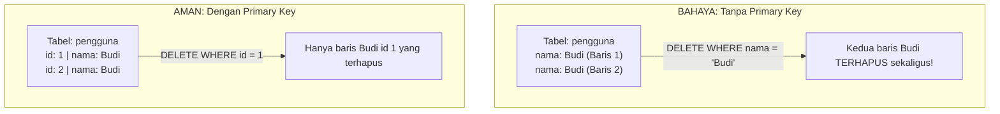

# 01 - BAB 01 PENTINGNYA PRIMARY KEY

Status: DRAFT
Rak: Desain Data dan Schema
Buku: Primary Key Foreign Key dan Constraint
Level: Level 2 - Level 3
Tipe Materi: Tutorial
Target: Developer atau Data Modeler yang merancang struktur database.
Estimasi Baca: 10 Menit
Terakhir Diperiksa: 2026-05-17

Sumber Utama: PostgreSQL Official Documentation
Versi Referensi: PostgreSQL docs/current
Status Verifikasi Sumber: REVIEW

---

## 1. Tujuan Belajar
Di akhir bab ini, pembaca diharapkan mampu:
- Memahami definisi dan fungsi utama Primary Key sebagai pengidentifikasi unik baris data dalam sebuah tabel.
- Menjelaskan alasan logis mengapa setiap baris data di dalam database wajib memiliki identitas unik.
- Memahami peran krusial Primary Key dalam memfasilitasi relasi data (Foreign Key) dan menjaga integritas referensial.
- Menuliskan kueri pembuatan Primary Key menggunakan metode tradisional `SERIAL` maupun standar modern `GENERATED ALWAYS AS IDENTITY`.

## 2. Prasyarat
- Memahami konsep dasar struktur tabel, baris, dan kolom (baca: [Apa Itu PostgreSQL](../../01-orientasi-sejarah-dan-fondasi-postgresql/buku-01-orientasi-postgresql/bab-01-apa-itu-postgresql.md)).
- Mengetahui cara mengeksekusi perintah SQL pembuatan tabel dasar.

## 3. Ringkasan Cepat
**Primary Key (Kunci Utama)** adalah satu atau kombinasi beberapa kolom yang digunakan untuk mengidentifikasi setiap baris data di dalam tabel secara unik dan mutlak. Kolom yang ditunjuk sebagai Primary Key secara otomatis dilarang kosong (`NOT NULL`) dan tidak boleh ada nilai ganda (`UNIQUE`). Tanpa Primary Key, data Anda menjadi sekadar tumpukan informasi tanpa kepastian identitas, sehingga mustahil melakukan operasi ubah (`UPDATE`) atau hapus (`DELETE`) secara aman.

## 4. Istilah Penting di Bab Ini

| Istilah | Arti Singkat |
|---|---|
| Primary Key (PK) | Kolom unik yang wajib terisi (NOT NULL) untuk mengidentifikasi setiap baris data secara mutlak. |
| Unique Constraint | Aturan database yang melarang adanya data ganda/duplikat pada kolom tertentu. |
| Auto-increment | Mekanisme di mana database secara otomatis menghasilkan deret angka berurutan untuk baris data baru. |
| SERIAL | Fitur auto-increment tradisional bawaan PostgreSQL (non-standar ANSI SQL). |
| IDENTITY Column | Fitur auto-increment modern berstandar resmi ANSI SQL yang diimplementasikan di PostgreSQL. |
| Referential Integrity | Konsistensi relasi data antar tabel, menjamin tidak ada referensi data yatim piatu (tidak valid). |

## 5. Analogi Sehari-hari
Bayangkan Anda menjabat sebagai kepala **Dinas Kependudukan (Database Administrator)**:
- Di wilayah Anda, terdapat jutaan warga bernama "Budi Santoso". Beberapa di antara mereka kebetulan lahir di tanggal yang sama dan tinggal di kota yang sama.
- Untuk membedakan Budi Santoso yang satu dengan yang lainnya secara mutlak tanpa kesalahan, pemerintah menerbitkan **Nomor Induk Kependudukan (NIK)** yang tercetak unik pada KTP setiap warga. NIK ini bertindak sebagai **Primary Key** bagi data warga tersebut.
- Jika polisi ingin memanggil seorang Budi Santoso karena melanggar lalu lintas, polisi tidak akan mencari berdasarkan nama *"Budi Santoso"*, karena akan ada ratusan orang tak bersalah ikut tertangkap. Polisi akan mencari berdasarkan **NIK** spesifiknya agar pemanggilan tepat sasaran.

## 6. Batas Analogi
Di dunia nyata, kartu fisik KTP bisa hilang, dipalsukan oleh oknum ilegal, atau terlambat diterbitkan saat seorang bayi lahir. 

Di dalam PostgreSQL, kepatuhan Primary Key dijamin secara mutlak oleh sistem database. PostgreSQL tidak akan pernah membiarkan data dimasukkan tanpa Primary Key yang valid, menggagalkan duplikasi secara instan (*Unique Constraint Enforcement*), dan melarang nilai kosong secara mutlak (*NOT NULL Constraint*) sejak awal transaksi data diproses.

## 7. Ilustrasi Konsep

Status Ilustrasi: DRAFT



## 8. Penjelasan Ilustrasi
Sisi kiri diagram menggambarkan bahaya tabel tanpa Primary Key. Ketika kita memiliki dua baris dengan nama "Budi" yang sama dan ingin menghapus salah satunya berdasarkan filter nama, database terpaksa menghapus kedua baris sekaligus karena tidak memiliki cara untuk membedakannya. Sisi kanan menunjukkan keunggulan Primary Key (`id`). Dengan Primary Key, kita dapat secara presisi menghapus baris Budi pertama (`id = 1`) tanpa mengganggu baris Budi kedua (`id = 2`).

## 9. Batas Ilustrasi
Ilustrasi di atas hanya menggambarkan fungsi Primary Key untuk operasi manipulasi data tunggal (keamanan hapus). Ilustrasi ini tidak menggambarkan peran vital Primary Key sebagai titik acuan relasi (*Foreign Key*) untuk menggabungkan tabel pengguna dengan tabel transaksi pembelanjaan produk.

## 10. Konsep Inti
Mengapa setiap tabel di PostgreSQL wajib memiliki Primary Key?
1.  **Kepastian Identitas**: Menjamin keunikan setiap baris data, menghindari duplikasi data sampah yang merusak laporan keuangan atau operasional.
2.  **Keamanan Operasi Write**: Memastikan kueri `UPDATE` dan `DELETE` hanya memengaruhi baris data yang ditargetkan secara presisi.
3.  **Kecepatan Pencarian (Indeks Otomatis)**: PostgreSQL secara otomatis membuat indeks berkinerja tinggi (*B-Tree Index*) untuk kolom Primary Key, mempercepat pencarian data jutaan baris hingga di bawah 1 milidetik.
4.  **Fondasi Relasi (Integritas Referensial)**: Primary Key digunakan sebagai acuan oleh tabel lain melalui mekanisme Foreign Key.

## 11. Penjelasan Detail
### Memilih Pendekatan Auto-increment: `SERIAL` vs `IDENTITY`
Di PostgreSQL, kita memiliki dua cara utama untuk membuat kolom Primary Key berupa angka acak berurutan yang terisi otomatis:

#### A. Pendekatan Tradisional: `SERIAL`
Tipe data kustom PostgreSQL yang otomatis membuat objek *Sequence* (pembangkit angka berurutan) di latar belakang.
```sql
CREATE TABLE produk_serial (
    id SERIAL PRIMARY KEY,
    nama VARCHAR(100) NOT NULL
);
```

#### B. Pendekatan Modern & Standar Resmi: `GENERATED ALWAYS AS IDENTITY`
Merupakan fitur standar ANSI SQL resmi yang diperkenalkan di PostgreSQL versi 10 ke atas. Pendekatan ini sangat direkomendasikan untuk pengembangan aplikasi modern.
```sql
CREATE TABLE produk_identity (
    id INT GENERATED ALWAYS AS IDENTITY PRIMARY KEY,
    nama VARCHAR(100) NOT NULL
);
```

## 12. Contoh SQL Dasar
Berikut adalah cara mendefinisikan tabel dengan Primary Key menggunakan standar industri yang direkomendasikan:

```sql
-- 1. Membuat tabel kategori dengan kolom ID bertipe IDENTITY
CREATE TABLE kategori (
    kategori_id INT GENERATED ALWAYS AS IDENTITY PRIMARY KEY,
    nama_kategori VARCHAR(100) NOT NULL
);

-- 2. Memasukkan data (kolom kategori_id akan terisi otomatis secara sistem)
INSERT INTO kategori (nama_kategori) VALUES ('Elektronik');
INSERT INTO kategori (nama_kategori) VALUES ('Pakaian');
```

## 13. Contoh SQL Praktik Project
Dalam skenario perancangan database toko online, kita merancang tabel produk dengan Primary Key terstandar. Ketika backend ingin memperbarui harga sebuah produk secara presisi, backend memanfaatkan ID produk tersebut:

```sql
-- 1. Membuat tabel produk
CREATE TABLE produk (
    produk_id INT GENERATED ALWAYS AS IDENTITY PRIMARY KEY,
    nama_produk VARCHAR(150) NOT NULL,
    harga NUMERIC(12, 2) NOT NULL
);

-- 2. Mengubah harga produk tertentu secara aman menggunakan ID-nya
UPDATE produk 
SET harga = 18500.00 
WHERE produk_id = 2;
```

## 14. Kesalahan Umum
- **Menggunakan Kolom Dinamis sebagai Primary Key**: Memilih kolom seperti `nomor_handphone` atau `email` warga sebagai Primary Key. Kolom-kolom ini nilainya dapat berubah di masa depan (misal pengguna ganti nomor HP atau email). Primary Key yang baik harus bersifat stabil dan tidak pernah berubah (*immutable*).
- **Merancang Tabel Tanpa Primary Key**: Mengabaikan Primary Key hanya karena tabel tersebut berukuran kecil saat dibuat. Ini menyulitkan integrasi relasi data saat sistem berkembang menjadi kompleks.

## 15. Catatan Interview
- **Pertanyaan**: "Mengapa tipe `GENERATED ALWAYS AS IDENTITY` lebih disukai dibandingkan `SERIAL` pada PostgreSQL modern?"
- **Jawaban**: "`GENERATED ALWAYS AS IDENTITY` adalah standar resmi ANSI SQL, sedangkan `SERIAL` adalah sintaksis kustom non-standar milik PostgreSQL. Selain itu, `IDENTITY` memberikan perlindungan keamanan lebih ketat karena mencegah pengguna memasukkan nilai ID secara manual secara tidak sengaja melalui perintah `INSERT` biasa (kecuali ditambahkan klausa khusus `OVERRIDING SYSTEM VALUE`), sehingga menghindari kekacauan sinkronisasi urutan angka auto-increment."

## 16. Catatan Diskusi User
- **Pertanyaan Umum**: "Saya mendengar istilah UUID sebagai Primary Key. Kapan sebaiknya saya menggunakan UUID dibanding deret angka biasa?"
- **Diskusikan**: Deret angka (`SERIAL` atau `IDENTITY`) adalah standar default terbaik karena hemat penyimpanan (4-8 byte) dan performa indeks pencariannya sangat cepat. Namun, untuk sistem terdistribusi skala besar (seperti microservices) di mana ID harus dihasilkan secara independen di tingkat backend sebelum masuk ke database guna menghindari tabrakan ID antar server, penggunaan UUID (16 byte) baru menjadi pilihan utama.

## 17. Latihan Kecil
1. Tuliskan query SQL untuk membuat tabel bernama `inventori` yang memiliki kolom Primary Key bernama `item_id` menggunakan metode `GENERATED ALWAYS AS IDENTITY`!
2. Jika Anda memiliki tabel tanpa Primary Key dan mendapati ada dua baris data yang nilainya persis sama di semua kolom, jelaskan secara singkat bagaimana cara Anda menghapus salah satunya secara aman! (Tantangan berpikir logis).

## 18. Checklist Pemahaman
- [ ] Memahami arti penting Primary Key bagi keunikan baris data.
- [ ] Mampu menuliskan sintaks pembuatan Primary Key bertipe `IDENTITY` standar modern.
- [ ] Mengetahui 3 fungsi utama Primary Key bagi stabilitas database.
- [ ] Memahami mengapa kolom Primary Key dilarang keras bernilai kosong (`NOT NULL`).

## 19. Hubungan dengan Materi Lain

### Posisi Materi
- Rak: [03 - Desain Data dan Schema](../../README.md)
- Buku: [Primary Key Foreign Key dan Constraint](../)

### Prasyarat
- [Mengenal Schema PostgreSQL](../../03-desain-data-dan-schema/buku-01-konsep-table-schema-dan-relasi/bab-01-mengenal-schema-postgresql.md)

### Materi Sebelumnya
- [Mengenal Schema PostgreSQL](../../03-desain-data-dan-schema/buku-01-konsep-table-schema-dan-relasi/bab-01-mengenal-schema-postgresql.md)

### Materi Berikutnya
- Relasi Data dengan Foreign Key *(Segera Datang)*

### Materi Terkait
- [Arsitektur dan Internals PostgreSQL](../../11-arsitektur-dan-internals-postgresql/)

### Istilah Terkait
- Constraints, Unique, Auto-increment, Sequence, Identity.

## 20. Referensi Resmi
Jangan membuka tautan berikut pada batch ini, cukup cantumkan sebagai referensi resmi yang ditargetkan untuk verifikasi nanti:
- PostgreSQL Official Documentation - Constraints
  https://www.postgresql.org/docs/current/ddl-constraints.html
- PostgreSQL Official Documentation - Identity Columns
  https://www.postgresql.org/docs/current/ddl-identity-columns.html

## 21. Catatan Pribadi / Project Notes
*   *Catatan Draft*: Draft ini difokuskan untuk melatih kedisiplinan perancangan tabel. Menekankan pendekatan standar `IDENTITY` modern dibandingkan `SERIAL` sangat krusial agar pembaca langsung memiliki modal keterampilan berstandar industri terbaru. Status verifikasi diatur ke REVIEW.
