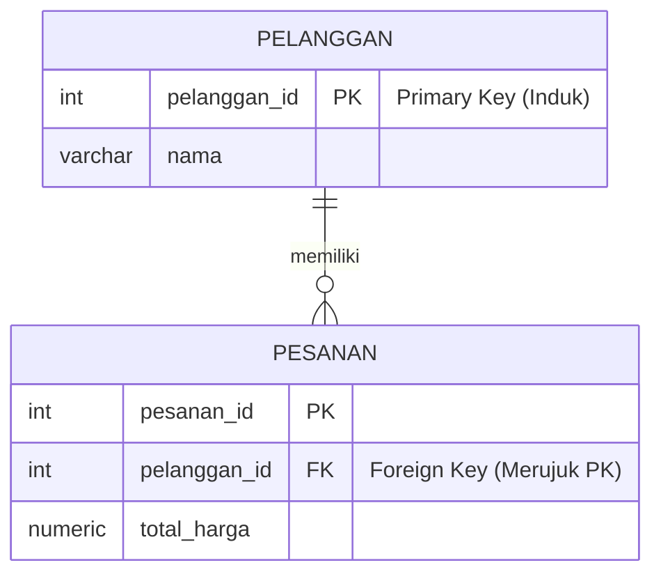

# 02 - BAB 02 FOREIGN KEY DAN REFERENTIAL INTEGRITY

Status: DRAFT
Rak: Desain Data dan Schema
Buku: Primary Key Foreign Key dan Constraint
Level: Level 2 - Level 3
Tipe Materi: Tutorial
Target: Developer atau Data Modeler yang merancang struktur database.
Estimasi Baca: 10 Menit
Terakhir Diperiksa: 2026-05-17

Sumber Utama: PostgreSQL Official Documentation
Versi Referensi: PostgreSQL docs/current
Status Verifikasi Sumber: REVIEW

---

## 1. Tujuan Belajar
Di akhir bab ini, pembaca diharapkan mampu:
- Memahami definisi, fungsi, dan sintaksis penulisan Foreign Key (Kunci Tamu) dalam menghubungkan tabel-tabel relasional.
- Menjelaskan konsep Integritas Referensial (*Referential Integrity*) dan mengapa ia krusial untuk memelihara kualitas data aplikasi.
- Mengidentifikasi bahaya data yatim piatu (*orphan records*) dan bagaimana Foreign Key mencegahnya secara otomatis di tingkat database.
- Memahami strategi penanganan penghapusan data induk melalui klausa `ON DELETE RESTRICT` dan `ON DELETE CASCADE`.

## 2. Prasyarat
- Memahami pentingnya Primary Key sebagai pengidentifikasi unik mutlak baris data (baca: [Pentingnya Primary Key](./bab-01-pentingnya-primary-key.md)).
- Mengetahui cara membuat tabel database relasional dasar di PostgreSQL.

## 3. Ringkasan Cepat
**Foreign Key (Kunci Asing / Kunci Tamu)** adalah satu atau beberapa kolom di suatu tabel (tabel anak/child) yang nilainya merujuk langsung ke Primary Key di tabel lain (tabel induk/parent). Keberadaan Foreign Key menjamin **Integritas Referensial**—sebuah garansi mutlak dari PostgreSQL bahwa data transaksi anak tidak akan pernah merujuk ke data induk yang tidak eksis, mencegah terciptanya data yatim piatu (*orphan records*) yang bisa merusak laporan bisnis aplikasi Anda.

## 4. Istilah Penting di Bab Ini

| Istilah | Arti Singkat |
|---|---|
| Foreign Key (FK) | Kolom tabel anak yang nilainya wajib bersumber dari Primary Key tabel induk yang valid. |
| Referential Integrity | Aturan yang menjamin hubungan relasi antar tabel tetap konsisten, sinkron, dan logis. |
| Parent Table | Tabel utama tempat Primary Key orisinal didefinisikan (contoh: tabel `pelanggan`). |
| Child Table | Tabel yang menyimpan rujukan Primary Key induk sebagai Foreign Key (contoh: tabel `pesanan`). |
| Orphan Record | Baris data di tabel anak yang kehilangan rujukan data induk (karena data induk terhapus atau palsu). |
| RESTRICT | Strategi penolakan penghapusan data induk jika masih ada data anak yang merujuknya. |
| CASCADE | Strategi penghapusan otomatis data anak secara berantai jika data induk yang dirujuknya dihapus. |

## 5. Analogi Sehari-hari
Bayangkan Anda adalah pengelola **Supermarket Besar (Database)** yang memiliki sistem **Kartu Keanggotaan / Member (Relasi)**:
- Di kantor administrasi, terdapat buku daftar pendaftaran **Profil Anggota (Tabel Induk: `pelanggan`)**. Setiap anggota memiliki nomor ID Member yang unik (**Primary Key**).
- Ketika ada orang berbelanja di kasir, kasir mencatat transaksi tersebut di dalam buku **Daftar Penjualan (Tabel Anak: `transaksi`)**. Di setiap baris penjualan, kasir mencatat kolom `member_id` (**Foreign Key**).
- **Foreign Key** adalah **Tindakan Validasi Kasir**: Ketika seseorang menyodorkan kartu member berkode `105`, kasir wajib memindai kartu tersebut dan mencocokkannya ke buku profil anggota. Jika sistem mendeteksi member `105` tidak ada di buku profil anggota, sistem kasir akan langsung membunyikan alarm dan menolak transaksi tersebut karena kartunya palsu.
- Sebaliknya, jika ada staf administrasi yang mencoba merobek halaman profil pelanggan Budi (member `105`) di buku anggota padahal Budi memiliki riwayat transaksi di buku penjualan, sistem akan melarang perobekan tersebut karena data belanja Budi akan menjadi data yatim tanpa pemilik yang jelas.

## 6. Batas Analogi
Di supermarket fisik, kasir yang malas atau terburu-buru bisa saja mengabaikan prosedur pemindaian kartu dan mencatat nomor member asal-asalan secara manual di kertas kasir demi mempercepat antrean.

Di dalam PostgreSQL, pengabaian aturan ini tidak mungkin terjadi. Engine PostgreSQL bertindak sebagai polisi data otomatis yang bekerja di tingkat memori RAM komputer. Setiap kali perintah `INSERT` data anak dieksekusi, database akan memvalidasi keaslian rujukan tersebut dalam hitungan mikrodetik, menolak kueri secara instan jika rujukan tidak valid (*strict constraint check*).

## 7. Ilustrasi Konsep

Status Ilustrasi: DRAFT



## 8. Penjelasan Ilustrasi
Diagram hubungan entitas (ERD) di atas memperlihatkan hubungan tabel induk `PELANGGAN` dengan tabel anak `PESANAN`. Kolom `pelanggan_id` bertindak sebagai Primary Key (PK) di tabel induk, dan dipinjam ke dalam tabel anak `PESANAN` sebagai Foreign Key (FK). Simbol relasi (`||--o{`) menjamin bahwa setiap satu pesanan wajib memiliki satu pelanggan yang valid di database, dan satu pelanggan diperbolehkan memiliki banyak pesanan.

## 9. Batas Ilustrasi
Diagram ERD di atas menampilkan relasi tingkat logis (konsep relasi). Ia tidak menampilkan secara fisik bagaimana PostgreSQL menggunakan indeks otomatis pada Primary Key induk untuk mempercepat proses pencarian data validasi saat baris baru pesanan dimasukkan ke dalam hard disk.

## 10. Konsep Inti
### Bahaya Terciptanya Data Yatim Piatu (*Orphan Records*)
Bayangkan jika tabel `pesanan` menyimpan data belanjaan bernilai 10 juta rupiah dengan kolom `pelanggan_id = 999`, padahal pelanggan ID 999 tidak pernah terdaftar. Laporan bulanan keuangan akan kacau karena sistem tidak tahu siapa pemilik transaksi tersebut. Transaksi 10 juta itu menjadi data yatim piatu (*orphan record*). Foreign Key menghentikan skenario terburuk ini secara mutlak.

### Strategi Penanganan Penghapusan Data Induk (`ON DELETE`)
Ketika baris data induk dihapus, apa yang harus dilakukan database terhadap data anak yang merujuknya?
1.  **`ON DELETE RESTRICT` (Pilihan Default)**:
    PostgreSQL melarang keras penghapusan data induk selama masih ada data anak yang merujuknya. Anda harus menghapus data anak terlebih dahulu sebelum bisa menghapus data induknya. Ini adalah strategi paling aman dari kesalahan penghapusan tidak sengaja.
2.  **`ON DELETE CASCADE`**:
    Jika data induk dihapus, maka seluruh riwayat data anak yang merujuknya akan otomatis ikut terhapus dari tabel anak secara berantai. Sangat praktis, namun sangat berbahaya jika diterapkan pada data keuangan sensitif.

## 11. Penjelasan Detail
### Deklarasi Foreign Key dalam Kueri SQL
Terdapat dua cara mendefinisikan Foreign Key di PostgreSQL:

#### A. Gaya Inline (Sederhana)
Cocok untuk pembuatan relasi dasar satu kolom.
```sql
CREATE TABLE pesanan (
    pesanan_id INT GENERATED ALWAYS AS IDENTITY PRIMARY KEY,
    pelanggan_id INT REFERENCES pelanggan(pelanggan_id), -- Mengunci Relasi
    total_harga NUMERIC(12, 2) NOT NULL
);
```

#### B. Gaya Explicit Constraint (Sangat Direkomendasikan)
Memberikan nama khusus pada constraint agar mudah diidentifikasi jika terjadi error, serta mendukung strategi `ON DELETE` secara eksplisit.
```sql
CREATE TABLE pesanan (
    pesanan_id INT GENERATED ALWAYS AS IDENTITY PRIMARY KEY,
    pelanggan_id INT NOT NULL,
    total_harga NUMERIC(12, 2) NOT NULL,
    CONSTRAINT fk_pelanggan_pesanan 
        FOREIGN KEY (pelanggan_id) REFERENCES pelanggan(pelanggan_id) 
        ON DELETE RESTRICT
);
```

## 12. Contoh SQL Dasar
Berikut adalah cara mendefinisikan tabel induk dan tabel anak menggunakan relasi Foreign Key yang valid:

```sql
-- 1. Membuat tabel induk (Parent)
CREATE TABLE pelanggan (
    pelanggan_id INT GENERATED ALWAYS AS IDENTITY PRIMARY KEY,
    nama VARCHAR(100) NOT NULL
);

-- 2. Membuat tabel anak (Child)
CREATE TABLE pesanan (
    pesanan_id INT GENERATED ALWAYS AS IDENTITY PRIMARY KEY,
    pelanggan_id INT NOT NULL,
    total_harga NUMERIC(12, 2) NOT NULL,
    CONSTRAINT fk_pelanggan FOREIGN KEY (pelanggan_id) REFERENCES pelanggan(pelanggan_id)
);
```

## 13. Contoh SQL Praktik Project
Dalam skenario database e-commerce yang lebih luas, kita merancang relasi bertingkat tiga (Pelanggan $\rightarrow$ Pesanan $\rightarrow$ Detail Barang Pesanan) untuk mengunci keamanan data bertingkat:

```sql
-- 1. Tabel Pelanggan
CREATE TABLE customers (
    id INT GENERATED ALWAYS AS IDENTITY PRIMARY KEY,
    fullname VARCHAR(150) NOT NULL
);

-- 2. Tabel Pesanan (Merujuk ke Pelanggan, dilarang hapus jika ada pesanan aktif)
CREATE TABLE orders (
    id INT GENERATED ALWAYS AS IDENTITY PRIMARY KEY,
    customer_id INT NOT NULL,
    order_date DATE DEFAULT CURRENT_DATE,
    CONSTRAINT fk_customer FOREIGN KEY (customer_id) 
        REFERENCES customers(id) ON DELETE RESTRICT
);

-- 3. Tabel Detail Item Pesanan (Merujuk ke Pesanan, jika pesanan induk dihapus, detail item ikut terhapus)
CREATE TABLE order_items (
    id INT GENERATED ALWAYS AS IDENTITY PRIMARY KEY,
    order_id INT NOT NULL,
    product_name VARCHAR(150) NOT NULL,
    qty INT NOT NULL,
    CONSTRAINT fk_order FOREIGN KEY (order_id) 
        REFERENCES orders(id) ON DELETE CASCADE
);
```

## 14. Kesalahan Umum
- **Relasi Hanya di Tingkat Backend Aplikasi**: Menolak menggunakan Foreign Key di database karena alasan "performa", dan memilih mengurus logika relasi data murni di tingkat kode program backend saja. Tanpa Foreign Key di database, jika aplikasi backend mengalami bug atau ada penulisan data manual langsung via CLI/GUI admin database, integritas data referensial akan langsung rusak dan memicu kekacauan relasi data yatim piatu.
- **Rujukan ke Kolom Non-Unik**: Membuat Foreign Key yang merujuk ke kolom tabel induk yang tidak terpasang `PRIMARY KEY` atau `UNIQUE` constraint. PostgreSQL akan otomatis menolak pembuatan tabel tersebut karena kolom rujukan wajib dijamin keunikan mutlaknya.

## 15. Catatan Interview
- **Pertanyaan**: "Apa yang dimaksud dengan *Referential Integrity* (Integritas Referensial) dan bagaimana PostgreSQL menegakkannya?"
- **Jawaban**: "Integritas Referensial adalah aturan yang menjamin bahwa hubungan relasi antar tabel database tetap konsisten, sinkron, dan valid. PostgreSQL menegakkannya melalui mekanisme constraint **Foreign Key**. Saat Foreign Key diaktifkan, database secara otomatis menolak segala upaya memasukkan data anak yang merujuk ke ID induk non-eksis, serta menolak penghapusan data induk yang masih memiliki keterikatan data anak (atau melakukan aksi hapus otomatis seperti CASCADE) demi mencegah terciptanya data rusak/yatim piatu (*orphan records*)."

## 16. Catatan Diskusi User
- **Pertanyaan Umum**: "Kapan sebaiknya saya memilih strategi `ON DELETE RESTRICT` dibandingkan `ON DELETE CASCADE`?"
- **Diskusikan**: Aturan praktisnya adalah: Gunakan `RESTRICT` untuk data transaksi penting, berharga, dan berumur panjang (seperti tabel pelanggan vs transaksi penjualan). Kita tidak ingin riwayat transaksi penjualan bernilai jutaan rupiah mendadak hilang terhapus tanpa jejak hanya karena seseorang tidak sengaja menghapus profil akun pelanggan. Gunakan `CASCADE` untuk data pembantu yang sifatnya melekat penuh dan tidak memiliki nilai independen (seperti ulasan barang pesanan atau data log temporer pendukung).

## 17. Latihan Kecil
1. Tuliskan query pembuatan tabel `komentar` yang memiliki kolom `komentar_id` (Primary Key), isi teks, dan kolom `artikel_id` yang merupakan Foreign Key merujuk ke tabel `artikel(id)` dengan strategi `ON DELETE CASCADE`!
2. Jelaskan secara singkat mengapa PostgreSQL melarang keras Foreign Key merujuk ke kolom tabel induk yang isinya boleh terduplikasi (non-unik)!

## 18. Checklist Pemahaman
- [ ] Memahami definisi Foreign Key dan hubungannya dengan Primary Key.
- [ ] Mampu membedakan tabel induk (Parent) dengan tabel anak (Child) dalam pemodelan relasi database.
- [ ] Memahami bahaya data yatim piatu (*orphan records*) bagi keakuratan laporan keuangan bisnis.
- [ ] Mengetahui perbedaan perilaku penghapusan antara `ON DELETE RESTRICT` dengan `ON DELETE CASCADE`.

## 19. Hubungan dengan Materi Lain

### Posisi Materi
- Rak: [03 - Desain Data dan Schema](../../README.md)
- Buku: [Primary Key Foreign Key dan Constraint](../)

### Prasyarat
- [Pentingnya Primary Key](./bab-01-pentingnya-primary-key.md)

### Materi Sebelumnya
- [Pentingnya Primary Key](./bab-01-pentingnya-primary-key.md)

### Materi Berikutnya
- Mengenal Check Constraint dan Default Value *(Segera Datang)*

### Materi Terkait
- [SQL dan Querying](../../02-sql-dan-querying/) (Kueri penggabungan data via JOIN)

### Istilah Terkait
- Referential Integrity, Cascade, Restrict, Orphan Records, Relational Database.

## 20. Referensi Resmi
Jangan membuka tautan berikut pada batch ini, cukup cantumkan sebagai referensi resmi yang ditargetkan untuk verifikasi nanti:
- PostgreSQL Official Documentation - Constraints
  https://www.postgresql.org/docs/current/ddl-constraints.html

## 21. Catatan Pribadi / Project Notes
*   *Catatan Draft*: Pastikan pembahasan memicu kesadaran pembaca bahwa database relasional menjadi kuat dan kokoh justru karena adanya Foreign Key. Bahaya data yatim piatu (*orphan record*) harus digambarkan secara dramatis agar developer menghormati aturan integritas di tingkat database server. Status verifikasi diatur ke REVIEW.
