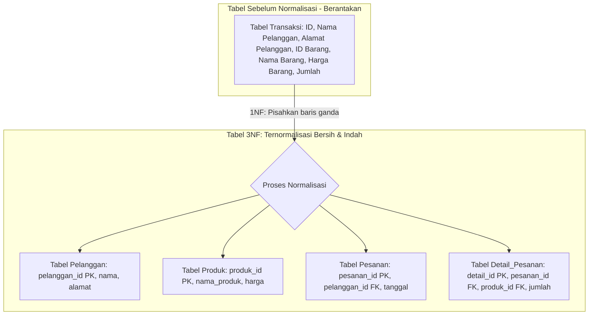

# 01 - BAB 01 NORMAL FORM 1 2 3

Status: DRAFT
Rak: Desain Data dan Schema
Buku: Normalisasi dan Denormalisasi
Level: Level 2 - Level 3
Tipe Materi: Tutorial
Target: Developer atau Data Modeler yang merancang struktur database.
Estimasi Baca: 10 Menit
Terakhir Diperiksa: 2026-05-17

Sumber Utama: PostgreSQL Official Documentation
Versi Referensi: PostgreSQL docs/current
Status Verifikasi Sumber: REVIEW

---

## 1. Tujuan Belajar
Di akhir bab ini, pembaca diharapkan mampu:
- Menjelaskan filosofi dasar dan tujuan dilakukannya proses Normalisasi Database pada perancangan skema relasional.
- Menyebutkan dan menjelaskan kriteria teknis pemenuhan standar bentuk normal pertama (1NF), kedua (2NF), dan ketiga (3NF).
- Mengubah struktur tabel yang berantakan (*denormalized/flat table*) menjadi pecahan tabel relasional terstruktur yang memenuhi syarat 3NF.
- Mendeteksi dan menghindari anomali data (insert, update, delete) akibat kesalahan desain skema yang melanggar prinsip normalisasi.

## 2. Prasyarat
- Memahami konsep dasar relasi data satu-ke-banyak (*one-to-many*) dan penempatan Foreign Key (baca: [Relasi One-to-One dan One-to-Many](../buku-01-konsep-table-schema-dan-relasi/bab-03-relasi-one-to-one-dan-one-to-many.md)).
- Mengetahui cara mengambil data relasional menggunakan operasi JOIN (baca: [LEFT dan RIGHT JOIN](../../../02-sql-dan-querying/buku-03-join-dan-relasi-query/bab-03-left-dan-right-join.md)).

## 3. Ringkasan Cepat
Normalisasi adalah metode sistematis untuk menyusun kolom-kolom dan tabel-tabel di database relasional demi meminimalkan redundansi (duplikasi data kembar) dan mencegah risiko anomali operasional. Proses ini diselesaikan secara bertahap: **1NF** (memastikan nilai kolom bersifat tunggal/atomik), **2NF** (menghilangkan ketergantungan parsial pada kunci utama komposit), dan **3NF** (menghilangkan ketergantungan transitif atau hubungan tidak langsung antar kolom biasa). Hasil akhir normalisasi 3NF menjamin database Anda bersih, aman dari inkonsistensi, dan siap dikembangkan dalam skala besar.

## 4. Istilah Penting di Bab Ini

| Istilah | Arti Singkat |
|---|---|
| Normalization | Proses pengorganisasian skema database untuk mengurangi duplikasi data dan anomali pembaruan. |
| Atomic Value | Nilai data tunggal yang tidak bisa dipecah lagi menjadi bagian-bagian yang lebih kecil secara logis. |
| 1NF (First Normal Form) | Bentuk normal kesatu; syarat setiap kolom wajib berisi nilai tunggal dan tidak boleh ada grup berulang. |
| 2NF (Second Normal Form) | Bentuk normal kedua; memenuhi 1NF dan semua kolom non-kunci wajib bergantung penuh pada Primary Key utuh. |
| 3NF (Third Normal Form) | Bentuk normal ketiga; memenuhi 2NF dan tidak boleh ada kolom non-kunci yang bergantung pada kolom non-kunci lainnya. |
| Transitive Dependency | Kondisi di mana kolom A bergantung pada kolom B, dan kolom B bergantung pada kolom Primary Key C. |
| Composite Key | Primary Key yang terdiri atas kombinasi gabungan dua kolom atau lebih sebagai pengenal unik. |

## 5. Analogi Sehari-hari
Mari kita analogikan tahapan normalisasi database dengan **Merapikan Lemari Pakaian Rumah Tangga yang Berantakan**:

- **Tabel Mentah Sebelum Normalisasi (Lemari Pakaian Berantakan)**:
  Bayangkan sebuah kotak kardus besar di kamar Anda tempat Anda membuang semua barang secara tercampur baur: baju kaos kaki, celana jin, gantungan kunci, kertas instruksi mencuci bahan wol, kuitansi belanja toko laundry, dan kartu nama pemilik laundry.
- **1NF (Ziplock Satu Pakaian Tunggal - Nilai Atomik)**:
  - *Kondisi Awal*: Di satu kantong plastik ziplock bertuliskan "Pakaian Budi", Anda memasukkan sekaligus: 3 kaos merah, 2 celana jin, dan 1 jaket wol (multi-nilai ganda di satu wadah).
  - *Menerapkan 1NF*: Anda mengeluarkan semuanya dan memastikan **setiap kantong plastik ziplock hanya boleh berisi tepat satu helai pakaian tunggal saja**. Tidak boleh ada tumpukan barang ganda di dalam satu wadah yang sama.
- **2NF (Memilah Kategori Lemari - Menghilangkan Ketergantungan Parsial)**:
  - *Kondisi Awal*: Anda membuat label gantungan kombinasi: `[ID Tamu + ID Pakaian]`. Namun, di setiap gantungan tersebut Anda menuliskan alamat rumah tamu secara lengkap berulang-ulang. Ini salah, karena alamat rumah tamu hanya bergantung pada orangnya (`ID Tamu`), tidak ada hubungannya dengan pakaiannya (`ID Pakaian`).
  - *Menerapkan 2NF*: Anda memotong data alamat rumah tamu tersebut, memisahkannya ke **Tabel Tamu** tersendiri yang kuncinya murni hanya `ID Tamu`.
- **3NF (Memisahkan Informasi Pihak Ketiga - Menghilangkan Ketergantungan Transitif)**:
  - *Kondisi Awal*: Di dalam gantungan pakaian, Anda menulis label: `[ID Pakaian -> Nama Pakaian -> ID Toko Laundry -> Alamat Toko Laundry]`. Di sini, alamat toko laundry bergantung pada ID tokonya, sedangkan ID tokonya bergantung pada ID pakaian. Terjadi ketergantungan tidak langsung (transitif).
  - *Menerapkan 3NF*: Anda memotong kolom alamat toko laundry dan memindahkannya ke **Tabel Toko Laundry** khusus yang kuncinya adalah `ID Toko Laundry`, sehingga di Tabel Pakaian cukup disisakan kolom `ID Toko Laundry` saja sebagai perantara (Foreign Key).

## 6. Batas Analogi
Di dalam lemari pakaian fisik dunia nyata, merapikan baju dan memotong-motong kertas label gantungan ke laci-laci kecil membutuhkan tenaga fisik manusia yang melelahkan dan memakan ruang kayu laci lemari asli.

Di dalam PostgreSQL digital, normalisasi adalah penataan file tabel logis secara elektronik. Hal ini justru sangat menghemat kapasitas penyimpanan harddisk karena data teks berulang yang ukurannya besar (seperti alamat toko laundry) dipangkas menjadi satu baris tunggal dan hanya dirujuk menggunakan ID angka kecil di tabel transaksi.

## 7. Ilustrasi Konsep

Status Ilustrasi: DRAFT



## 8. Penjelasan Ilustrasi
Bagan di atas memetakan transformasi skema data. Di sebelah kiri, tabel transaksi sebelum normalisasi menyimpan seluruh kolom informasi pembeli, barang, dan kuantitas dalam satu tempat, yang memicu redundansi parah. Melalui proses normalisasi (1NF hingga 3NF), tabel raksasa tersebut dipecah secara elegan menjadi 4 tabel spesifik yang bersih di sebelah kanan: `Pelanggan`, `Produk`, `Pesanan`, dan `Detail_Pesanan`. Keempat tabel baru ini saling terhubung secara aman melalui Foreign Key tanpa menyisakan satu pun anomali data.

## 9. Batas Ilustrasi
Visualisasi di atas berfokus pada tahapan normalisasi hingga tingkat 3NF yang merupakan standar industri untuk aplikasi umum backend e-commerce. Ia tidak mengilustrasikan bentuk normal tingkat tinggi akademis seperti BCNF (Boyce-Codd Normal Form), 4NF, atau 5NF yang sangat jarang digunakan pada aplikasi praktis sehari-hari.

## 10. Konsep Inti

### 1. Bentuk Normal Pertama (1NF)
Syarat sebuah tabel memenuhi standar **1NF** adalah:
- **Setiap Kolom Wajib Bersifat Atomik**: Kolom dilarang berisi kumpulan data ganda yang dipisah koma (cth kolom `produk_id` berisi nilai `'1,2,3'`) atau berisi struktur array mentah di dalam tabel relasional murni.
- **Tidak Ada Kolom yang Berulang**: Cth memiliki kolom `hp_1`, `hp_2`, `hp_3` di satu tabel untuk menyimpan nomor handphone. Solusinya, buat tabel anak khusus `telepon_pelanggan` dengan relasi One-to-Many.

### 2. Bentuk Normal Kedua (2NF)
Syarat tabel memenuhi standar **2NF** adalah:
- Wajib memenuhi standar **1NF**.
- **Menghilangkan Ketergantungan Parsial (Partial Dependency)**: Ini biasanya terjadi pada tabel yang menggunakan kunci utama gabungan (*Composite Key*). Seluruh kolom non-kunci wajib bergantung pada **seluruh** bagian Primary Key, bukan hanya bergantung pada salah satu kuncinya saja. Jika ada kolom yang hanya bergantung pada sebagian kunci, potong kolom tersebut dan pindahkan ke tabel tersendiri.

### 3. Bentuk Normal Ketiga (3NF)
Syarat tabel memenuhi standar **3NF** adalah:
- Wajib memenuhi standar **2NF**.
- **Menghilangkan Ketergantungan Transitif (Transitive Dependency)**: Kolom non-kunci dilarang bergantung pada kolom non-kunci lainnya. Seluruh kolom non-kunci wajib bergantung **langsung** dan **hanya** pada Primary Key saja.

## 11. Penjelasan Detail

### Mengapa Ketergantungan Transitif Sangat Berbahaya?
Perhatikan contoh desain tabel `karyawan` yang buruk berikut (melanggar 3NF):

| Karyawan_ID (PK) | Nama_Karyawan | Departemen_ID | Nama_Departemen |
|---|---|---|---|
| 101 | Budi | D-01 | Divisi Keuangan |
| 102 | Ani | D-01 | Divisi Keuangan |

#### Letak Pelanggaran 3NF:
Di tabel ini, `Nama_Departemen` bergantung pada `Departemen_ID`, sedangkan `Departemen_ID` bergantung pada `Karyawan_ID`. Terjadi ketergantungan transitif (`Karyawan_ID` -> `Departemen_ID` -> `Nama_Departemen`).

#### Akibat Buruknya:
1.  **Redundansi**: Kita terpaksa menulis kata `"Divisi Keuangan"` secara berulang-ulang di setiap karyawan yang bekerja di divisi tersebut.
2.  **Anomali Update**: Jika nama departemen diubah menjadi `"Divisi Akuntansi"`, kita harus memperbarui nama tersebut di ratusan baris data karyawan. Jika ada satu karyawan terlewat diperbarui, data sistem kita akan rusak.
3.  **Solusi 3NF**: Potong kolom `Nama_Departemen` dari tabel karyawan. Buat tabel baru `departemen (departemen_id PK, nama_departemen)`. Di tabel karyawan cukup sisakan kolom `departemen_id` sebagai Foreign Key.

## 12. Contoh SQL Dasar
Berikut adalah contoh pembuatan tabel hasil normalisasi **3NF** (tabel `pelanggan` dan `telepon_pelanggan` untuk menggantikan kolom berulang `hp_1`, `hp_2` demi memenuhi syarat 1NF):

```sql
-- 1. Tabel Utama Pelanggan
CREATE TABLE pelanggan (
    pelanggan_id INT GENERATED ALWAYS AS IDENTITY PRIMARY KEY,
    nama VARCHAR(100) NOT NULL
);

-- 2. Tabel Telepon (Memenuhi 1NF: Menampung nomor HP dinamis)
CREATE TABLE telepon_pelanggan (
    telepon_id INT GENERATED ALWAYS AS IDENTITY PRIMARY KEY,
    nomor_hp VARCHAR(20) NOT NULL,
    pelanggan_id INT NOT NULL,
    
    CONSTRAINT fk_telepon_pelanggan 
        FOREIGN KEY (pelanggan_id) 
        REFERENCES pelanggan(pelanggan_id)
);
```

## 13. Contoh SQL Praktik Project
Berikut adalah rekonstruksi kueri SQL `JOIN` bertingkat untuk menyatukan kembali informasi pesanan, pelanggan, dan detail item produk yang telah dipecah rapi secara normalisasi **3NF** di PostgreSQL:

```sql
-- Mengambil data invoice lengkap dari database ternormalisasi 3NF
SELECT 
    o.pesanan_id AS nomor_invoice,
    p.nama AS nama_pembeli,
    prod.nama_produk AS nama_barang,
    det.jumlah AS jumlah_beli,
    (prod.harga * det.jumlah) AS subtotal
FROM pesanan AS o
INNER JOIN pelanggan AS p ON o.pelanggan_id = p.pelanggan_id -- Join 1
INNER JOIN detail_pesanan AS det ON o.pesanan_id = det.pesanan_id -- Join 2
INNER JOIN produk AS prod ON det.produk_id = prod.produk_id -- Join 3
ORDER BY o.pesanan_id DESC;
```

## 14. Kesalahan Umum
- **Menyimpan Array Terpisah Koma**: Menyimpan data multi-nilai di satu kolom string, misalnya `hobi = 'membaca,menulis,berenang'`. Ini pelanggaran berat 1NF yang membuat kueri penyaringan data hobi menjadi sangat lambat dan mustahil dioptimalisasi menggunakan indeks.
- **Terlalu Takut Melakukan JOIN**: Membiarkan tabel berantakan karena cemas performa database akan lambat akibat kueri JOIN. Padahal, database relasional modern seperti PostgreSQL didesain secara khusus untuk melakukan JOIN jutaan baris data secara sangat efisien.

## 15. Catatan Interview
- **Pertanyaan**: "Jelaskan dengan bahasa sederhana apa perbedaan antara bentuk normal kedua (2NF) dengan bentuk normal ketiga (3NF)!"
- **Jawaban**: "Bentuk normal kedua (2NF) berfokus untuk **menghilangkan ketergantungan parsial**, di mana kolom non-kunci hanya bergantung pada sebagian kunci utama gabungan (*Composite Key*). Sedangkan bentuk normal ketiga (3NF) melangkah lebih jauh untuk **menghilangkan ketergantungan transitif**, di mana kolom non-kunci bergantung pada kolom non-kunci lainnya, bukan bergantung langsung pada Primary Key utama."

## 16. Catatan Diskusi User
- **Teaser untuk Bab Berikutnya (Kapan Harus Denormalisasi)**:
  Apakah kita harus selalu memaksakan database berada di tingkat 3NF dalam segala kondisi?
  - Pada aplikasi analitik bisnis berskala raksasa (*Data Warehouse*) yang membaca miliaran data per detik untuk membuat laporan tahunan, kueri JOIN bertingkat 3NF yang terlalu kompleks dapat menurunkan performa baca secara signifikan.
  - Pada kondisi khusus tersebut, kita sengaja melanggar aturan normalisasi dengan teknik **Denormalisasi** (menyatukan kembali tabel demi kecepatan kueri membaca), yang akan dibahas secara detail pada bab berikutnya.

## 17. Latihan Kecil
1. Berikan analisis Anda, apakah struktur tabel berikut memenuhi syarat 3NF? Jika melanggar, sebutkan alasannya dan bagaimana cara memperbaikinya!
   `tabel_buku (buku_id PK, judul_buku, penulis_id, nama_penulis)`
2. Tuliskan query SQL untuk membuat tabel `departemen` hasil pemecahan normalisasi dari contoh kasus ketergantungan transitif departemen karyawan di atas!

## 18. Checklist Pemahaman
- [ ] Memahami arti dan tujuan dilakukannya normalisasi database relasional.
- [ ] Mampu menerangkan syarat pemenuhan kriteria 1NF, 2NF, dan 3NF secara detail.
- [ ] Mampu mendeteksi pelanggaran ketergantungan transitif pada skema tabel mentah.
- [ ] Mengetahui perbedaan use-case antara database ternormalisasi dengan denormalisasi secara konseptual.

## 19. Hubungan dengan Materi Lain

### Posisi Materi
- Rak: [03 - Desain Data dan Schema](../../README.md)
- Buku: [Normalisasi dan Denormalisasi](../)

### Prasyarat
- [Relasi One-to-One dan One-to-Many](../../buku-01-konsep-table-schema-dan-relasi/bab-03-relasi-one-to-one-dan-one-to-many.md)

### Materi Sebelumnya
- [Relasi One-to-One dan One-to-Many](../../buku-01-konsep-table-schema-dan-relasi/bab-03-relasi-one-to-one-dan-one-to-many.md)

### Materi Berikutnya
- [Kapan Harus Denormalisasi](./bab-02-kapan-harus-denormalisasi.md) *(Planned / Belum dibuat)*

### Materi Terkait
- [Mengenal Schema PostgreSQL](../../buku-01-konsep-table-schema-dan-relasi/bab-01-mengenal-schema-postgresql.md) (Merapikan penempatan tabel skema)

### Istilah Terkait
- Normalization Theory, First Normal Form, Second Normal Form, Third Normal Form, Functional Dependency, Transitive Dependency, Composite Key, Anomaly Prevention.

## 20. Referensi Resmi
Jangan membuka tautan berikut pada batch ini, cukup cantumkan sebagai referensi resmi yang ditargetkan untuk verifikasi nanti:
- PostgreSQL Official Documentation — perlu diverifikasi pada batch official docs verification.
- SQL standard / relational database concept — perlu diverifikasi jika nanti masuk fase source verification.

## 21. Catatan Pribadi / Project Notes
*   *Catatan Draft*: Desain bab ini difokuskan untuk mengusir rasa takut pemula terhadap teori normalisasi yang seringkali diajarkan secara terlampau akademis dan rumit di perkuliahan. Gunakan contoh nyata tabel e-commerce yang dekat dengan pengalaman coding harian mereka agar mudah diserap dan langsung bisa dipraktikkan. Status verifikasi diatur ke REVIEW.
