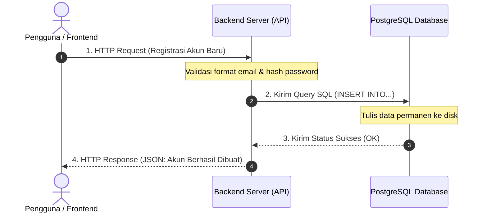

# 01 - BAB 01 PERAN DATABASE DI ARSITEKTUR BACKEND

Status: DRAFT
Rak: PostgreSQL untuk Aplikasi
Buku: PostgreSQL dalam Backend Application
Level: Level 3 - Level 4
Tipe Materi: Tutorial
Target: Backend Developer yang menghubungkan aplikasi ke PostgreSQL.
Estimasi Baca: 10 Menit
Terakhir Diperiksa: 2026-05-17

Sumber Utama: PostgreSQL Official Documentation
Versi Referensi: PostgreSQL docs/current
Status Verifikasi Sumber: REVIEW

---

## 1. Tujuan Belajar
Di akhir bab ini, pembaca diharapkan mampu:
- Memahami posisi dan peran penting database PostgreSQL di dalam arsitektur aplikasi tiga lapis (*three-tier architecture*).
- Menjelaskan mengapa backend membutuhkan PostgreSQL untuk menyimpan *state* atau kondisi aplikasi secara persisten.
- Memahami alur perjalanan data dari frontend, diproses oleh backend API, hingga disimpan di dalam PostgreSQL.
- Menyadari peran bahasa query (SQL) sebagai jembatan komunikasi antara logika backend dengan persistence layer.

## 2. Prasyarat
- Memahami konsep dasar database, DBMS, tabel, dan kolom (baca: [Apa Itu PostgreSQL](../../01-orientasi-sejarah-dan-fondasi-postgresql/buku-01-orientasi-postgresql/bab-01-apa-itu-postgresql.md)).
- Memahami perintah SQL dasar pembacaan data (baca: [Struktur Perintah SELECT](../../02-sql-dan-querying/buku-01-dasar-sql-dan-query-select/bab-01-struktur-perintah-select.md)).
- Memiliki gambaran umum mengenai apa itu backend/API (mengetahui bahwa backend adalah kode program yang berjalan di server untuk melayani permintaan frontend).

## 3. Ringkasan Cepat
Dalam arsitektur software modern, PostgreSQL berperan sebagai **Persistence Layer** (lapisan penyimpanan permanen) atau "gudang ingatan utama". Aplikasi backend bertindak sebagai otak logika bisnis yang memproses permintaan pengguna, memvalidasi aturan operasional, dan berkomunikasi dengan PostgreSQL menggunakan perintah SQL untuk menulis atau membaca memori data permanen tersebut agar tidak hilang saat server backend dimatikan.

## 4. Istilah Penting di Bab Ini

| Istilah | Arti Singkat |
|---|---|
| State | Kondisi data aktif dari suatu aplikasi pada satu waktu tertentu. |
| Persistence | Kemampuan data untuk tetap tersimpan secara aman dan permanen meskipun aplikasi dimatikan atau server mati listrik. |
| API | Application Programming Interface; jembatan penghubung komunikasi data antar sistem. |
| Frontend / Client | Lapisan antarmuka pengguna yang berinteraksi langsung dengan user (web browser, mobile app). |
| Backend Server | Server tempat berjalannya logika bisnis aplikasi, validasi keamanan, dan pengolahan data utama. |
| Persistence Layer | Lapisan khusus dalam arsitektur aplikasi yang didedikasikan untuk mengurus penyimpanan data permanen (database). |
| libpq | Library antarmuka pemrograman C resmi dari PostgreSQL yang mendasari driver komunikasi database di berbagai bahasa pemrograman. |

## 5. Analogi Sehari-hari
Bayangkan Anda sedang mengunjungi sebuah **Restoran Mewah**:
- **Frontend (Tampilan Aplikasi)** adalah *meja makan bersih dan buku menu indah* yang Anda lihat di depan. Ini adalah area tempat Anda duduk, membaca menu, dan memilih pesanan.
- **Backend (Server Logika)** adalah *pelayan restoran dan dapur tempat memasak*. Pelayan bertugas mencatat pesanan Anda, memvalidasi ke dapur apakah bahan menu tersebut tersedia, lalu meminta koki memasak makanan mengikuti aturan resep masakan restoran.
- **PostgreSQL (Database)** adalah *gudang persediaan bahan makanan utama dan buku catatan resep/keuangan raksasa di belakang gedung*.
  *   Pelayan tidak bisa memasak tanpa mengambil bahan baku dari gudang penyimpanan.
  *   Juru masak harus memeriksa buku catatan gudang untuk mengetahui ketersediaan stok bahan.
  *   Setelah Anda selesai makan dan membayar, pelayan akan mencatat transaksi tersebut di dalam buku catatan keuangan utama di gudang agar tidak hilang dan bisa dihitung besok pagi.

## 6. Batas Analogi
Di restoran fisik, pelayan harus berjalan kaki secara manual ke gudang belakang untuk mengambil bahan, yang memakan waktu menit dan rentan human error. 

Di dalam sistem backend digital, komunikasi antara server backend dan database PostgreSQL terjadi dalam hitungan milidetik melalui jaringan komputer lokal atau cloud dengan protokol TCP/IP berkecepatan tinggi. Selain itu, bahan makanan fisik di gudang restoran bisa membusuk, rusak, atau habis. Sedangkan data digital di PostgreSQL dapat disimpan selamanya tanpa penurunan kualitas fisik, selama media hard disk/SSD server berfungsi dengan baik dan dirawat dengan sistem backup berkala.

## 7. Ilustrasi Konsep

Status Ilustrasi: DRAFT



## 8. Penjelasan Ilustrasi
Bagan di atas menggambarkan urutan perjalanan pendaftaran akun baru:
1. Pengguna mengisi formulir di frontend (HP/Browser) lalu mengirimkannya sebagai *HTTP Request* ke **Backend Server (API)**.
2. Backend menerima request, melakukan validasi bisnis (seperti memastikan email belum terdaftar dan mengenkripsi password), kemudian menerjemahkan logika pendaftaran tersebut menjadi kueri SQL (`INSERT`) dan mengirimkannya ke **PostgreSQL**.
3. **PostgreSQL** memproses kueri SQL tersebut, menyimpan data akun baru secara permanen di disk, lalu mengirim balik status sukses ke backend.
4. Backend menerima konfirmasi sukses dari database, lalu menyusun respons JSON yang rapi untuk dikirim kembali ke **Frontend/Pengguna**.

## 9. Batas Ilustrasi
Diagram urutan di atas sangat disederhanakan untuk tingkat pemula. Proses sesungguhnya di belakang layar melibatkan manajemen *connection pooling* (antrean koneksi database), penanganan transaksi aman (*transaction handling*), enkripsi SSL/TLS selama pengiriman kueri lewat jaringan, serta kemungkinan kegagalan koneksi (*handling connection database timeout*) yang tidak diperlihatkan di bagan sederhana ini.

## 10. Konsep Inti
### Mengapa Database Dibutuhkan? (Stateless vs Stateful)
Mengapa kita tidak menyimpan data pengguna langsung di memori program backend saja?
- **Stateless Backend**: Server backend modern umumnya dirancang tanpa menyimpan status data aktif pengguna (*stateless*) di memorinya sendiri. Tujuannya adalah agar ketika aplikasi Anda mendadak ramai, Anda dapat dengan mudah menduplikasi server backend tersebut menjadi 10 server sekaligus di belakang load balancer tanpa pusing memikirkan data user tersimpan di server backend mana.
- **Stateful Database**: Karena backend bersifat stateless, ia membutuhkan sistem eksternal yang tangguh dan andal untuk menyimpan *state* (kondisi data) secara terpusat dan permanen (*stateful*). Di sinilah peran penting **PostgreSQL** sebagai *Persistence Layer* tunggal yang diandalkan oleh seluruh replika server backend Anda.

## 11. Penjelasan Detail
### Cara Backend Berkomunikasi dengan PostgreSQL: Protokol dan `libpq`
Bagaimana kode program backend (seperti JavaScript, Python, Go, Java) dapat dipahami oleh mesin PostgreSQL?
1. **Client Interfaces & Driver**: Setiap bahasa pemrograman memiliki library khusus yang disebut driver database (misalnya driver `pg` pada Node.js, `psycopg2` pada Python, atau `pq` pada Go).
2. **Peran `libpq`**: Di tingkat sistem operasi terdalam, PostgreSQL menyediakan sebuah library resmi C bernama `libpq`. Library `libpq` adalah mesin protokol komunikasi client resmi yang mengerti bagaimana cara membuka koneksi socket TCP/IP ke server database, mengirimkan kueri SQL, menangani enkripsi, dan mengembalikan format hasil kueri (*result set*) kepada program pemanggil. Hampir sebagian besar driver database di berbagai bahasa pemrograman backend modern dibungkus (*wrapper*) atau mereplikasi protokol yang didefinisikan oleh `libpq` ini agar dapat berinteraksi secara aman dengan server PostgreSQL.

## 12. Contoh SQL Dasar
Berikut adalah kueri SQL dasar yang dikirimkan oleh backend API saat melayani request pengguna:

```sql
-- 1. Mengambil data hashed password untuk validasi saat user login
SELECT id, email, password_hash 
FROM pengguna 
WHERE email = 'budi@email.com';

-- 2. Menulis data keranjang belanja baru milik pengguna ke database
INSERT INTO keranjang_belanja (pengguna_id, produk_id, jumlah) 
VALUES (1, 10, 2);
```

## 13. Contoh SQL Praktik Project
Dalam skenario transaksi keuangan atau checkout toko online, backend mengirimkan kueri update stok dengan validasi ketat agar stok tidak pernah minus akibat transaksi bersamaan (*race condition*):

```sql
-- Mengurangi stok produk di database secara konsisten hanya jika stok mencukupi
UPDATE produk 
SET stok = stok - 1 
WHERE produk_id = 15 AND stok > 0;
```

## 14. Kesalahan Umum
- **Menyimpan State Penting di RAM Backend**: Menyimpan data login pengguna aktif hanya dalam variabel array global di memori backend. Saat server backend di-restart untuk update kode, seluruh data login pengguna akan hilang seketika karena RAM backend bersifat volatil. Gunakan database persisten seperti PostgreSQL.
- **Frontend Langsung Konek ke Database**: Menghubungkan aplikasi Mobile (Android/iOS) atau Website Frontend secara langsung ke PostgreSQL tanpa perantara backend API. Ini adalah pelanggaran keamanan yang sangat fatal karena kredensial database utama terekspos ke publik dan rentan disalahgunakan oleh pihak luar untuk merusak data.

## 15. Catatan Interview
- **Pertanyaan**: "Mengapa arsitektur three-tier (Frontend -> Backend -> Database) menjadi standar industri, alih-alih Frontend langsung terhubung ke Database?"
- **Jawaban**: "Ada dua alasan utama: Keamanan dan Kontrol Bisnis. Pertama, keamanan kredensial; jika frontend langsung konek ke database, kredensial database harus disimpan di client, yang sangat mudah diekstraksi oleh hacker. Kedua, kontrol logika; backend bertindak sebagai gerbang tunggal yang memvalidasi data, melakukan otorisasi (siapa boleh mengakses apa), mengamankan SQL injection, dan menjalankan aturan bisnis (business logic) sebelum data diizinkan masuk ke database."

## 16. Catatan Diskusi User
- **Pertanyaan Umum**: "Apakah kita harus memahami C atau C++ untuk menggunakan library `libpq` di backend?"
- **Diskusikan**: Tidak perlu. Pustaka driver di bahasa pemrograman modern (seperti Node.js, Python, Go) sudah menyediakan abstraksi tingkat tinggi yang sangat mudah digunakan. Kita cukup menulis fungsi JavaScript atau Python sederhana. Namun, memahami bahwa di balik layar driver tersebut mengandalkan standar protokol `libpq` membantu kita memahami pesan error tingkat rendah, konfigurasi koneksi jaringan, dan performa komunikasi client-server database secara lebih mendalam saat debugging.

## 17. Latihan Kecil
1. Gambarkan secara mandiri diagram alur perjalanan data dari klik tombol "Bayar" di aplikasi HP Anda hingga saldo berkurang di database PostgreSQL!
2. Jelaskan bahaya keamanan apa saja yang akan timbul jika sebuah sistem tidak menggunakan lapisan Backend API sebagai perantara database!

## 18. Checklist Pemahaman
- [ ] Memahami posisi database PostgreSQL dalam arsitektur aplikasi tiga lapis (*three-tier*).
- [ ] Mampu membedakan peran *stateless* pada backend server dan *stateful* pada database.
- [ ] Mengetahui alur request-response data dari frontend hingga persistence layer.
- [ ] Mengenal fungsi utama library `libpq` dalam menjembatani komunikasi client-server PostgreSQL.

## 19. Hubungan dengan Materi Lain

### Posisi Materi
- Rak: [04 - PostgreSQL untuk Aplikasi](../../README.md)
- Buku: [PostgreSQL dalam Backend Application](../)

### Prasyarat
- [Apa Itu PostgreSQL](../../01-orientasi-sejarah-dan-fondasi-postgresql/buku-01-orientasi-postgresql/bab-01-apa-itu-postgresql.md)

### Materi Sebelumnya
- [Check dan Unique Constraint](../../03-desain-data-dan-schema/buku-02-primary-key-foreign-key-dan-constraint/bab-03-check-dan-unique-constraint.md)

### Materi Berikutnya
- [Database Driver dan Connection Pooling](./bab-02-database-driver-dan-connection-pooling.md)

### Materi Terkait
- [Administrasi DBA dan Operasional](../../08-administrasi-dba-dan-operasional/)

### Istilah Terkait
- Three-Tier Architecture, Stateless, Stateful, Persistence Layer, libpq, Connection Driver.

## 20. Referensi Resmi
Jangan membuka tautan berikut pada batch ini, cukup cantumkan sebagai referensi resmi yang ditargetkan untuk verifikasi nanti:
- PostgreSQL Official Documentation - Client Interfaces
  https://www.postgresql.org/docs/current/client-interfaces.html
- PostgreSQL Official Documentation - libpq
  https://www.postgresql.org/docs/current/libpq.html

## 21. Catatan Pribadi / Project Notes
*   *Catatan Draft*: Penyusunan materi ini sengaja menghindari penulisan framework atau bahasa backend tertentu (seperti Express, Django, Go Fiber) agar ilmunya bersifat universal untuk segala jenis developer backend. Fokus pada pemahaman mental model *stateless vs stateful* dan fungsi protokol `libpq` tingkat rendah. Status verifikasi diatur ke REVIEW.
