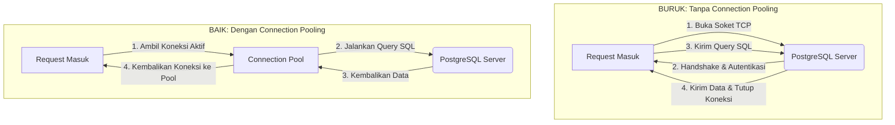

# 02 - BAB 02 DATABASE DRIVER DAN CONNECTION POOLING

Status: DRAFT
Rak: PostgreSQL untuk Aplikasi
Buku: PostgreSQL dalam Backend Application
Level: Level 3 - Level 4
Tipe Materi: Tutorial
Target: Backend Developer yang menghubungkan aplikasi ke PostgreSQL.
Estimasi Baca: 10 Menit
Terakhir Diperiksa: 2026-05-17

Sumber Utama: PostgreSQL Official Documentation
Versi Referensi: PostgreSQL docs/current
Status Verifikasi Sumber: REVIEW

---

## 1. Tujuan Belajar
Di akhir bab ini, pembaca diharapkan mampu:
- Memahami peran Database Driver sebagai perantara dan penerjemah antara kode bahasa pemrograman dengan PostgreSQL.
- Menjelaskan proses terbentuknya sebuah koneksi database (TCP/IP handshake dan autentikasi).
- Memahami konsep Connection Pooling dan alasan mengapa pembukaan koneksi baru secara berulang sangat mahal secara komputasi.
- Menjelaskan bagaimana connection pooling meningkatkan performa aplikasi backend secara signifikan pada trafik tinggi.

## 2. Prasyarat
- Memahami peran database dalam arsitektur backend tiga lapis (baca: [Peran Database di Arsitektur Backend](./bab-01-peran-database-di-arsitektur-backend.md)).
- Mengetahui bahwa database beroperasi dalam protokol client-server melalui jaringan komputer.

## 3. Ringkasan Cepat
Aplikasi backend tidak bisa "berbicara" langsung ke database karena perbedaan bahasa komunikasi. **Database Driver** bertindak sebagai "mesin penerjemah" resmi yang mengubah instruksi bahasa program (Node.js, Go, Python, dll.) menjadi protokol native PostgreSQL. Selanjutnya, untuk menghindari penurunan performa akibat pembukaan jalur komunikasi baru secara berulang-ulang setiap kali ada pengguna mengakses aplikasi, kita menggunakan **Connection Pooling**—sebuah wadah yang menyimpan sekumpulan koneksi aktif siap pakai agar respons aplikasi tetap secepat kilat.

## 4. Istilah Penting di Bab Ini

| Istilah | Arti Singkat |
|---|---|
| Database Driver | Pustaka software (library) yang menerjemahkan kode bahasa pemrograman backend ke protokol database native. |
| Connection | Jalur komunikasi aktif berbasis soket jaringan (TCP/IP) antara backend server dan database server. |
| Overhead | Penggunaan sumber daya komputer tambahan (waktu, CPU, RAM) yang tidak perlu dalam melakukan operasi teknis. |
| Connection Pooling | Teknik menjaga sekumpulan koneksi database tetap aktif di memori agar bisa dipakai berulang kali tanpa membuat koneksi baru dari nol. |
| Handshake | Proses awal pertukaran informasi otentikasi dan penyelarasan protokol untuk menyetujui pembukaan koneksi jaringan. |

## 5. Analogi Sehari-hari
Bayangkan Anda berkunjung ke sebuah **Bank Besar (Database Server)** untuk melakukan transaksi bisnis:
- **Database Driver** adalah **Penerjemah Bahasa Resmi** yang Anda sewa karena teller bank hanya berbicara bahasa asing kuno (Protokol native PostgreSQL) sedangkan Anda hanya bisa berbicara bahasa Indonesia (Node.js/Go).
- **Connection** adalah **Proses Mengantre dari Nol**: Setiap kali Anda ingin bertransaksi, Anda harus datang menemui satpam bank, mengambil nomor antrean baru, menunggu dipanggil, menunjukkan KTP asli, memverifikasi tanda tangan, hingga akhirnya diperbolehkan berbicara dengan teller. Setelah transaksi selesai dalam 5 detik, Anda langsung pulang. Jika 2 menit kemudian Anda butuh bertransaksi lagi, Anda harus mengulang seluruh proses antrean rumit itu dari awal. Sangat membuang waktu dan melelahkan, bukan?
- **Connection Pooling** adalah **Sewa Jalur Khusus dengan Staf VIP Tetap (Pool)**: Kantor Anda menyewa 5 staf perantara yang berdiri terus-menerus di depan meja teller bank (koneksi aktif yang terus terbuka). Ketika Anda butuh bertransaksi, Anda cukup memberikan berkas ke salah satu staf VIP tersebut yang posisinya sudah berada di depan teller. Transaksi selesai instan dalam milidetik tanpa perlu mengantre dari pintu satpam lagi. Setelah selesai, staf VIP tersebut tidak pulang ke rumah, melainkan tetap berdiri di depan meja teller menunggu tugas transaksi Anda berikutnya.

## 6. Batas Analogi
Di dunia nyata, mempekerjakan 5 staf VIP berdiri seharian di depan meja bank sangat memboroskan biaya gaji manusia secara fisik dan membuat lobi bank terlihat penuh sesak. 

Di dalam sistem PostgreSQL digital, membiarkan beberapa koneksi database tetap aktif (*idle connection*) di dalam pool justru sangat efisien. Langkah ini menghemat pemakaian CPU database server dari beban penanganan jabat tangan (*handshake*) TCP/IP berulang-ulang, serta sangat menghemat waktu tunggu (*latency*) respons aplikasi backend Anda hingga berkali-kali lipat.

## 7. Ilustrasi Konsep

Status Ilustrasi: DRAFT



## 8. Penjelasan Ilustrasi
Diagram di atas membandingkan dua pendekatan koneksi. Skenario tanpa pooling (atas) menggambarkan alur yang lambat; setiap ada request HTTP masuk terpaksa melewati fase pembukaan soket TCP dan autentikasi dari nol yang lambat sebelum bisa mengirim query, lalu koneksi ditutup kembali secara fisik. Skenario dengan pooling (bawah) menggambarkan alur yang sangat cepat; backend cukup mengambil koneksi aktif yang sudah *ready* di pool, mengeksekusi kueri secara instan ke PostgreSQL, dan mengembalikan koneksi tersebut ke pool untuk digunakan request berikutnya tanpa memutus soket fisik jaringan.

## 9. Batas Ilustrasi
Ilustrasi ini menyederhanakan arsitektur pool demi kemudahan visual. Di dunia nyata, sistem connection pooling memiliki parameter dinamis tambahan seperti batas maksimum koneksi aktif (*maximum connections*), batas waktu tunggu antrean koneksi (*connection timeout*), dan pembersihan otomatis koneksi yang sudah terlalu lama tidak bekerja (*idle timeout*).

## 10. Konsep Inti
### Mengapa Buka Koneksi Baru Sangat Mahal?
Proses membuka satu koneksi baru secara fisik ke PostgreSQL membutuhkan langkah-langkah berat:
1.  **TCP/IP Handshake**: Pembentukan jalur soket jaringan antar server.
2.  **Negosiasi Keamanan**: Proses jabat tangan SSL/TLS untuk enkripsi data jaringan.
3.  **Proses Autentikasi**: Verifikasi kecocokan username, password, dan hak akses skema database.
4.  **Alokasi Resource Server**: PostgreSQL harus membuat *process* background baru (melalui fork process) dan mengalokasikan memori RAM khusus untuk melayani koneksi tersebut.

Jika aplikasi backend Anda melayani 500 request per detik dan membuka-tutup koneksi baru untuk setiap request, database server akan mati kelumpuhan akibat beban CPU untuk proses pembukaan koneksi tersebut, meskipun query SQL yang dijalankan sangat sederhana.

## 11. Penjelasan Detail
### Bagaimana Connection Pooling Menyelesaikan Masalah?
Connection pooling bertindak sebagai manajer koneksi database di backend:
- Saat backend pertama kali dinyalakan, pool membuka sejumlah koneksi aktif (misal 10 koneksi) dan menjaganya tetap aktif (*keep-alive*).
- Saat ada kueri SQL yang ingin dijalankan, backend meminta izin ke pool untuk meminjam (*checkout*) salah satu koneksi aktif tersebut.
- Kueri dijalankan lewat koneksi tersebut secara instan tanpa proses handshake lagi.
- Setelah kueri selesai dan datanya didapatkan, koneksi langsung dikembalikan (*checkin*) ke dalam pool agar siap dipinjam oleh request HTTP berikutnya. Jalur fisik ke PostgreSQL tidak pernah diputus.

## 12. Contoh SQL Dasar
Berikut adalah kueri administratif yang sering digunakan oleh database administrator (DBA) atau developer backend untuk memantau status koneksi aktif yang sedang terhubung ke PostgreSQL:

```sql
-- Memantau jumlah koneksi aktif dan statusnya ke PostgreSQL
SELECT count(*), state 
FROM pg_stat_activity 
GROUP BY state;
```

## 13. Contoh SQL Praktik Project
Meskipun dalam kode program nyata (seperti Node.js atau Go) kita menggunakan fungsi bawaan library driver, secara konseptual kueri yang dijalankan backend melalui perantara pool koneksi tetaplah kueri SQL standar:

```sql
-- Query sederhana yang dieksekusi secara instan memanfaatkan koneksi dari pool
SELECT nama_produk, harga 
FROM produk 
WHERE produk_id = 12;
```

## 14. Kesalahan Umum
- **Lupa Menggunakan Connection Pooling**: Membuat koneksi database baru untuk setiap kali endpoint API dipanggil. Hal ini akan memicu error fatal di PostgreSQL: `ERROR: remaining connection slots are reserved for non-replication superuser connections` karena jatah slot koneksi server habis terbakar dalam hitungan detik.
- **Menyetel Pool Size Terlalu Besar**: Mengira semakin besar ukuran pool (misal menyetel 500 koneksi) akan membuat sistem semakin cepat. Padahal, menyetel pool terlalu besar justru merusak performa database karena server PostgreSQL terpaksa melakukan perpindahan tugas CPU (*context switching*) yang sangat berlebihan untuk melayani terlalu banyak koneksi aktif yang berebut resource.

## 15. Catatan Interview
- **Pertanyaan**: "Mengapa membuka dan menutup koneksi database secara langsung pada setiap request HTTP dikategorikan sebagai bencana performa aplikasi backend?"
- **Jawaban**: "Karena proses pembuatan koneksi fisik baru melibatkan overhead jaringan dan komputasi yang sangat mahal: TCP/IP handshake, negosiasi keamanan SSL/TLS, otentikasi kredensial pengguna, serta alokasi memori RAM khusus di server PostgreSQL. Mengulang proses ini pada setiap request HTTP akan membuang waktu tunggu (menaikkan latency) secara signifikan dan membebani kerja CPU database server secara ekstrem. Solusi terbaiknya adalah menerapkan Connection Pooling untuk menjaga koneksi tetap aktif dan siap digunakan kembali."

## 16. Catatan Diskusi User
- **Pertanyaan Umum**: "Berapa ukuran connection pool (*pool size*) ideal untuk aplikasi backend saya?"
- **Diskusikan**: Menentukan ukuran pool yang tepat bukanlah dengan menebak angka besar secara acak. Secara konsep, ukuran pool ideal bergantung pada jumlah core CPU yang dimiliki server database dan kecepatan operasi baca-tulis media penyimpanan (disk). Seringkali, pool berukuran kecil (seperti 10-20 koneksi aktif) justru bekerja jauh lebih cepat dibanding pool berukuran 100 koneksi karena meminimalkan antrean switching CPU di server PostgreSQL.

## 17. Latihan Kecil
1. Jelaskan dengan pemahaman Anda sendiri mengapa connection pooling dapat membuat waktu respons API backend menjadi jauh lebih cepat!
2. Apa akibat buruknya jika kita membiarkan aplikasi backend meminjam koneksi dari pool tetapi lupa mengembalikannya (*connection leak*) setelah kueri selesai dijalankan?

## 18. Checklist Pemahaman
- [ ] Memahami peran utama database driver sebagai penerjemah bahasa backend ke bahasa native database.
- [ ] Mampu menerangkan proses overhead yang terjadi saat pembuatan koneksi database baru secara fisik.
- [ ] Mengetahui cara kerja connection pooling dalam meminjamkan dan mengembalikan koneksi secara dinamis.
- [ ] Memahami bahaya kesalahan setup ukuran pool yang terlalu besar bagi kesehatan server database.

## 19. Hubungan dengan Materi Lain

### Posisi Materi
- Rak: [04 - PostgreSQL untuk Aplikasi](../../README.md)
- Buku: [PostgreSQL dalam Backend Application](../)

### Prasyarat
- [Peran Database di Arsitektur Backend](./bab-01-peran-database-di-arsitektur-backend.md)

### Materi Sebelumnya
- [Peran Database di Arsitektur Backend](./bab-01-peran-database-di-arsitektur-backend.md)

### Materi Berikutnya
- [Keamanan Koneksi Database](./bab-03-keamanan-koneksi-database.md)

### Materi Terkait
- [Administrasi DBA dan Operasional](../../08-administrasi-dba-dan-operasional/)
- [Troubleshooting dan Debugging](../../12-troubleshooting-dan-debugging/)

### Istilah Terkait
- Driver, Active Connection, TCP/IP Handshake, Connection Pooling, Max Pool Size, Latency.

## 20. Referensi Resmi
Jangan membuka tautan berikut pada batch ini, cukup cantumkan sebagai referensi resmi yang ditargetkan untuk verifikasi nanti:
- PostgreSQL Official Documentation - Client Interfaces
  https://www.postgresql.org/docs/current/client-interfaces.html
- PostgreSQL Official Documentation - libpq
  https://www.postgresql.org/docs/current/libpq.html

## 21. Catatan Pribadi / Project Notes
*   *Catatan Draft*: Penjelasan connection pooling diatur agar sangat konseptual tanpa terikat sintaks library tertentu (seperti `pg` Node.js atau `pgx` Go) demi menjaga keawetan ilmu. Penggunaan analogi staf VIP bank ditekankan agar konsep "hemat antrean" langsung melekat di benak pembaca. Status verifikasi diatur ke REVIEW.
