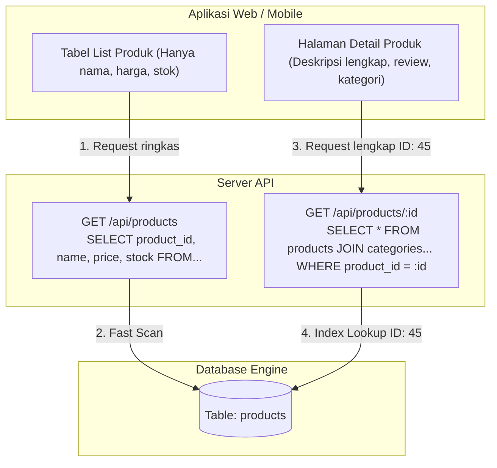

# 04 - BAB 04 QUERY UNTUK LIST DAN DETAIL DATA APLIKASI

Status: DRAFT
Rak: PostgreSQL untuk Aplikasi
Buku: PostgreSQL dalam Backend Application
Level: Level 3 - Level 4
Tipe Materi: Tutorial
Target: Backend Developer yang menghubungkan aplikasi ke PostgreSQL.
Estimasi Baca: 12 Menit
Terakhir Diperiksa: 2026-05-18

Sumber Utama: PostgreSQL Official Documentation
Versi Referensi: PostgreSQL docs/current
Status Verifikasi Sumber: REVIEW

---

## 1. Tujuan Belajar
Di akhir bab ini, pembaca diharapkan mampu:
- Menjelaskan korelasi langsung antara kueri SQL dengan pembentukan respon endpoint API (List dan Detail).
- Membedakan kebutuhan arsitektur dan efisiensi kueri list data dengan kueri detail data.
- Menjelaskan bahaya performa memanggil `SELECT *` pada endpoint list data dalam aplikasi skala produksi.
- Menuliskan kueri SQL list dan detail menggunakan PostgreSQL, baik kueri tabel tunggal maupun kueri relasional memanfaatkan `INNER JOIN`.
- Menjelaskan konsep penanganan data kosong (*data not found*) saat aplikasi mengeksekusi kueri detail.

## 2. Prasyarat
- Memahami dasar kueri SELECT dan alias (baca: [Alias Kolom dan Tabel](../../02-sql-dan-querying/buku-01-dasar-sql-dan-query-select/bab-03-alias-kolom-dan-tabel.md)).
- Memahami konsep dasar relasi antar tabel (baca: [Konsep Relasi Antar Tabel](../../02-sql-dan-querying/buku-03-join-dan-relasi-query/bab-01-konsep-relasi-antar-tabel.md)).

## 3. Ringkasan Cepat
Di dalam pengembangan aplikasi modern, sebagian besar fungsionalitas backend berputar pada dua pola akses data utama: **List (Daftar Banyak Data)** dan **Detail (Satu Data Lengkap)**. Kueri **List** dirancang untuk performa tinggi dengan membatasi jumlah kolom (*underfetching prevention*) dan mengurutkan baris secara efisien untuk antarmuka tabel web/ponsel. Sebaliknya, kueri **Detail** dirancang untuk presisi tinggi menggunakan filter primary key unik (`WHERE id = ...`) dan sering kali menggabungkan banyak tabel pendukung via `JOIN` untuk menampilkan informasi komprehensif satu baris entitas.

## 4. Istilah Penting di Bab Ini

| Istilah | Arti Singkat |
|---|---|
| Overfetching | Kondisi di mana aplikasi meminta kolom/data lebih banyak daripada yang sebenarnya dibutuhkan oleh UI. |
| Underfetching | Kondisi di mana data yang diminta kurang, memicu backend memanggil query tambahan secara beruntun. |
| SELECT * (Star Query) | Sintaksis SQL untuk menarik seluruh kolom dari suatu tabel (sebaiknya dihindari pada endpoint list). |
| Primary Key Lookup | Operasi pencarian super cepat di PostgreSQL memanfaatkan indeks unik kolom primary key. |
| Zero Rows Returned | Kondisi di mana kueri SQL sukses dieksekusi tetapi mengembalikan 0 baris (data tidak ditemukan). |

## 5. Analogi Sehari-hari
Bayangkan Anda sedang mengunjungi **Toko Buku Fisik yang Besar (Sistem Database)**:
- **Query List Data** adalah tindakan Anda membaca **Buku Katalog Ringkas** yang digantung di depan pintu toko. Di buku katalog tersebut, Anda hanya melihat judul buku, nama penulis, dan harga saja (kolom terbatas) untuk ratusan buku secara cepat (baris berurutan). Informasi tebal buku, bab isi, berat buku, dan ulasan pelanggan disembunyikan agar katalog tetap ringan dibaca.
- **Query Detail Data** adalah tindakan Anda **mengambil satu buku spesifik dari rak**, membawa buku itu ke kursi baca, lalu membuka seluruh halaman bukunya dari lembar pertama hingga akhir. Anda membaca sinopsis lengkap, ulasan di cover belakang, riwayat hidup penulis, hingga detail percetakan (membuka seluruh kolom data satu baris spesifik).

## 6. Batas Analogi
Di perpustakaan fisik, buku katalog ringkas dicetak secara manual oleh manusia dan diletakkan secara terpisah. Di PostgreSQL, katalog ringkas (list) dan buku tebal (detail) ditarik dari tabel fisik yang sama secara dinamis. Bedanya hanya terletak pada seberapa disiplin backend developer menuliskan daftar kolom di klausa `SELECT` kueri SQL mereka.

## 7. Ilustrasi Konsep

Status Ilustrasi: DRAFT



## 8. Penjelasan Ilustrasi
Bagan di atas menunjukkan pemisahan alur antara request list dengan request detail dari antarmuka pengguna (*Client UI*) hingga ke PostgreSQL. Request list memanggil API list yang mengeksekusi kueri cepat dengan kolom terbatas. Request detail memanggil API detail berdasarkan ID spesifik, mengeksekusi kueri lookup yang mengembalikan informasi lengkap entitas tersebut melalui join relasional.

## 9. Batas Ilustrasi
Bagan di atas menggambarkan kueri detail menggunakan `SELECT *`. Di dunia nyata, meskipun query detail menarik informasi lengkap, kita tetap direkomendasikan menuliskan kolom secara eksplisit (daripada menggunakan wildcard `*`) untuk menjamin kestabilan integrasi aplikasi jika di masa depan ada kolom bertipe data raksasa (seperti `BYTEA` untuk gambar) yang sengaja ditambahkan ke tabel tersebut.

---

## 10. Konsep Inti

### Mengapa SELECT * Harus Dihindari pada Kueri List?
1. **Network Overhead (Pemborosan Jaringan)**: Jika tabel `products` memiliki kolom `description` bertipe `TEXT` yang memuat ribuan kata, menarik kolom tersebut untuk 100 baris list produk akan membebani bandwidth jaringan antara server database dengan server aplikasi backend.
2. **Memory Bloat (Pemborosan Memori)**: Server aplikasi (Node.js/Go/Python) terpaksa mengalokasikan memori RAM raksasa untuk memproses data teks panjang yang pada akhirnya dibuang oleh UI karena halaman list hanya menampilkan nama dan harga.
3. **Database Disk I/O**: PostgreSQL terpaksa membaca halaman penyimpanan sekunder di piringan disk untuk menarik kolom raksasa, memperlambat kecepatan eksekusi query secara keseluruhan.

### Karakteristik Kueri Detail
Kueri detail memiliki karakteristik unik:
- **Tepat Satu Baris**: Menggunakan filter primary key (`WHERE product_id = 45`). Pencarian ini biasanya sangat efisien karena primary key memiliki index unik bawaan di PostgreSQL.
- **Kaya Informasi (Rich Data)**: Biasanya menggabungkan tabel master dengan tabel relasi (misalnya order detail membutuhkan join ke user, order items, dan product).

---

## 11. Penjelasan Detail

### Penanganan Kasus Data Tidak Ditemukan (Data Not Found)
Ketika aplikasi melakukan kueri detail (`SELECT ... WHERE id = 999`), ada kemungkinan ID tersebut tidak ada di database. 
- **Di Tingkat SQL**: PostgreSQL akan mengembalikan set data dengan **0 baris** (*empty set*). Ini bukan error SQL. Kueri sukses, namun datanya kosong.
- **Di Tingkat Backend**: Backend developer wajib mendeteksi kondisi kosong ini. Jika baris hasil = 0, backend harus segera melempar respon HTTP Status **404 Not Found** ke client, bukan mengirimkan objek kosong `{}` atau nilai `null` berstatus HTTP 200 OK.

---

## 12. Contoh SQL Dasar
Simulasi kueri list ringkas dan detail presisi pada tabel produk tunggal di PostgreSQL:

```sql
-- [SKENARIO 1: QUERY LIST UNTUK ENDPOINT /api/products]
-- Mengambil daftar produk ringkas untuk kebutuhan halaman katalog awal.
-- Kolom deskripsi produk disembunyikan agar respons cepat.
SELECT 
    product_id, 
    product_name, 
    price, 
    stock 
FROM products
ORDER BY product_name ASC;


-- [SKENARIO 2: QUERY DETAIL UNTUK ENDPOINT /api/products/42]
-- Mengambil seluruh informasi produk secara spesifik berdasarkan ID produk.
-- Kolom deskripsi lengkap dimunculkan karena user sudah klik halaman detail.
SELECT 
    product_id, 
    product_name, 
    price, 
    stock, 
    description, 
    created_at 
FROM products
WHERE product_id = 42;
```

---

## 13. Contoh SQL Praktik Project
Dalam skenario transaksi riil, kueri detail sering kali memerlukan penggabungan relasional yang kompleks menggunakan `INNER JOIN` atau `LEFT JOIN` agar informasi detail pesanan tampil utuh beserta nama pembeli dan item belanjaannya:

```sql
-- [SKENARIO 3: QUERY DETAIL PESANAN KOMPREHENSIF UNTUK ENDPOINT /api/orders/105]
-- Menampilkan detail pesanan, nama pembeli, daftar produk yang dibeli, jumlah, dan subtotal.
SELECT 
    o.order_id,
    o.order_date,
    o.status AS order_status,
    u.username AS customer_name,
    u.email AS customer_email,
    oi.quantity,
    oi.price_at_purchase,
    (oi.quantity * oi.price_at_purchase) AS subtotal,
    p.product_name
FROM orders o
INNER JOIN users u ON o.user_id = u.user_id
INNER JOIN order_items oi ON o.order_id = oi.order_id
INNER JOIN products p ON oi.product_id = p.product_id
WHERE o.order_id = 105;
```

---

## 14. Kesalahan Umum
- **Menggunakan SELECT * di Semua Tempat**: Kemalasan menulis kolom satu per satu sehingga menggunakan wildcard `SELECT *` baik di kueri list maupun detail.
- **Melakukan Filter List di Memori Aplikasi (Backend)**: Menarik seluruh data tabel dari database (`SELECT * FROM products`) ke server backend, lalu menyaringnya menggunakan Javascript `Array.filter()` di backend. Hal ini akan melumpuhkan server ketika database memuat ribuan baris data. Penyaringan wajib dilakukan di database menggunakan klausa `WHERE`.
- **Tidak Memasang Klausa ORDER BY pada Kueri List**: Mengasumsikan PostgreSQL akan mengembalikan list data dalam urutan yang sama setiap kali kueri dijalankan. Tanpa `ORDER BY`, urutan baris bersifat tidak teratur (*non-deterministic*) tergantung pada bagaimana PostgreSQL menulis halaman memori disk fisiknya.

---

## 15. Catatan Interview
- **Pertanyaan**: "Mengapa kita sebaiknya menghindari kueri `SELECT *` untuk fitur halaman daftar (list data) di aplikasi kita?"
- **Jawaban**: "Karena penggunaan `SELECT *` memicu masalah *overfetching*, di mana kolom-kolom besar yang tidak dibutuhkan oleh antarmuka list (seperti teks deskripsi panjang atau log riwayat) ikut ditarik. Hal ini menyebabkan pemborosan bandwidth jaringan antara database dan backend, membebani alokasi RAM server aplikasi, serta memaksa mesin PostgreSQL melakukan operasi pembacaan disk (I/O) ekstra, yang secara dramatis menurunkan performa respon aplikasi secara keseluruhan."

---

## 16. Catatan Diskusi User
- **Pertanyaan Umum**: "Apakah boleh kita membuat satu kueri SQL tunggal yang sangat besar dengan puluhan JOIN untuk menampilkan halaman detail yang sangat kompleks?"
- **Diskusikan**: Menulis kueri join yang terlalu kompleks (lebih dari 5-7 tabel join) dapat menurunkan performa PostgreSQL karena *Query Planner* harus menganalisis jutaan kemungkinan jalur pencarian indeks. Jika halaman detail sangat kompleks, terkadang memecahnya menjadi 2-3 kueri terpisah yang sederhana yang dijalankan secara paralel di backend dapat menghasilkan waktu respon yang jauh lebih cepat.

---

## 17. Latihan Kecil
1. Tuliskan query SQL list untuk mengambil data dari tabel `users` dengan hanya menampilkan kolom `username` dan `created_at` diurutkan berdasarkan tanggal pendaftaran terbaru (`created_at` paling lambat)!
2. Jika sebuah kueri detail dijalankan di PostgreSQL menggunakan filter `WHERE user_id = 99` dan menghasilkan respon kosong (0 baris), bagaimana alur respon HTTP yang ideal yang wajib dikirimkan oleh server backend ke client?

---

## 18. Checklist Pemahaman
- [ ] Memahami korelasi antara kueri database dengan pembentukan antarmuka aplikasi List dan Detail.
- [ ] Mengetahui bahaya performa penggunaan `SELECT *` di kueri list.
- [ ] Mampu menuliskan kueri list dengan pemilihan kolom yang spesifik dan pengurutan `ORDER BY`.
- [ ] Mampu menuliskan kueri detail relasional kompleks menggunakan filter primary key unik dan `INNER JOIN`.
- [ ] Memahami konsep penanganan data kosong di tingkat SQL dan HTTP status code.

---

## 19. Hubungan dengan Materi Lain

### Posisi Materi
- Rak: [04 - PostgreSQL untuk Aplikasi](../../README.md)
- Buku: [PostgreSQL dalam Backend Application](../)

### Prasyarat
- [Alias Kolom dan Tabel](../../02-sql-dan-querying/buku-01-dasar-sql-dan-query-select/bab-03-alias-kolom-dan-tabel.md)
- [Konsep Relasi Antar Tabel](../../02-sql-dan-querying/buku-03-join-dan-relasi-query/bab-01-konsep-relasi-antar-tabel.md)

### Materi Sebelumnya
- [Keamanan Koneksi Database](./bab-03-keamanan-koneksi-database.md)

### Materi Berikutnya
- [Query untuk Filter, Sorting, dan Pagination](./bab-05-query-untuk-filter-sorting-dan-pagination.md)

### Materi Terkait
- [Inner Join](../../02-sql-dan-querying/buku-03-join-dan-relasi-query/bab-02-inner-join.md) (Menghubungkan tabel detail pesanan)
- [Sorting dengan Order By](../../02-sql-dan-querying/buku-02-filtering-sorting-dan-limit/bab-03-sorting-dengan-order-by.md) (Mengatur urutan deterministik list)

### Istilah Terkait
- Overfetching, Primary Key Lookup, API Endpoint, INNER JOIN, Network Bandwidth, HTTP 404.

---

## 20. Referensi Resmi
Jangan membuka tautan berikut pada batch ini, cukup cantumkan sebagai referensi resmi yang ditargetkan untuk verifikasi nanti:
- PostgreSQL Official Documentation - The SELECT Statement
  https://www.postgresql.org/docs/current/sql-select.html
- PostgreSQL Official Documentation - Joins Between Tables
  https://www.postgresql.org/docs/current/tutorial-join.html

---

## 21. Catatan Pribadi / Project Notes
*   *Catatan Draft*: Tekankan konsep "SELECT * is an anti-pattern for list views" kepada pembaca agar terbiasa menulis kode database yang efisien sejak dini. Status verifikasi diatur ke REVIEW.
