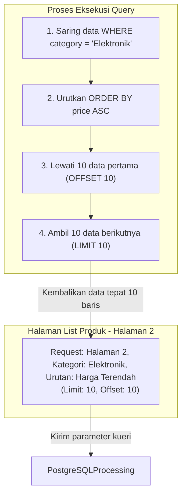

# 05 - BAB 05 QUERY UNTUK FILTER, SORTING, DAN PAGINATION

Status: DRAFT
Rak: PostgreSQL untuk Aplikasi
Buku: PostgreSQL dalam Backend Application
Level: Level 3 - Level 4
Tipe Materi: Tutorial
Target: Backend Developer yang menghubungkan aplikasi ke PostgreSQL.
Estimasi Baca: 12 Menit
Terakhir Diperiksa: 2026-05-18

Sumber Utama: PostgreSQL Official Documentation
Versi Referensi: PostgreSQL docs/current
Status Verifikasi Sumber: REVIEW

---

## 1. Tujuan Belajar
Di akhir bab ini, pembaca diharapkan mampu:
- Menjelaskan pentingnya penerapan fitur filter, sorting, dan pagination pada endpoint API aplikasi.
- Menuliskan kueri SQL penyaringan (filtering) berdasarkan kategori, status, dan rentang tanggal di PostgreSQL.
- Mengatur urutan hasil kueri secara dinamis (sorting) berdasarkan nama, harga, atau tanggal pembuatan.
- Menerapkan pembatasan baris data menggunakan klausa `LIMIT` dan `OFFSET` untuk keperluan pagination halaman awal.
- Menganalisis risiko performa penurunan kecepatan kueri akibat penggunaan `OFFSET` bernilai besar secara konseptual.
- Menuliskan pencarian teks sederhana menggunakan operator pencocokan string `LIKE` dan `ILIKE` di PostgreSQL.

## 2. Prasyarat
- Memahami konsep dasar filtering database (baca: [Klausa WHERE Dasar](../../02-sql-dan-querying/buku-02-filtering-sorting-dan-limit/bab-01-klausa-where-dasar.md)).
- Memahami dasar pengurutan data menggunakan ORDER BY (baca: [Sorting dengan Order By](../../02-sql-dan-querying/buku-02-filtering-sorting-dan-limit/bab-03-sorting-dengan-order-by.md)).

## 3. Ringkasan Cepat
Di lingkungan produksi skala besar, backend tidak boleh menyajikan ribuan data mentah langsung ke pengguna. Kita memerlukan sistem kontrol: **Filter** (menyaring data yang relevan seperti kategori atau status), **Sorting** (mengurutkan data berdasarkan kriteria tertentu seperti harga terendah atau produk terbaru), dan **Pagination** (membagi ribuan baris data menjadi halaman-halaman kecil yang ramah RAM menggunakan `LIMIT` dan `OFFSET`). Ketiga teknik ini bekerja sama dalam SQL untuk menyajikan data yang cepat, rapi, dan hemat bandwidth di sisi aplikasi.

## 4. Istilah Penting di Bab Ini

| Istilah | Arti Singkat |
|---|---|
| Pagination | Teknik memecah kumpulan data besar menjadi bagian-bagian (halaman) yang lebih kecil. |
| Limit | Klausa SQL untuk menentukan jumlah maksimal baris data yang ingin diambil. |
| Offset | Klausa SQL untuk menentukan berapa banyak baris data awal yang ingin dilewati. |
| Case-sensitive | Aturan pencarian string yang membedakan huruf besar dan huruf kecil (misal: 'Budi' != 'budi'). |
| ILIKE Operator | Operator pencarian string khusus PostgreSQL yang bersifat tidak sensitif huruf (case-insensitive). |

## 5. Analogi Sehari-hari
Bayangkan Anda sedang mencari informasi di dalam **Kamus Besar Bahasa Indonesia Cetak (Database Server)**:
- **Filtering** adalah tindakan Anda **hanya mencari kata yang berawalan huruf 'A' saja** dan melompati huruf lainnya (menyaring berdasarkan kategori status).
- **Sorting** adalah aturan bawaan kamus di mana seluruh kata di dalamnya sudah **disusun rapi secara alfabetis dari A sampai Z** agar mudah dicari (mengurutkan harga/tanggal).
- **Pagination** adalah kenyataan bahwa kamus setebal 2000 halaman tidak dicetak dalam satu lembar kertas gulung tanpa putus. Kamus tersebut **dibagi per halaman kertas fisik**, di mana setiap halaman hanya memuat maksimal 30 kata (LIMIT 30). Jika Anda ingin membaca halaman 3, Anda melompati 60 kata pertama di halaman 1 dan 2 (OFFSET 60) lalu mulai membaca 30 kata berikutnya di halaman tersebut.

## 6. Batas Analogi
Di dalam kamus cetak, melompati halaman (OFFSET) dapat dilakukan secara instan dengan jempol tangan karena kertas sudah terikat. Namun di database elektronik PostgreSQL, melompati baris data menggunakan `OFFSET` memaksa engine database memindai secara elektronik seluruh baris yang dilewati terlebih dahulu sebelum membuangnya. Hal ini membuat OFFSET besar berjalan lambat di database raksasa.

## 7. Ilustrasi Konsep

Status Ilustrasi: DRAFT



## 8. Penjelasan Ilustrasi
Diagram di atas menggambarkan alur logika bagaimana mesin PostgreSQL memproses permintaan kueri list produk yang kompleks dari antarmuka web. Saat pengguna meminta halaman ke-2 kategori Elektronik yang diurutkan dari harga terendah, PostgreSQL menyaring data terlebih dahulu, mengurutkannya, melompati 10 produk pertama (halaman 1), lalu mengambil 10 produk berikutnya untuk ditampilkan sebagai halaman 2.

## 9. Batas Ilustrasi
Bagan di atas fokus pada pagination konseptual menggunakan `LIMIT`/`OFFSET` (Offset-based pagination). Perlu dicatat bahwa untuk database skala jutaan baris, para developer senior di masa mendatang akan merekomendasikan teknik alternatif bernama **Cursor-based pagination** (Keystep pagination) untuk menghindari penurunan performa akibat `OFFSET` besar, namun konsep dasarnya tetap dibangun dari prinsip sortasi dan limitasi ini.

---

## 10. Konsep Inti

### Mengapa Aplikasi Membutuhkan Kontrol Kueri List?
1. **Performa Server**: Mencegah server backend *crash* akibat kehabisan memori RAM saat mencoba memproses ratusan ribu baris data transaksi sekaligus.
2. **User Experience (UX)**: Menghindari browser web pengguna membeku (*freeze*) karena rendering baris data yang terlalu panjang secara bersamaan.
3. **Optimasi Bandwidth**: Mengurangi tagihan internet cloud server dengan hanya mentransmisikan data yang sedang aktif dilihat oleh user.

### Perilaku Operator LIKE vs ILIKE di PostgreSQL
Dalam fitur pencarian nama atau barang, input dari form pencarian pengguna sering kali tidak konsisten dalam penggunaan huruf kapital:
- **LIKE (SQL Standard)**: Bersifat *case-sensitive*. Pencarian `LIKE '%budi%'` tidak akan menemukan baris dengan nama `"Budi Utomo"` karena huruf 'B' kapital tidak cocok dengan 'b' kecil.
- **ILIKE (PostgreSQL Extension)**: Bersifat *case-insensitive*. Pencarian `ILIKE '%budi%'` akan sukses menemukan `"Budi Utomo"`, `"BUDI SETIAWAN"`, maupun `"doni budiman"`. Ini adalah pilihan yang sangat cocok untuk fitur pencarian pada aplikasi umum.

---

## 11. Penjelasan Detail

### Masalah Performa OFFSET Besar (Deep Pagination)
Klausa `OFFSET` memberi tahu PostgreSQL untuk mengabaikan $N$ baris pertama. Namun, di bawah tenda engine, PostgreSQL tidak bisa langsung meloncat ke baris ke-1.000.000 secara instan.
- **Mekanisme**: PostgreSQL terpaksa membaca, memuat ke memori, mengurutkan, dan memproses 1.000.000 baris pertama tersebut dari disk, lalu membuangnya begitu saja, baru kemudian mengambil 10 baris setelahnya (LIMIT 10).
- **Dampak**: Semakin besar halaman yang dibuka oleh pengguna (misal halaman ke-10.000), kueri akan berjalan semakin lambat.
- **Batas Pembahasan**: Di tingkat pemula-menengah, `LIMIT` dan `OFFSET` adalah standar industri yang sangat memadai dan mudah diimplementasikan sebelum kita terpaksa bermigrasi ke cursor-based pagination.

---

## 12. Contoh SQL Dasar
Berikut adalah dasar-dasar penulisan kueri filter, sorting, dan pagination tunggal di PostgreSQL:

```sql
-- 1. Menyaring produk dengan kategori 'Elektronik' dan stok di atas 5 unit
SELECT product_id, product_name, price, stock 
FROM products
WHERE category = 'Elektronik' AND stock > 5;

-- 2. Mengurutkan produk berdasarkan harga termahal ke termurah
SELECT product_id, product_name, price 
FROM products
ORDER BY price DESC;

-- 3. Menerapkan Pagination Halaman 1 (Mengambil 10 produk pertama)
SELECT product_id, product_name, price 
FROM products
LIMIT 10 OFFSET 0;

-- 4. Menerapkan Pagination Halaman 2 (Melompati 10 produk pertama, ambil 10 berikutnya)
SELECT product_id, product_name, price 
FROM products
LIMIT 10 OFFSET 10;
```

---

## 13. Contoh SQL Praktik Project
Berikut adalah implementasi kueri SQL nyata yang menggabungkan seluruh fitur filter dinamis, sorting harga terendah, pencarian teks tidak sensitif huruf, dan pagination halaman ke-3 untuk halaman katalog admin e-commerce:

```sql
-- [SKENARIO: HALAMAN 3 KATALOG PRODUK ADMIN]
-- Fitur: Pencarian kata 'tas', Kategori 'Aksesoris', Urutan Harga Terendah.
-- Aturan Pagination: Tampilkan 5 produk per halaman.
-- Rumus Offset untuk Halaman 3: (Halaman - 1) * Limit = (3 - 1) * 5 = 10.

SELECT 
    p.product_id,
    p.product_name,
    p.price,
    p.stock,
    c.category_name
FROM products p
INNER JOIN categories c ON p.category_id = c.category_id
WHERE 
    p.product_name ILIKE '%tas%'             -- Pencarian case-insensitive kata 'tas'
    AND c.category_name = 'Aksesoris'        -- Filter kategori khusus
    AND p.stock > 0                          -- Filter hanya produk aktif berstok
ORDER BY 
    p.price ASC,                             -- Sorting utama: Harga terendah
    p.product_id ASC                         -- Tie-breaker sorting agar urutan deterministik
LIMIT 5 OFFSET 10;                           -- Pagination: Halaman 3 (Limit 5, Offset 10)
```

---

## 14. Kesalahan Umum
- **Menggunakan OFFSET Tanpa ORDER BY**: Menjalankan kueri `LIMIT 10 OFFSET 10` tanpa klausa `ORDER BY`. Karena urutan data di PostgreSQL bersifat tidak menentu jika tidak diurutkan secara eksplisit, baris data yang muncul di Halaman 1 bisa muncul kembali di Halaman 2 secara acak, menyebabkan data tumpang tindih.
- **Kueri Search Tanpa Wildcard `%`**: Menuliskan pencarian `ILIKE 'baju'` padahal bermaksud mencari baju di semua posisi nama. Tanpa tanda `%` di awal atau akhir (`ILIKE '%baju%'`), PostgreSQL memperlakukan kueri tersebut sebagai pencocokan kata persis (`=`), sehingga produk bernama "Baju Tidur" tidak akan pernah ditemukan.
- **Mencampur Tipe Data pada Filter Tanggal**: Membandingkan kolom bertipe `TIMESTAMP` langsung dengan teks string tanggal tanpa casting yang tepat, yang dapat memicu kegagalan interpretasi zona waktu di PostgreSQL.

---

## 15. Catatan Interview
- **Pertanyaan**: "Mengapa penggunaan klausa `OFFSET` yang sangat besar (Deep Pagination) dianggap sebagai masalah performa besar di PostgreSQL?"
- **Jawaban**: "Karena klausa `OFFSET` memaksa PostgreSQL untuk memindai, memuat ke memori, dan mengurutkan seluruh baris data awal yang dilewati sebelum membuangnya. Jika kita menulis `OFFSET 1000000 LIMIT 10`, mesin database tetap harus membaca 1.000.000 baris pertama terlebih dahulu dari disk, yang secara drastik meningkatkan I/O disk dan pemakaian RAM, sehingga kueri menjadi sangat lambat."

---

## 16. Catatan Diskusi User
- **Pertanyaan Umum**: "Kapan kita harus menggunakan pencarian `ILIKE` dan kapan harus menggunakan sistem Full-Text Search (FTS) di PostgreSQL?"
- **Diskusikan**: Operator `ILIKE` sangat cocok dan sangat cepat untuk pencarian string sederhana skala kecil hingga menengah (misalnya mencari nama user atau nama produk tunggal di bawah 100.000 baris). Namun, jika kita ingin menyimulasikan mesin pencari canggih yang mengenali struktur kata, kemiripan fonetik, atau mencari dokumen paragraf panjang, kita wajib bermigrasi menggunakan fitur bawaan PostgreSQL **Full-Text Search (TSVECTOR dan TSQUERY)** yang akan dibahas di Level lanjutan.

---

## 17. Latihan Kecil
1. Tuliskan query SQL e-commerce untuk mengambil data pesanan (`orders`) yang berstatus `'DELIVERED'`, diurutkan berdasarkan tanggal transaksi paling baru (`created_at` DESC), dan ambil hanya 5 data pertama untuk kebutuhan widget dashboard admin!
2. Hitunglah nilai LIMIT dan OFFSET yang wajib didefinisikan di kueri SQL jika tim frontend meminta data Halaman ke-5 dengan aturan 20 baris per halaman!

---

## 18. Checklist Pemahaman
- [ ] Memahami arti dan kebutuhan fitur filter, sorting, dan pagination bagi arsitektur aplikasi backend.
- [ ] Mampu menuliskan filter SQL gabungan menggunakan operator logika `AND` dan `OR`.
- [ ] Mampu membedakan karakteristik pencarian case-sensitive (`LIKE`) dengan case-insensitive (`ILIKE`) di PostgreSQL.
- [ ] Memahami cara menggunakan klausa `LIMIT` dan `OFFSET` untuk membagi halaman data.
- [ ] Memahami alasan mengapa pengurutan `ORDER BY` wajib disertakan dalam kueri pagination agar urutan data bersifat deterministik.

---

## 19. Hubungan dengan Materi Lain

### Posisi Materi
- Rak: [04 - PostgreSQL untuk Aplikasi](../../README.md)
- Buku: [PostgreSQL dalam Backend Application](../)

### Prasyarat
- [Klausa WHERE Dasar](../../02-sql-dan-querying/buku-02-filtering-sorting-dan-limit/bab-01-klausa-where-dasar.md)
- [Sorting dengan Order By](../../02-sql-dan-querying/buku-02-filtering-sorting-dan-limit/bab-03-sorting-dengan-order-by.md)

### Materi Sebelumnya
- [Query untuk List dan Detail Data Aplikasi](./bab-04-query-untuk-list-dan-detail-data-aplikasi.md)

### Materi Berikutnya
- [Apa Itu Database Migration](../buku-03-migration-seed-dan-versioning-schema/bab-01-apa-itu-database-migration.md)

### Materi Terkait
- [Inner Join](../../02-sql-dan-querying/buku-03-join-dan-relasi-query/bab-02-inner-join.md) (Menyaring produk berdasarkan kategori relasional)
- [Pola Desain Schema SaaS](../../03-desain-data-dan-schema/buku-04-desain-schema-untuk-aplikasi/bab-01-pola-desain-schema-saas.md) (Mengatur isolasi data tenant pada filter kueri)

### Istilah Terkait
- Deep Pagination, Case-insensitive, ILIKE Operator, Offset-based Pagination, Wildcard Pattern, Deterministic Sort.

---

## 20. Referensi Resmi
Jangan membuka tautan berikut pada batch ini, cukup cantumkan sebagai referensi resmi yang ditargetkan untuk verifikasi nanti:
- PostgreSQL Official Documentation - LIMIT and OFFSET
  https://www.postgresql.org/docs/current/queries-limit.html
- PostgreSQL Official Documentation - Pattern Matching (LIKE, ILIKE)
  https://www.postgresql.org/docs/current/functions-matching.html

---

## 21. Catatan Pribadi / Project Notes
*   *Catatan Draft*: Pastikan pembaca memahami bahaya `Deep Pagination` akibat penggunaan `OFFSET` besar secara konseptual. Ini adalah topik wawancara kerja yang sangat disukai oleh para Lead Engineer. Status verifikasi diatur ke REVIEW.
