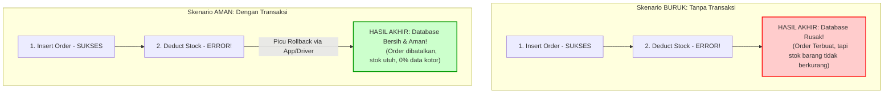

# 06 - BAB 06 TRANSAKSI DATABASE UNTUK APLIKASI

Status: DRAFT
Rak: PostgreSQL untuk Aplikasi
Buku: PostgreSQL dalam Backend Application
Level: Level 3 - Level 4
Tipe Materi: Tutorial
Target: Backend Developer yang menghubungkan aplikasi ke PostgreSQL.
Estimasi Baca: 12 Menit
Terakhir Diperiksa: 2026-05-18

Sumber Utama: PostgreSQL Official Documentation
Versi Referensi: PostgreSQL docs/current
Status Verifikasi Sumber: REVIEW

---

## 1. Tujuan Belajar
Di akhir bab ini, pembaca diharapkan mampu:
- Menjelaskan definisi dan urgensi Transaksi Database dalam siklus hidup aplikasi backend.
- Mengidentifikasi masalah serius yang timbul akibat kegagalan operasi multi-step tanpa transaksi (*Partial Update*).
- Menjelaskan konsep Atomicity ("All or Nothing") secara sederhana sebagai fondasi transaksi database.
- Menyusun skenario alur data transaksi komersial (seperti pembuatan order, pemotongan stok, dan pencatatan pembayaran) secara konseptual.
- Menganalisis kaitan integritas data relasional dengan penerapan transaksi database di PostgreSQL.

## 2. Prasyarat
- Memahami relasi tabel dan key constraint (baca: [Foreign Key dan Referential Integrity](../../03-desain-data-dan-schema/buku-02-primary-key-foreign-key-dan-constraint/bab-02-foreign-key-dan-referential-integrity.md)).
- Memahami kueri modifikasi data dasar SQL (seperti perintah `INSERT`, `UPDATE`, dan `DELETE`).

## 3. Ringkasan Cepat
Di dalam backend application harian, satu fitur aplikasi sering kali membutuhkan pengeksekusian beberapa perintah SQL modifikasi data secara berurutan. Sebagai contoh, proses checkout belanja online mengharuskan sistem untuk membuat baris pesanan baru, mencatat barang yang dibeli, memotong saldo pengguna, serta mengurangi stok produk. Jika server tiba-tiba mati atau terjadi error di tengah jalan saat stok belum dikurangi, database akan mengalami **Partial Update** (konsistensi rusak). **Transaksi Database** menyelesaikan masalah ini dengan membungkus seluruh langkah tersebut menjadi satu kesatuan logika tunggal yang bersifat **Atomicity**: seluruh langkah wajib sukses, atau seluruh langkah dibatalkan sama sekali (*rollback*).

## 4. Istilah Penting di Bab Ini

| Istilah | Arti Singkat |
|---|---|
| Database Transaction | Unit kerja logis tunggal yang membungkus beberapa kueri SQL modifikasi secara aman. |
| Atomicity | Sifat transaksi yang menjamin seluruh kueri berhasil dijalankan, atau tidak dijalankan sama sekali. |
| Partial Update | Kondisi rusak di mana hanya sebagian kueri SQL modifikasi yang berhasil disimpan ke database. |
| Supermarket Cashier | Analogi kasir swalayan yang harus menyelesaikan transaksi belanja secara utuh sebelum melepaskan barang. |
| Data Integrity | Kondisi kebenaran, akurasi, dan konsistensi data yang tersimpan di dalam database. |

## 5. Analogi Sehari-hari
Bayangkan Anda sedang berbelanja di **Kasir Swalayan Supermarket (Aplikasi & PostgreSQL)**:
- Kasir memulai proses dengan men-scan satu per satu barang belanjaan Anda, memasukkannya ke kantong plastik belanja, menggesek kartu debit Anda di mesin EDC, lalu mencetak struk fisik sebagai tanda bukti pembayaran.
- Seluruh langkah di atas merupakan **Satu Paket Transaksi Kasir yang Utuh**:
  - Jika di tengah-tengah proses (misalnya setelah barang di-scan dan dimasukkan ke kantong) tiba-tiba kartu debit Anda dideklarasikan **Ditolak/Saldo Kurang**, kasir tidak akan membiarkan Anda membawa pulang setengah barang belanjaan secara gratis. Kasir akan membatalkan seluruh proses, meminta kantong plastik kembali, lalu mengosongkan layar monitor kasir ke kondisi semula (**Rollback**).
  - Anda membawa pulang seluruh belanjaan dengan kartu sukses didebit, atau Anda pulang dengan tangan kosong tanpa ada uang sepeser pun yang berkurang dari rekening Anda (**All or Nothing**).

## 6. Batas Analogi
Di kasir supermarket fisik, jika transaksi gagal, kasir terpaksa mengeluarkan barang dari kantong plastik secara manual dengan tangan satu per satu.
Di dalam PostgreSQL, proses pembersihan data setengah jadi tersebut dikelola oleh engine database. Ketika mendeteksi kegagalan kueri dalam blok transaksi, PostgreSQL akan menandai transaksi tersebut sebagai aborted (batal) dan mengabaikan kueri selanjutnya hingga instruksi ROLLBACK eksplisit dikirimkan oleh backend aplikasi atau driver database untuk mengembalikan status memori ke keadaan bersih seolah-olah transaksi tidak pernah terjadi.

## 7. Ilustrasi Konsep

Status Ilustrasi: DRAFT



## 8. Penjelasan Ilustrasi
Bagan di atas menggambarkan perbedaan dramatis antara mengeksekusi operasi multi-step tanpa transaksi dengan menggunakan transaksi. Tanpa transaksi, error di langkah kedua memicu kegagalan sistem namun meninggalkan data order menggantung di database (data rusak/inkonsisten). Dengan transaksi, kegagalan di langkah kedua membuat transaksi dibatalkan (di-rollback oleh aplikasi/driver) yang membersihkan record order yang sempat ditulis sementara di langkah pertama, mengembalikan database ke kondisi bersih.

## 9. Batas Ilustrasi
Bagan di atas menyederhanakan alur transaksi. Di dunia nyata, keputusan untuk melakukan rollback tidak hanya dipicu oleh error di sisi PostgreSQL saja, melainkan bisa juga dipicu oleh logika bisnis di server backend aplikasi (misalnya backend mendeteksi stok fisik ternyata kurang dari jumlah yang diminta, sehingga backend sengaja mengirimkan perintah rollback).

---

## 10. Konsep Inti

### Risiko Fatal Partial Update (Pembaruan Sebagian)
Partial update adalah mimpi buruk terbesar bagi integritas data perusahaan:
1. **Kasus E-Commerce**: Pesanan terdaftar di tabel `orders`, tetapi karena kegagalan koneksi di tengah jalan, tabel `order_items` kosong. Pelanggan membayar tagihan penuh namun admin gudang kebingungan produk apa yang dibeli karena tidak ada detail barang belanjaan yang tersimpan.
2. **Kasus Keuangan (Transfer Bank)**: Saldo pengirim didebit sebesar Rp1.000.000, tetapi akibat server mati mendadak, saldo penerima tidak pernah dikreditkan. Uang hilang di udara tanpa jejak pelacakan akuntansi.
3. **Penyebab**: Partial update murni terjadi karena kueri dijalankan secara terpisah satu per satu tanpa dibungkus pengaman transaksional.

### Konsep Atomicity (Keterpaduan)
Atomicity adalah pilar pertama dari standar keamanan database relasional bernama **ACID (Atomicity, Consistency, Isolation, Durability)**.
- **Definisi**: Atomicity memperlakukan serangkaian perintah SQL modifikasi sebagai satu partikel terkecil yang tidak bisa dipecah-pecah (*indivisible*).
- **Prinsip**: Jika ada 10 kueri SQL di dalam transaksi, dan 9 kueri sukses namun kueri ke-10 gagal, maka seluruh 9 kueri yang sukses tersebut wajib dianggap gagal dan ditarik kembali dari database.

---

## 11. Penjelasan Detail

### Kapan Fitur Aplikasi Wajib Menggunakan Transaksi Database?
Sebagai developer backend profesional, Anda wajib mengenali jenis fitur apa saja yang tidak boleh berjalan tanpa transaksi:
- **Proses Transaksi Finansial**: Transfer uang, pemotongan saldo, top-up dompet digital, pembayaran invoice.
- **Sistem Inventori Gudang**: Pengurangan stok saat checkout barang, mutasi barang antar rak, penerimaan stok baru.
- **Pendaftaran Berantai (Cascade Registration)**: Membuat akun user baru sekaligus membuat profil default, mengalokasikan role, dan mencatat log selamat datang di tabel terpisah.
- **Proses Keranjang Belanja (Checkout)**: Memasukkan data ke tabel induk `orders` diikuti oleh pengisian data ke tabel anak `order_items`.

---

## 12. Contoh SQL Konseptual
Berikut adalah representasi kueri SQL konseptual yang menggambarkan bahaya partial update (Skenario Buruk) dan bagaimana transaksi membungkusnya secara aman (Skenario Baik) di PostgreSQL:

```sql
-- ========================================================
-- SKENARIO A: PROSES CHECKOUT TANPA TRANSAKSI (Sangat Bahaya!)
-- ========================================================

-- Langkah 1: Catat pesanan baru
INSERT INTO orders (order_id, user_id, total_price)
VALUES (201, 45, 150000.00);

-- [Bencana Terjadi!] Koneksi terputus tiba-tiba atau server mati mendadak di sini.
-- Akibatnya, langkah 2 dan langkah 3 di bawah ini TIDAK PERNAH tereksekusi.

-- Langkah 2: Catat barang belanjaan
-- INSERT INTO order_items (order_id, product_id, quantity) VALUES (201, 12, 1);

-- Langkah 3: Potong stok produk
-- UPDATE products SET stock = stock - 1 WHERE product_id = 12;

-- HASIL AKHIR: Database rusak! Ada order_id 201 tapi tidak ada isinya dan stok tidak berkurang.


-- ========================================================
-- SKENARIO B: PROSES CHECKOUT DENGAN TRANSAKSI (Sangat Aman)
-- ========================================================

-- Seluruh perintah ini dibungkus sebagai satu transaksi logis.
-- Detail perintah BEGIN, COMMIT, dan ROLLBACK akan dibahas mendalam di Bab 07.
-- PostgreSQL menjamin: Semua baris sukses disimpan ke disk, atau dibatalkan total.
```

---

## 13. Contoh SQL Praktik Project
Berikut adalah alur kueri SQL terurut yang disiapkan untuk dibungkus transaksi guna menyimulasikan mutasi transfer saldo antar akun nasabah secara presisi:

```sql
-- [PROSES TRANSFER SALDO RP50.000 DARI BUDI (ID: 1) KE DONI (ID: 2)]

-- Langkah 1: Kurangi saldo pengirim (Budi)
UPDATE accounts
SET balance = balance - 50000.00
WHERE account_id = 1 AND balance >= 50000.00;

-- Langkah 2: Tambahkan saldo penerima (Doni)
UPDATE accounts
SET balance = balance + 50000.00
WHERE account_id = 2;

-- Langkah 3: Catat riwayat mutasi sebagai audit log
INSERT INTO transaction_logs (sender_id, receiver_id, amount, note)
VALUES (1, 2, 50000.00, 'Transfer Saldo harian');
```

---

## 14. Kesalahan Umum
- **Mengabaikan Transaksi pada Proses Berantai**: Berasumsi bahwa database jarang mengalami kegagalan sehingga menulis kode checkout belanjaan menggunakan kueri SQL terpisah biasa. Ketika server kelebihan beban (*high load*), partial update akan mulai bermunculan dan merusak laporan keuangan.
- **Tidak Memvalidasi Kondisi Prasyarat dalam Query**: Langsung memotong saldo tanpa memeriksa apakah saldo pengirim cukup (`balance >= 50000.00`). Transaksi dapat berjalan lancar namun menghasilkan saldo negatif jika validasi ini diabaikan.
- **Berasumsi Transaksi Menjamin Bebas Deadlock Tanpa Rencana**: Mengira dengan membungkus kueri menggunakan transaksi, kita tidak perlu memikirkan urutan operasi. Padahal, transaksi yang tidak teratur urutannya antar developer dapat memicu kondisi *Deadlock* (saling kunci) di database produksi.

---

## 15. Catatan Interview
- **Pertanyaan**: "Apa yang dimaksud dengan konsep Atomicity dalam transaksi database, dan mengapa konsep ini sangat vital bagi aplikasi e-commerce?"
- **Jawaban**: "Atomicity adalah salah satu pilar ACID yang menjamin bahwa seluruh rangkaian kueri modifikasi di dalam transaksi diperlakukan sebagai satu unit kerja tunggal yang tidak dapat terbagi. Artinya, seluruh langkah kueri wajib berhasil dieksekusi ke database secara utuh, atau jika ada satu saja langkah yang gagal/error, maka seluruh modifikasi sebelumnya akan dibatalkan total (*rollback*). Ini sangat vital bagi e-commerce untuk mencegah terjadinya *Partial Update*, seperti pesanan yang berhasil dicatat namun stok produk tidak terpotong atau detail barang tidak tersimpan."

---

## 16. Catatan Diskusi User
- **Pertanyaan Umum**: "Apakah kita harus membungkus kueri `SELECT` biasa (baca data) di dalam transaksi database?"
- **Diskusikan**: Kueri pembacaan data (`SELECT`) tunggal umumnya tidak memerlukan transaksi karena tidak memodifikasi data. Namun, jika backend perlu melakukan pembacaan beberapa data secara konsisten (misalnya mencetak laporan bulanan yang rumit di saat ribuan transaksi aktif sedang menulis data baru), membungkus kueri `SELECT` dalam transaksi ber-isolation level tertentu dapat menjamin konsistensi visual laporan dari awal hingga akhir pembacaan.

---

## 17. Latihan Kecil
1. Tuliskan 3 alur langkah kueri SQL terurut yang wajib dibungkus di dalam satu transaksi untuk menyimulasikan pendaftaran akun user baru di aplikasi SaaS (tabel target: `users`, `user_profiles`, dan `user_settings`)!
2. Jelaskan bahaya fatal yang terjadi bagi perusahaan perbankan jika fitur penarikan uang di ATM berjalan tanpa menggunakan sistem transaksi database!

---

## 18. Checklist Pemahaman
- [ ] Memahami definisi, peran, dan pentingnya Transaksi Database bagi aplikasi backend.
- [ ] Mampu mendefinisikan bahaya fatal dari terjadinya kondisi *Partial Update* pada database.
- [ ] Memahami pilar Atomicity ("All or Nothing") dalam menjamin kebersihan data.
- [ ] Mengetahui jenis-jenis fitur aplikasi yang mutlak membutuhkan perlindungan transaksi database.

---

## 19. Hubungan dengan Materi Lain

### Posisi Materi
- Rak: [04 - PostgreSQL untuk Aplikasi](../../README.md)
- Buku: [PostgreSQL dalam Backend Application](../)

### Prasyarat
- [Foreign Key dan Referential Integrity](../../03-desain-data-dan-schema/buku-02-primary-key-foreign-key-dan-constraint/bab-02-foreign-key-dan-referential-integrity.md)

### Materi Sebelumnya
- [Query untuk Filter, Sorting, dan Pagination](./bab-05-query-untuk-filter-sorting-dan-pagination.md)

### Materi Berikutnya
- [BEGIN, COMMIT, dan ROLLBACK](./bab-07-begin-commit-dan-rollback.md)

### Materi Terkait
- [Pola Desain Schema SaaS](../../03-desain-data-dan-schema/buku-04-desain-schema-untuk-aplikasi/bab-01-pola-desain-schema-saas.md) (Menjamin transaksi hanya berjalan di dalam tenant terisolasi)

### Istilah Terkait
- Database Transaction, Atomicity, Partial Update, ACID Properties, Data Consistency, All or Nothing.

---

## 20. Referensi Resmi
Jangan membuka tautan berikut pada batch ini, cukup cantumkan sebagai referensi resmi yang ditargetkan untuk verifikasi nanti:
- PostgreSQL Official Documentation - Database Transactions
  https://www.postgresql.org/docs/current/tutorial-transactions.html
- PostgreSQL Official Documentation - Transaction Isolation Levels
  https://www.postgresql.org/docs/current/transaction-iso.html

---

## 21. Catatan Pribadi / Project Notes
*   *Catatan Draft*: Tekankan mental model kasir swalayan agar developer pemula memahami mengapa "Partial Update" adalah bencana nyata di sistem backend komersial. Status verifikasi diatur ke REVIEW.
