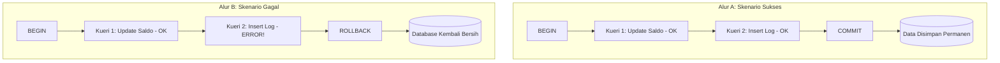

# 07 - BAB 07 BEGIN, COMMIT, DAN ROLLBACK

Status: DRAFT
Rak: PostgreSQL untuk Aplikasi
Buku: PostgreSQL dalam Backend Application
Level: Level 3 - Level 4
Tipe Materi: Tutorial
Target: Backend Developer yang menghubungkan aplikasi ke PostgreSQL.
Estimasi Baca: 12 Menit
Terakhir Diperiksa: 2026-05-18

Sumber Utama: PostgreSQL Official Documentation
Versi Referensi: PostgreSQL docs/current
Status Verifikasi Sumber: REVIEW

---

## 1. Tujuan Belajar
Di akhir bab ini, pembaca diharapkan mampu:
- Menjelaskan fungsi masing-masing perintah kontrol transaksi: `BEGIN`, `COMMIT`, dan `ROLLBACK` di PostgreSQL.
- Menggambarkan bagan alur eksekusi transaksi database, baik pada skenario sukses (*happy path*) maupun gagal (*rollback path*).
- Menuliskan sintaksis SQL dasar transaksi menggunakan perintah `BEGIN`, `UPDATE`, `INSERT`, dan `COMMIT` secara berurutan.
- Mengidentifikasi kesalahan umum dalam pemrograman transaksi aplikasi, seperti lupa menutup transaksi (*hanging transactions*) atau transaksi yang terlalu panjang (*long-running transactions*).
- Menjelaskan batasan bahasan transaksi tingkat dasar ini dibanding topik concurrency tingkat lanjut (seperti lock dan isolation levels).

## 2. Prasyarat
- Memahami alasan konseptual dan urgensi transaksi database (baca: [Transaksi Database untuk Aplikasi](./bab-06-transaksi-database-untuk-aplikasi.md)).
- Memahami dasar penulisan kueri modifikasi data SQL (seperti perintah `INSERT`, `UPDATE`, dan `DELETE`).

## 3. Ringkasan Cepat
Untuk menerapkan pilar Atomicity di dalam PostgreSQL, kita menggunakan tiga perintah SQL utama: **BEGIN** (membuka gerbang transaksi baru), **COMMIT** (menyimpan seluruh modifikasi data secara permanen ke piringan disk penyimpanan), dan **ROLLBACK** (membatalkan seluruh modifikasi sementara jika terjadi error, mengembalikan database ke kondisi semula). Pengendalian alur transaksi yang presisi di tingkat backend aplikasi sangat vital untuk mencegah database terkunci (*table lock*), memori bocor (*hanging connection*), atau data kotor yang lolos tersimpan.

## 4. Istilah Penting di Bab Ini

| Istilah | Arti Singkat |
|---|---|
| BEGIN | Perintah SQL untuk memulai/membuka blok transaksi baru di PostgreSQL. |
| COMMIT | Perintah SQL untuk mengesahkan dan menyimpan permanen seluruh perubahan transaksi. |
| ROLLBACK | Perintah SQL untuk membatalkan seluruh perubahan sementara di dalam blok transaksi. |
| Hanging Transaction | Transaksi yang menggantung terbuka karena lupa melakukan COMMIT atau ROLLBACK. |
| Table Lock | Kondisi di mana suatu tabel dikunci oleh transaksi sehingga kueri lain terpaksa mengantre. |

## 5. Analogi Sehari-hari
Bayangkan Anda sedang menulis sebuah **Naskah Novel menggunakan Pensil di Buku Kerja Resmi (PostgreSQL Database Engine)**:
- **BEGIN** adalah tindakan Anda **membuka lembaran halaman buku kosong baru** dan mempersiapkan pensil serta penghapus karet di samping Anda. Anda siap menulis coretan draf ide.
- **Proses Penulisan (UPDATE/INSERT)** adalah tindakan Anda **menulis baris-baris kalimat cerita menggunakan pensil** di halaman tersebut. Kalimat-kalimat tersebut terlihat di halaman buku, namun belum resmi disahkan karena masih ditulis tipis dengan pensil yang sangat mudah dihapus.
- **COMMIT** adalah tindakan Anda **menebalkan tulisan pensil tersebut menggunakan pena tinta permanen antipudar**. Begitu tinta ditebalkan, coretan naskah tersebut menjadi bagian permanen dari buku kerja resmi yang tidak bisa dihapus lagi oleh penghapus karet biasa.
- **ROLLBACK** adalah tindakan Anda **mengambil penghapus karet besar lalu menggosok bersih seluruh coretan pensil** di halaman tersebut hingga bersih mengilap karena Anda menyadari alur cerita novel yang Anda tulis di lembar tersebut rusak berantakan. Halaman buku kembali kosong melongpong seolah Anda tidak pernah menulis coretan pensil tersebut.

## 6. Batas Analogi
Di buku fisik, menggosok penghapus karet akan meninggalkan bekas noda abu-abu atau merusak serat kertas. Di dalam PostgreSQL, operasi `ROLLBACK` berjalan 100% sempurna tanpa bekas noda fisik sedikit pun di disk penyimpanan karena PostgreSQL memanfaatkan teknologi log penulisan canggih di memori sebelum data benar-benar disahkan ke disk fisik.

## 7. Ilustrasi Konsep

Status Ilustrasi: DRAFT



## 8. Penjelasan Ilustrasi
Bagan alur di atas menunjukkan dua rute kehidupan transaksi database. Pada Alur A (Happy Path), seluruh kueri SQL sukses dieksekusi, sehingga perintah `COMMIT` dijalankan untuk mengesahkan data secara permanen ke database. Pada Alur B (Rollback Path), kueri kedua melempar error, sehingga backend segera memotong alur dengan mengirimkan perintah `ROLLBACK` untuk mengembalikan database ke kondisi awal sebelum `BEGIN` dibuka.

## 9. Batas Ilustrasi
Bagan di atas fokus pada visualisasi alur di tingkat internal database. Di dunia nyata backend development, kita biasanya membungkus alur di atas di dalam blok proteksi error program backend seperti `try-catch`. Blok `try` memuat perintah `BEGIN` hingga `COMMIT`, sedangkan blok `catch` secara khusus ditugaskan untuk mengeksekusi `ROLLBACK` jika program menangkap sinyal error apa pun di tengah jalan.

---

## 10. Konsep Inti

### Perintah Kontrol Transaksi SQL di PostgreSQL
1. **`BEGIN` (atau `START TRANSACTION`)**: Menandai dimulainya blok transaksi. Sejak perintah ini dieksekusi, PostgreSQL menangguhkan penyimpanan otomatis (*autocommit mode*) untuk koneksi tersebut. Seluruh modifikasi data setelahnya disimpan di area memori transaksional sementara.
2. **`COMMIT`**: Menyimpan seluruh rangkaian perubahan data sementara tersebut secara permanen ke media penyimpanan fisik. Begitu COMMIT berhasil dijalankan, transaksi dinyatakan selesai dan data baru dapat dilihat oleh user lain di seluruh sistem.
3. **`ROLLBACK`**: Membatalkan seluruh kueri modifikasi sementara di dalam blok transaksi tersebut sejak perintah `BEGIN` pertama kali dideklarasikan. Database bersih kembali dari sisa data setengah jadi.

---

## 11. Penjelasan Detail

### Kesalahan Umum Pemrograman Transaksi yang Fatal
Aspek penulisan alur transaksi dapat mengakibatkan kerugian performa luar biasa bagi perusahaan:

#### A. Lupa Menutup Transaksi (Hanging Transactions)
Terjadi ketika backend menjalankan `BEGIN`, mengeksekusi beberapa kueri, namun akibat kesalahan penulisan kode logic (misalnya error ditangkap oleh catch tapi kita lupa memanggil kueri `ROLLBACK` di dalam blok catch tersebut), koneksi database dibiarkan terbuka menggantung.
- **Dampak**: PostgreSQL akan mempertahankan kunci tabel (*table locks*) untuk transaksi tersebut selamanya. Akibatnya, kueri-kueri lain dari user lain yang ingin mengakses tabel tersebut akan mengantre lama (*connection pool exhaustion*) hingga server aplikasi mengalami *timeout* atau macet total.

#### B. Transaksi yang Terlahu Panjang (Long-Running Transactions)
Membungkus operasi non-database (seperti memanggil API pihak ketiga untuk verifikasi SMS OTP yang membutuhkan waktu 5-10 detik, atau memproses kompresi gambar di server backend) di dalam blok transaksi database `BEGIN` - `COMMIT`.
- **Dampak**: Database terpaksa mengunci tabel selama proses eksternal tersebut berjalan. Aturan wajib: **Hanya bungkus kueri SQL yang cepat dan mutlak di dalam transaksi database. Selesaikan seluruh validasi data dan panggil API pihak ketiga SEBELUM gerbang `BEGIN` dibuka.**

---

## 12. Contoh SQL Dasar
Berikut adalah sintaksis kueri transaksi dasar PostgreSQL yang berjalan secara fungsional di SQL Editor:

```sql
-- ========================================================
-- 1. CONTOH TRANSAKSI SUKSES (HAPPY PATH)
-- ========================================================

-- Mulai transaksi
BEGIN;

-- Langkah 1: Kurangi stok produk meja belajar
UPDATE products
SET stock = stock - 2
WHERE product_id = 15;

-- Langkah 2: Catat transaksi penjualan
INSERT INTO sales (product_id, quantity, buyer_name)
VALUES (15, 2, 'Rian Setiawan');

-- Sahkan perubahan
COMMIT;

-- Hasil: Stok berkurang 2 dan data penjualan Rian tersimpan permanen.
```

---

## 13. Contoh SQL Praktik Project
Berikut adalah simulasi skenario kegagalan transaksi di mana data transaksi dibatalkan total karena PostgreSQL mendeteksi pelanggaran constraint (stok produk tidak boleh minus):

```sql
-- ========================================================
-- 2. CONTOH TRANSAKSI GAGAL DAN DICANCEL (ROLLBACK PATH)
-- ========================================================

-- Asumsi tabel products memiliki constraint check: CHECK (stock >= 0)
-- Kondisi Awal: Stok produk ID 9 adalah 1 unit.

BEGIN;

-- Langkah 1: Penjualan mencoba mengurangi stok sebanyak 5 unit
-- Query ini akan BERHASIL dieksekusi di memori sementara (PostgreSQL belum mematikan koneksi)
UPDATE products
SET stock = stock - 5
WHERE product_id = 9;

-- Langkah 2: Mencoba mencatat penjualan
INSERT INTO sales (product_id, quantity, buyer_name)
VALUES (9, 5, 'Dina Amelia');

-- Langkah 3: Eksekusi COMMIT
-- PostgreSQL mendeteksi stok produk ID 9 menjadi -4, melanggar CHECK (stock >= 0).
-- COMMIT GAGAL! PostgreSQL melempar error dan secara otomatis memicu ROLLBACK internal.

ROLLBACK;

-- Hasil: Database aman! Stok produk ID 9 tetap utuh 1 unit, dan data Dina tidak tersimpan.
```

---

## 14. Kesalahan Umum
- **Lupa Menulis COMMIT**: Menuliskan seluruh kueri perubahan di dalam `BEGIN` namun lupa memanggil `COMMIT` di akhir kode. Perubahan terlihat berhasil di konsol SQL local developer karena konsol tersebut menahan sesi yang sama, namun ketika dicek dari komputer server/aplikasi lain, data baru tersebut tidak pernah muncul.
- **Menuliskan Validasi Bisnis yang Lambat di Dalam Transaksi**: Membuka transaksi `BEGIN` lalu melakukan kueri pembacaan data yang lambat dan rumit untuk validasi sebelum menulis data. Validasi pembacaan data sebaiknya dilakukan di luar transaksi untuk menjaga waktu penguncian tabel seminimal mungkin.
- **Tidak Melakukan Rollback Saat Query Error**: Backend menangkap error dari salah satu kueri SQL di dalam transaksi, namun backend langsung melempar respon error ke pengguna tanpa mengeksekusi perintah `ROLLBACK` ke database terlebih dahulu.

---

## 15. Catatan Interview
- **Pertanyaan**: "Apa bahayanya jika kita membuat transaksi database yang di dalamnya memanggil API eksternal (seperti payment gateway atau SMS OTP gateway)?"
- **Jawaban**: "Bahaya terbesarnya adalah terjadinya *Long-Running Transaction* yang memicu *Connection Pool Exhaustion* dan *Table Lock*. Ketika transaksi dibuka via `BEGIN`, PostgreSQL akan mengunci tabel-tabel terkait agar data tidak dimodifikasi oleh proses lain. Jika di dalam transaksi tersebut kita menunggu respon API eksternal yang lambat (misal butuh waktu 5 detik), tabel akan terkunci selama 5 detik tersebut. Hal ini membuat kueri dari ratusan user lain mengantre lama, membebani koneksi database, dan pada akhirnya dapat melumpuhkan seluruh sistem backend."

---

## 16. Catatan Diskusi User
- **Pertanyaan Umum**: "Apakah ORM modern seperti Prisma atau Sequelize melakukan autocommit dan autorollback secara mandiri?"
- **Diskusikan**: Ya, ORM modern menyediakan pembungkus transaksi bawaan (seperti `$transaction` di Prisma) yang secara otomatis akan mengirimkan perintah `BEGIN`, memantau eksekusi kode backend kita, lalu secara cerdas mengeksekusi `COMMIT` jika seluruh blok sukses atau `ROLLBACK` jika menangkap sinyal *exception/error*. Namun, pemahaman kueri SQL dasar `BEGIN`, `COMMIT`, dan `ROLLBACK` di bawahnya mutlak wajib dikuasai agar developer dapat melakukan debugging jika terjadi masalah kebocoran transaksi (*transaction leak*).

---

## 17. Latihan Kecil
1. Tuliskan blok script transaksi SQL dasar PostgreSQL lengkap untuk mengubah status pesanan (`orders`) ID 88 menjadi `'PAID'` sekaligus menambahkan data pembayaran ke tabel `payments`!
2. Jelaskan secara singkat apa yang dimaksud dengan kondisi *Hanging Transaction* dan sebutkan dampak buruknya bagi pengguna aplikasi lain!

---

## 18. Checklist Pemahaman
- [ ] Memahami peran serta sintaksis perintah `BEGIN`, `COMMIT`, dan `ROLLBACK` di PostgreSQL.
- [ ] Mampu merancang alur eksekusi transaksi yang aman (Happy Path dan Rollback Path).
- [ ] Mengetahui bahaya dari kelalaian menutup transaksi (*Hanging Transactions*).
- [ ] Mengetahui aturan wajib untuk tidak menyertakan operasi DML lambat di dalam transaksi (*Long-Running Transactions*).
- [ ] Memahami penanganan pembatalan transaksi secara otomatis saat PostgreSQL mendeteksi pelanggaran constraint skema.

---

## 19. Hubungan dengan Materi Lain

### Posisi Materi
- Rak: [04 - PostgreSQL untuk Aplikasi](../../README.md)
- Buku: [PostgreSQL dalam Backend Application](../)

### Prasyarat
- [Transaksi Database untuk Aplikasi](./bab-06-transaksi-database-untuk-aplikasi.md)

### Materi Sebelumnya
- [Transaksi Database untuk Aplikasi](./bab-06-transaksi-database-untuk-aplikasi.md)

### Materi Berikutnya
- [Apa Itu Database Migration](../buku-03-migration-seed-dan-versioning-schema/bab-01-apa-itu-database-migration.md)

### Materi Terkait
- [Check dan Unique Constraint](../../03-desain-data-dan-schema/buku-02-primary-key-foreign-key-dan-constraint/bab-03-check-dan-unique-constraint.md) (Pemicu kegagalan commit akibat pelanggaran aturan data skema)

### Istilah Terkait
- BEGIN Transaction, COMMIT Statement, ROLLBACK Statement, Hanging Connection, Long-running Transaction, Autocommit Mode.

---

## 20. Referensi Resmi
Jangan membuka tautan berikut pada batch ini, cukup cantumkan sebagai referensi resmi yang ditargetkan untuk verifikasi nanti:
- PostgreSQL Official Documentation - BEGIN
  https://www.postgresql.org/docs/current/sql-begin.html
- PostgreSQL Official Documentation - COMMIT
  https://www.postgresql.org/docs/current/sql-commit.html
- PostgreSQL Official Documentation - ROLLBACK
  https://www.postgresql.org/docs/current/sql-rollback.html

---

## 21. Catatan Pribadi / Project Notes
*   *Catatan Draft*: Pastikan pembaca memahami bahaya meletakkan pemanggilan API pihak ketiga di dalam gerbang transaksi database. Ini adalah kesalahan pemula backend terpopuler di industri nyata. Status verifikasi diatur ke REVIEW.
