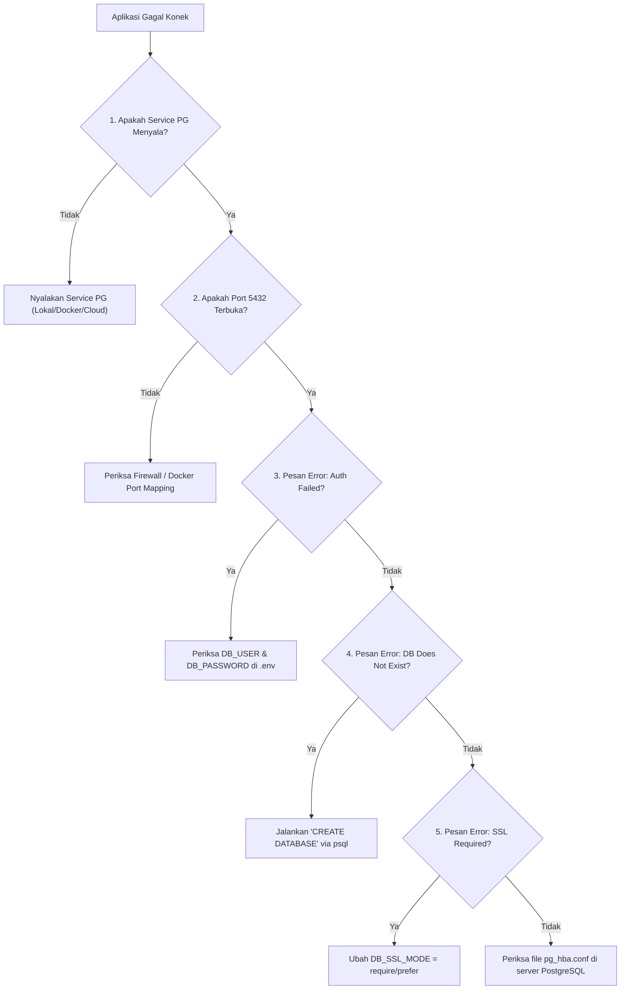

# 03 - BAB 03 TROUBLESHOOTING KONEKSI APLIKASI

Status: DRAFT
Rak: PostgreSQL untuk Aplikasi
Buku: Koneksi Database dan Environment
Level: Level 3 - Level 4
Tipe Materi: Tutorial
Target: Backend Developer yang menghubungkan aplikasi ke PostgreSQL.
Estimasi Baca: 10 Menit
Terakhir Diperiksa: 2026-05-18

Sumber Utama: PostgreSQL Official Documentation
Versi Referensi: PostgreSQL docs/current
Status Verifikasi Sumber: REVIEW

---

## 1. Tujuan Belajar
Di akhir bab ini, pembaca diharapkan mampu:
- Mendiagnosis penyebab umum kegagalan koneksi aplikasi ke server PostgreSQL secara sistematis.
- Membaca dan menerjemahkan pesan kesalahan (*error logs*) koneksi database yang sering ditemui.
- Menguji jangkauan port jaringan database menggunakan perkakas baris perintah ringan (`nc`, `telnet`).
- Mengatasi masalah otentikasi, pembatasan alamat IP (`pg_hba.conf`), dan ketidakcocokan konfigurasi SSL.

## 2. Prasyarat
- Memahami manajemen secret database (baca: [Manajemen Secret Database](./bab-02-manajemen-secret-database.md)).

## 3. Ringkasan Cepat
Kegagalan aplikasi saat menghubungkan diri ke PostgreSQL adalah masalah harian backend developer. Penyebab kegagalan berkisar dari masalah sederhana seperti typo password, port yang terblokir firewall, server database yang belum diaktifkan, hingga masalah jaringan kompleks seperti pembatasan akses IP di file `pg_hba.conf` server PostgreSQL. Menghadapi error koneksi membutuhkan alur berpikir diagnosis yang sistematis (dari cek status servis, cek jaringan port, hingga cek kredensial), alih-alih melakukan tebak-tebak acak pada kode aplikasi.

## 4. Istilah Penting di Bab Ini

| Istilah | Arti Singkat |
|---|---|
| Connection Refused | Pesan kesalahan jaringan yang menyatakan port target tidak aktif atau tidak mendengarkan (*listening*) koneksi. |
| pg_hba.conf | File konfigurasi utama PostgreSQL untuk mengatur kontrol akses host/IP client mana saja yang boleh login. |
| Connection Timeout | Kegagalan koneksi karena server tidak memberikan respon sama sekali hingga batas waktu tunggu aplikasi habis. |
| max_connections | Batas maksimum jumlah koneksi client simultan yang diperbolehkan oleh server PostgreSQL. |
| Docker Bridge Network | Jaringan virtual Docker yang sering memisahkan container aplikasi dan container database PostgreSQL. |

## 5. Analogi Sehari-hari
Bayangkan Anda sedang mencoba **Menelepon Teman Anda di Luar Negeri**:

- **Kasus 1: Handphone Teman Mati Total** -> Handphone teman Anda tidak aktif sama sekali. Panggilan Anda langsung ditolak sistem operator. Ini setara dengan error **"Connection Refused"** karena servis PostgreSQL belum dijalankan.
- **Kasus 2: Salah Tekan Nomor Port Negara** -> Anda menekan nomor telepon dengan kode negara yang salah. Panggilan berdering ke rumah orang lain atau tersesat. Ini setara dengan salah menulis variabel `DB_PORT`.
- **Kasus 3: Teman Memblokir Nomor Asing** -> Handphone teman Anda menyala dan berdering, tetapi teman Anda memasang filter: *"Hanya nomor keluarga dekat yang boleh masuk, nomor asing otomatis ditolak."* Ini setara dengan restriksi keamanan **`pg_hba.conf`** pada PostgreSQL.
- **Kasus 4: Salah Mengucapkan Sandi Rahasia** -> Teman Anda mengangkat telepon, tetapi meminta sandi rahasia masuk grup obrolan. Anda salah mengucapkan sandi. Telepon langsung ditutup sepihak. Ini setara dengan error **"Password authentication failed"**.

## 6. Batas Analogi
Di telepon fisik, Anda mendengar suara operator verbal *"Nomor yang Anda tuju sedang tidak aktif"*. 

Di dunia server backend, aplikasi Anda hanya akan menerima lembaran teks kode kesalahan mentah (*socket error code* seperti `ECONNREFUSED` atau `ETIMEDOUT`) yang harus Anda terjemahkan sendiri secara mandiri berdasarkan konteks arsitektur infrastruktur server Anda.

## 7. Ilustrasi Konsep

Status Ilustrasi: DRAFT



## 8. Penjelasan Ilustrasi
Bagan keputusan di atas memetakan alur diagnosis sistematis (*Troubleshooting Decision Tree*) saat aplikasi gagal terhubung ke PostgreSQL:
1. Mulai dengan memeriksa apakah mesin server PostgreSQL-nya sendiri menyala.
2. Uji kelayakan port jaringan (apakah ada firewall yang memblokir jalur).
3. Jika koneksi sampai ke server tapi ditolak, periksa kredensial username dan password.
4. Periksa apakah nama database tujuan sudah dibuat di server PostgreSQL.
5. Selesaikan masalah protokol enkripsi SSL dan otorisasi IP client (`pg_hba.conf`).

## 9. Batas Ilustrasi
Bagan keputusan di atas berfokus pada kegagalan koneksi awal (*bootstrapping connection*). Ia tidak menggambarkan masalah kegagalan koneksi intermiten di tengah jalan (seperti kebocoran koneksi pool aplikasi, CPU spike di server database, atau degradasi performa I/O disk).

---

## 10. Konsep Inti: Menerjemahkan Pesan Error Umum

### 1. Error: "Connection Refused" (atau `ECONNREFUSED`)
- **Arti**: Aplikasi mencoba mengetuk port 5432 di alamat host, tetapi tidak ada respon sama sekali karena tidak ada program yang mendengarkan (*listening*) di port tersebut.
- **Penyebab**: Servis PostgreSQL di komputer lokal belum diaktifkan, atau jika menggunakan Docker container, Anda lupa melakukan *port mapping* `-p 5432:5432` ke OS host.

### 2. Error: "FATAL: password authentication failed for user..."
- **Arti**: Alamat host benar dan port terbuka, tetapi kombinasi username atau password yang dikirim oleh file `.env` ditolak oleh PostgreSQL.
- **Penyebab**: Typo pada `DB_USER` atau `DB_PASSWORD`, atau password user database telah kedaluwarsa/diubah.

### 3. Error: "FATAL: database ... does not exist"
- **Arti**: Kredensial benar, tetapi nama database yang ditulis di `DB_NAME` belum dibuat di dalam server PostgreSQL.
- **Penyebab**: Anda lupa menjalankan perintah `CREATE DATABASE nama_database;` sebelum menyalakan aplikasi.

### 4. Error: "Connection Timeout" (atau `ETIMEDOUT`)
- **Arti**: Aplikasi mencoba menghubungi server database, tetapi tidak mendapatkan jawaban sama sekali hingga waktu tunggu habis.
- **Penyebab**: Server diblokir oleh aturan firewall cloud (seperti Security Group AWS atau firewall lokal), atau alamat IP host database yang ditulis salah total.

### 5. Error: "no pg_hba.conf entry for host..."
- **Arti**: Koneksi mencapai server PostgreSQL, tetapi server menolak karena alamat IP komputer aplikasi tidak terdaftar di daftar putih (*white-list*) izin masuk PostgreSQL.
- **Penyebab**: Alamat IP publik aplikasi dinamis dan belum ditambahkan ke konfigurasi `pg_hba.conf` di server PostgreSQL.

---

## 11. Penjelasan Detail

### Checklist Diagnosis 3 Langkah (Sistematis & Cepat)
Jangan mengubah kode program backend Anda sebelum melakukan checklist infrastruktur berikut di terminal komputer Anda:

#### Langkah 1: Uji Apakah Jaringan Port Terbuka
Gunakan perkakas terminal bawaan untuk memastikan komputer Anda bisa mencapai port PostgreSQL tujuan.

```bash
# Uji menggunakan Netcat (nc) ke server database lokal
nc -zv 127.0.0.1 5432

# Uji menggunakan Telnet (Alternatif Windows/macOS)
telnet 127.0.0.1 5432
```
*Hasil Sukses*: Teks output akan memunculkan pesan `Connection to 127.0.0.1 5432 port [tcp/postgresql] succeeded!`. Jika gagal/hang, dipastikan ada masalah firewall atau servis PostgreSQL mati.

#### Langkah 2: Uji Koneksi Langsung via CLI PostgreSQL (psql)
Sebelum membiarkan kode program backend Anda yang kompleks mencoba koneksi, lakukan uji coba menggunakan perkakas baris perintah PostgreSQL resmi:

```bash
psql -h 127.0.0.1 -p 5432 -U postgres_dev -d toko_db
```
Jika perintah di atas berhasil masuk dan meminta password lalu menyajikan prompt sql `toko_db=>`, maka koneksi database Anda 100% aman. Masalah kegagalan koneksi dipastikan berada di kesalahan kode aplikasi backend Anda (misalnya salah memetakan nama kunci environment variable).

#### Langkah 3: Periksa pg_hba.conf (Untuk Database Remote/Cloud)
Jika Anda mengakses server VPS mandiri, buka file `pg_hba.conf` di server PostgreSQL dan pastikan baris berikut ditambahkan untuk mengizinkan akses koneksi:

```
# format: TYPE  DATABASE        USER            ADDRESS                 METHOD
host    all             all             0.0.0.0/0               scram-sha-256
```
*(Catatan: Mengizinkan `0.0.0.0/0` berarti membuka akses dari seluruh internet. Pastikan password Anda sangat kuat dan port diikat dengan SSL).*

---

## 12. Contoh SQL Dasar
Untuk memantau jumlah koneksi aktif aplikasi yang masuk ke server PostgreSQL (guna mendiagnosis error *Connection Limit Exceeded*), Anda dapat menjalankan kueri sistem internal berikut:

```sql
-- Melihat daftar koneksi aktif aplikasi saat ini
SELECT pid, usename, client_addr, state, query 
FROM pg_stat_activity 
WHERE datname = 'toko_db';
```
Kueri di atas membantu admin database mengidentifikasi apakah ada aplikasi backend yang melakukan kebocoran koneksi pool (*connection pool leaks*) sehingga memonopoli slot koneksi server database.

---

## 13. Contoh SQL Praktik Project
Visualisasi error log koneksi di level konsol terminal aplikasi backend yang sering ditemui oleh developer:

```text
# Contoh Log Error Node.js (Pg Driver)
Error: connect ECONNREFUSED 127.0.0.1:5432
    at TCPConnectWrap.afterConnect [as oncomplete] (node:net:1605:16) {
  errno: -4078,
  code: 'ECONNREFUSED',
  syscall: 'connect',
  address: '127.0.0.1',
  port: 5432
}
>> Diagnosis: Servis PostgreSQL lokal mati atau container Docker belum memetakan port 5432!
```

---

## 14. Kesalahan Umum
- **Mengubah Kode Aplikasi Tanpa Cek Servis**: Menghabiskan waktu berjam-jam mengubah konfigurasi framework backend, padahal masalahnya hanya karena server PostgreSQL lokal belum di-start via Docker atau Services Manager.
- **Jebakan Docker "localhost"**: Menulis `DB_HOST=localhost` di dalam file `.env` aplikasi backend yang berjalan di dalam Docker Container. Bagi aplikasi di dalam container, `localhost` merujuk ke dirinya sendiri (bukan ke mesin host). Anda harus menggunakan nama servis kontainer (misal: `DB_HOST=db`) atau `host.docker.internal` sebagai alamat host database.
- **Mengabaikan Pesan Log**: Langsung panik saat melihat error di terminal dan langsung menanyakan ke forum tanpa membaca baris detail pesan error seperti `FATAL: database "xxx" does not exist` yang sebenarnya sudah menjelaskan solusinya secara gamblang.

---

## 15. Catatan Interview
- **Pertanyaan**: "Apa arti dari pesan kesalahan database 'FATAL: remaining connection slots are reserved for non-replication superuser connections' dan bagaimana cara mengatasinya?"
- **Jawaban**: "Pesan tersebut berarti jumlah koneksi aktif yang dibuka oleh aplikasi telah mencapai batas maksimum `max_connections` yang dikonfigurasi di server PostgreSQL. PostgreSQL menyisakan sedikit slot kosong khusus untuk superuser (`postgres`) agar admin tetap bisa login untuk melakukan investigasi darurat. Cara mengatasinya adalah dengan memeriksa apakah aplikasi mengalami kebocoran koneksi pool (*connection pool leaks*), menurunkan ukuran maksimum pool size di konfigurasi aplikasi backend, atau meningkatkan nilai parameter `max_connections` di file `postgresql.conf` server database."

---

## 16. Catatan Diskusi User
- **Pertanyaan Umum**: "Apakah kita harus selalu mengizinkan koneksi dari semua IP (0.0.0.0/0) di server cloud?"
- **Diskusikan**: Sangat tidak disarankan untuk server produksi sensitif. Praktik terbaik industri adalah menggunakan jaringan internal privat (*VPC - Virtual Private Cloud*) atau memasukkan daftar IP statis server backend Anda saja ke dalam setelan firewall cloud, sehingga server PostgreSQL sama sekali tidak terekspos langsung ke internet publik.

---

## 17. Latihan Kecil
1. Terjemahkan arti pesan kesalahan berikut dan tuliskan langkah perbaikan konkretnya:
   `FATAL: no pg_hba.conf entry for host "192.168.1.50", user "dev_user", database "store_db", no encryption`
2. Mengapa menjalankan perintah `nc -zv db_host 5432` sangat berguna dilakukan sebelum Anda meluncurkan proses deployment aplikasi backend Anda ke server staging?

---

## 18. Checklist Pemahaman
- [ ] Mampu membaca dan menerjemahkan 5 jenis error koneksi dasar PostgreSQL.
- [ ] Mengetahui cara menguji kelayakan port database menggunakan perkakas CLI (`nc`/`telnet`).
- [ ] Memahami perbedaan alamat `localhost` pada komputer fisik dengan container Docker.
- [ ] Memahami peran pembatasan hak akses IP client pada file konfigurasi `pg_hba.conf`.

---

## 19. Hubungan dengan Materi Lain

### Posisi Materi
- Rak: [04 - PostgreSQL untuk Aplikasi](../../README.md)
- Buku: [Koneksi Database dan Environment](../)

### Prasyarat
- [Manajemen Secret Database](./bab-02-manajemen-secret-database.md)

### Materi Sebelumnya
- [Manajemen Secret Database](./bab-02-manajemen-secret-database.md)

### Materi Berikutnya
- [Apa Itu Database Migration](../buku-03-migration-seed-dan-versioning-schema/bab-01-apa-itu-database-migration.md) (Menghubungkan kelayakan koneksi database untuk proses migrasi otomatis struktur skema)

### Materi Terkait
- [Dampak Desain pada Performa](../../03-desain-data-dan-schema/buku-03-normalisasi-dan-denormalisasi/bab-03-dampak-desain-pada-performa.md) (Mengetahui pengaruh kelebihan beban koneksi terhadap kelelahan CPU database)

### Istilah Terkait
- Troubleshooting, Connection Refused, Socket Error, Network Diagnostics, Netcat, Telnet, pg_hba, pg_stat_activity, Connection Pool, Max Connections.

## 20. Referensi Resmi
Jangan membuka tautan berikut pada batch ini, cukup cantumkan sebagai referensi resmi yang ditargetkan untuk verifikasi nanti:
- PostgreSQL Official Documentation — perlu diverifikasi pada batch official docs verification.
- PostgreSQL connection/configuration references — perlu diverifikasi jika nanti masuk fase source verification.

## 21. Catatan Pribadi / Project Notes
*   *Catatan Draft*: Penting untuk menyertakan trik diagnosis lokal (`nc` dan `psql` CLI) karena 90% waktu terbuang developer junior saat mengatasi error koneksi adalah karena mereka mengotak-atik kode backend padahal servis databasenya sendiri yang sedang tidak aktif. Status verifikasi diatur ke REVIEW.
