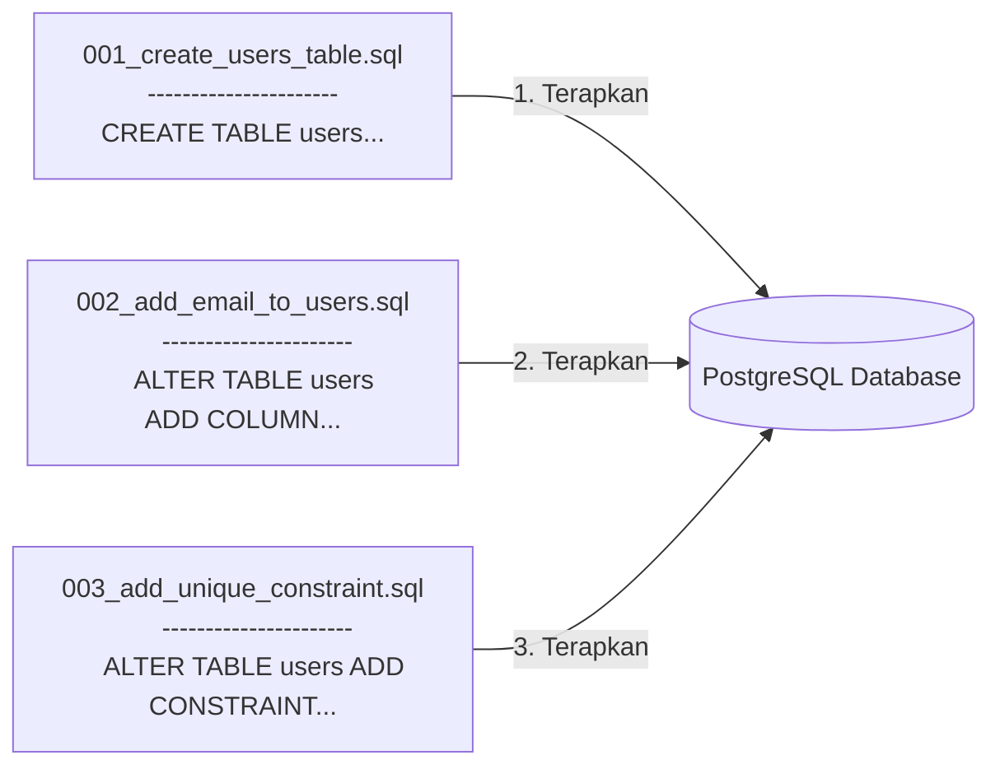

# 01 - BAB 01 APA ITU DATABASE MIGRATION

Status: DRAFT
Rak: PostgreSQL untuk Aplikasi
Buku: Migration Seed dan Versioning Schema
Level: Level 3 - Level 4
Tipe Materi: Tutorial
Target: Backend Developer yang menghubungkan aplikasi ke PostgreSQL.
Estimasi Baca: 10 Menit
Terakhir Diperiksa: 2026-05-17

Sumber Utama: PostgreSQL Official Documentation
Versi Referensi: PostgreSQL docs/current
Status Verifikasi Sumber: REVIEW

---

## 1. Tujuan Belajar
Di akhir bab ini, pembaca diharapkan mampu:
- Memahami definisi dan fungsi utama Database Migration dalam siklus pengembangan aplikasi backend skala tim.
- Menjelaskan pentingnya berkas migration untuk mencegah masalah perbedaan struktur database (*Schema Drift*) antar tim developer.
- Membedakan secara konseptual fungsi berkas *Migration* (struktur cetakan) dengan berkas *Seed* (data awal).
- Menuliskan perintah SQL modifikasi skema dasar (`ALTER TABLE`, `ADD COLUMN`, `DROP COLUMN`) di PostgreSQL.

## 2. Prasyarat
- Memahami dasar penulisan perintah `CREATE TABLE` dan pemilihan tipe data (baca: [Database, Table, Row, dan Column](../../01-orientasi-sejarah-dan-fondasi-postgresql/buku-04-fondasi-konsep-database/bab-01-database-table-row-dan-column.md)).
- Memahami pentingnya integritas data menggunakan key constraint (baca: [Foreign Key dan Referential Integrity](../../03-desain-data-dan-schema/buku-02-primary-key-foreign-key-dan-constraint/bab-02-foreign-key-dan-referential-integrity.md)).

## 3. Ringkasan Cepat
**Database Migration (Migrasi Database)** adalah sistem pelacak perubahan (*version control*) untuk skema database. Mirip seperti Git yang mencatat sejarah perubahan baris kode program aplikasi, berkas migrasi mencatat sejarah evolusi modifikasi struktur tabel (tambah kolom, ubah tipe data, hapus constraint) dari waktu ke waktu secara berurutan. Hal ini menjamin seluruh tim developer dan server aplikasi berjalan di atas skema database yang persis sama secara konsisten.

## 4. Istilah Penting di Bab Ini

| Istilah | Arti Singkat |
|---|---|
| Database Migration | Berkas naskah script terurut yang mencatat perubahan evolusi skema database. |
| Schema Drift | Kondisi buruk di mana struktur database di komputer developer berbeda dengan server produksi. |
| Seed (Seeding) | Proses otomatis pengisian data awal atau dummy ke dalam tabel setelah skema terbentuk. |
| Rollback | Tindakan membatalkan atau memundurkan versi skema database ke versi sebelumnya. |
| DDL (Data Definition Language) | Kelompok perintah SQL untuk mendefinisikan struktur database (CREATE, ALTER, DROP). |

## 5. Analogi Sehari-hari
Bayangkan Anda dan tim arsitek sedang mengelola proyek **Renovasi Gedung Sekolah Besar (Database Server)**:
- **Database** adalah **Gedung Sekolah Fisik** itu sendiri.
- **Database Migration** adalah **Buku Log Harian Renovasi Arsitektur Resmi**.
- Ketika tim ingin memperluas kelas, arsitek menulis di buku log: *"Hari ke-1: Tambahkan pintu darurat di aula samping."* Esoknya ditulis lagi: *"Hari ke-2: Ubah jendela kayu di kelas 3A menjadi jendela kaca."*
- Setiap ada tukang baru yang bergabung, ia cukup membaca buku log renovasi ini dari halaman pertama hingga akhir untuk menduplikasi bentuk sekolah yang persis sama di tempat lain (**skema lokal komputer developer baru**). Jika tukang baru langsung merenovasi tanpa membaca buku log, bentuk gedung sekolah akan berbeda-beda di tiap lokasi (**Schema Drift**).
- **Seed** adalah **Tindakan Memasukkan Kursi, Meja, dan Papan Tulis Baru** ke dalam ruangan kelas setelah dinding selesai dibangun. Meja dan kursi adalah isi ruangan (data), bukan bagian dari fondasi beton dinding gedung (skema).

## 6. Batas Analogi
Di dunia renovasi fisik, jika Anda sudah terlanjur merubuhkan tembok beton kokoh, Anda harus mengeluarkan tenaga fisik ekstra dan biaya material besar untuk membangunnya kembali jika ingin membatalkan (*rollback*) renovasi.

Di dalam PostgreSQL, modifikasi skema diatur secara elektronik melalui perintah SQL DDL (`ALTER TABLE`). Melalui bantuan tools migrasi backend, kita bisa melakukan pembatalan (*rollback*) struktur database ke versi sebelumnya secara relatif lebih cepat (selama database tidak memuat data sensitif yang terlanjur terhapus akibat kolomnya dibuang).

## 7. Ilustrasi Konsep

Status Ilustrasi: DRAFT



## 8. Penjelasan Ilustrasi
Bagan di atas menggambarkan alur penerapan berkas migrasi database secara terurut. Setiap berkas migrasi menyimpan satu perintah modifikasi skema spesifik. Ketika dijalankan secara berurutan (dari berkas `001` hingga `003`), PostgreSQL akan mengeksekusi perintah tersebut satu per satu untuk membangun skema database akhir yang konsisten di komputer mana pun kueri tersebut dijalankan.

## 9. Batas Ilustrasi
Diagram di atas menyederhanakan alur migrasi. Pada kenyataannya, tools migrasi backend (seperti ORM Prisma, Knex, atau TypeORM) akan membuat satu tabel pelacak internal khusus di dalam PostgreSQL bernama `_migration_log` untuk mencatat berkas nomor berapa saja yang sudah pernah dijalankan, mencegah pengeksekusian berkas migrasi yang sama dua kali.

## 10. Konsep Inti
### Mengapa Migration Sangat Penting bagi Developer?
Tanpa migration, jika rekan kerja Anda menambahkan kolom `alamat` di komputer lokalnya, Anda tidak akan tahu. Ketika Anda menarik (*pull*) kode programnya ke komputer Anda, aplikasi Anda akan langsung *crash* dengan error `column "alamat" does not exist` karena database lokal Anda belum memiliki kolom tersebut. Migration menyelesaikan masalah kolaborasi tim ini secara anggun.

### Perbedaan Fungsional Migration vs Seed
*   **Migration (Struktur)**: Mengatur struktur/cetakan database menggunakan perintah DDL (`CREATE TABLE`, `ALTER TABLE`, `DROP TABLE`).
*   **Seed (Data)**: Mengatur data isi database menggunakan perintah DML (`INSERT INTO` untuk data wilayah, data akun admin bawaan, atau data pengujian awal aplikasi).

## 11. Penjelasan Detail
### Perintah SQL DDL Modifikasi Skema Dasar di PostgreSQL
Berikut adalah sintaksis dasar memodifikasi tabel menggunakan bahasa SQL resmi:

#### A. Menambahkan Kolom Baru
```sql
ALTER TABLE nama_tabel ADD COLUMN nama_kolom tipe_data;
```

#### B. Menghapus Kolom yang Ada
```sql
ALTER TABLE nama_tabel DROP COLUMN nama_kolom;
```

#### C. Menambahkan Constraint Baru
```sql
ALTER TABLE nama_tabel ADD CONSTRAINT nama_constraint aturan;
```

## 12. Contoh SQL Dasar
Berikut adalah cara mendefinisikan kueri perubahan tabel dasar di PostgreSQL:

```sql
-- 1. Menambahkan kolom nomor_telepon ke tabel siswa
ALTER TABLE siswa ADD COLUMN nomor_telepon VARCHAR(20);

-- 2. Menghapus kolom tinggi_badan dari tabel siswa
ALTER TABLE siswa DROP COLUMN tinggi_badan;
```

## 13. Contoh SQL Praktik Project
Dalam skenario simulasi pengembangan aplikasi, kita membuat berkas migrasi evolusioner berantai untuk mencatat penambahan email secara aman:

```sql
-- [BERKAS MIGRASI: 01_create_karyawan_table.sql]
CREATE TABLE karyawan (
    karyawan_id INT GENERATED ALWAYS AS IDENTITY PRIMARY KEY,
    nama VARCHAR(150) NOT NULL
);

-- [BERKAS MIGRASI: 02_add_email_and_unique_constraint.sql]
-- 1. Menambahkan kolom email baru ke tabel karyawan
ALTER TABLE karyawan ADD COLUMN email VARCHAR(150);

-- 2. Memasang UNIQUE constraint pada kolom email agar tidak kembar
ALTER TABLE karyawan ADD CONSTRAINT uq_karyawan_email UNIQUE (email);
```

## 14. Kesalahan Umum
- **Mengubah Database Langsung Lewat GUI**: Melakukan modifikasi skema database (seperti menambah kolom atau mengubah tipe data) secara langsung klik manual menggunakan GUI (seperti pgAdmin atau DBeaver) di server produksi tanpa menulis berkas migrasinya. Akibatnya, server development dan server produksi akan mengalami perbedaan skema (*Schema Drift*) yang sangat sulit dilacak dan memicu aplikasi error secara acak.
- **Mengubah Isi Berkas Migrasi Lama**: Mengubah isi berkas migrasi lama yang sudah telanjur dijalankan (*applied*) di server produksi. Seharusnya, setiap perubahan skema baru wajib ditulis di berkas migrasi baru berikutnya.

## 15. Catatan Interview
- **Pertanyaan**: "Mengapa kita dilarang keras mengubah isi berkas migrasi yang sudah pernah dijalankan di server produksi?"
- **Jawaban**: "Karena tools migrasi melacak berkas berdasarkan nama berkas dan kecocokan nilai hash (*checksum*)-nya. Jika kita mengubah berkas migrasi lama yang sudah dijalankan, sistem migrasi akan mendeteksi ketidakcocokan riwayat (*migration history conflict*) dan menolak menjalankan migrasi baru, memicu kegagalan deployment aplikasi. Solusi yang benar adalah selalu membuat berkas migrasi baru selanjutnya untuk mencatat perubahan skema baru tersebut."

## 16. Catatan Diskusi User
- **Pertanyaan Umum**: "Saya menggunakan ORM modern seperti Prisma di Node.js. Apakah saya harus menulis perintah `ALTER TABLE` secara manual setiap kali migrasi?"
- **Diskusikan**: ORM modern seperti **Prisma**, **Knex**, atau **TypeORM** sangat cerdas. Alat-alat ini akan secara otomatis membandingkan model kode backend kita dengan database, lalu men-generate script SQL migrasi secara otomatis. Namun sebagai developer profesional, kita wajib memahami bahasa dasar SQL `ALTER TABLE` di bawahnya agar bisa membaca, menganalisis, dan memperbaiki script migrasi jika terjadi kegagalan sistem otomatis.

## 17. Latihan Kecil
1. Tuliskan query SQL untuk menambahkan kolom bertipe tanggal `tanggal_lahir` ke tabel `karyawan` yang sudah ada!
2. Jelaskan secara singkat bahaya dari timbulnya kondisi *Schema Drift* di lingkungan tim developer!

## 18. Checklist Pemahaman
- [ ] Memahami definisi dan urgensi penggunaan Database Migration dalam pengembangan aplikasi tim.
- [ ] Mampu membedakan peran berkas Migration (cetakan struktur) dengan berkas Seed (data isi).
- [ ] Mampu menuliskan perintah dasar `ALTER TABLE ADD COLUMN` di PostgreSQL.
- [ ] Mengetahui bahaya memodifikasi skema secara manual via GUI di server produksi.

## 19. Hubungan dengan Materi Lain

### Posisi Materi
- Rak: [04 - PostgreSQL untuk Aplikasi](../../README.md)
- Buku: [Migration Seed dan Versioning Schema](../)

### Prasyarat
- [Database, Table, Row, dan Column](../../01-orientasi-sejarah-dan-fondasi-postgresql/buku-04-fondasi-konsep-database/bab-01-database-table-row-dan-column.md)
- [Foreign Key dan Referential Integrity](../../03-desain-data-dan-schema/buku-02-primary-key-foreign-key-dan-constraint/bab-02-foreign-key-dan-referential-integrity.md)

### Materi Sebelumnya
- [Keamanan Koneksi Database](../buku-01-postgresql-dalam-backend-application/bab-03-keamanan-koneksi-database.md)

### Materi Berikutnya
- [Kembali ke Jalur Belajar Utama](../../00-index-dan-jalur-belajar/jalur-belajar-level-0-sampai-4.md)

### Materi Terkait
- [Administrasi DBA dan Operasional](../../08-administrasi-dba-dan-operasional/)

### Istilah Terkait
- Schema Drift, Migration Rollback, DDL Statement, ORM, Seeding.

## 20. Referensi Resmi
Jangan membuka tautan berikut pada batch ini, cukup cantumkan sebagai referensi resmi yang ditargetkan untuk verifikasi nanti:
- PostgreSQL Official Documentation - Altering Tables
  https://www.postgresql.org/docs/current/ddl-alter.html
- PostgreSQL Official Documentation - ALTER TABLE
  https://www.postgresql.org/docs/current/sql-altertable.html

## 21. Catatan Pribadi / Project Notes
*   *Catatan Draft*: Bab pembuka ini harus memicu kesadaran developer bahwa kolaborasi skema tidak boleh berantakan. Rancang penjelasan analogi renovasi gedung sekolah secara menarik agar pembaca memahami mengapa pencatatan riwayat struktur database mutlak diperlukan dalam proyek tim skala industri. Status verifikasi diatur ke REVIEW.
