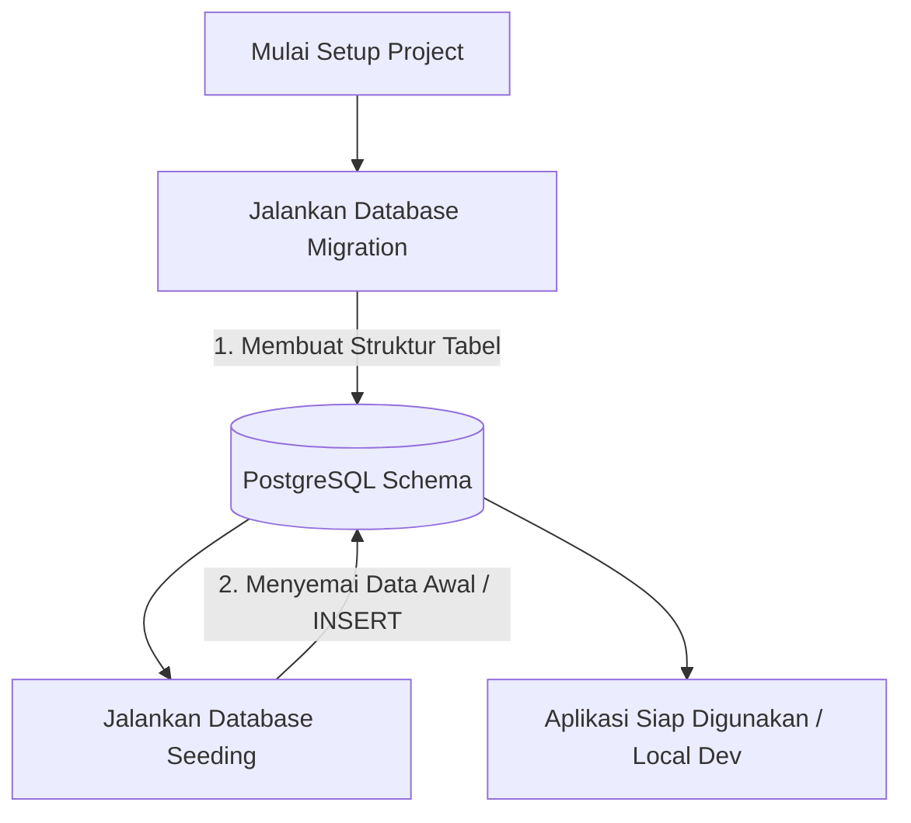

# 02 - BAB 02 DATA SEEDING DASAR

Status: DRAFT
Rak: PostgreSQL untuk Aplikasi
Buku: Migration Seed dan Versioning Schema
Level: Level 3 - Level 4
Tipe Materi: Tutorial
Target: Backend Developer yang menghubungkan aplikasi ke PostgreSQL.
Estimasi Baca: 10 Menit
Terakhir Diperiksa: 2026-05-18

Sumber Utama: PostgreSQL Official Documentation
Versi Referensi: PostgreSQL docs/current
Status Verifikasi Sumber: REVIEW

---

## 1. Tujuan Belajar
Di akhir bab ini, pembaca diharapkan mampu:
- Menjelaskan definisi dan fungsi utama Data Seeding dalam pengembangan aplikasi backend.
- Mengidentifikasi alasan mengapa proyek pengembangan membutuhkan data seeding untuk mempercepat alur kerja development.
- Membedakan secara tegas peran serta karakteristik antara Database Migration dengan Database Seeding.
- Menuliskan script SQL dasar menggunakan perintah `INSERT INTO` untuk mengisi data benih awal (seperti roles, categories, dan initial admin).
- Menganalisis risiko-risiko fatal jika database seeding dijalankan secara sembarangan, khususnya di lingkungan production.

## 2. Prasyarat
- Memahami konsep dasar Database Migration (baca: [Apa Itu Database Migration](./bab-01-apa-itu-database-migration.md)).
- Memahami cara membuat tabel dan memilih tipe data dasar di PostgreSQL (baca: [Pembuatan Table dan Data Type](../../03-desain-data-dan-schema/buku-01-konsep-table-schema-dan-relasi/bab-02-pembuatan-table-dan-data-type.md)).

## 3. Ringkasan Cepat
**Data Seeding (Penyemaian Data)** adalah proses otomatisasi pengisian database dengan kumpulan data awal (*seed data*) setelah skema database berhasil dibuat oleh sistem migrasi. Seed data biasanya berisi data referensi statis (seperti daftar role user, kategori produk, status transaksi) atau data pengujian tiruan (dummy data) agar lingkungan pengembangan (*local development*) atau pengujian (*testing*) langsung berada dalam kondisi siap pakai tanpa harus diinput manual satu per satu lewat antarmuka aplikasi.

## 4. Istilah Penting di Bab Ini

| Istilah | Arti Singkat |
|---|---|
| Data Seeding | Proses mengisi database dengan data awal secara otomatis melalui script/perintah terprogram. |
| Seed Data | Kumpulan data awal yang digunakan untuk mengisi database (baik data statis wajib maupun data dummy). |
| Static/Reference Data | Data transaksional bawaan yang mutlak dibutuhkan agar aplikasi bisa berfungsi (misal: role 'admin', 'user'). |
| Idempotent Seeding | Desain script seeding yang aman dijalankan berulang kali tanpa memicu error data duplikat. |
| Production Seeding | Proses seeding khusus yang hanya memasukkan data konfigurasi sistem mutlak ke database live. |

## 5. Analogi Sehari-hari
Bayangkan Anda sedang mendirikan sebuah **Perpustakaan Umum Kota Baru (Sistem Aplikasi & Database)**:
- **Database Migration** adalah tindakan arsitek **membangun gedung perpustakaan fisik**, mendirikan rak-rak kayu yang kokoh, serta menempelkan label kategori di setiap dinding (membangun struktur tabel dan kolom).
- **Data Seeding** adalah tindakan **mengisi rak-rak kosong tersebut dengan set buku contoh awal, buku kamus referensi wajib, dan formulir pendaftaran anggota** sesaat sebelum perpustakaan dibuka untuk umum.
- Tanpa seeding, pustakawan yang pertama kali masuk kerja akan mendapati sebuah gedung megah yang benar-benar kosong melongpong. Pengunjung tidak bisa membaca apa pun, dan pustakawan tidak bisa menyimulasikan alur peminjaman karena tidak ada satu pun buku fisik (data) yang bisa diproses. Dengan seeding, perpustakaan langsung berada dalam kondisi operasional awal yang siap disimulasikan.

## 6. Batas Analogi
Di perpustakaan fisik, buku-buku referensi wajib dan buku pajangan tiruan ditaruh di tempat yang sama dan diatur oleh orang yang sama. Namun dalam sistem database modern, kita wajib memisahkan secara ketat mana data referensi yang mutlak diperlukan agar program berjalan (seperti jenis mata uang atau hak akses role) dengan data contoh/tiruan pengujian (seperti nama user bohong-bohongan "John Doe"). Data tiruan tidak boleh sekali-kali dimasukkan ke dalam rak database produksi riil.

## 7. Ilustrasi Konsep

Status Ilustrasi: DRAFT



## 8. Penjelasan Ilustrasi
Alur di atas menggambarkan siklus setup awal database di lingkungan lokal developer. Pertama, migration dijalankan untuk membangun cetakan tabel kosong di PostgreSQL. Setelah tabel siap, proses seeding mengeksekusi script SQL (`INSERT`) untuk mengisi data awal ke dalam skema tersebut. Hasil akhirnya adalah database lokal yang fungsional dan siap dihubungkan ke server aplikasi backend untuk mulai dicoding.

## 9. Batas Ilustrasi
Meskipun alur di atas terlihat linier, pada praktiknya, seeding tidak selalu dijalankan segera setelah migrasi selesai. Beberapa framework backend memisahkan perintah ini (misal: `prisma db push` lalu `prisma db seed`, atau di Laravel `php artisan migrate` kemudian `php artisan db:seed`). Selain itu, seeding untuk keperluan testing (*automated testing*) sering kali menghapus (*truncate*) seluruh isi tabel terlebih dahulu sebelum menyemai ulang data dari awal untuk menjamin kebersihan kondisi pengujian.

## 10. Konsep Inti

### Mengapa Proyek Aplikasi Membutuhkan Seed Data?
1. **Mempercepat Onboarding Developer Baru**: Anggota tim baru yang baru saja mengunduh kode proyek (*clone repository*) cukup menjalankan perintah migrasi dan seeding untuk langsung mendapatkan database lokal yang terisi data simulasi lengkap, tanpa perlu menghabiskan waktu berjam-jam melakukan register manual di web.
2. **Kebutuhan Sistem Wajib**: Aplikasi tidak akan bisa melakukan registrasi user jika tabel `roles` tidak memiliki data dasar seperti `1 - Admin` atau `2 - Customer` yang berfungsi sebagai foreign key.
3. **Konsistensi Lingkungan Testing**: Menjamin seluruh unit test dijalankan di atas sampel data yang identik, sehingga hasil tes bersifat konsisten (*predictable*).

### Perbedaan Utama Migration vs Seeding

| Karakteristik | Database Migration | Database Seeding |
|---|---|---|
| **Fokus Utama** | Struktur data (Skema/DDL) | Isi data (Konten/DML) |
| **Operasi SQL** | `CREATE TABLE`, `ALTER TABLE`, `DROP` | `INSERT INTO`, `UPDATE`, `DELETE`, `TRUNCATE` |
| **Frekuensi** | Berjalan sekali per berkas migrasi | Dapat berjalan berkali-kali tergantung kebutuhan |
| **Lingkungan** | Wajib di semua lingkungan (Dev, Staging, Prod) | Terbatas (Dev/Test); sangat dibatasi di Prod |

## 11. Penjelasan Detail

### Kategori Data Seeding
Di dalam pengembangan aplikasi backend, seeding secara umum dibagi menjadi dua kategori utama berdasarkan tujuannya:

#### A. Seed Data Konfigurasi/Statis (Reference Data)
Merupakan data mutlak yang wajib ada di database agar fitur inti aplikasi bisa berfungsi. Tanpa data ini, kode backend akan melempar error.
- **Contoh**: Daftar provinsi/kota untuk aplikasi kurir, daftar mata uang aktif, tingkatan hak akses (role), status pesanan (`PENDING`, `PAID`, `SHIPPED`).
- **Penerapan**: Dijalankan di lingkungan *development* maupun *production* saat database pertama kali diinisialisasi.

#### B. Seed Data Pengujian (Dummy/Demo Data)
Merupakan data buatan dalam jumlah banyak yang digunakan untuk menyimulasikan transaksi riil di lingkungan lokal atau demo.
- **Contoh**: 100 produk buatan dengan gambar tiruan, 50 transaksi pembelian fiktif, 20 user tes dengan password standard.
- **Penerapan**: Hanya boleh dijalankan di lingkungan *development*, *testing*, atau *staging* (demo). **Dilarang keras** dijalankan di server *production*.

---

## 12. Contoh SQL Dasar
Berikut adalah script SQL DDL migrasi awal diikuti oleh perintah SQL DML seeding untuk mengisi data dasar kategori produk dan role user:

```sql
-- ==========================================
-- 1. BAGIAN MIGRATION (MEMBUAT STRUKTUR TABEL)
-- ==========================================

CREATE TABLE roles (
    role_id INT GENERATED ALWAYS AS IDENTITY PRIMARY KEY,
    role_name VARCHAR(50) NOT NULL UNIQUE
);

CREATE TABLE users (
    user_id INT GENERATED ALWAYS AS IDENTITY PRIMARY KEY,
    username VARCHAR(100) NOT NULL UNIQUE,
    role_id INT REFERENCES roles(role_id)
);

-- ==========================================
-- 2. BAGIAN SEEDING (MENGISI DATA BENIH AWAL)
-- ==========================================

-- Mengisi master role wajib sistem
INSERT INTO roles (role_name) VALUES 
('Super Admin'),
('Administrator'),
('Staff'),
('Customer');

-- Mengisi user administrator default untuk login pertama kali
-- (Asumsi role_id '2' merujuk pada 'Administrator')
INSERT INTO users (username, role_id) VALUES 
('admin_utama', 2);
```

---

## 13. Contoh SQL Praktik Project
Dalam skenario riil, menjalankan script `INSERT INTO` berulang kali dapat memicu error `duplicate key value violates unique constraint` jika data tersebut sudah ada di tabel.
Untuk mengatasi masalah ini, kita menerapkan pola **Idempotent Seeding** memanfaatkan perintah `ON CONFLICT DO NOTHING` atau `ON CONFLICT DO UPDATE` (sering disebut UPSERT) di PostgreSQL:

```sql
-- Menyemai kategori produk secara aman (Idempotent)
-- Jika kategori 'Elektronik' sudah ada, PostgreSQL tidak akan melempar error, melainkan mengabaikannya.
INSERT INTO categories (category_name, description) VALUES
('Elektronik', 'Peralatan elektronik dan gadget rumah tangga'),
('Pakaian', 'Busana pria, wanita, dan anak-anak'),
('Buku', 'Buku fisik, novel, komik, dan e-book')
ON CONFLICT (category_name) 
DO NOTHING;

-- Menyemai konfigurasi sistem global
-- Jika key 'maintenance_mode' sudah ada, lakukan update nilainya menjadi 'false'
INSERT INTO system_settings (setting_key, setting_value) VALUES
('maintenance_mode', 'false'),
('max_login_attempts', '5')
ON CONFLICT (setting_key)
DO UPDATE SET setting_value = EXCLUDED.setting_value;
```

---

## 14. Kesalahan Umum
- **Menggunakan Seeding untuk Data Produksi Riil**: Menyertakan data rahasia/sensitif (seperti token API pihak ketiga asli atau password admin produksi asli) di dalam file script seeding yang dicommit ke GitHub publik. Hal ini merupakan celah keamanan yang sangat fatal.
- **Menjalankan Seeding Dev di Server Production**: Melakukan eksekusi script database seeding tanpa memisahkan lingkungan (*environment check*), sehingga data dummy uji coba seperti user bernama "Doni Bohong" masuk ke sistem laporan komersial produksi.
- **Script Seeding Tidak Idempotent**: Menulis kueri `INSERT` polos tanpa proteksi `ON CONFLICT`. Akibatnya, setiap kali deployment/pipelining berjalan otomatis, script seeding akan gagal akibat error duplikasi data unik.

---

## 15. Catatan Interview
- **Pertanyaan**: "Apa perbedaan mendasar antara Database Migration dengan Database Seeding, dan kapan kita menggunakan masing-masing?"
- **Jawaban**: "Database Migration berfokus pada **struktur atau skema** database menggunakan perintah DDL (seperti `CREATE TABLE`, `ALTER TABLE`) dan bertindak sebagai version control untuk evolusi struktur data di semua lingkungan. Sedangkan Database Seeding berfokus pada **pengisian konten/data awal** menggunakan perintah DML (seperti `INSERT INTO`) untuk menyiapkan data referensi wajib sistem atau data tiruan (dummy) agar aplikasi siap dioperasikan di lingkungan lokal atau staging."

---

## 16. Catatan Diskusi User
- **Pertanyaan Umum**: "Apakah aman menyatukan kueri `INSERT` seed data referensi wajib langsung di dalam berkas migrasi `.sql`?"
- **Diskusikan**: Menyatukan data statis mutlak (seperti daftar negara atau mata uang) di dalam berkas migrasi awal sering dilakukan dan aman karena data tersebut adalah bagian dari prasyarat operasional database itu sendiri. Namun, untuk data dummy pengujian local dev, data tersebut wajib dipisahkan ke mekanisme/script seeding tersendiri agar tidak pernah sengaja tereksekusi di lingkungan produksi.

---

## 17. Latihan Kecil
1. Tuliskan query SQL seeding yang aman (menggunakan `ON CONFLICT`) untuk menyisipkan data status pesanan berikut ke tabel `order_statuses` (kolom unik: `status_code`):
   - `PENDING` (Pesanan baru dibuat)
   - `PAID` (Pembayaran telah dikonfirmasi)
   - `SHIPPED` (Barang sedang dalam pengiriman)
2. Mengapa script seeding untuk lingkungan local development sangat dilarang keras memuat data password asli tanpa enkripsi (*hashing*)?

---

## 18. Checklist Pemahaman
- [ ] Memahami arti konseptual dan kegunaan praktis dari proses Data Seeding.
- [ ] Mampu merinci perbedaan mendasar antara Database Migration (skema) dengan Database Seeding (data).
- [ ] Mampu menuliskan perintah `INSERT INTO` dengan klausul `ON CONFLICT DO NOTHING` (Idempotent Seeding) di PostgreSQL.
- [ ] Memahami bahaya fatal dari pencampuran data benih simulasi dengan lingkungan database produksi riil.

---

## 19. Hubungan dengan Materi Lain

### Posisi Materi
- Rak: [04 - PostgreSQL untuk Aplikasi](../../README.md)
- Buku: [Migration Seed dan Versioning Schema](../)

### Prasyarat
- [Apa Itu Database Migration](./bab-01-apa-itu-database-migration.md)
- [Pembuatan Table dan Data Type](../../03-desain-data-dan-schema/buku-01-konsep-table-schema-dan-relasi/bab-02-pembuatan-table-dan-data-type.md)

### Materi Sebelumnya
- [Apa Itu Database Migration](./bab-01-apa-itu-database-migration.md)

### Materi Berikutnya
- [Seed Data vs Dummy Data dan Production Data](./bab-03-seed-data-vs-dummy-data-dan-production-data.md)

### Materi Terkait
- [Foreign Key dan Referential Integrity](../../03-desain-data-dan-schema/buku-02-primary-key-foreign-key-dan-constraint/bab-02-foreign-key-dan-referential-integrity.md) (Mengetahui urutan seeding tabel anak agar tidak melanggar foreign key)

### Istilah Terkait
- Reference Data, Idempotent, ON CONFLICT, DML Statement, Initial Seed.

---

## 20. Referensi Resmi
Jangan membuka tautan berikut pada batch ini, cukup cantumkan sebagai referensi resmi yang ditargetkan untuk verifikasi nanti:
- PostgreSQL Official Documentation - INSERT Statement
  https://www.postgresql.org/docs/current/sql-insert.html
- PostgreSQL Official Documentation - ON CONFLICT Clause
  https://www.postgresql.org/docs/current/sql-insert.html#SQL-ON-CONFLICT

---

## 21. Catatan Pribadi / Project Notes
*   *Catatan Draft*: Pastikan bab ini memisahkan konsep seeding statis (reference) vs seeding dinamis (dummy) sejak awal agar developer pemula tidak melakukan blunder fatal mencampur data kotor ke server production. Status verifikasi diatur ke REVIEW.
