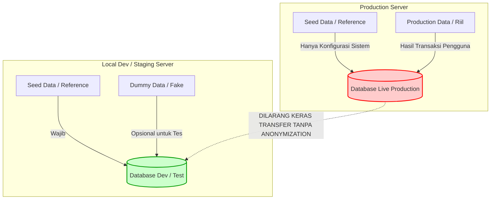

# 03 - BAB 03 SEED DATA VS DUMMY DATA DAN PRODUCTION DATA

Status: DRAFT
Rak: PostgreSQL untuk Aplikasi
Buku: Migration Seed dan Versioning Schema
Level: Level 3 - Level 4
Tipe Materi: Tutorial
Target: Backend Developer yang menghubungkan aplikasi ke PostgreSQL.
Estimasi Baca: 10 Menit
Terakhir Diperiksa: 2026-05-18

Sumber Utama: PostgreSQL Official Documentation
Versi Referensi: PostgreSQL docs/current
Status Verifikasi Sumber: REVIEW

---

## 1. Tujuan Belajar
Di akhir bab ini, pembaca diharapkan mampu:
- Mendefinisikan secara presisi karakteristik Seed Data, Dummy Data, dan Production Data.
- Membedakan fungsi, siklus hidup, dan batasan penggunaan masing-masing jenis data dalam alur kerja pengembangan software profesional.
- Membaca dan menganalisis tabel komparasi komprehensif antara ketiga jenis data tersebut.
- Mengidentifikasi kapan proses seeding aman digunakan dan kapan tindakan tersebut berubah menjadi bahaya operasional.
- Menjelaskan mengapa data produksi asli dilarang keras dipindahkan langsung ke database lokal developer (terkait kepatuhan privasi/GDPR/PII).
- Menghubungkan peran data tiruan dengan kesuksesan proses pengujian otomatis (*automated testing*).

## 2. Prasyarat
- Memahami konsep dasar Data Seeding (baca: [Data Seeding Dasar](./bab-02-data-seeding-dasar.md)).
- Memahami peran penting primary key dan foreign key dalam integritas tabel database (baca: [Pentingnya Primary Key](../../03-desain-data-dan-schema/buku-02-primary-key-foreign-key-dan-constraint/bab-01-pentingnya-primary-key.md)).

## 3. Ringkasan Cepat
Di dalam pengembangan aplikasi backend profesional, kita berurusan dengan tiga entitas data dengan tujuan hidup yang bertolak belakang: **Seed Data** (data referensi awal agar program berjalan), **Dummy Data** (data tiruan pengujian local dev), dan **Production Data** (data riil pelanggan komersial). Kegagalan memahami batas-batas tegas antara ketiganya sering kali memicu insiden kebocoran privasi (*PII leak*), pelanggaran regulasi kepatuhan (*compliance breach*), atau terhapusnya data operasional penting perusahaan.

## 4. Istilah Penting di Bab Ini

| Istilah | Arti Singkat |
|---|---|
| PII (Personally Identifiable Information) | Data sensitif yang dapat mengidentifikasi seseorang secara personal (nama asli, email, telepon). |
| Dummy/Fake Data | Data tiruan fiktif yang sengaja dibuat untuk keperluan pengujian dan pengisian ruang kosong UI. |
| Production Data | Seluruh data operasional nyata yang dihasilkan dari transaksi riil pengguna aplikasi di server produksi. |
| GDPR/UU PDP | Hukum regulasi perlindungan data pribadi yang membatasi hak akses dan pemindahan data pengguna. |
| Data Masking/Anonymization | Teknik mengacak atau menyamarkan data produksi asli menjadi data dummy sebelum dipindah ke komputer lokal. |

## 5. Analogi Sehari-hari
Bayangkan Anda sedang mengelola sebuah **Showroom Mobil Mewah (Aplikasi Web & Database)**:
- **Seed Data** adalah **Kunci Utama, Buku Manual Pengoperasian Showroom, dan Seragam Sales** yang mutlak wajib ada di hari pertama agar showroom bisa buka pintu dan beroperasi secara formal. Tanpa barang-barang ini (reference data), bisnis tidak bisa berjalan.
- **Dummy Data** adalah **Mobil-mobil Pajangan Tiruan Plastik Skala Kecil** yang ditaruh di rak pajangan hiasan atau **mobil tes kemudi khusus (test drive car)** yang boleh ditabrakkan secara sengaja untuk menguji sensor keselamatan tanpa menimbulkan kerugian finansial nyata bagi showroom.
- **Production Data** adalah **Mobil-mobil Mewah Pelanggan Asli** yang diparkir di garasi servis belakang. Mobil-mobil ini bernilai ratusan ribu dolar milik orang luar yang nyata. Jika sales mengambil kunci mobil pelanggan asli lalu menabrakannya ke tembok showroom untuk "sekadar tes sistem sensor baru" (menguji kode lokal menggunakan database produksi), sales tersebut telah melakukan pelanggaran hukum pidana berat dan menghancurkan aset pelanggan.

## 6. Batas Analogi
Di dunia fisik, mobil tes kemudi dan mobil pelanggan asli dapat dipisahkan secara fisik dengan pagar pembatas yang nyata. Namun dalam dunia database, data hanya berupa baris-baris barcode biner elektronik di memori server. Jika developer salah mengonfigurasi variabel environment database lokal (`DATABASE_URL`) ke server database produksi secara tidak sengaja, script seeding lokal yang dijalankan akan langsung menggilas data komersial asli secara tak kasat mata dalam hitungan milidetik.

## 7. Ilustrasi Konsep

Status Ilustrasi: DRAFT



## 8. Penjelasan Ilustrasi
Visualisasi di atas menunjukkan batas demarkasi tegas antara lingkungan lokal pengembangan (*Local Dev*) dengan lingkungan operasional langsung (*Production*). Di lingkungan lokal, database bebas diisi oleh Seed Data statis dan Dummy Data uji coba. Di lingkungan produksi, database hanya boleh menerima data konfigurasi wajib sistem dan data transaksi riil pengguna. Transfer data mentah secara langsung dari database produksi ke database lokal developer **dilarang keras** karena melanggar batasan keamanan data.

## 9. Batas Ilustrasi
Meskipun pemisahan di atas terlihat mutlak, ada kalanya tim developer membutuhkan data dari database produksi untuk memecahkan bug yang hanya terjadi pada data riil pelanggan. Kasus ini diselesaikan melalui proses khusus bernama **Database Anonymization (Anonimisasi Data)**, di mana data produksi diunduh secara ketat melalui script penyaring yang secara otomatis mengubah nama asli menjadi "John Doe", mengacak nomor telepon, dan mengenkripsi email pribadi sebelum bisa digunakan secara lokal oleh developer.

---

## 10. Konsep Inti

### Perbandingan Komprehensif Jenis Data

| Karakteristik | Seed Data (Reference) | Dummy Data | Production Data |
|---|---|---|---|
| **Definisi** | Data konfigurasi mutlak sistem | Data fiktif buatan untuk uji coba | Data transaksi riil pengguna asli |
| **Sumber Pembuatan** | Ditulis manual oleh tim arsitek/dev | Di-generate oleh library pengacak | Dihasilkan secara organik dari aplikasi |
| **Nilai Kebenaran** | Akurat dan standar (Statis) | Palsu/Acak (Dinamis) | Riil dan Sensitif (Komersial) |
| **Lingkungan** | Dev, Staging, Production | Hanya Dev, Testing, Staging | Hanya Production |
| **Siklus Hidup** | Permanen mengikuti daur hidup sistem | Sementara (Sering dihapus/truncating) | Abadi (Wajib di-backup ketat) |
| **Regulasi Hukum** | Tidak ada implikasi hukum | Bebas hukum (Tidak memuat PII) | Diatur hukum ketat (GDPR/UU PDP) |

---

## 11. Penjelasan Detail

### Mengapa Production Data Tidak Boleh Dianggap Sama dengan Dummy Data?
1. **Bahaya Pelanggaran Kepatuhan Privasi (PII Breach)**: Memindahkan database produksi ke komputer lokal developer berarti mengekspos informasi pribadi pelanggan asli (seperti nama, alamat rumah, nomor kartu kredit, dan riwayat transaksi medis) ke lingkungan yang tidak terenkripsi secara militer. Jika laptop developer hilang atau dicuri, perusahaan dapat dikenakan denda pelanggaran regulasi UU Perlindungan Data Pribadi (UU PDP) hingga miliaran rupiah.
2. **Skala dan Volumetrik Performa**: Mengasumsikan performa kueri lokal yang diuji dengan 10 baris dummy data akan berjalan secepat itu di produksi dengan 10 juta baris data asli adalah kesalahan fatal. Testing performa kueri wajib menyimulasikan volumetrik data skala besar secara anonim di server staging khusus.

### Hubungan Data Tiruan dengan Testing Otomatis (Automated Testing)
Dalam penulisan unit testing atau integration testing di backend (misal menggunakan library Mocha, Jest, atau Vitest), pengujian harus bersifat **Isolasi Mandiri (Self-contained)**.
- **Skenario**: Saat menguji fitur penarikan uang, database pengujian wajib menyemai ulang data akun dummy dengan saldo tepat `$100` sebelum tes dijalankan.
- **Tujuan**: Memastikan kueri pengecekan saldo berfungsi konsisten tanpa terpengaruh oleh sisa data dari hasil pengujian manual developer sebelumnya.

---

## 12. Contoh SQL Dasar
Simulasi penulisan data tiruan (dummy data) yang aman menggunakan fungsi bawaan PostgreSQL `generate_series()` untuk membuat ribuan baris data acak secara instan:

```sql
-- Membuat 100 User Dummy Pengujian Secara Instan
-- Menggunakan generator deret angka di PostgreSQL
INSERT INTO users (username, email, role_id)
SELECT 
    'user_dummy_' || i AS username,
    'user_' || i || '@test-dummy.local' AS email,
    (1 + (i % 3)) AS role_id -- mengalokasikan role_id antara 1, 2, atau 3 secara bergantian
FROM generate_series(1, 100) AS i;
```

---

## 13. Contoh SQL Praktik Project
Penerapan kueri simulasi transaksi dummy skala menengah untuk mengisi tabel pesanan fiktif dengan harga acak guna menguji query agregasi performa laporan:

```sql
-- Membuat tabel pesanan dummy jika belum ada
CREATE TABLE IF NOT EXISTS orders_dummy (
    order_id INT GENERATED ALWAYS AS IDENTITY PRIMARY KEY,
    customer_name VARCHAR(100),
    total_price NUMERIC(10,2),
    created_at TIMESTAMP
);

-- Menyemai 1000 Transaksi Penjualan Dummy dengan data acak
-- Menggunakan fungsi random() PostgreSQL untuk menyimulasikan harga
INSERT INTO orders_dummy (customer_name, total_price, created_at)
SELECT 
    'Pembeli Tiruan No ' || i,
    ROUND((RANDOM() * 1000 + 10)::NUMERIC, 2) AS total_price,
    NOW() - (i || ' minutes')::INTERVAL AS created_at
FROM generate_series(1, 1000) AS i;
```

---

## 14. Kesalahan Umum
- **Membawa Data Produksi untuk Debugging Lokal**: Mengunduh cadangan database (*database backup dump*) langsung dari server produksi untuk memecahkan bug sederhana di komputer pribadi tanpa menyamarkan data terlebih dahulu.
- **Mencampur Script Seed Master dengan Data Dummy**: Menyatukan kueri pengisian tabel master wilayah Indonesia dengan kueri pengisian user fiktif "Budi Bohong" di berkas SQL yang sama, sehingga saat produksi dideploy, nama "Budi Bohong" ikut masuk ke live system.
- **Ketergantungan Idempotency pada Urutan File**: Menyemai tabel anak (`orders`) sebelum tabel induk (`users`) disemai terlebih dahulu, memicu kegagalan integritas foreign key constraint di PostgreSQL.

---

## 15. Catatan Interview
- **Pertanyaan**: "Mengapa kita dilarang keras mengunduh database produksi asli ke laptop lokal kita hanya untuk keperluan debugging kode program harian?"
- **Jawaban**: "Karena tindakan tersebut mengekspos data pribadi pelanggan asli (PII/Personally Identifiable Information) ke lingkungan lokal yang tidak memiliki standar keamanan tingkat server (seperti enkripsi disk penuh, kontrol akses tersertifikasi, dan audit log). Hal ini melanggar regulasi privasi data global seperti GDPR atau UU PDP Indonesia, dan berisiko memicu denda hukum komersial yang luar biasa besar jika laptop developer mengalami kehilangan atau diretas."

---

## 16. Catatan Diskusi User
- **Pertanyaan Umum**: "Bagaimana cara terbaik memicu data tiruan di tim kami tanpa harus menulis generator manual?"
- **Diskusikan**: Di tingkat aplikasi backend, manfaatkan library generator data populer seperti **Faker.js** (Node.js), **Faker** (Python), atau library tiruan sejenis. Tools ini menghasilkan nama, alamat, kartu kredit, dan detail acak yang terlihat riil namun sepenuhnya fiktif sehingga aman dari tuduhan kebocoran data pribadi.

---

## 17. Latihan Kecil
1. Tuliskan query SQL PostgreSQL menggunakan `generate_series()` untuk menghasilkan 50 data produk dummy di tabel `products_dummy` dengan ketentuan kolom:
   - `product_name`: `'Produk Contoh X'` (di mana X adalah angka deret)
   - `stock`: angka acak bulat antara 10 hingga 150 (Petunjuk: gunakan rumus `FLOOR(RANDOM() * 141) + 10`)
2. Mengapa anonymization/data masking wajib dilakukan di server khusus (*staging environment*) sebelum data hasil anonimisasi tersebut didistribusikan ke tim developer lokal?

---

## 18. Checklist Pemahaman
- [ ] Memahami perbedaan fungsional dan operasional antara Seed Data, Dummy Data, dan Production Data.
- [ ] Mengetahui risiko kepatuhan hukum perlindungan data pribadi (UU PDP/GDPR) terkait pemindahan database produksi tanpa proses masking.
- [ ] Mampu menuliskan query generator data dummy instan memanfaatkan `generate_series()` di PostgreSQL.
- [ ] Memahami pentingnya menjaga kebersihan basis data test melalui siklus pembersihan data di unit testing backend.

---

## 19. Hubungan dengan Materi Lain

### Posisi Materi
- Rak: [04 - PostgreSQL untuk Aplikasi](../../README.md)
- Buku: [Migration Seed dan Versioning Schema](../)

### Prasyarat
- [Data Seeding Dasar](./bab-02-data-seeding-dasar.md)

### Materi Sebelumnya
- [Data Seeding Dasar](./bab-02-data-seeding-dasar.md)

### Materi Berikutnya
- [Version Control untuk Schema](./bab-04-version-control-untuk-schema.md)

### Materi Terkait
- [Pentingnya Primary Key](../../03-desain-data-dan-schema/buku-02-primary-key-foreign-key-dan-constraint/bab-01-pentingnya-primary-key.md) (Menghindari tabrakan generator deret angka dengan sekuens primary key asli)

### Istilah Terkait
- Personally Identifiable Information (PII), GDPR, Data Masking, Database Anonymization, generate_series, Unit Testing.

---

## 20. Referensi Resmi
Jangan membuka tautan berikut pada batch ini, cukup cantumkan sebagai referensi resmi yang ditargetkan untuk verifikasi nanti:
- PostgreSQL Official Documentation - Set Returning Functions (generate_series)
  https://www.postgresql.org/docs/current/functions-srf.html
- General Data Protection Regulation (GDPR) - Compliance Standards for Databases
  https://gdpr-info.eu/

---

## 21. Catatan Pribadi / Project Notes
*   *Catatan Draft*: Tekankan pentingnya perlindungan privasi data pribadi (GDPR/UU PDP) dalam bab ini agar developer backend tidak terbiasa melakukan blunder fatal memindahkan dump database komersial asli secara bebas. Status verifikasi diatur ke REVIEW.
