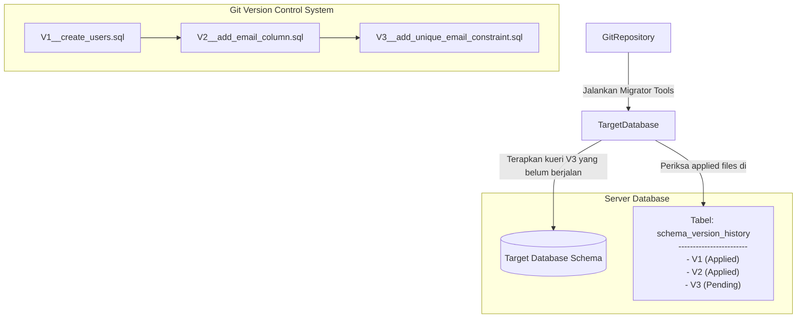

# 04 - BAB 04 VERSION CONTROL UNTUK SCHEMA

Status: DRAFT
Rak: PostgreSQL untuk Aplikasi
Buku: Migration Seed dan Versioning Schema
Level: Level 3 - Level 4
Tipe Materi: Tutorial
Target: Backend Developer yang menghubungkan aplikasi ke PostgreSQL.
Estimasi Baca: 10 Menit
Terakhir Diperiksa: 2026-05-18

Sumber Utama: PostgreSQL Official Documentation
Versi Referensi: PostgreSQL docs/current
Status Verifikasi Sumber: REVIEW

---

## 1. Tujuan Belajar
Di akhir bab ini, pembaca diharapkan mampu:
- Menjelaskan definisi dan pentingnya Schema Versioning dalam pengelolaan database aplikasi backend skala tim.
- Mengidentifikasi risiko-risiko kritis memodifikasi database secara manual langsung melalui GUI atau SQL Console tanpa pencatatan sejarah.
- Memaparkan kaitan erat antara konsep Schema Versioning dengan tools Database Migration.
- Menyusun alur kerja aman bagi tim developer saat melakukan modifikasi skema database secara berantai.
- Menuliskan kueri SQL dasar modifikasi skema menggunakan `ALTER TABLE` untuk menambah kolom dan constraint secara bertahap di PostgreSQL.

## 2. Prasyarat
- Memahami konsep dasar Database Migration (baca: [Apa Itu Database Migration](./bab-01-apa-itu-database-migration.md)).
- Memahami perbedaan antara seed data statis dengan dummy data (baca: [Seed Data vs Dummy Data dan Production Data](./bab-03-seed-data-vs-dummy-data-dan-production-data.md)).

## 3. Ringkasan Cepat
**Schema Versioning (Pemberian Versi Skema)** adalah praktik memperlakukan skema database sebagai aset kode sumber (*infrastructure as code*) yang memiliki nomor versi dan sejarah perubahan terurut. Setiap modifikasi struktur (seperti penambahan tabel baru, perubahan nama kolom, pemasangan constraint) didokumentasikan dalam bentuk berkas script perubahan versi terurut (migration files) yang disimpan di Git. Hal ini memastikan evolusi database dapat dilacak, direproduksi, dan diaudit secara otomatis di seluruh lingkungan (development, staging, dan production).

## 4. Istilah Penting di Bab Ini

| Istilah | Arti Singkat |
|---|---|
| Schema Versioning | Pendekatan melacak dan memberi nomor versi pada struktur database seiring waktu. |
| DDL (Data Definition Language) | Kelompok perintah SQL yang memodifikasi struktur database (CREATE, ALTER, DROP). |
| DML (Data Manipulation Language) | Kelompok perintah SQL yang memodifikasi isi data (INSERT, UPDATE, DELETE). |
| Schema Drift | Ketidaksesuaian struktur database antar komputer lokal developer dengan server produksi. |
| Migration History | Tabel pencatat internal dalam database yang menyimpan riwayat berkas migrasi mana saja yang sudah dijalankan. |

## 5. Analogi Sehari-hari
Bayangkan Anda adalah bagian dari tim arsitek yang sedang merancang dan memelihara **Candi Kuno yang Megah (Database Server)**:
- **Skema Database** adalah **Blueprint (Cetak Biru) Arsitektur Candi** tersebut.
- **Manual Database Editing (Klik GUI)** adalah tindakan developer diam-diam datang ke candi membawa palu di malam hari untuk memahat ruangan baru tanpa menggambar ulang blueprint resminya. Akibatnya, arsitek lain keesokan harinya akan kebingungan karena bentuk fisik candi tidak lagi cocok dengan blueprint kertas yang mereka bawa.
- **Schema Versioning** adalah **Sistem Cetak Biru Berlembar Terurut (Blueprint Versioning)**. Setiap ada perubahan ruangan, tim wajib mengeluarkan lembar blueprint tambahan: *Lembar 01 (Fondasi awal), Lembar 02 (Penambahan pilar gerbang), Lembar 03 (Pemasangan atap)*.
- Setiap kali ada candi replika baru yang ingin dibangun di kota lain (**lingkungan server baru**), tim pembangun cukup mengeksekusi blueprint lembar demi lembar secara berurutan. Hasil akhirnya dijamin 100% identik dan tidak ada deviasi arsitektur.

## 6. Batas Analogi
Di dunia arsitektur fisik, begitu semen basah gerbang candi sudah mengeras, sangat sulit untuk melakukan pembatalan (*rollback*) struktur tanpa menghancurkan fisik candi secara kasar.
Dalam PostgreSQL, setiap perintah modifikasi skema diatur secara elektronik. Melalui transaksi DDL yang didukung penuh oleh PostgreSQL, kita bisa menulis skrip pembatalan (*down-migration*) secara presisi, sehingga jika ada perubahan skema yang terbukti merusak sistem, server database dapat dikembalikan ke versi sebelumnya secara mulus dalam hitungan detik.

## 7. Ilustrasi Konsep

Status Ilustrasi: DRAFT



## 8. Penjelasan Ilustrasi
Visualisasi di atas menunjukkan cara kerja sistem Schema Versioning. Di dalam repositori Git, perubahan skema dicatat dalam berkas SQL terurut versi (`V1` sampai `V3`). Di dalam PostgreSQL, terdapat tabel pelacak internal (misal: `schema_version_history`). Ketika script dijalankan, tools migrasi akan membaca tabel pelacak tersebut untuk melihat versi berapa saja yang sudah diterapkan. Jika terdeteksi ada berkas baru (`V3` berstatus pending), PostgreSQL hanya akan mengeksekusi berkas `V3` tersebut untuk menaikkan versi skema target secara aman.

## 9. Batas Ilustrasi
Bagan di atas menyederhanakan alur migrasi dengan mengasumsikan kueri selalu sukses. Pada kenyataannya, jika ada kesalahan penulisan SQL di tengah-tengah berkas `V3`, PostgreSQL akan membatalkan seluruh isi berkas `V3` tersebut secara otomatis melalui fitur **Transactional DDL** (sehingga versi database tidak menggantung di kondisi setengah rusak), asalkan kueri tersebut tidak melibatkan perintah non-transactional (seperti `VACUUM` atau modifikasi index tertentu secara concurrently).

---

## 10. Konsep Inti

### Mengapa Schema Database Perlu Riwayat Perubahan?
1. **Mencegah Masalah Schema Drift**: Menjamin database di laptop developer, server testing, dan server produksi berjalan pada versi struktur yang sama persis tanpa ada kolom misterius yang tertinggal.
2. **Kebutuhan Continuous Deployment (CI/CD)**: Memungkinkan server deployment otomatis untuk memperbarui database produksi di cloud secara mandiri tanpa membutuhkan intervensi manual (klik pgAdmin) dari DBA di tengah malam.
3. **Auditability (Kemudahan Audit)**: Memudahkan tim keamanan melacak siapa yang membuat kolom tertentu, kapan kolom itu ditambahkan, dan mengapa constraint tersebut dipasang, cukup dengan melihat riwayat komit Git.

### Bahaya Mengubah Database Manual Langsung dari GUI / SQL Console
Melakukan modifikasi database secara langsung dengan cara mengklik tombol pgAdmin/DBeaver di server produksi, atau menjalankan query `ALTER TABLE` langsung tanpa berkas migrasi, adalah tindakan yang sangat berbahaya bagi tim:
- **Timbulnya "Ghost Changes" (Perubahan Hantu)**: Perubahan skema tersebut tidak tercatat di file kode program proyek. Ketika aplikasi dideploy ulang, aplikasi akan crash karena struktur di server berbeda dengan kode program lokal.
- **Kehilangan Kemampuan Replikasi**: Lingkungan server testing baru tidak akan bisa menduplikasi database produksi karena tidak ada berkas catatan cara membuat kolom manual tersebut.
- **Rollback yang Tidak Mungkin Dilakukan**: Jika modifikasi manual tersebut merusak performa query, tidak ada cara otomatis untuk membatalkan perubahan tersebut dengan cepat.

---

## 11. Penjelasan Detail

### Perbedaan Konseptual Perubahan Skema vs Perubahan Data
Penting untuk selalu memisahkan perubahan struktur database dengan perubahan isi database:

#### A. Perubahan Skema (Schema Changes - DDL)
Berorientasi pada **wadah/definisi data**.
- **Sintaksis**: `CREATE TABLE`, `ALTER TABLE`, `DROP COLUMN`, `CREATE INDEX`.
- **Dampak**: Memengaruhi metadata PostgreSQL. Wajib melintasi semua lingkungan melalui version control secara identik.

#### B. Perubahan Data (Data Changes - DML)
Berorientasi pada **konten/isi data** di dalam wadah tersebut.
- **Sintaksis**: `INSERT`, `UPDATE`, `DELETE`.
- **Dampak**: Hanya mengubah baris data fisik. Seeding dummy data atau pembersihan data uji hanya dilakukan lokal, tidak boleh menyentuh server produksi.

---

## 12. Contoh SQL Dasar
Berikut adalah cara mendefinisikan rangkaian berkas versioning terurut secara bertahap untuk mencatat perubahan skema database PostgreSQL secara aman:

```sql
-- =======================================================
-- BERKAS 1: V1__inisialisasi_tabel_produk.sql
-- =======================================================
CREATE TABLE products (
    product_id INT GENERATED ALWAYS AS IDENTITY PRIMARY KEY,
    product_name VARCHAR(150) NOT NULL,
    price NUMERIC(12,2) NOT NULL
);

-- =======================================================
-- BERKAS 2: V2__tambah_kolom_stok.sql
-- =======================================================
-- Menambahkan kolom stok baru dengan nilai default 0
ALTER TABLE products ADD COLUMN stock INT NOT NULL DEFAULT 0;

-- =======================================================
-- BERKAS 3: V3__tambah_constraint_harga_positif.sql
-- =======================================================
-- Menambahkan CHECK constraint agar harga produk tidak minus
ALTER TABLE products ADD CONSTRAINT chk_positive_price CHECK (price >= 0);
```

---

## 13. Contoh SQL Praktik Project
Dalam skenario migrasi tim nyata, kita terkadang harus memecah migrasi yang kompleks menjadi fase yang aman untuk menghindari database terkunci (*table lock*) dalam waktu lama pada tabel produksi berskala besar.
Berikut adalah contoh mengubah nama kolom secara aman dengan teknik **Add $\rightarrow$ Copy $\rightarrow$ Deprecate**:

```sql
-- [Skenario: Mengubah nama kolom 'telepon' menjadi 'nomor_hp' di tabel users]

-- FASE 1: Tambahkan kolom baru tanpa menghapus kolom lama
-- Hal ini menjamin aplikasi versi lama yang masih aktif berjalan tidak crash
ALTER TABLE users ADD COLUMN nomor_hp VARCHAR(20);

-- FASE 2: Jalankan kueri data migration untuk menyalin data dari kolom lama ke kolom baru
-- (Ini adalah perintah DML yang diselipkan dalam alur deployment)
UPDATE users SET nomor_hp = telepon WHERE nomor_hp IS NULL;

-- FASE 3: Tambahkan NOT NULL constraint ke kolom baru setelah semua data tersalin
ALTER TABLE users ALTER COLUMN nomor_hp SET NOT NULL;

-- FASE 4: (Setelah aplikasi versi baru 100% stabil) Hapus kolom lama
ALTER TABLE users DROP COLUMN telepon;
```

---

## 14. Kesalahan Umum
- **Menggabungkan Kueri Skema dan Transaksi Data dalam Satu Berkas Besar**: Mencampur perintah `ALTER TABLE` dengan kueri `INSERT` data dummy 1 juta baris. Jika proses data insertion gagal, PostgreSQL terpaksa melakukan rollback struktur skema yang sudah dibangun, menyebabkan kondisi database membingungkan.
- **Menggunakan Nama Berkas Migrasi yang Tumpang Tindih**: Menamai berkas migrasi tanpa timestamps atau nomor urut teratur (misal: `migrasi_baru.sql` dan `migrasi_terbaru.sql`). Hal ini membuat sistem version control gagal mendeteksi urutan eksekusi yang benar. Gunakan format standar: `V1__nama.sql`, `V2__nama.sql`, atau menggunakan timestamp `20260518210000_nama.sql`.
- **Mengubah Kolom yang Sedang Digunakan Fitur Live Tanpa Rencana Cadangan**: Langsung membuang (*dropping*) kolom `telepon` saat fitur checkout transaksi di server produksi masih mengakses kolom tersebut, memicu *downtime* sistem seketika.

---

## 15. Catatan Interview
- **Pertanyaan**: "Apa yang dimaksud dengan Schema Drift, dan bagaimana cara Schema Versioning mengatasinya?"
- **Jawaban**: "Schema Drift adalah kondisi di mana struktur skema database di server produksi berbeda dengan laptop developer karena adanya perubahan manual yang tidak tercatat. Schema Versioning mengatasi hal ini dengan mewajibkan seluruh perubahan skema ditulis ke dalam berkas migrasi terurut versi yang disimpan di Git. Tools migrasi kemudian membandingkan riwayat versi di database target dengan berkas di repositori untuk secara otomatis menyamakan versi struktur tanpa intervensi manual."

---

## 16. Catatan Diskusi User
- **Pertanyaan Umum**: "Apakah kita perlu menulis berkas migrasi rollback (`down-migration`) untuk setiap berkas perubahan skema (`up-migration`)?"
- **Diskusikan**: Menulis berkas rollback (`down`) sangat berguna saat fase development awal untuk mempermudah developer maju-mundur versi skema secara lokal. Namun di lingkungan produksi berskala besar, mematikan sistem dengan melakukan rollback otomatis skema database (terutama yang membuang kolom) sangat berisiko merusak data komersial aktif. Pilihan terbaik di produksi adalah selalu melakukan **Forward Roll (Roll-forward)**, yaitu membuat berkas migrasi baru untuk memperbaiki masalah yang ditimbulkan oleh migrasi sebelumnya.

---

## 17. Latihan Kecil
1. Tuliskan berkas migrasi SQL versi `V4` untuk menambahkan kolom bertipe teks `deskripsi` ke tabel `products` (yang didefinisikan di Bab 12) dengan nilai default `'Tidak ada deskripsi'`!
2. Mengapa merubah tipe data kolom (misalnya dari `INT` menjadi `VARCHAR`) pada tabel yang memuat jutaan baris data di PostgreSQL produksi membutuhkan kehati-hatian ekstra dibanding sekadar menambah kolom baru?

---

## 18. Checklist Pemahaman
- [ ] Memahami arti konseptual, keuntungan, dan urgensi penerapan Schema Versioning.
- [ ] Mengetahui risiko fatal melakukan edit database secara langsung menggunakan GUI (pgAdmin/DBeaver) di server produksi.
- [ ] Mampu menuliskan script SQL DDL terurut versi (`V1`, `V2`, `V3`) menggunakan `ALTER TABLE` dan key constraints di PostgreSQL.
- [ ] Memahami cara kerja tabel riwayat internal (`migration history table`) dalam melacak kemajuan versi database.

---

## 19. Hubungan dengan Materi Lain

### Posisi Materi
- Rak: [04 - PostgreSQL untuk Aplikasi](../../README.md)
- Buku: [Migration Seed dan Versioning Schema](../)

### Prasyarat
- [Apa Itu Database Migration](./bab-01-apa-itu-database-migration.md)
- [Data Seeding Dasar](./bab-02-data-seeding-dasar.md)
- [Seed Data vs Dummy Data dan Production Data](./bab-03-seed-data-vs-dummy-data-dan-production-data.md)

### Materi Sebelumnya
- [Seed Data vs Dummy Data dan Production Data](./bab-03-seed-data-vs-dummy-data-dan-production-data.md)

### Materi Berikutnya
- [Kembali ke Jalur Belajar Utama](../../00-index-dan-jalur-belajar/jalur-belajar-level-0-sampai-4.md)

### Materi Terkait
- [Administrasi DBA dan Operasional](../../08-administrasi-dba-dan-operasional/) (Tugas DBA melakukan pemantauan table lock saat migrasi berjalan)

### Istilah Terkait
- Schema Versioning, DDL Transaction, Schema Drift, Blueprint Versioning, Migration History, ALTER TABLE.

---

## 20. Referensi Resmi
Jangan membuka tautan berikut pada batch ini, cukup cantumkan sebagai referensi resmi yang ditargetkan untuk verifikasi nanti:
- PostgreSQL Official Documentation - System Catalogs (pg_namespace, pg_class)
  https://www.postgresql.org/docs/current/catalogs.html
- PostgreSQL Official Documentation - ALTER TABLE
  https://www.postgresql.org/docs/current/sql-altertable.html

---

## 21. Catatan Pribadi / Project Notes
*   *Catatan Draft*: Tekankan konsep "Infrastructure as Code" dalam bab ini. Dorong pemikiran developer agar selalu disiplin menggunakan berkas migrasi terurut dan melarang modifikasi langsung via pgAdmin. Status verifikasi diatur ke REVIEW.
