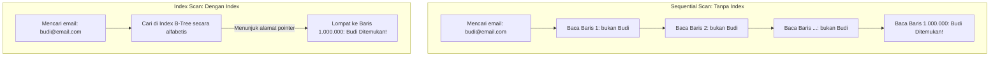

# 01 - BAB 01 APA ITU INDEX DATABASE

Status: DRAFT
Rak: Indexing, Query Planner, dan Performance
Buku: Indexing Dasar untuk Developer
Level: Level 3 - Level 4
Tipe Materi: Pengantar
Target: Backend Developer yang menghubungkan aplikasi ke PostgreSQL.
Estimasi Baca: 10 Menit
Terakhir Diperiksa: 2026-05-18

Sumber Utama: PostgreSQL Official Documentation
Versi Referensi: PostgreSQL docs/current
Status Verifikasi Sumber: REVIEW

---

## 1. Tujuan Belajar
Di akhir bab ini, pembaca diharapkan mampu:
- Menjelaskan definisi dan fungsi utama Indeks Database bagi performa kueri.
- Memaparkan mental model indeks database menggunakan analogi daftar isi buku dan katalog perpustakaan.
- Membedakan alur kerja PostgreSQL saat melakukan pencarian tanpa indeks (*Sequential Scan*) dengan menggunakan indeks (*Index Scan*) secara sederhana.
- Mengidentifikasi biaya-biaya (*overhead*) penerapan indeks dari sisi ruang penyimpanan disk dan kecepatan operasi penulisan data.
- Menuliskan sintaksis dasar pembuatan indeks menggunakan `CREATE INDEX` di PostgreSQL.

## 2. Prasyarat
- Memahami dasar kueri SELECT dan filter data (baca: [Klausa WHERE Dasar](../../02-sql-dan-querying/buku-02-filtering-sorting-dan-limit/bab-01-klausa-where-dasar.md)).
- Memahami konsep kueri aplikasi list dan detail (baca: [Query untuk List dan Detail Data Aplikasi](../../04-postgresql-untuk-aplikasi/buku-01-postgresql-dalam-backend-application/bab-04-query-untuk-list-dan-detail-data-aplikasi.md)).

## 3. Ringkasan Cepat
Seiring pertumbuhan data dalam aplikasi backend, kueri pembacaan data (`SELECT`) dapat berjalan semakin lambat. Tanpa optimasi, mesin PostgreSQL terpaksa memindai setiap baris data di dalam disk dari baris pertama hingga terakhir (**Sequential Scan**) hanya untuk mencari satu data spesifik. **Index Database** menyelesaikan masalah ini dengan membuat struktur data pencarian terurut sekunder di luar tabel utama. Indeks berfungsi sebagai peta alamat cepat yang memandu PostgreSQL langsung ke lokasi penyimpanan baris data target (**Index Scan**), mempercepat pencarian data secara dramatis dalam banyak kasus operasional.

## 4. Istilah Penting di Bab Ini

| Istilah | Arti Singkat |
|---|---|
| Index | Struktur data pembantu terurut untuk mempercepat pencarian baris dalam database. |
| Sequential Scan (Seq Scan) | Metode pencarian data dengan membaca seluruh baris tabel secara berurutan (lambat pada tabel besar). |
| Index Scan | Metode pencarian data presisi memanfaatkan indeks untuk langsung melompat ke baris target (cepat). |
| Write Overhead | Penurunan kecepatan operasi INSERT/UPDATE/DELETE karena database harus memperbarui struktur indeks. |
| B-Tree Index | Jenis indeks default dan terpopuler di PostgreSQL yang menyusun data dalam bentuk pohon seimbang. |

## 5. Analogi Sehari-hari
Bayangkan Anda sedang mencari informasi resep masakan di dalam **Buku Rekayasa Kuliner Setebal 1000 Halaman (Tabel Database)**:
- **Pencarian Tanpa Indeks (Sequential Scan)** adalah tindakan Anda **membuka halaman buku satu per satu mulai dari halaman 1, 2, 3, hingga halaman 1000** hanya untuk mencari kata "Rendang Sapi". Jika resep tersebut ternyata dicetak di halaman 998, Anda terpaksa membuang waktu membaca 997 halaman yang tidak relevan terlebih dahulu.
- **Pencarian Dengan Indeks (Index Scan)** adalah tindakan Anda **langsung membuka halaman paling belakang buku**, menuju ke lembaran **Daftar Isi / Indeks Kata Kunci (Index Database)**. Di sana, kata "Rendang" diurutkan secara alfabetis (R) dengan sangat cepat, dan di sampingnya tertulis petunjuk halaman: *Halaman 998*. Anda langsung menutup halaman indeks tersebut, lalu dengan satu gerakan jari jempol langsung membuka halaman 998 secara presisi.

## 6. Batas Analogi
Di buku cetak fisik, daftar isi halaman belakang merupakan bagian halaman kertas yang sama dan statis dari buku tersebut. Di dalam database PostgreSQL, indeks disimpan sebagai berkas biner terpisah di disk penyimpanan yang secara dinamis diperbarui oleh sistem setiap milidetik ketika ada data baru dimasukkan ke dalam tabel utama.

## 7. Ilustrasi Konsep

Status Ilustrasi: DRAFT



## 8. Penjelasan Ilustrasi
Bagan di atas menggambarkan perbedaan dramatis alur pencarian data. Di Skenario A (tanpa indeks), PostgreSQL harus memindai seluruh jutaan baris data secara fisik dari disk. Di Skenario B (dengan indeks), PostgreSQL melakukan pencarian cepat di dalam indeks B-Tree yang ukurannya jauh lebih kecil dan rapi, lalu menggunakan alamat pointer untuk langsung menarik baris yang dituju.

## 9. Batas Ilustrasi
Bagan di atas memberikan kesan bahwa indeks selalu lebih baik. Namun, visualisasi ini menyembunyikan kenyataan bahwa jika tabel tersebut sangat kecil (misal hanya memuat 5 baris data), PostgreSQL akan sengaja mengabaikan indeks dan memilih Sequential Scan karena membaca 5 baris langsung jauh lebih cepat daripada memuat berkas indeks terpisah terlebih dahulu.

---

## 10. Konsep Inti

### Kenapa Kita Membutuhkan Indeks?
Tanpa indeks, performa kueri aplikasi kita akan menurun secara linear seiring bertambahnya jumlah pengguna dan transaksi.
- **Tabel Kecil (100 baris)**: Sequential scan berjalan instan.
- **Tabel Menengah (10.000 baris)**: Perbedaan kecepatan mulai terasa di milidetik awal.
- **Tabel Raksasa (1.000.000+ baris)**: Sequential scan dapat membekukan aplikasi karena memaksa CPU database bekerja ekstra keras memindai seluruh penyimpanan disk.

### Biaya Penerapan Indeks (The Cost of Indexing)
Indeks bukanlah solusi ajaib gratis tanpa konsekuensi. Backend developer wajib memahami biaya tersembunyi ini:
1. **Penyimpanan Disk Tambahan (Storage Overhead)**: Indeks membutuhkan ruang disk tambahan di server database. Dalam beberapa kasus dengan banyak indeks di satu tabel, ukuran berkas indeks bisa lebih besar daripada ukuran tabel fisik data itu sendiri.
2. **Penurunan Kecepatan Tulis (Write Overhead)**: Setiap kali aplikasi backend mengeksekusi `INSERT` data baru, `UPDATE` kolom terindeks, atau `DELETE` baris, PostgreSQL terpaksa melakukan pekerjaan ganda: memodifikasi tabel utama sekaligus menyusun ulang pohon indeks agar tetap terurut.
3. **Perawatan Database**: Indeks yang terlalu sering dimodifikasi dapat mengalami fragmentasi (celah kosong), sehingga memerlukan perawatan berkala (*vacuum* atau *reindex*) agar performanya tetap optimal.

---

## 11. Penjelasan Detail
Di tingkat pengantar ini, kita fokus pada indeks jenis **B-Tree (Balanced Tree)** yang dipasang secara otomatis oleh PostgreSQL saat kita mendefinisikan Primary Key atau Unique Constraint pada suatu kolom.
- **Indeks B-Tree**: Menyusun data secara seimbang sehingga pencarian, pengurutan, dan pencarian rentang (*range queries*) berjalan dalam waktu yang relatif konstan dan sangat efisien.
- **Batasan**: Di tingkat awal-menengah ini, kita belum masuk ke pembahasan optimasi mendalam menggunakan jenis indeks khusus (seperti GIN untuk JSONB, GiST untuk data spasial, atau BRIN untuk log transaksi raksasa) maupun teknik *Partial Indexing* yang memerlukan analisis kueri planner tingkat lanjut.

---

## 12. Contoh SQL Dasar
Berikut adalah sintaksis SQL dasar untuk membuat dan menghapus indeks di PostgreSQL:

```sql
-- [SKENARIO: MEMPERCEPAT PENCARIAN USER BERDASARKAN EMAIL]

-- Langkah 1: Membuat indeks B-Tree standar pada kolom email tabel users
CREATE INDEX idx_users_email ON users(email);

-- Catatan: PostgreSQL secara dinamis akan mendaftarkan seluruh email 
-- yang sudah ada ke dalam struktur indeks baru ini.

-- Langkah 2: Menghapus indeks jika sudah tidak dibutuhkan lagi
DROP INDEX idx_users_email;
```

---

## 13. Contoh SQL Praktik Project
Dalam project backend komersial, indeks umumnya direkomendasikan untuk dipasang pada kolom relasi (Foreign Key) yang sangat sering digunakan dalam kueri `JOIN` untuk menampilkan halaman transaksi:

```sql
-- [SKENARIO: OPTIMASI HALAMAN TRANSAKSI E-COMMERCE]
-- Kolom user_id di tabel orders adalah foreign key yang sering dipanggil 
-- dalam kueri filter customer.

-- 1. Buat indeks pada foreign key user_id
CREATE INDEX idx_orders_user_id ON orders(user_id);

-- 2. Buat indeks pada kolom tanggal transaksi untuk mempercepat laporan bulanan
CREATE INDEX idx_orders_created_at ON orders(created_at);
```

---

## 14. Kesalahan Umum
- **Memasang Indeks di Semua Kolom Tabel**: Berpikir bahwa "semakin banyak indeks, aplikasi akan semakin cepat". Hal ini justru akan melumpuhkan performa operasi tulis (`INSERT`/`UPDATE`) dan menghabiskan ruang penyimpanan disk server secara sia-sia.
- **Membuat Indeks pada Tabel Sangat Kecil**: Membuat indeks pada tabel status yang hanya memuat 3 baris data (misal status pesanan: `'PENDING'`, `'SHIPPED'`, `'DELIVERED'`). PostgreSQL tidak akan pernah menggunakan indeks tersebut karena sequential scan jauh lebih efisien.
- **Lupa Membuat Indeks pada Kolom Foreign Key**: Mengabaikan indeks pada foreign key. Hal ini menyebabkan kueri `JOIN` atau pencarian detail berantai berjalan lambat saat data transaksi mulai membesar.

---

## 15. Catatan Interview
- **Pertanyaan**: "Apakah kita sebaiknya membuat indeks pada setiap kolom di dalam tabel database kita?"
- **Jawaban**: "Tidak, itu adalah praktik buruk yang sebaiknya dihindari. Meskipun indeks mempercepat kueri pembacaan data (`SELECT`), indeks memiliki biaya penyimpanan disk tambahan dan menurunkan performa kueri penulisan data (`INSERT`, `UPDATE`, `DELETE`). Hal ini terjadi karena PostgreSQL terpaksa menyusun ulang struktur indeks setiap kali data dimodifikasi. Indeks sebaiknya hanya dipasang secara selektif pada kolom-kolom yang sangat sering masuk ke filter `WHERE`, `JOIN`, atau pengurutan `ORDER BY`."

---

## 16. Catatan Diskusi User
- **Pertanyaan Umum**: "Apakah kolom Primary Key otomatis memiliki indeks di PostgreSQL?"
- **Diskusikan**: Ya, PostgreSQL secara otomatis membuat indeks unik B-Tree di latar belakang untuk setiap kolom yang didefinisikan sebagai `PRIMARY KEY` atau memiliki constraint `UNIQUE`. Oleh karena itu, kita tidak perlu (dan sebaiknya dihindari) membuat indeks manual tambahan pada kolom-kolom kunci utama tersebut.

---

## 17. Latihan Kecil
1. Tuliskan query SQL PostgreSQL untuk membuat indeks bernama `idx_products_price` pada tabel `products` untuk kolom `price`!
2. Jika sebuah kueri SELECT berjalan lambat, jelaskan secara konseptual mengapa menambahkan indeks belum tentu menyelesaikan masalah jika data tabel tersebut ternyata hanya berjumlah 10 baris!

---

## 18. Checklist Pemahaman
- [ ] Memahami definisi, fungsi, dan mental model indeks database.
- [ ] Mampu membedakan karakteristik pencarian Sequential Scan dengan Index Scan secara konseptual.
- [ ] Mengetahui biaya-biaya overhead penyimpanan disk dan kecepatan tulis dari penerapan indeks.
- [ ] Mampu menuliskan sintaksis dasar `CREATE INDEX` dan `DROP INDEX` di PostgreSQL.
- [ ] Memahami bahwa Primary Key dan Unique constraint otomatis dibuatkan indeks oleh PostgreSQL.

---

## 19. Hubungan dengan Materi Lain

### Posisi Materi
- Rak: [07 - Indexing, Query Planner, dan Performance](../../README.md)
- Buku: [Indexing Dasar untuk Developer](../)

### Prasyarat
- [Klausa WHERE Dasar](../../02-sql-dan-querying/buku-02-filtering-sorting-dan-limit/bab-01-klausa-where-dasar.md)
- [Query untuk List dan Detail Data Aplikasi](../../04-postgresql-untuk-aplikasi/buku-01-postgresql-dalam-backend-application/bab-04-query-untuk-list-dan-detail-data-aplikasi.md)

### Materi Sebelumnya
- [BEGIN, COMMIT, dan ROLLBACK](../../04-postgresql-untuk-aplikasi/buku-01-postgresql-dalam-backend-application/bab-07-begin-commit-dan-rollback.md)

### Materi Berikutnya
- [Kapan Index Membantu Query](./bab-02-kapan-index-membantu-query.md)

### Materi Terkait
- [Pentingnya Primary Key](../../03-desain-data-dan-schema/buku-02-primary-key-foreign-key-dan-constraint/bab-01-pentingnya-primary-key.md) (Pemicu pembuatan indeks unik otomatis)

### Istilah Terkait
- Database Index, Sequential Scan, Index Scan, Write Overhead, Storage Overhead, B-Tree Structure.

---

## 20. Referensi Resmi
Jangan membuka tautan berikut pada batch ini, cukup cantumkan sebagai referensi resmi yang ditargetkan untuk verifikasi nanti:
- PostgreSQL Official Documentation - Indexes
  https://www.postgresql.org/docs/current/indexes.html
- PostgreSQL Official Documentation - CREATE INDEX
  https://www.postgresql.org/docs/current/sql-createindex.html

---

## 21. Catatan Pribadi / Project Notes
*   *Catatan Draft*: Tekankan mental model daftar isi buku halaman belakang agar pembaca langsung paham cara kerja pointer indeks tanpa terjebak teori struktur data pohon seimbang yang terlalu teoretis di tingkat awal. Status verifikasi diatur ke REVIEW.
