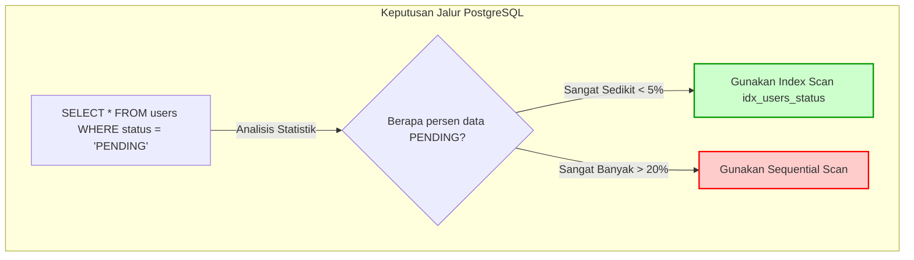

# 02 - BAB 02 KAPAN INDEX MEMBANTU QUERY

Status: DRAFT
Rak: Indexing, Query Planner, dan Performance
Buku: Indexing Dasar untuk Developer
Level: Level 3 - Level 4
Tipe Materi: Pengantar
Target: Backend Developer yang menghubungkan aplikasi ke PostgreSQL.
Estimasi Baca: 10 Menit
Terakhir Diperiksa: 2026-05-18

Sumber Utama: PostgreSQL Official Documentation
Versi Referensi: PostgreSQL docs/current
Status Verifikasi Sumber: REVIEW

---

## 1. Tujuan Belajar
Di akhir bab ini, pembaca diharapkan mampu:
- Menganalisis kriteria kueri SQL yang biasanya mendapat manfaat performa tinggi dari penerapan indeks.
- Mengidentifikasi efektivitas indeks pada kolom filter `WHERE`, pengurutan `ORDER BY`, relasi `JOIN`, dan lookup foreign key.
- Menjelaskan kondisi-kondisi spesifik di mana indeks diabaikan oleh query planner database (misalnya tabel kecil atau kueri dengan selektivitas rendah).
- Mengartikan bahaya performa penulisan data akibat over-indexing (indeks berlebihan).
- Merumuskan jawaban profesional untuk wawancara kerja mengenai kelayakan pembuatan indeks.

## 2. Prasyarat
- Memahami konsep dasar indeks database (baca: [Apa Itu Index Database](./bab-01-apa-itu-index-database.md)).
- Memahami query filter, sorting, dan pagination aplikasi (baca: [Query untuk Filter, Sorting, dan Pagination](../../04-postgresql-untuk-aplikasi/buku-01-postgresql-dalam-backend-application/bab-05-query-untuk-filter-sorting-dan-pagination.md)).

## 3. Ringkasan Cepat
Membuat indeks pada database tidak secara otomatis membuat seluruh kueri berjalan lebih cepat. Indeks adalah alat bantu selektif. Indeks **biasanya membantu** kueri yang menyaring sejumlah kecil baris dari tabel besar (seperti pencarian berdasarkan email unik atau filter status transaksi spesifik), kueri pengurutan yang cocok dengan arah indeks, serta kolom relasi yang sering digabungkan via `JOIN`. Sebaliknya, indeks **tidak banyak membantu** (dan bahkan diabaikan oleh PostgreSQL) pada tabel-tabel kecil atau kueri yang menarik sebagian besar isi tabel, karena sequential scan langsung terbukti jauh lebih murah.

## 4. Istilah Penting di Bab Ini

| Istilah | Arti Singkat |
|---|---|
| Query Planner | Komponen internal PostgreSQL yang menganalisis kueri dan menentukan cara tercepat untuk menarik data. |
| Selectivity (Selektivitas) | Ukuran seberapa banyak baris data yang disaring oleh kueri dibanding total baris tabel. |
| High Selectivity | Kondisi kueri yang menyaring sangat sedikit baris data presisi (sangat bagus untuk indeks). |
| Low Selectivity | Kondisi kueri yang menyaring sebagian besar data tabel (indeks biasanya diabaikan). |
| Over-indexing | Praktik buruk membuat indeks pada terlalu banyak kolom tabel, merusak performa penulisan. |

## 5. Analogi Sehari-hari
Bayangkan Anda sedang mencari informasi di dalam **Gudang Arsip Dokumen Kertas (Database Server)**:
- **Kueri Selektivitas Tinggi (Index Sangat Membantu)**: Anda datang ke petugas arsip dengan membawa **Nomor KTP Spesifik (Email Unik)** dan meminta dokumen orang tersebut. Petugas melihat kartu indeks kecil di mejanya, melompat ke lemari C rak 4, lalu menyerahkan map tersebut dalam 5 detik. Indeks sangat mempercepat pencarian.
- **Kueri Selektivitas Rendah (Index Diabaikan)**: Anda meminta dokumen **seluruh warga yang berjenis kelamin Laki-laki atau Perempuan (Kolom Gender)**. Karena kelompok data ini memuat hampir 99% dari seluruh isi gudang arsip, membaca kartu indeks satu per satu justru akan memperlambat kerja petugas. Petugas akan mengabaikan kartu indeks dan langsung berjalan menelusuri lemari arsip secara berurutan baris demi baris (**Sequential Scan**) karena ia tahu ia terpaksa harus menarik hampir semua dokumen di gudang tersebut.

## 6. Batas Analogi
Di dunia fisik, petugas arsip manusia mungkin kebingungan menentukan kapan harus mengabaikan indeks. Di dalam PostgreSQL, keputusan ini diambil secara matematis oleh **Query Planner** menggunakan statistik persebaran data tabel yang diperbarui secara dinamis di latar belakang.

## 7. Ilustrasi Konsep

Status Ilustrasi: DRAFT



## 8. Penjelasan Ilustrasi
Bagan di atas memvisualisasikan bagaimana PostgreSQL Query Planner mengambil keputusan secara dinamis sebelum menjalankan kueri. Jika status `'PENDING'` hanya mewakili sebagian kecil baris data (selektivitas tinggi), PostgreSQL akan memilih menggunakan indeks. Namun jika status `'PENDING'` mewakili mayoritas data tabel (selektivitas rendah), PostgreSQL secara cerdas mengabaikan indeks dan langsung melakukan pemindaian berurutan (*Sequential Scan*).

## 9. Batas Ilustrasi
Bagan di atas menyederhanakan ambang batas keputusan query planner. Keputusan ril query planner melibatkan estimasi biaya I/O disk yang rumit, ukuran halaman memori RAM, tingkat fragmentasi indeks, serta apakah kolom tersebut merupakan primary key atau bukan.

---

## 10. Konsep Inti

### Kapan Indeks Biasanya Membantu Performa Query?
Developerbackend sebaiknya memprioritaskan pembuatan indeks pada pola-pola kueri berikut:

1. **Penyaringan Presisi Tinggi (Highly Selective WHERE)**
   Kueri yang menyaring data spesifik pada kolom yang memiliki banyak nilai unik (seperti username, email, nomor induk, nomor telepon).
   ```sql
   SELECT * FROM users WHERE email = 'budi@email.com';
   ```

2. **Kueri Pencarian Detail Relasional (Foreign Key Lookup)**
   Kolom-kolom kunci asing yang digunakan untuk menghubungkan satu tabel ke tabel lain. Indeks di sini sangat membantu performa kueri `JOIN`.
   ```sql
   SELECT * FROM orders WHERE user_id = 45;
   ```

3. **Pengurutan Terpilih (ORDER BY Terarah)**
   Kueri list yang membutuhkan pengurutan data teratur. Jika indeks dibuat pada kolom tersebut, PostgreSQL dapat langsung membaca data yang sudah terurut rapi di dalam indeks tanpa perlu melakukan operasi pengurutan memori (*internal sort*) yang membebani CPU.
   ```sql
   SELECT product_id, product_name FROM products ORDER BY price ASC LIMIT 10;
   ```

### Kapan Indeks Tidak Banyak Membantu (Diabaikan)?
Ada kalanya indeks yang kita buat tidak akan pernah disentuh oleh PostgreSQL:
- **Tabel Terlalu Kecil**: Jika tabel hanya memuat puluhan atau ratusan baris data.
- **Nilai Unik Sangat Sedikit (Low Cardinality)**: Seperti kolom `gender` (hanya `'L'` atau `'P'`) atau kolom `is_active` (hanya `TRUE` atau `FALSE`).
- **Kueri yang Menarik Terlalu Banyak Baris**: Kueri yang menghasilkan lebih dari 15-20% dari total baris tabel. PostgreSQL Planner akan menyimpulkan bahwa melompati indeks dan langsung memindai tabel secara fisik (Seq Scan) jauh lebih murah.
- **Kueri yang Memanipulasi Kolom Terindeks**: Menggunakan fungsi pada kolom yang terindeks di klausa `WHERE`.
  ```sql
  -- Indeks pada kolom created_at akan diabaikan karena kolom dibungkus fungsi DATE()
  SELECT * FROM orders WHERE DATE(created_at) = '2026-05-18';
  ```

---

## 11. Penjelasan Detail
Pemilihan kolom untuk indeks harus disesuaikan dengan pola akses data aplikasi backend:
- **Analisis Kueri Terlebih Dahulu**: Jangan terburu-buru membuat indeks sebelum kueri aplikasi backend Anda selesai dirancang. Pasang indeks hanya setelah Anda mengetahui kolom mana saja yang menjadi parameter filter utama di endpoint API Anda.
- **Risiko Over-indexing**: Membuat indeks pada kolom `created_at`, `status`, `price`, `name`, `stock` secara membabi buta di satu tabel akan memperlambat proses checkout belanjaan (operasi `INSERT` ke tabel tersebut) karena database sibuk memelihara 5 indeks sekunder sekaligus.

---

## 12. Contoh SQL Dasar
Simulasi kueri yang mendapat manfaat penuh dari pembuatan indeks selektif di PostgreSQL:

```sql
-- [SKENARIO A: OPTIMASI FILTER STATUS PESANAN AKAN DIKIRIM]
-- Di tabel orders raksasa (1 juta baris), status 'PROCESSED' hanya memuat 500 baris.

-- Pembuatan indeks selektif
CREATE INDEX idx_orders_status ON orders(status);

-- Kueri di bawah ini biasanya akan menggunakan Index Scan dengan sangat efisien
SELECT order_id, total_price 
FROM orders 
WHERE status = 'PROCESSED';
```

---

## 13. Contoh SQL Praktik Project
Berikut adalah praktik optimasi kueri join e-commerce yang menggabungkan indeks pada foreign key dan filter rentang tanggal laporan penjualan bulanan:

```sql
-- [SKENARIO B: LAPORAN PENJUALAN BULANAN SALES DEPARTEMENT]

-- Langkah 1: Buat indeks pendukung relasi dan tanggal
CREATE INDEX idx_order_items_product_id ON order_items(product_id);
CREATE INDEX idx_orders_order_date ON orders(order_date);

-- Langkah 2: Eksekusi kueri laporan bulanan teroptimasi
-- PostgreSQL biasanya akan memproses kueri ini memanfaatkan kedua indeks di atas 
-- untuk menghindari scan fisik penuh pada tabel orders dan order_items yang besar.
SELECT 
    p.product_name,
    SUM(oi.quantity) AS total_sold,
    SUM(oi.quantity * oi.price_at_purchase) AS total_revenue
FROM orders o
INNER JOIN order_items oi ON o.order_id = oi.order_id
INNER JOIN products p ON oi.product_id = p.product_id
WHERE o.order_date >= '2026-05-01' AND o.order_date <= '2026-05-31'
GROUP BY p.product_name
ORDER BY total_revenue DESC;
```

---

## 14. Kesalahan Umum
- **Menggunakan Fungsi pada Klausa WHERE Terindeks**: Menuliskan kueri `LOWER(username) = 'budi'` padahal indeks dipasang pada kolom `username` biasa tanpa fungsi `LOWER`. PostgreSQL terpaksa mematikan penggunaan indeks dan melakukan Seq Scan penuh.
- **Indeks yang Tidak Sesuai Urutan Kolom Kueri**: Membuat indeks gabungan (*Composite Index*) pada kolom `(first_name, last_name)`, namun melakukan kueri pencarian hanya menggunakan filter `WHERE last_name = 'Setiawan'`. PostgreSQL tidak akan menggunakan indeks tersebut karena kolom pertama (`first_name`) dilewati.
- **Mengasumsikan Indeks Selalu Digunakan**: Tidak melakukan pemeriksaan ulang performa kueri menggunakan peralatan analisis internal pada tahap pengembangan backend lanjutan.

---

## 15. Catatan Interview
- **Pertanyaan**: "Bagaimana kita bisa menentukan apakah suatu indeks yang kita buat benar-benar digunakan oleh PostgreSQL untuk kueri kita atau tidak?"
- **Jawaban**: "Untuk mengetahuinya secara pasti, kita perlu memverifikasi kueri tersebut menggunakan perintah bawaan PostgreSQL yaitu `EXPLAIN` atau `EXPLAIN ANALYZE` di depan kueri SQL kita. Output dari perintah tersebut akan menunjukkan rencana eksekusi (*Query Plan*) yang dipilih oleh PostgreSQL Planner. Jika rencana tersebut memuat istilah `Index Scan` atau `Index Only Scan` menggunakan nama indeks yang kita buat, berarti indeks tersebut aktif digunakan. Namun jika yang muncul adalah `Seq Scan` (Sequential Scan), berarti PostgreSQL sengaja memilih untuk mengabaikan indeks kita karena dinilai lebih lambat untuk skenario data saat itu."

---

## 16. Catatan Diskusi User
- **Pertanyaan Umum**: "Apakah kita perlu membuat indeks pada kolom bertipe Boolean seperti `is_deleted`?"
- **Diskusikan**: Umumnya dihindari. Kolom Boolean memiliki kardinalitas sangat rendah (hanya bernilai `TRUE` atau `FALSE`). Kueri penyaringan Boolean biasanya akan mengembalikan hampir 50% hingga 90% data tabel, sehingga PostgreSQL Query Planner dipastikan akan mengabaikan indeks tersebut dan memilih Sequential Scan. Indeks pada kolom Boolean hanya berguna dalam kasus khusus menggunakan teknik *Partial Index* yang dibahas pada Level lanjutan (misalnya `CREATE INDEX ... WHERE is_deleted = FALSE` untuk tabel arsip aktif).

---

## 17. Latihan Kecil
1. Tuliskan query SQL e-commerce untuk membuat indeks bernama `idx_orders_user_id` pada tabel `orders` untuk meminimalkan beban kueri lookup pesanan nasabah!
2. Jika sebuah tabel produk memuat 1.000.000 baris data, dan kita melakukan kueri pencarian `SELECT * FROM products WHERE stock >= 0` (hampir semua produk berstok non-negatif), jelaskan secara logis mengapa PostgreSQL Query Planner kemungkinan besar akan mengabaikan indeks pada kolom `stock`!

---

## 18. Checklist Pemahaman
- [ ] Mampu menganalisis kolom mana saja di tabel aplikasi yang mendapat keuntungan besar dari pembuatan indeks.
- [ ] Memahami perbedaan kueri selektivitas tinggi dengan selektivitas rendah secara konseptual.
- [ ] Mengetahui kondisi-kondisi yang memicu PostgreSQL Query Planner mengabaikan indeks.
- [ ] Memahami risiko performa akibat over-indexing pada database produksi.

---

## 19. Hubungan dengan Materi Lain

### Posisi Materi
- Rak: [07 - Indexing, Query Planner, dan Performance](../../README.md)
- Buku: [Indexing Dasar untuk Developer](../)

### Prasyarat
- [Apa Itu Index Database](./bab-01-apa-itu-index-database.md)
- [Query untuk Filter, Sorting, dan Pagination](../../04-postgresql-untuk-aplikasi/buku-01-postgresql-dalam-backend-application/bab-05-query-untuk-filter-sorting-dan-pagination.md)

### Materi Sebelumnya
- [Apa Itu Index Database](./bab-01-apa-itu-index-database.md)

### Materi Berikutnya
- [Apa Itu Database Migration](../../04-postgresql-untuk-aplikasi/buku-03-migration-seed-dan-versioning-schema/bab-01-apa-itu-database-migration.md) (Melompat kembali ke siklus hidup schema evolution)

### Materi Terkait
- [Sorting dengan Order By](../../02-sql-dan-querying/buku-02-filtering-sorting-dan-limit/bab-03-sorting-dengan-order-by.md) (Memanfaatkan indeks terurut agar terhindar dari pemrosesan memori internal sort)

### Istilah Terkait
- Query Planner, Selectivity, Cardinallity, Composite Index, Sequential Scan, Index Scan, EXPLAIN ANALYZE.

---

## 20. Referensi Resmi
Jangan membuka tautan berikut pada batch ini, cukup cantumkan sebagai referensi resmi yang ditargetkan untuk verifikasi nanti:
- PostgreSQL Official Documentation - Index Scanning
  https://www.postgresql.org/docs/current/indexes-scanning.html
- PostgreSQL Official Documentation - Planner Statistics
  https://www.postgresql.org/docs/current/planner-stats.html

---

## 21. Catatan Pribadi / Project Notes
*   *Catatan Draft*: Tekankan pemahaman "Index is selective, not magic" kepada pembaca agar terhindar dari kebiasaan buruk over-indexing. Status verifikasi diatur ke REVIEW.
