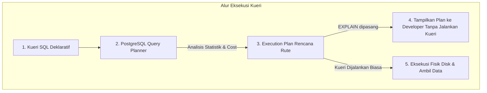

# 03 - BAB 03 APA ITU EXPLAIN

Status: DRAFT
Rak: Indexing, Query Planner, dan Performance
Buku: Indexing Dasar untuk Developer
Level: Level 3 - Level 4
Tipe Materi: Pengantar
Target: Backend Developer yang menghubungkan aplikasi ke PostgreSQL.
Estimasi Baca: 10 Menit
Terakhir Diperiksa: 2026-05-18

Sumber Utama: PostgreSQL Official Documentation
Versi Referensi: PostgreSQL docs/current
Status Verifikasi Sumber: REVIEW

---

## 1. Tujuan Belajar
Di akhir bab ini, pembaca diharapkan mampu:
- Menjelaskan definisi dan fungsi utama perintah `EXPLAIN` di PostgreSQL.
- Membedakan konsep kueri SQL deklaratif dengan rencana eksekusi (*Execution Plan*) prosedural.
- Menjelaskan perbedaan kritis antara `EXPLAIN` standar (estimasi jalur) dengan `EXPLAIN ANALYZE` (eksekusi riil) secara konseptual.
- Mengidentifikasi istilah-istilah dasar dalam rencana eksekusi, seperti *Seq Scan*, *Index Scan*, *Filter*, *Sort*, dan *Cost*.
- Menggunakan perintah `EXPLAIN` untuk memeriksa apakah suatu indeks berpotensi digunakan oleh PostgreSQL.

## 2. Prasyarat
- Memahami konsep dasar indeks database (baca: [Apa Itu Index Database](./bab-01-apa-itu-index-database.md)).
- Memahami kondisi-kondisi kelayakan penggunaan indeks (baca: [Kapan Index Membantu Query](./bab-02-kapan-index-membantu-query.md)).

## 3. Ringkasan Cepat
Bahasa SQL bersifat **Deklaratif**, yang berarti kita hanya menuliskan *apa* data yang ingin ditarik, bukan *bagaimana* cara database menariknya. Untuk mengetahui rute prosedural yang dipilih oleh database, PostgreSQL menyediakan perintah **EXPLAIN**. Perintah ini bertindak sebagai alat inspeksi yang menjabarkan **Execution Plan (Rencana Eksekusi)** sebelum kueri benar-benar dijalankan. Membaca rencana eksekusi membantu backend developer memastikan secara ilmiah apakah indeks yang mereka buat benar-benar digunakan, atau justru diabaikan oleh engine database, sehingga terhindar dari proses tebak-tebak performa yang merugikan.

## 4. Istilah Penting di Bab Ini

| Istilah | Arti Singkat |
|---|---|
| EXPLAIN | Perintah PostgreSQL untuk menjabarkan rute/rencana eksekusi kueri tanpa benar-benar menjalankannya. |
| Execution Plan | Rencana langkah-demi-langkah prosedural yang dirumuskan database engine untuk mengambil data. |
| Cost (Biaya) | Satuan nilai estimasi usaha I/O disk dan CPU yang dibutuhkan untuk menjalankan suatu rute kueri. |
| Declarative Language | Gaya bahasa pemrograman (seperti SQL) di mana kita hanya mendefinisikan hasil akhir yang diinginkan. |
| Procedural Route | Rangkaian instruksi kerja sistematis tentang cara menyelesaikan suatu pekerjaan di komputer. |

## 5. Analogi Sehari-hari
Bayangkan Anda sedang menggunakan **Aplikasi Ojek Online / GPS Navigasi (PostgreSQL Engine)**:
- **Kueri SQL** adalah tindakan Anda **mengetikkan alamat tujuan akhir** (misalnya: *Menara Monas*). Anda tidak menulis instruksi belok kanan, belok kiri, atau memilih jalan tol. Anda hanya meminta tujuan akhir.
- **Rencana Eksekusi (Execution Plan)** adalah **Rute Perjalanan yang Ditampilkan GPS** di layar ponsel Anda: *Lewat Jalan A (Tol) karena bebas macet, atau Lewat Jalan B (Arteri) karena lebih dekat*. GPS menghitung estimasi biaya waktu tempuh secara cerdas.
- **Perintah EXPLAIN** adalah tindakan Anda **melihat layar ponsel sebelum menekan tombol "Pesan Ojek/Mulai Jalan"**. Anda memeriksa rute mana yang dipilih oleh GPS, apakah ojek akan lewat jalan tikus yang becek atau jalan raya yang mulus. Anda melihat rencana perjalanan tanpa benar-benar melangkahkan kaki keluar rumah.

## 6. Batas Analogi
Di aplikasi navigasi, Anda dapat dengan sengaja memaksa pengemudi ojek menyimpang dari rute GPS di tengah jalan. Di dalam PostgreSQL, begitu kueri dijalankan, backend aplikasi tidak dapat mengintervensi alur kerja mesin database; kueri akan berjalan mengikuti rencana yang dipilih Query Planner.

## 7. Ilustrasi Konsep

Status Ilustrasi: DRAFT



## 8. Penjelasan Ilustrasi
Bagan di atas menunjukkan posisi perintah `EXPLAIN` dalam alur kerja PostgreSQL. Saat developer menambahkan kata kunci `EXPLAIN` di depan kueri, PostgreSQL Query Planner hanya akan merumuskan rencana eksekusi dan langsung mengembalikannya sebagai teks hasil pembacaan rute, tanpa memutar piringan disk fisik untuk mengambil baris data yang sesungguhnya.

## 9. Batas Ilustrasi
Bagan di atas memisahkan proses `EXPLAIN` dengan eksekusi fisik. Perlu dicatat bahwa PostgreSQL juga memiliki perintah bernama `EXPLAIN ANALYZE`. Berbeda dengan `EXPLAIN` standar yang hanya memberikan estimasi rute, `EXPLAIN ANALYZE` benar-benar mengeksekusi kueri tersebut secara fisik di database untuk mencocokkan estimasi dengan waktu eksekusi riil. Topik ini dibatasi dan akan dibahas pada tingkat lanjutan.

---

## 10. Konsep Inti

### Kenapa Developer Backend Membutuhkan EXPLAIN?
Dalam pengembangan aplikasi backend berskala besar, kita tidak boleh berasumsi tentang performa database:
1. **Verifikasi Indeks**: Memastikan indeks baru yang kita buat benar-benar digunakan untuk kueri API kita.
2. **Pendeteksi Bottleneck**: Menemukan bagian kueri mana yang paling mahal (misalnya karena filter yang salah atau `JOIN` yang tidak efisien).
3. **Mencegah Blunder Produksi**: Menangkap kueri lambat yang berpotensi melumpuhkan server database sebelum kode program di-deploy ke lingkungan produksi.

### Perbedaan Estimasi vs Eksekusi Riil
- **EXPLAIN (Estimasi)**: Sangat aman dijalankan di server produksi untuk kueri apa pun (termasuk `DELETE` atau `UPDATE`) karena database hanya membuat simulasi matematika tanpa benar-benar mengubah atau menghapus data.
- **EXPLAIN ANALYZE (Eksekusi Riil)**: **Dapat berbahaya jika dijalankan sembarangan** di produksi untuk kueri modifikasi (seperti `DELETE`), karena kueri tersebut akan benar-benar menghapus data riil di database Anda.

---

## 11. Penjelasan Detail
Output dari perintah `EXPLAIN` berupa pohon teks bertingkat (*node tree*). Setiap tingkatan mewakili operasi database tertentu:
- **Seq Scan (Sequential Scan)**: Menunjukkan PostgreSQL memindai tabel secara fisik dari baris pertama hingga terakhir.
- **Index Scan**: Menunjukkan PostgreSQL melompat menggunakan indeks terurut untuk menarik baris data spesifik.
- **Filter**: Operasi penyaringan baris data tambahan (biasanya terjadi setelah Seq Scan).
- **Sort**: Operasi pengurutan baris data di memori database.
- **Cost**: Angka estimasi biaya yang ditulis dalam format `(cost=nilai_awal..nilai_akhir)`. Nilai awal adalah biaya untuk mendapatkan baris pertama, sedangkan nilai akhir adalah estimasi total biaya keseluruhan kueri.

---

## 12. Contoh SQL Dasar
Berikut adalah cara memasang perintah `EXPLAIN` di depan kueri SQL standar PostgreSQL:

```sql
-- [SKENARIO 1: PENGGUNAAN EXPLAIN PADA PENCARIAN EMAIL]

-- Cukup tambahkan kata kunci EXPLAIN di depan kueri SELECT Anda
EXPLAIN 
SELECT user_id, username, email 
FROM users 
WHERE email = 'budi@example.com';

-- PostgreSQL akan mengembalikan output plan, bukan baris data Budi.
```

---

## 13. Contoh SQL Praktik Project
Berikut adalah simulasi membandingkan rencana eksekusi kueri pencarian sebelum dan sesudah indeks dibuat, untuk memverifikasi kesuksesan optimasi performa:

```sql
-- [Langkah A: Cek kueri sebelum indeks dibuat]
EXPLAIN 
SELECT product_id, product_name, price 
FROM products 
WHERE price = 150000;
-- Output yang muncul biasanya: "Seq Scan on products ... (Filter: price = 150000)"

-- [Langkah B: Buat indeks pendukung]
CREATE INDEX idx_products_price ON products(price);

-- [Langkah C: Cek kembali dengan EXPLAIN]
EXPLAIN 
SELECT product_id, product_name, price 
FROM products 
WHERE price = 150000;
-- Output yang muncul dalam banyak kasus berubah menjadi: "Index Scan using idx_products_price ..."
```

---

## 14. Kesalahan Umum
- **Langsung Membuat Indeks Tanpa Membaca EXPLAIN**: Menambahkan indeks secara membabi buta pada setiap kolom yang dicurigai lambat tanpa memverifikasi rute eksekusi aslinya terlebih dahulu.
- **Menganggap Rencana Kueri Bersifat Statis**: Mengasumsikan bahwa jika kueri menggunakan `Index Scan` di komputer lokal, kueri tersebut pasti menggunakan `Index Scan` di server produksi. Ingat, Query Planner menentukan rute berdasarkan ukuran data fisik; rencana eksekusi dapat berubah secara dinamis seiring bertambahnya volume data.
- **Menjalankan EXPLAIN ANALYZE untuk Menghapus Data di Produksi**: Menuliskan `EXPLAIN ANALYZE DELETE FROM users;` dengan pemikiran "ah, kan cuma nge-explain". Ingat, `ANALYZE` akan mengeksekusi kueri tersebut secara fisik, yang akan menghapus seluruh data user Anda seketika.

---

## 15. Catatan Interview
- **Pertanyaan**: "Apa perbedaan utama antara perintah `EXPLAIN` standar dengan `EXPLAIN ANALYZE` di PostgreSQL, dan kapan kita harus berhati-hati menggunakannya?"
- **Jawaban**: "Perbedaan utamanya terletak pada eksekusi kueri. `EXPLAIN` standar hanya meminta Query Planner membuat estimasi rute matematika dan biaya (*cost*) berdasarkan statistik tanpa benar-benar mengeksekusi kueri tersebut di disk. Hal ini sangat aman dijalankan kapan saja. Sebaliknya, `EXPLAIN ANALYZE` akan benar-benar mengeksekusi kueri tersebut secara fisik untuk mengukur waktu nyata (*actual time*). Kita harus sangat berhati-hati menggunakan `EXPLAIN ANALYZE` di database produksi untuk kueri modifikasi data seperti `INSERT`, `UPDATE`, atau `DELETE` karena perubahan data tersebut akan benar-benar terjadi dan disahkan ke dalam database."

---

## 16. Catatan Diskusi User
- **Pertanyaan Umum**: "Apakah output EXPLAIN memiliki format visual selain teks pohon / node tree yang rumit?"
- **Diskusikan**: Ya, PostgreSQL mendukung berbagai format output. Developer backend dapat menggunakan perintah `EXPLAIN (FORMAT JSON) SELECT ...` atau menggunakan perangkat visualisasi pihak ketiga yang populer seperti **PEV (Postgres Explain Visualizer)** untuk mengubah pohon teks yang rumit menjadi diagram interaktif yang lebih mudah dibaca saat melakukan koordinasi tim.

---

## 17. Latihan Kecil
1. Tuliskan kueri SQL untuk memeriksa rencana eksekusi dari kueri: `SELECT * FROM orders WHERE status = 'DELIVERED'`!
2. Mengapa perintah `EXPLAIN` standar dinilai sangat aman dijalankan di database produksi live untuk kueri `DELETE FROM orders` dibandingkan perintah `EXPLAIN ANALYZE`?

---

## 18. Checklist Pemahaman
- [ ] Memahami arti dan fungsi perintah `EXPLAIN` di PostgreSQL.
- [ ] Memahami konsep bahasa SQL deklaratif versus rencana eksekusi prosedural.
- [ ] Mengetahui perbedaan mendasar antara `EXPLAIN` standar dengan `EXPLAIN ANALYZE` secara konseptual.
- [ ] Mengenal istilah awal rencana eksekusi (*Seq Scan*, *Index Scan*, *Cost*).
- [ ] Mampu menuliskan perintah `EXPLAIN` untuk memeriksa rute kueri.

---

## 19. Hubungan dengan Materi Lain

### Posisi Materi
- Rak: [07 - Indexing, Query Planner, dan Performance](../../README.md)
- Buku: [Indexing Dasar untuk Developer](../)

### Prasyarat
- [Apa Itu Index Database](./bab-01-apa-itu-index-database.md)
- [Kapan Index Membantu Query](./bab-02-kapan-index-membantu-query.md)

### Materi Sebelumnya
- [Kapan Index Membantu Query](./bab-02-kapan-index-membantu-query.md)

### Materi Berikutnya
- [Membaca Query Plan Dasar](./bab-04-membaca-query-plan-dasar.md)

### Materi Terkait
- [Klausa WHERE Dasar](../../02-sql-dan-querying/buku-02-filtering-sorting-dan-limit/bab-01-klausa-where-dasar.md) (Parameter filter utama pembentuk query plan)

### Istilah Terkait
- SQL Query, Execution Plan, Query Planner, Cost Estimation, Declarative, Procedural, Postgres Explain Visualizer.

---

## 20. Referensi Resmi
Jangan membuka tautan berikut pada batch ini, cukup cantumkan sebagai referensi resmi yang ditargetkan untuk verifikasi nanti:
- PostgreSQL Official Documentation - EXPLAIN
  https://www.postgresql.org/docs/current/sql-explain.html
- PostgreSQL Official Documentation - Using EXPLAIN
  https://www.postgresql.org/docs/current/using-explain.html

---

## 21. Catatan Pribadi / Project Notes
*   *Catatan Draft*: Tekankan perbedaan aman/tidaknya menjalankan EXPLAIN vs EXPLAIN ANALYZE pada data modification agar developer pemula terhindar dari blunder fatal menghapus data produksi secara tidak sengaja. Status verifikasi diatur ke REVIEW.
