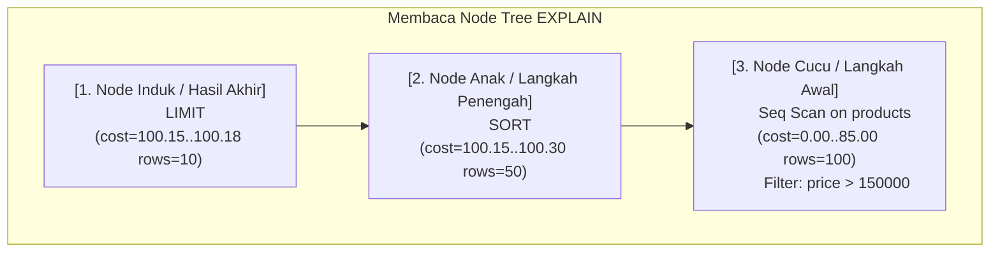

# 04 - BAB 04 MEMBACA QUERY PLAN DASAR

Status: DRAFT
Rak: Indexing, Query Planner, dan Performance
Buku: Indexing Dasar untuk Developer
Level: Level 3 - Level 4
Tipe Materi: Pengantar
Target: Backend Developer yang menghubungkan aplikasi ke PostgreSQL.
Estimasi Baca: 12 Menit
Terakhir Diperiksa: 2026-05-18

Sumber Utama: PostgreSQL Official Documentation
Versi Referensi: PostgreSQL docs/current
Status Verifikasi Sumber: REVIEW

---

## 1. Tujuan Belajar
Di akhir bab ini, pembaca diharapkan mampu:
- Membaca dan menginterpretasikan struktur pohon teks sederhana hasil kueri `EXPLAIN` dari atas ke bawah.
- Menjelaskan arti dari node operasional dasar: *Seq Scan*, *Index Scan*, *Filter*, dan *Sort* dalam kueri plan.
- Menjelaskan arti angka estimasi *Cost* (biaya awal dan biaya akhir) secara konseptual.
- Menganalisis alasan logis mengapa Query Planner memilih rute tertentu berdasarkan prinsip efisiensi biaya.
- Menyusun daftar periksa sederhana untuk mendeteksi apakah kueri backend Anda berpotensi mengalami masalah performa.

## 2. Prasyarat
- Memahami alasan dan fungsionalitas perintah EXPLAIN (baca: [Apa Itu EXPLAIN](./bab-03-apa-itu-explain.md)).
- Memahami konsep dasar indeks database B-Tree (baca: [Apa Itu Index Database](./bab-01-apa-itu-index-database.md)).

## 3. Ringkasan Cepat
Output dari perintah `EXPLAIN` di PostgreSQL menyajikan peta teks bertingkat (*node tree*) yang dibaca dari **atas ke bawah** dan dari **dalam ke luar**. Setiap baris output menjelaskan satu operasi database spesifik beserta perkiraan biaya usahanya (**Cost**). Di bab ini, kita akan belajar cara membaca kueri plan sederhana untuk mengidentifikasi apakah PostgreSQL melakukan pemindaian lambat (*Seq Scan* dengan penyaring *Filter*) atau pemindaian terarah yang cepat (*Index Scan*), serta memahami bahwa Query Planner selalu memilih rute dengan total cost estimasi paling rendah demi menjaga performa aplikasi.

## 4. Istilah Penting di Bab Ini

| Istilah | Arti Singkat |
|---|---|
| Node Tree | Struktur bertingkat di mana operasi anak menyuplai data ke operasi induk di atasnya. |
| Startup Cost | Angka estimasi pertama pada cost yang menunjukkan biaya sebelum baris pertama berhasil diambil. |
| Total Cost | Angka estimasi kedua pada cost yang menunjukkan total biaya hingga seluruh kueri selesai. |
| Filter Operator | Operasi menyaring baris data pasca pemindaian berdasarkan kriteria tertentu (lambat di Seq Scan). |
| Sort Node | Operasi pengurutan data di memori database ketika index yang cocok tidak tersedia. |

## 5. Analogi Sehari-hari
Bayangkan Anda sedang membaca **Resep Langkah Pembuatan Kue (Execution Plan)** di dapur restoran:
- **Membaca dari Bawah ke Atas (Dalam ke Luar)**: Resep menuliskan: *Langkah 1 (Paling bawah): Pecahkan telur dan kocok. Langkah 2 (Tengah): Campurkan tepung ke kocokan telur. Langkah 3 (Paling atas): Panggang adonan di dalam oven*. Anda tidak bisa memanggang kue sebelum memecahkan telur. Operasi bawah (anak) harus menyelesaikan pekerjaannya terlebih dahulu untuk menyuplai bahan baku ke operasi atas (induk).
- **Cost (Estimasi Waktu Dapur)**: Di samping setiap langkah tertulis estimasi usaha: *Pecah telur (cost=2 menit), Panggang (cost=45 menit)*. Koki kepala selalu memilih resep yang total estimasi waktunya paling efisien untuk melayani pelanggan restoran dengan cepat.

## 6. Batas Analogi
Di dapur nyata, seorang koki bisa saja melakukan improvisasi di tengah langkah memasak. Di dalam PostgreSQL, Query Planner merumuskan seluruh langkah secara kaku dan terstruktur sebelum kueri dieksekusi; tidak ada langkah tambahan yang disisipkan secara acak di tengah jalan.

## 7. Ilustrasi Konsep

Status Ilustrasi: DRAFT



## 8. Penjelasan Ilustrasi
Bagan di atas memvisualisasikan bagaimana struktur pohon rencana eksekusi database disusun bertingkat. Operasi terbawah (`Seq Scan` pada tabel `products` yang disaring oleh `Filter`) harus berjalan terlebih dahulu untuk menarik data mentah. Data hasil saringan tersebut kemudian disuplai ke atas untuk diurutkan (`Sort`), dan baris hasil urutan tersebut disuplai ke tingkat teratas untuk dibatasi jumlahnya (`Limit`) sebelum dikirimkan ke aplikasi backend.

## 9. Batas Ilustrasi
Bagan di atas menyajikan kueri plan yang sangat sederhana pada satu tabel tunggal. Di dunia nyata, jika kueri melibatkan penggabungan tabel (`JOIN`), kueri plan akan memiliki banyak cabang anak yang sejajar (seperti *Hash Join*, *Nested Loop*, atau *Merge Join*) yang masing-masing menyuplai data ke induk penengah sebelum digabungkan. Bahasan ini dibatasi untuk tingkat lanjutan.

---

## 10. Konsep Inti

### Memahami Angka Cost
Setiap node di dalam kueri plan selalu diawali dengan teks biaya (*cost estimation*) seperti contoh berikut:
```text
(cost=0.00..85.00 rows=100 width=45)
```
Mari kita bedah artinya secara konseptual:
1. **`cost=0.00` (Startup Cost)**: Perkiraan biaya yang dibutuhkan sebelum database dapat menghasilkan baris data pertama. Nilai `0.00` biasanya menunjukkan database dapat langsung bekerja seketika (seperti saat Seq Scan tanpa operasi sortasi).
2. **`..85.00` (Total Cost)**: Perkiraan total biaya yang dibutuhkan untuk menyelesaikan seluruh operasi di node tersebut. Ini adalah indikator performa utama yang dianalisis oleh Query Planner.
3. **`rows=100`**: Perkiraan jumlah baris data yang akan dihasilkan oleh operasi ini setelah disaring.
4. **`width=45`**: Perkiraan ukuran rata-rata baris data dalam satuan bita (*bytes*) yang mengalir melalui node tersebut.

*Penting*: Satuan biaya (*cost*) di PostgreSQL **bukan satuan waktu** (seperti detik atau milidetik). Cost adalah nilai estimasi relatif abstrak yang dihitung berdasarkan beban pembacaan halaman disk dan penggunaan CPU.

---

## 11. Penjelasan Detail

### Membaca Dua Skenario Output EXPLAIN Sederhana
Berikut adalah dua contoh kueri plan konseptual yang sangat sering ditemui oleh backend developer saat menguji performa kueri:

#### Skenario 1: Output Tanpa Indeks (Sequential Scan)
Kueri mencari data produk dengan harga di atas 150.000 menggunakan filter WHERE pada kolom `price` yang tidak terindeks:
```text
Seq Scan on products  (cost=0.00..85.00 rows=120 width=36)
  Filter: (price > 150000::numeric)
```
- **Cara Membaca**: PostgreSQL melakukan pemindaian fisik penuh secara berurutan (`Seq Scan`) pada tabel `products`. Startup cost-nya `0.00` (langsung membaca disk), dengan total cost estimasi `85.00`. Diperkirakan ada `120` baris yang lolos penyaringan (`Filter: price > 150000`).

#### Skenario 2: Output Dengan Indeks (Index Scan)
Kueri yang sama dijalankan setelah indeks pada kolom `price` dibuat (`idx_products_price`):
```text
Index Scan using idx_products_price on products  (cost=0.28..12.50 rows=120 width=36)
  Index Cond: (price > 150000::numeric)
```
- **Cara Membaca**: PostgreSQL memilih menggunakan indeks `idx_products_price` melalui operasi `Index Scan`. Perhatikan bahwa startup cost sedikit meningkat menjadi `0.28` (karena database harus memuat dan mencari di berkas indeks terlebih dahulu sebelum bisa melompat ke tabel utama). Namun, **total cost turun drastis** dari `85.00` menjadi hanya `12.50` karena database tidak perlu memindai disk fisik secara penuh.

---

## 12. Contoh SQL Dasar
Simulasi kueri pembacaan plan sederhana di PostgreSQL untuk kueri list yang membutuhkan pengurutan data:

```sql
-- [SKENARIO: EXPLAIN PADA QUERY SORTING]
EXPLAIN 
SELECT product_id, price 
FROM products 
ORDER BY price ASC;

-- Output konseptual yang biasanya muncul:
-- Sort  (cost=120.15..122.30 rows=500 width=16)
--   Sort Key: price
--   ->  Seq Scan on products  (cost=0.00..85.00 rows=500 width=16)
```
- **Cara Membaca Rute**: PostgreSQL melakukan `Seq Scan` terlebih dahulu di bagian bawah untuk mengumpulkan seluruh data, lalu menyuplai data tersebut ke atas untuk diurutkan (`Sort`) berdasarkan kunci `price`.

---

## 13. Contoh SQL Praktik Project
Bagaimana backend developer memanfaatkan informasi `EXPLAIN` untuk mendeteksi kueri yang salah sasaran performa:

```sql
-- [SKENARIO: VERIFIKASI PENGURUTAN Halaman Katalog]
-- Developer menduga kueri di bawah ini lambat karena sorting memori.

EXPLAIN 
SELECT product_id, product_name, created_at 
FROM products 
ORDER BY created_at DESC 
LIMIT 5;

-- Jika output menunjukkan operasi "Sort", berarti database melakukan sorting di RAM.
-- Optimasi: Buat indeks terurut untuk melompati Sort Node!
CREATE INDEX idx_products_created_at_desc ON products(created_at DESC);

-- Jalankan EXPLAIN kembali untuk memastikan Sort Node hilang dan berubah menjadi Index Scan.
```

---

## 14. Kesalahan Umum
- **Hanya Fokus pada Nilai Awal Cost**: Terjebak mengkhawatirkan startup cost yang sedikit naik saat menggunakan indeks (misalnya dari `0.00` menjadi `0.28`). Ingat, performa keseluruhan ditentukan oleh total cost estimasi di bagian akhir.
- **Mengabaikan Baris Filter pada Seq Scan**: Membiarkan kueri Seq Scan dengan `Filter` yang menyaring jutaan baris data berjalan di aplikasi backend. Hal ini dipastikan akan memicu kelambatan server database saat trafik pengguna meningkat.
- **Membaca Terbalik**: Membaca kueri plan dari atas secara harfiah tanpa memahami bahwa alur pasokan data sebenarnya mengalir dari node terdalam di bawah menuju ke atas.

---

## 15. Catatan Interview
- **Pertanyaan**: "Apa arti nilai *Cost* yang ditampilkan di dalam output `EXPLAIN` PostgreSQL, dan apakah nilai tersebut mewakili durasi waktu detik?"
- **Jawaban**: "Nilai *Cost* di dalam output `EXPLAIN` PostgreSQL adalah unit pengukuran relatif abstrak, **bukan satuan waktu** seperti detik atau milidetik. Nilai tersebut mewakili perkiraan beban komputasi yang dihitung secara matematis oleh Query Planner berdasarkan operasi I/O disk (membaca halaman memori penyimpanan) dan pemakaian CPU. Nilai cost ditulis dalam format awal dan akhir, misalnya `(cost=0.28..12.50)`. Angka pertama adalah *Startup Cost* (biaya sebelum baris pertama didapatkan), dan angka kedua adalah *Total Cost* (biaya keseluruhan untuk menyelesaikan operasi kueri tersebut). Query Planner menggunakan total cost ini untuk membandingkan rute alternatif dan memilih rute dengan total cost terkecil."

---

## 16. Catatan Diskusi User
- **Pertanyaan Umum**: "Apakah kita harus selalu mengoptimalkan kueri hingga nilai cost mencapai 0?"
- **Diskusikan**: Tidak mungkin dan sebaiknya dihindari membuang waktu untuk mengejar cost bernilai mendekati nol pada semua kueri. Target utama optimasi backend adalah **menghindari Seq Scan pada tabel berskala menengah-besar** dan **menghilangkan Sort Node pada kueri list halaman yang sering dipanggil**. Jika total cost kueri sudah cukup rendah dan waktu respon API di bawah ambang batas yang dapat diterima, kueri tersebut sudah dinilai sangat memadai untuk produksi.

---

## 17. Latihan Kecil
1. Bacalah output plan konseptual berikut dan tentukan langkah awal apa yang dilakukan oleh PostgreSQL:
   ```text
   Limit  (cost=15.20..15.22 rows=5)
     ->  Sort  (cost=15.20..15.30 rows=50)
           Sort Key: username
           ->  Seq Scan on users  (cost=0.00..12.50 rows=50)
   ```
2. Mengapa kueri pembacaan data yang memanfaatkan `Index Scan` umumnya direkomendasikan untuk memiliki total cost yang jauh lebih rendah dibanding `Seq Scan` pada tabel yang memiliki jutaan baris data?

---

## 18. Checklist Pemahaman
- [ ] Memahami cara membaca pohon rencana eksekusi kueri `EXPLAIN` dari bawah ke atas.
- [ ] Mengetahui arti konseptual dari startup cost dan total cost di PostgreSQL.
- [ ] Mampu mendeteksi tanda bahaya performa (*Seq Scan* dengan penyaring *Filter* berat) di kueri plan.
- [ ] Memahami peran indeks dalam meminimalkan total cost kueri secara dramatis dalam banyak kasus.
- [ ] Mengetahui bahwa satuan cost di PostgreSQL adalah estimasi abstrak relatif, bukan satuan detik.

---

## 19. Hubungan dengan Materi Lain

### Posisi Materi
- Rak: [07 - Indexing, Query Planner, dan Performance](../../README.md)
- Buku: [Indexing Dasar untuk Developer](../)

### Prasyarat
- [Apa Itu EXPLAIN](./bab-03-apa-itu-explain.md)
- [Apa Itu Index Database](./bab-01-apa-itu-index-database.md)

### Materi Sebelumnya
- [Apa Itu EXPLAIN](./bab-03-apa-itu-explain.md)

### Materi Berikutnya
- [Apa Itu Database Migration](../../04-postgresql-untuk-aplikasi/buku-03-migration-seed-dan-versioning-schema/bab-01-apa-itu-database-migration.md) (Melompat kembali ke siklus evolusi schema database)

### Materi Terkait
- [Query untuk List dan Detail Data Aplikasi](../../04-postgresql-untuk-aplikasi/buku-01-postgresql-dalam-backend-application/bab-04-query-untuk-list-dan-detail-data-aplikasi.md) (Fitur endpoint yang menjadi target utama inspeksi EXPLAIN)

### Istilah Terkait
- Node Tree, Startup Cost, Total Cost, Seq Scan, Index Scan, Filter Condition, Sort Node, Cost Estimation Unit.

---

## 20. Referensi Resmi
Jangan membuka tautan berikut pada batch ini, cukup cantumkan sebagai referensi resmi yang ditargetkan untuk verifikasi nanti:
- PostgreSQL Official Documentation - Performance Tips (Using EXPLAIN)
  https://www.postgresql.org/docs/current/using-explain.html
- PostgreSQL Official Documentation - Query Planning Internals
  https://www.postgresql.org/docs/current/planner-stats.html

---

## 21. Catatan Pribadi / Project Notes
*   *Catatan Draft*: Pastikan pembaca memahami bahwa cost PostgreSQL adalah satuan kalkulasi matematika abstrak relatif, bukan detik. Ini adalah pembeda utama antara developer backend profesional dengan pemula yang sering salah menafsirkan angka cost sebagai durasi milidetik. Status verifikasi diatur ke REVIEW.
