# 01 - BAB 01 KENAPA BACKUP DATABASE PENTING

Status: DRAFT
Rak: Administrasi, DBA, dan Operasional
Buku: Backup, Restore, dan Risiko Data
Level: Level 3 - Level 4
Tipe Materi: Pengantar
Target: Backend Developer yang menghubungkan aplikasi ke PostgreSQL.
Estimasi Baca: 10 Menit
Terakhir Diperiksa: 2026-05-18

Sumber Utama: PostgreSQL Official Documentation
Versi Referensi: PostgreSQL docs/current
Status Verifikasi Sumber: REVIEW

---

## 1. Tujuan Belajar
Di akhir bab ini, pembaca diharapkan mampu:
- Menjelaskan definisi dan fungsi utama backup database sebagai salinan keselamatan data pada titik waktu tertentu (*point-in-time snapshot*).
- Menguraikan risiko-risiko operasional jika backend developer mengelola database tanpa adanya prosedur backup yang memadai.
- Membedakan secara presisi peran dan ruang lingkup berkas *Backup* dengan *Database Migration*, *Seed Data*, dan *Export Laporan*.
- Menuliskan perintah baris (*command line*) dasar utilitas `pg_dump` untuk mengekspor database secara konseptual.
- Mengidentifikasi kesalahan umum dalam pengelolaan berkas backup di lingkungan lokal maupun server.

## 2. Prasyarat
- Memahami konsep data seeding untuk development (baca: [Data Seeding Dasar](../../04-postgresql-untuk-aplikasi/buku-03-migration-seed-dan-versioning-schema/bab-02-data-seeding-dasar.md)).
- Memahami konsep schema versioning dan database migration (baca: [Version Control untuk Schema](../../04-postgresql-untuk-aplikasi/buku-03-migration-seed-dan-versioning-schema/bab-04-version-control-untuk-schema.md)).

## 3. Ringkasan Cepat
Dalam operasional backend application, data adalah aset komersial yang tidak boleh hilang. **Backup Database** adalah proses pembuatan salinan data fisik dan skema database secara utuh pada titik waktu tertentu. Memiliki backup yang sehat merupakan perisai utama backend developer untuk berlindung dari kecelakaan fatal seperti salah menjalankan kueri `DELETE` massal tanpa `WHERE`, kegagalan migrasi skema yang merusak data, maupun kerusakan hardware server. Di bab ini, kita akan membangun mental kesadaran risiko data dan mempelajari utilitas command-line bawaan PostgreSQL bernama **pg_dump** untuk menyelamatkan data secara konseptual.

## 4. Istilah Penting di Bab Ini

| Istilah | Arti Singkat |
|---|---|
| pg_dump | Utilitas bawaan PostgreSQL untuk mengekspor skema dan isi satu database menjadi berkas cadangan. |
| Snapshot | Keadaan data database yang diabadikan persis pada satu titik detik waktu tertentu. |
| Plain SQL Backup | Berkas backup berformat teks SQL biasa (`.sql`) yang berisi instruksi `CREATE TABLE` dan `INSERT INTO`. |
| Custom/Directory Format | Format backup biner khusus PostgreSQL (`.dump`) yang dikompresi agar hemat ukuran penyimpanan disk. |
| Human Error | Kesalahan tindakan manusia (seperti salah mengetik parameter kueri) yang memicu kegagalan sistem. |

## 5. Analogi Sehari-hari
Bayangkan Anda sedang memimpin proyek **Restorasi Gedung Arsip Kuno yang Rapuh (Database Server)**:
- **Backup Database** adalah tindakan Anda **membuat salinan fotokopi warna dari seluruh lembar dokumen sejarah di gedung tersebut**, lalu menyimpannya di dalam **Brankas Antipetir yang Terletak di Gedung Seberang Jalan**. Jika besok terjadi kebakaran hebat akibat korsleting listrik saat renovasi (salah kueri/server crash), isi dokumen sejarah berharga tersebut tidak hilang selamanya karena Anda memiliki fotokopi fisiknya di brankas seberang jalan.
- **Batas Analogi**: Di dunia fisik, memfotokopi 1 juta dokumen kertas membutuhkan waktu berminggu-minggu dan kertas berton-ton. Di dalam dunia PostgreSQL, membackup 1 juta baris data elektronik secara konseptual dapat diselesaikan secara lebih cepat dibandingkan fotokopi fisik, tergantung pada ukuran data dan spesifikasi server, serta disimpan di dalam berkas digital berukuran lebih ringkas berkat teknologi kompresi data.

## 6. Ilustrasi Konsep

Status Ilustrasi: DRAFT

```mermaid
graph TD
    subgraph Skenario Kehilangan Data Tanpa Backup
        A1[Developer salah ketik kueri] -->|DELETE FROM users tanpa WHERE| A2[Seluruh user terhapus secara fisik]
        A2 -->|Tidak ada cadangan| A3[Bencana! Bisnis tutup, data hilang selamanya]
    end
    
    subgraph Skenario Penyelamatan Dengan Backup
        B1[Developer salah ketik kueri] -->|DELETE FROM users tanpa WHERE| B2[Seluruh user terhapus secara fisik]
        B2 -->|Miliki snapshot pg_dump| B3[Jalankan proses restore cadangan]
        B3 -->|Data dipulihkan ke titik backup| B4[Sistem kembali beroperasi secara normal]
    end
```



## 7. Penjelasan Ilustrasi
Bagan di atas membandingkan dua akhir hidup operasional aplikasi backend saat terjadi kesalahan kueri fatal. Tanpa adanya cadangan data, satu baris kueri yang salah ketik dapat membunuh reputasi bisnis perusahaan seketika. Dengan adanya backup yang dijaga disiplin, developer memiliki tombol penyelamat darurat untuk memulihkan seluruh keadaan sistem ke kondisi sedetik sebelum insiden terjadi.

## 8. Batas Ilustrasi
Bagan di atas memberikan kesan bahwa restore data dapat memulihkan keseluruhan data tanpa kerugian sedikit pun. Perlu dipahami bahwa jika backup terakhir dilakukan pada pukul 08.00 pagi, dan kecelakaan terjadi pada pukul 12.00 siang, sebagian besar data transaksi transaksi yang masuk antara pukul 08.00 hingga 12.00 siang kemungkinan besar akan hilang, kecuali perusahaan menerapkan strategi replikasi canggih seperti WAL archiving tingkat tinggi yang dibatasi pada pengantar ini.

---

## 10. Konsep Inti

### Risiko Utama Pengelolaan Database Tanpa Backup
Seorang backend developer wajib memiliki kewaspadaan risiko data yang tinggi:
1. **Accidental Write Operations**: Salah mengeksekusi kueri modifikasi data (`UPDATE` / `DELETE`) tanpa klausa penyaring `WHERE` di database produksi live.
2. **DDL Blunder**: Salah membuang tabel penting (`DROP TABLE`) atau mematikan database secara kasar karena mengira sedang terhubung ke database uji coba lokal.
3. **Catastrophic Migration Failure**: Migrasi skema database versi baru mengalami error di tengah jalan dan menyisakan struktur data yang rusak berantakan.
4. **Hardware Failure**: Laptop development atau server cloud mengalami kerusakan disk fisik penyimpanan, membuat data di dalamnya tidak dapat dibaca lagi.

### Perbandingan Peran Berkas Data

| Karakteristik | Berkas Backup (pg_dump) | Berkas Migration | Berkas Seed Data |
|---|---|---|---|
| **Tujuan** | Keselamatan dan pemulihan bencana | Evolusi versioning skema | Data awal local development |
| **Isi Utama** | Seluruh data operasional + skema | Hanya instruksi modifikasi skema | Data referensi / dummy acak |
| **Sifat Data** | Dinamis mengikuti transaksi | Statis mengikuti versi kode | Statis / dinamis buatan |
| **Lingkungan** | Wajib ada di Production | Di semua lingkungan server | Hanya Dev / Staging |

---

## 11. Penjelasan Detail

### Utilitas pg_dump PostgreSQL
PostgreSQL menyediakan alat bawaan CLI (*Command Line Interface*) yang sangat andal bernama **pg_dump**. Alat ini berjalan secara independen di terminal shell komputer Anda, bukan di dalam prompt SQL `psql`.
- **Fokus Pengantar**: Di tingkat pengantar ini, kita mempelajari format backup **Plain SQL (`.sql`)** yang menghasilkan berkas teks berisi instruksi SQL lengkap yang sangat ramah dibaca manusia.
- **Batasan**: Kita belum membahas teknik operasional DBA tingkat lanjut seperti backup berbasis kluster (`pg_dumpall`), pencadangan fisik biner (*physical backup*), pengarsipan log transaksi berkelanjutan (*WAL archiving*), maupun strategi replikasi toleransi bencana (*High Availability*) yang menjadi domain khusus insinyur keandalan sistem (*SRE / DBA*).

---

## 12. Contoh Command Dasar Konseptual
Berikut adalah perintah ekspor database di terminal shell menggunakan utilitas `pg_dump`:

```bash
# [SKENARIO: BACKUP DATABASE TOKO ONLINE LOKAL KE FILE SQL]

# Eksekusi perintah ini di Terminal OS Anda (Command Prompt/PowerShell/Bash)
# Opsi -U menentukan user, -d menentukan database, -f menentukan file output
pg_dump -U postgres -d toko_db -f backup_toko_db.sql

# Catatan: Terminal akan meminta Anda memasukkan password PostgreSQL.
# Hasil akhir adalah file teks "backup_toko_db.sql" yang tersimpan di disk Anda.
```

---

## 13. Contoh Praktik Project
Sebagai pengembang backend, biasakanlah melakukan backup data lokal Anda secara disiplin sebelum mencoba melakukan uji coba berbahaya (seperti mengubah relasi tabel orm atau memodifikasi kolom sensitif):

```bash
-- [Langkah 1: Backup aman database belajar di laptop lokal]
pg_dump -U postgres -d belajar_db -f aman_sebelum_eksperimen.sql

-- [Langkah 2: Lakukan eksperimen Anda di psql]
-- psql -U postgres -d belajar_db
-- ALTER TABLE users DROP COLUMN email; -- Eksperimen berbahaya!
```

---

## 14. Kesalahan Umum
- **Menyimpan Berkas Backup di Partisi Disk Server yang Sama**: Menyimpan berkas backup di harddisk yang sama dengan folder database PostgreSQL aktif. Jika harddisk tersebut rusak secara fisik, Anda akan kehilangan database sekaligus file backup-nya secara bersamaan.
- **Menganggap Migration File sebagai Pengganti Backup**: Berpikir bahwa "kan sudah pakai migration, jadi tidak perlu backup". Ingat, migration hanya mencatat struktur skema, **bukan data transaksi komersial** dari ribuan pembeli di server produksi.
- **Membiarkan Backup Tanpa Proteksi Keamanan**: Menyimpan file backup `.sql` di folder publik yang dapat diakses oleh siapa saja. Ingat, file backup memuat data sensitif user tanpa enkripsi; berkas backup wajib disimpan di penyimpanan awan terenkripsi yang aman.

---

## 15. Catatan Interview
- **Pertanyaan**: "Apa perbedaan antara file hasil database migration dengan file database backup, dan mengapa kita membutuhkan keduanya?"
- **Jawaban**: "Berkas *Database Migration* adalah skrip version control yang hanya menyimpan riwayat evolusi struktur skema database (seperti kueri `CREATE TABLE` atau `ALTER TABLE`) dan diurus oleh tim developer untuk menyelaraskan kode aplikasi. Sebaliknya, berkas *Database Backup* (seperti hasil `pg_dump`) adalah salinan snapshot data fisik lengkap pada titik waktu tertentu yang memuat seluruh baris transaksi riil pengguna. Kita membutuhkan keduanya karena migration menjamin konsistensi arsitektur kode aplikasi di semua server, sedangkan backup menjamin keselamatan data komersial asli dari bahaya kehilangan dan bencana operasional."

---

## 16. Catatan Diskusi User
- **Pertanyaan Umum**: "Apakah proses backup menggunakan `pg_dump` akan mengunci database sehingga aplikasi backend kita tidak bisa diakses selama proses backup berlangsung?"
- **Diskusikan**: Tidak secara konseptual untuk sebagian besar kueri standar. PostgreSQL dirancang menggunakan arsitektur MVCC. Proses `pg_dump` melakukan pembacaan snapshot data secara konsisten dengan dampak minimal pada aktivitas kueri baca/tulis (`SELECT`, `INSERT`, `UPDATE`) dari aplikasi backend. Utilitas ini dirancang untuk mengambil snapshot konsisten tanpa mengunci akses baca/tulis kueri biasa, namun untuk database produksi live sangat disarankan untuk tetap dijalankan sesuai prosedur operasional pada jam trafik rendah demi meminimalkan dampak beban kerja server.

---

## 17. Latihan Kecil
1. Tuliskan perintah command-line PostgreSQL konseptual untuk membackup database bernama `sekolah_db` dengan pengguna `admin_sekolah` ke dalam berkas bernama `cadangan_sekolah.sql`!
2. Jika sebuah server database produksi mengalami kerusakan disk fisik, jelaskan secara logis mengapa file backup yang disimpan di komputer lokal developer dinilai jauh lebih menyelamatkan dibanding file backup yang disimpan di dalam partisi disk server produksi itu sendiri!

---

## 18. Checklist Pemahaman
- [ ] Memahami arti penting dan fungsi utama backup database sebagai snapshot keselamatan.
- [ ] Mengetahui risiko-risiko operasional fatal akibat ketiadaan prosedur backup.
- [ ] Mampu membedakan karakteristik berkas Backup dengan berkas Migration dan Seed Data.
- [ ] Mampu menuliskan perintah ekspor database dasar memanfaatkan utilitas `pg_dump` secara konseptual.
- [ ] Mengetahui bahwa proses backup `pg_dump` dirancang untuk mengambil snapshot konsisten tanpa mengunci sebagian besar akses kueri baca/tulis biasa.

---

## 19. Hubungan dengan Materi Lain

### Posisi Materi
- Rak: [08 - Administrasi, DBA, dan Operasional](../../README.md)
- Buku: [Backup, Restore, dan Risiko Data](../)

### Prasyarat
- [Data Seeding Dasar](../../04-postgresql-untuk-aplikasi/buku-03-migration-seed-dan-versioning-schema/bab-02-data-seeding-dasar.md)
- [Version Control untuk Schema](../../04-postgresql-untuk-aplikasi/buku-03-migration-seed-dan-versioning-schema/bab-04-version-control-untuk-schema.md)

### Materi Sebelumnya
- [Membaca Query Plan Dasar](../../07-indexing-query-planner-dan-performance/buku-01-indexing-dasar-untuk-developer/bab-04-membaca-query-plan-dasar.md) (Melompat dari optimasi kueri ke keselamatan database)

### Materi Berikutnya
- [Restore dan Latihan Pemulihan Data](./bab-02-restore-dan-latihan-pemulihan-data.md)

### Materi Terkait
- [Keamanan Koneksi Database](../../04-postgresql-untuk-aplikasi/buku-01-postgresql-dalam-backend-application/bab-03-keamanan-koneksi-database.md) (Menjaga keamanan kredensial saat menjalankan perintah pg_dump)

### Istilah Terkait
- Database Backup, pg_dump Utility, Point-in-time Snapshot, Plain SQL, Custom Format, MVCC Architecture.

---

## 20. Referensi Resmi
Jangan membuka tautan berikut pada batch ini, cukup cantumkan sebagai referensi resmi yang ditargetkan untuk verifikasi nanti:
- PostgreSQL Official Documentation - Backup and Restore
  https://www.postgresql.org/docs/current/backup.html
- PostgreSQL Official Documentation - pg_dump
  https://www.postgresql.org/docs/current/app-pgdump.html

---

## 21. Catatan Pribadi / Project Notes
*   *Catatan Draft*: Tumbuhkan kesadaran risiko data (*data loss risk*) kepada pembaca agar tidak menganggap remeh perintah SQL modifikasi di server produksi. Pastikan status verifikasi diatur ke REVIEW.
