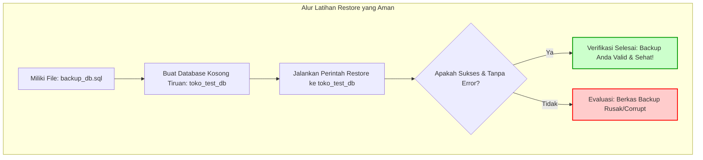

# 02 - BAB 02 RESTORE DAN LATIHAN PEMULIHAN DATA

Status: DRAFT
Rak: Administrasi, DBA, dan Operasional
Buku: Backup, Restore, dan Risiko Data
Level: Level 3 - Level 4
Tipe Materi: Pengantar
Target: Backend Developer yang menghubungkan aplikasi ke PostgreSQL.
Estimasi Baca: 10 Menit
Terakhir Diperiksa: 2026-05-18

Sumber Utama: PostgreSQL Official Documentation
Versi Referensi: PostgreSQL docs/current
Status Verifikasi Sumber: REVIEW

---

## 1. Tujuan Belajar
Di akhir bab ini, pembaca diharapkan mampu:
- Menjelaskan definisi dan fungsi utama pemulihan data (*Restore*) database dari berkas cadangan.
- Memaparkan urgensi mengapa latihan pemulihan data (*restore drill*) wajib dilatih secara berkala di lingkungan lokal/test.
- Mengidentifikasi perbedaan kritis antara status "Backup Berhasil" dengan "Restore Berhasil" dalam manajemen database.
- Menuliskan perintah pemulihan database dari format Plain SQL menggunakan utilitas `psql`.
- Menggunakan utilitas `pg_restore` untuk mengimpor berkas cadangan berformat kustom biner secara konseptual.
- Menyusun daftar periksa (*safety checklist*) sebelum mengeksekusi proses restore guna menghindari bencana menimpa database produksi.

## 2. Prasyarat
- Memahami dasar dan urgensi pencadangan data (baca: [Kenapa Backup Database Penting](./bab-01-kenapa-backup-database-penting.md)).
- Memahami cara masuk ke dalam CLI PostgreSQL menggunakan `psql` (baca: [Keamanan Koneksi Database](../../04-postgresql-untuk-aplikasi/buku-01-postgresql-dalam-backend-application/bab-03-keamanan-koneksi-database.md)).

## 3. Ringkasan Cepat
Memiliki berkas backup berukuran bergiga-giga di tempat penyimpanan cloud belum tentu menjamin keselamatan data Anda jika Anda tidak pernah menguji cara mengembalikannya ke database aktif. **Restore Database** adalah proses memulihkan kembali seluruh struktur skema dan baris data dari berkas cadangan ke dalam database target. Di bab ini, kita akan mempelajari filosofi pemulihan data, utilitas restorasi dasar bawaan PostgreSQL seperti **psql** (untuk format teks) dan **pg_restore** (untuk format biner), serta prosedur checklist wajib demi menghindari kesalahan fatal menimpa database produksi secara tidak sengaja.

## 4. Istilah Penting di Bab Ini

| Istilah | Arti Singkat |
|---|---|
| Restore | Proses membaca berkas cadangan dan menyusun ulang data/skema ke dalam database aktif. |
| Restore Drill | Latihan simulasi pemulihan bencana untuk memastikan file backup benar-benar valid dan bisa digunakan. |
| pg_restore | Utilitas baris perintah bawaan PostgreSQL untuk memulihkan database dari format biner/kustom. |
| Target Database | Database tujuan akhir di mana data dari berkas backup akan dituangkan ke dalamnya. |
| Shell Redirect | Simbol `<` di terminal untuk menyuplai isi file teks SQL langsung ke input CLI database. |

## 5. Analogi Sehari-hari
Bayangkan Anda sedang memimpin simulasi **Latihan Penyelamatan Kebakaran di Gedung Perkantoran (Restore Drill)**:
- **Backup Berhasil** adalah tindakan Anda **memasang 100 buah tabung pemadam api di setiap lorong gedung**. Anda merasa aman karena tabung tersebut terpasang rapi.
- **Restore Berhasil** adalah tindakan Anda **menguji tabung pemadam tersebut secara berkala**. Saat dicoba menyemprotkan air, tabung tersebut benar-benar mengeluarkan busa pemadam dengan tekanan tinggi. Jika tabung pemadam terpasang rapi tapi saat terjadi kebakaran ternyata isinya macet karena macet/kosong (backup corrupt), gedung Anda tetap akan hangus terbakar.
- **Restore Drill** adalah latihan evakuasi karyawan agar saat bencana kebakaran riil terjadi, seluruh staf dapur dan developer tidak panik dan tahu persis ke mana harus melangkah menyelamatkan diri secara teratur.

## 6. Batas Analogi
Di gedung fisik, latihan pemadam kebakaran memakan biaya air dan busa serta waktu staf yang terbuang. Di dunia PostgreSQL, latihan restore dapat dilakukan secara gratis tanpa batas menggunakan database tiruan (*local development database*) tanpa memengaruhi sistem operasional utama aplikasi.

## 7. Ilustrasi Konsep

Status Ilustrasi: DRAFT



## 8. Penjelasan Ilustrasi
Bagan di atas memvisualisasikan prosedur latihan pemulihan data yang aman. Developer backend tidak boleh mencoba melakukan uji coba restore langsung ke database utama. Proses restore wajib dialirkan ke database tiruan terlebih dahulu guna memastikan bahwa berkas backup benar-benar sehat, tidak korup di tengah jalan, dan siap digunakan saat kondisi darurat tiba.

## 9. Batas Ilustrasi
Bagan di atas menyederhanakan proses verifikasi. Latihan pemulihan di tingkat korporasi besar melibatkan verifikasi data secara dinamis, menguji integritas constraint kunci asing (*foreign key*), serta mengukur durasi waktu restore (*Recovery Time Objective*) agar tidak mengganggu aktivitas bisnis terlalu lama. Bahasan ini dibatasi untuk tingkat DBA tingkat lanjut.

---

## 10. Konsep Inti

### Perbedaan "Backup Berhasil" vs "Restore Berhasil"
Banyak developer terjebak dalam rasa aman palsu:
- **Backup Berhasil**: Skrip otomatis di server berhasil menghasilkan berkas cadangan `.sql` setiap hari pukul 02.00 subuh. Namun, tidak pernah ada yang membuka atau menguji berkas tersebut.
- **Restore Berhasil**: Berkas `.sql` cadangan dicoba didekripsi, dieksekusi di database uji coba, dan terbukti mampu menyusun ulang baris transaksi secara lengkap sesuai snapshot cadangan yang tersedia tanpa ada satupun instruksi SQL yang error.
*Penting*: **Nilai sejati dari sebuah backup hanya terbukti saat proses restore berhasil dilaksanakan dengan mulus.**

### Risiko Bencana: Restore ke Database yang Salah
Proses restore bersifat menimpa (*overwrite*) data yang ada. Jika Anda tidak berhati-hati dalam menetapkan parameter target koneksi, Anda dapat secara tidak sengaja menuangkan data cadangan lama ke database produksi yang sedang live, mengakibatkan seluruh transaksi pembeli hari ini terhapus dan kembali ke keadaan kemarin subuh.

---

## 11. Penjelasan Detail

### Dua Metode Pemulihan di PostgreSQL
Pemilihan alat pemulihan data disesuaikan dengan format berkas cadangan yang dihasilkan oleh `pg_dump`:

1. **Pemulihan Berkas Plain SQL (`.sql`) menggunakan `psql`**
   Karena berkas plain SQL hanya berisi kumpulan kueri teks SQL biasa, kita memulihkannya menggunakan program CLI `psql` standar dengan bantuan operator pengalihan shell (`<`).
2. **Pemulihan Berkas Kustom Biner (`.dump`) menggunakan `pg_restore`**
   Untuk berkas biner terkompresi yang tidak ramah dibaca mata manusia, kita wajib menggunakan utilitas khusus bernama `pg_restore`. Alat ini lebih canggih karena mendukung pemulihan multi-thread paralel agar proses berjalan sangat cepat pada data berskala gigabyte.

---

## 12. Contoh Command Dasar Konseptual
Berikut adalah perintah pemulihan database di terminal shell menggunakan utilitas `psql` dan `pg_restore`:

```bash
-- [METODE 1: RESTORE FILE PLAIN SQL KE DATABASE TEST LOKAL]
-- Opsi -U menentukan user, -d menentukan database target
psql -U postgres -d toko_test_db < backup_toko_db.sql


-- [METODE 2: RESTORE FILE KUSTOM BINER KE DATABASE TEST LOKAL]
-- pg_restore digunakan khusus untuk berkas cadangan non-plain text (.dump)
pg_restore -U postgres -d toko_test_db backup_toko_db.dump
```

*Catatan*: Pastikan database target (`toko_test_db`) sudah Anda buat terlebih dahulu dalam keadaan kosong sebelum mengeksekusi perintah di atas agar tidak terjadi tabrakan data.

---

## 13. Contoh Praktik Project: Latihan Pemulihan Aman
Mari kita praktikkan latihan restore terisolasi yang relatif aman karena sepenuhnya berjalan di komputer lokal Anda:

```bash
# Langkah 1: Buat database tiruan khusus uji coba di terminal psql Anda
# psql -U postgres -c "CREATE DATABASE uji_pulih_db;"

# Langkah 2: Eksekusi proses pemulihan ke database uji coba tersebut
psql -U postgres -d uji_pulih_db < aman_sebelum_eksperimen.sql

# Langkah 3: Periksa isi tabel di database uji_pulih_db untuk memastikan data dapat dipulihkan ke titik backup yang tersedia
# psql -U postgres -d uji_pulih_db -c "SELECT COUNT(*) FROM users;"
```

---

## 14. Kesalahan Umum
- **Restore Langsung ke Database Produksi Tanpa Backup Cadangan Terakhir**: Mengeksekusi restore di server produksi live tanpa melakukan backup darurat sesaat sebelum restore dimulai. Jika proses restore gagal ditengah jalan, database produksi Anda akan berada dalam kondisi rusak setengah jalan.
- **Mengabaikan Pesan Error saat Restore**: Membiarkan proses restore teks SQL menghasilkan ribuan baris log error "table already exists" karena lupa mengosongkan database target terlebih dahulu.
- **Menjalankan Perintah Tanpa Memeriksa Environment Active**: Mengeksekusi perintah restore di terminal OS yang sedang terhubung ke variabel lingkungan koneksi server produksi cloud akibat kelalaian memeriksa kredensial aktif.

---

## 15. Safety Checklist Sebelum Restore
Sebelum Anda menekan tombol Enter untuk memulai proses pemulihan data di server mana pun, Anda wajib memeriksa daftar berikut secara disiplin:
- [ ] **Target Database**: Apakah nama database target benar-benar database test lokal, bukan database produksi live?
- [ ] **Berkas Backup**: Apakah berkas backup yang akan digunakan merupakan berkas yang valid, memiliki ukuran bita (*size*) yang logis, dan diambil pada waktu yang tepat?
- [ ] **Koneksi Aktif**: Periksa kredensial IP host dan Port yang aktif di terminal Anda untuk memastikan tidak ada koneksi tersembunyi ke server cloud luar.
- [ ] **Backup Darurat**: Jika terpaksa harus melakukan restore di lingkungan produksi, apakah Anda sudah membackup database produksi tersebut sesaat sebelum eksekusi dimulai?
- [ ] **Jangan Dilakukan Sendiri di Produksi**: Apakah tindakan restore di produksi sudah dikoordinasikan dengan tim infrastruktur dan disetujui melalui prosedur darurat tertulis?

---

## 16. Catatan Interview
- **Pertanyaan**: "Mengapa kita tidak boleh hanya mengandalkan kesuksesan proses pencadangan database (*backup*), melainkan wajib melakukan uji coba pemulihan data (*restore*) secara berkala?"
- **Jawaban**: "Karena status backup berhasil tidak menjamin data tersebut bisa digunakan saat bencana terjadi. Banyak kasus di lapangan menunjukkan berkas cadangan yang dihasilkan ternyata mengalami kerusakan biner (*corrupt*), terenkripsi dengan kunci yang hilang, atau berisi struktur tabel yang tidak kompatibel dengan versi database baru. Tanpa latihan pemulihan (*restore drill*) secara berkala di lingkungan lokal atau staging, kita tidak akan pernah tahu apakah prosedur pemulihan bencana kita benar-benar berfungsi hingga akhirnya terlambat dan menyebabkan kehilangan data permanen di lingkungan produksi."

---

## 17. Latihan Kecil
1. Tuliskan perintah command-line PostgreSQL konseptual untuk memulihkan file teks cadangan bernama `backup_perpustakaan.sql` ke dalam database kosong bernama `perpustakaan_test_db` dengan pengguna `postgres`!
2. Jelaskan secara logis mengapa kita sebaiknya selalu membuat database baru dalam keadaan kosong sebelum menjalankan perintah restorasi data!

---

## 18. Checklist Pemahaman
- [ ] Memahami arti dan fungsi restorasi database dari berkas cadangan.
- [ ] Mengetahui perbedaan mendasar antara backup sukses dengan restore sukses.
- [ ] Mampu membedakan penggunaan utilitas `psql` (plain SQL) dengan `pg_restore` (format biner/kustom) secara konseptual.
- [ ] Mampu menuliskan perintah pemulihan database dasar secara konseptual di lingkungan lokal/test.
- [ ] Menguasai dan berkomitmen menerapkan safety checklist sebelum melakukan restore data di lingkungan kerja.

---

## 19. Hubungan dengan Materi Lain

### Posisi Materi
- Rak: [08 - Administrasi, DBA, dan Operasional](../../README.md)
- Buku: [Backup, Restore, dan Risiko Data](../)

### Prasyarat
- [Kenapa Backup Database Penting](./bab-01-kenapa-backup-database-penting.md)
- [Keamanan Koneksi Database](../../04-postgresql-untuk-aplikasi/buku-01-postgresql-dalam-backend-application/bab-03-keamanan-koneksi-database.md)

### Materi Sebelumnya
- [Kenapa Backup Database Penting](./bab-01-kenapa-backup-database-penting.md)

### Materi Berikutnya
- [Apa Itu Database Migration](../../04-postgresql-untuk-aplikasi/buku-03-migration-seed-dan-versioning-schema/bab-01-apa-itu-database-migration.md) (Melompat kembali ke alur evolution lifecycle)

### Materi Terkait
- [Version Control untuk Schema](../../04-postgresql-untuk-aplikasi/buku-03-migration-seed-dan-versioning-schema/bab-04-version-control-untuk-schema.md) (Membandingkan restore data dengan migrasi rollback)

### Istilah Terkait
- Database Restoration, psql Utility, pg_restore Utility, Shell Redirection, Restore Drill, Target Connection, Safety Checklist.

---

## 20. Referensi Resmi
Jangan membuka tautan berikut pada batch ini, cukup cantumkan sebagai referensi resmi yang ditargetkan untuk verifikasi nanti:
- PostgreSQL Official Documentation - Restoring the Dump
  https://www.postgresql.org/docs/current/backup-dump.html#BACKUP-DUMP-RESTORE
- PostgreSQL Official Documentation - pg_restore
  https://www.postgresql.org/docs/current/app-pgrestore.html

---

## 21. Catatan Pribadi / Project Notes
*   *Catatan Draft*: Tekankan mentalitas "Backup is only as good as its restore" agar pembaca sadar bahwa data aman baru terbukti setelah dicoba dipulihkan. Pastikan status verifikasi diatur ke REVIEW.
