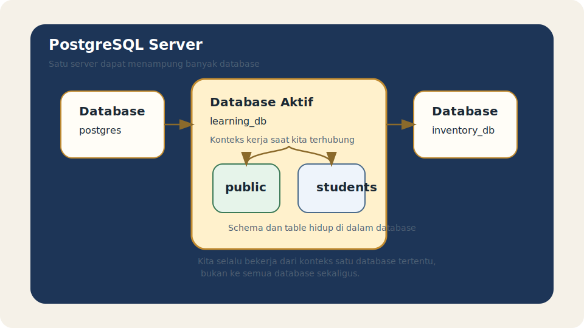

# Module 03 - Database Basics

## Tujuan

Memahami apa itu database dalam PostgreSQL, bagaimana posisinya dalam struktur sistem, dan apa saja operasi dasar yang perlu dipahami sebelum masuk ke schema, table, dan desain data.

## Hasil Belajar

Setelah menyelesaikan module ini, pembaca diharapkan mampu:

1. menjelaskan arti database dalam konteks PostgreSQL
2. membedakan database dengan schema dan table
3. memahami lifecycle dasar database
4. mengenali kapan perlu membuat database baru
5. menghindari kesalahan awal saat mengelola database latihan

## Apa Itu Database

Dalam PostgreSQL, `database` adalah wadah logis utama yang menampung object seperti schema, table, view, function, dan object lain.

Saat kita terhubung ke PostgreSQL, kita tidak hanya terhubung ke server secara umum, tetapi juga masuk ke satu database tertentu.

Contoh database:

- `postgres`
- `template1`
- `playground_db`
- `app_db`

Artinya, database adalah konteks kerja utama tempat object-object lain nantinya dibuat.

## Analogi Ringan

Cara sederhana untuk membayangkan `database` adalah seperti satu gedung kerja dengan tujuan tertentu.

- PostgreSQL server seperti kawasan yang memiliki banyak gedung
- satu `database` seperti satu gedung aktif
- di dalam gedung itu ada beberapa ruangan kerja
- ruangan kerja itu nanti bisa dibayangkan sebagai `schema`

Dengan analogi ini, kita lebih mudah memahami bahwa saat terhubung ke PostgreSQL, kita tidak berjalan bebas ke semua tempat sekaligus. Kita sedang masuk ke satu gedung tertentu, lalu bekerja di dalam konteks gedung itu.

## Posisi Database Dalam Struktur PostgreSQL

Cara berpikir sederhananya seperti ini:

- PostgreSQL server adalah sistem utama yang berjalan
- di dalam server bisa ada banyak `database`
- di dalam setiap database bisa ada banyak `schema`
- di dalam schema ada table dan object lain

Urutan ini penting karena pemula sering mencampuradukkan level object.

Ringkasnya:

- server mengelola banyak database
- database mengelola banyak schema
- schema mengelola banyak table dan object lain

## Diagram Posisi Database



Diagram ini membantu menunjukkan bahwa `database` berada di tengah antara `server` dan object-object yang lebih detail seperti `schema` dan `table`.

## Beda Database, Schema, Dan Table

Perbedaan paling dasar:

- `database` adalah wadah besar terpisah untuk kumpulan object
- `schema` adalah pengelompokan object di dalam satu database
- `table` adalah tempat menyimpan data dalam bentuk baris dan kolom

Contoh sederhana:

- database: `school_db`
- schema: `public`
- table: `students`

Jadi, `students` bukan berada langsung di level server, tetapi berada di dalam schema tertentu, yang juga berada di dalam database tertentu.

## Database Bawaan Yang Sering Ditemui

Setelah instalasi PostgreSQL, biasanya ada beberapa database bawaan seperti:

- `postgres`
- `template0`
- `template1`

Untuk pemula, cukup pahami dua hal:

- database bawaan ada untuk kebutuhan sistem dan awal penggunaan
- kita tetap disarankan membuat database latihan sendiri

Dengan begitu, latihan tidak bercampur dengan object bawaan yang tidak perlu disentuh sembarangan.

## Kapan Membuat Database Baru

Membuat database baru masuk akal jika:

- ingin memisahkan lingkungan latihan
- ingin memisahkan data untuk aplikasi berbeda
- ingin menjaga eksperimen tetap terisolasi

Untuk tahap belajar, satu database latihan biasanya sudah cukup.

Contoh nama yang aman dan jelas:

- `playground_db`
- `learning_db`
- `inventory_lab`

## Operasi Dasar Pada Database

Operasi dasar yang umum dikenal pemula:

1. melihat daftar database
2. membuat database baru
3. terhubung ke database tertentu
4. menghapus database yang tidak lagi dipakai

Contoh perintah:

```sql
CREATE DATABASE learning_db;
```

Di `psql`, melihat daftar database bisa dilakukan dengan:

```text
\l
```

Berpindah koneksi ke database lain:

```text
\c learning_db
```

Menghapus database:

```sql
DROP DATABASE learning_db;
```

Untuk `DROP DATABASE`, pemula perlu ekstra hati-hati karena operasi ini menghapus database beserta object di dalamnya.

## Lifecycle Dasar Database

Lifecycle sederhana database biasanya seperti ini:

1. database dibuat
2. schema dan table mulai ditambahkan
3. data dimasukkan dan dipakai
4. database diubah seiring kebutuhan
5. database dihapus jika sudah tidak diperlukan

Di tahap fundamentals, yang penting adalah memahami bahwa database bukan sekadar nama, tetapi wadah kerja yang punya umur dan tujuan.

## Memilih Database Untuk Latihan

Saat belajar, lebih aman memakai database khusus latihan daripada terus bekerja di database default.

Keuntungannya:

- lebih mudah bereksperimen
- lebih mudah dibersihkan bila salah
- lebih jelas memisahkan object latihan dari object bawaan

Contoh alur yang sehat:

1. konek ke `postgres`
2. buat `playground_db`
3. pindah ke `playground_db`
4. lakukan semua latihan fundamentals di sana

## Kesalahan Umum Pemula

Kesalahan yang sering terjadi:

- mengira database sama dengan table
- belum paham bahwa koneksi selalu masuk ke database tertentu
- membuat terlalu banyak database tanpa alasan jelas
- berlatih di database default lalu bingung object tersimpan di mana
- menjalankan `DROP DATABASE` tanpa benar-benar paham akibatnya

## Best Practices Awal

Beberapa kebiasaan baik:

- gunakan nama database yang jelas
- buat database latihan khusus
- pahami konteks database aktif sebelum membuat object
- cek database aktif dengan query sederhana saat ragu
- hindari menghapus database jika belum yakin isinya tidak dibutuhkan

Contoh verifikasi:

```sql
SELECT current_database();
```

## Contoh Latihan

Lihat folder `examples/` untuk latihan singkat membuat, mengecek, dan memahami konteks database aktif.

Jalankan contoh secara bertahap agar hubungan antara server, database, dan object di dalamnya terasa lebih jelas.

Jika perlu, lihat kembali diagram pada bagian awal agar konteks `server -> database -> schema -> table` tetap konsisten saat membaca contoh.

## Ringkasan

Database adalah wadah utama dalam PostgreSQL tempat schema, table, dan object lain hidup. Memahami database berarti memahami konteks kerja sebelum membuat struktur data yang lebih detail.

Kalau pembaca sudah paham:

- apa itu database
- posisi database dalam server PostgreSQL
- beda database dengan schema dan table
- operasi dasar dan risiko dasarnya

maka pembaca siap masuk ke module berikutnya tentang schema dan table basics.

## Aturan Lokal Module

Lihat folder `docs/` module ini.
