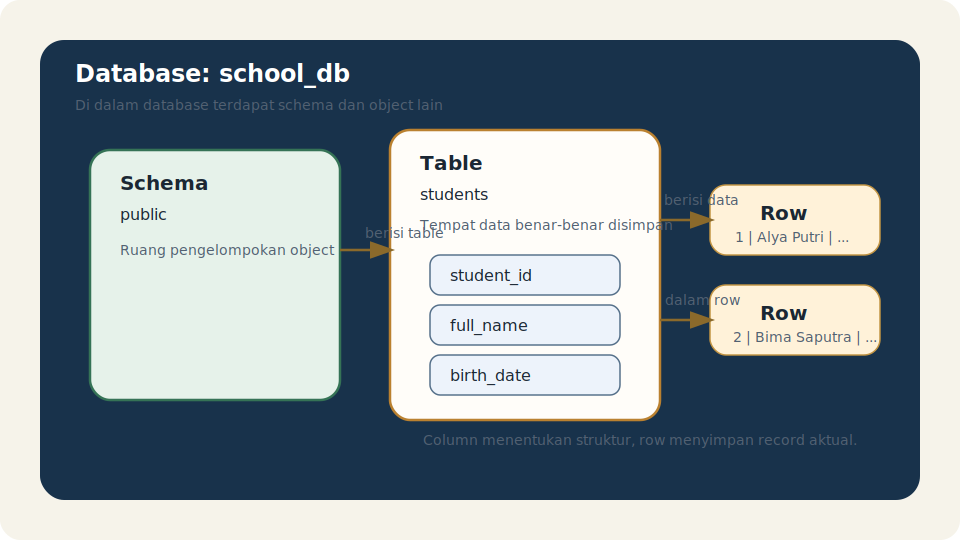

# Module 04 - Schema And Table Basics

## Tujuan

Memahami peran schema dan table dalam PostgreSQL, serta hubungan schema, table, row, dan column sebagai fondasi struktur data sebelum masuk ke tipe data, constraint, dan operasi CRUD.

## Hasil Belajar

Setelah menyelesaikan module ini, pembaca diharapkan mampu:

1. menjelaskan apa itu schema dalam PostgreSQL
2. menjelaskan apa itu table, row, dan column
3. memahami hubungan antara database, schema, dan table
4. mengenali nama object dengan lebih jelas
5. menghindari kebingungan dasar saat mulai membuat struktur data

## Gambaran Struktur Object

Setelah kita paham bahwa PostgreSQL server dapat memiliki banyak database, langkah berikutnya adalah memahami struktur di dalam sebuah database.

Cara berpikir sederhananya:

- server memiliki banyak database
- database memiliki banyak schema
- schema memiliki banyak table dan object lain
- table menyimpan data dalam bentuk row dan column

Urutan ini penting karena hampir semua pekerjaan data dasar akan bergerak di level schema dan table.

## Apa Itu Schema

`schema` adalah ruang pengelompokan object di dalam satu database.

Schema membantu kita:

- mengelompokkan object
- menghindari benturan nama
- membuat struktur database lebih rapi

Schema default yang paling sering ditemui adalah:

- `public`

Saat pemula membuat table tanpa menyebut schema secara eksplisit, table itu sering dibuat di schema `public`.

Contoh nama lengkap object:

```text
public.students
```

Artinya:

- schema: `public`
- table: `students`

## Analogi Inti

Cara sederhana untuk membayangkan struktur ini adalah seperti ruang arsip:

- `database` seperti satu pusat arsip
- `schema` seperti ruangan atau zona di dalam pusat arsip
- `table` seperti lemari data
- `column` seperti label field pada formulir
- `row` seperti satu lembar formulir yang sudah terisi

Analogi ini membantu membedakan bahwa `schema` bukan tempat menyimpan data langsung. Data tetap disimpan di `table`, sedangkan `schema` membantu mengelompokkan table dan object lain.

## Apa Itu Table

`table` adalah object utama untuk menyimpan data secara terstruktur.

Sebuah table terdiri dari:

- `column` sebagai atribut data
- `row` sebagai record data

Contoh sederhana:

Table `students` mungkin memiliki column:

- `student_id`
- `full_name`
- `birth_date`

Lalu setiap row mewakili satu siswa.

## Apa Itu Column

`column` adalah bagian vertikal pada table yang mendefinisikan atribut data yang disimpan.

Contoh:

- `student_id` menyimpan identitas siswa
- `full_name` menyimpan nama siswa
- `birth_date` menyimpan tanggal lahir siswa

Setiap column sebaiknya punya arti yang jelas agar struktur data mudah dibaca dan dipakai.

## Apa Itu Row

`row` adalah satu record data utuh di dalam table.

Jika table `students` punya tiga column:

- `student_id`
- `full_name`
- `birth_date`

maka satu row bisa berisi data seperti:

- `1`
- `Alya Putri`
- `2005-02-14`

Jadi:

- column menjelaskan bentuk data
- row berisi data aktual

## Hubungan Database, Schema, Table, Row, Dan Column

Contoh struktur lengkap:

- database: `school_db`
- schema: `public`
- table: `students`
- column: `student_id`, `full_name`, `birth_date`
- row: satu data siswa tertentu

Penulisan nama table yang lebih lengkap sering terlihat seperti ini:

```sql
SELECT *
FROM public.students;
```

Di sini `public.students` menunjukkan bahwa table `students` berada di schema `public`.

## Diagram Struktur Schema Dan Table



Diagram ini menunjukkan bagaimana `database`, `schema`, `table`, `column`, dan `row` tersusun dari level yang lebih besar ke level yang lebih detail.

## Membuat Table Sederhana

Contoh table paling dasar:

```sql
CREATE TABLE public.students (
    student_id INTEGER,
    full_name TEXT,
    birth_date DATE
);
```

Dari contoh ini:

- `students` adalah nama table
- `student_id`, `full_name`, dan `birth_date` adalah column
- tipe data setiap column menentukan jenis nilai yang boleh disimpan

Pada module ini, fokus kita masih pada struktur object, bukan detail desain column yang paling ideal.

## Melihat Table Sebagai Tempat Menyimpan Record

Setelah table dibuat, data nantinya akan masuk sebagai row.

Contoh bentuk data yang dibayangkan:

| student_id | full_name   | birth_date |
| ---------- | ----------- | ---------- |
| 1          | Alya Putri  | 2005-02-14 |
| 2          | Bima Saputra| 2004-09-30 |

Intinya:

- column adalah definisi struktur
- row adalah isi aktualnya

## Kenapa Schema Penting

Pada tahap awal, pemula kadang bertanya: kalau sudah ada database, kenapa masih ada schema?

Jawaban sederhananya: karena database bisa berisi banyak object, dan schema membantu mengaturnya.

Bayangkan satu database berisi:

- table aplikasi utama
- table eksperimen
- table laporan

Tanpa pengelompokan, semua object akan cepat terasa berantakan. Schema membantu menjaga keteraturan itu.

## Kesalahan Umum Pemula

Kesalahan yang sering muncul:

- mengira schema sama dengan database
- mengira table sama dengan database
- belum paham bahwa row dan column berada di dalam table
- membuat object tanpa sadar sedang bekerja di schema mana
- memakai nama table atau column yang terlalu umum dan membingungkan

## Best Practices Awal

Beberapa kebiasaan baik:

- pahami schema `public` sebelum membuat schema lain
- gunakan nama table yang jelas dan mewakili entitas
- gunakan nama column yang deskriptif
- cek konteks object saat menulis nama lengkap seperti `public.students`
- bangun pemahaman struktur dulu sebelum memperumit desain

## Contoh Latihan

Lihat folder `examples/` untuk contoh SQL pembuka yang menunjukkan relasi antara schema, table, row, dan column.

Jalankan contoh secara bertahap agar pembaca bisa melihat bahwa:

- table dibuat di schema tertentu
- table berisi column
- data masuk sebagai row

Kalau perlu, lihat kembali diagram pada bagian awal agar pembaca tetap melihat struktur besar sebelum fokus ke contoh SQL.

## Ringkasan

Schema dan table adalah fondasi struktur data di PostgreSQL. Jika database adalah wadah utama, maka schema adalah pengelompokan object, dan table adalah tempat data benar-benar disimpan.

Kalau pembaca sudah paham:

- fungsi schema
- fungsi table
- beda row dan column
- posisi schema dan table di dalam database

maka pembaca siap masuk ke module berikutnya tentang tipe data dasar.

## Aturan Lokal Module

Lihat folder `docs/` module ini.
