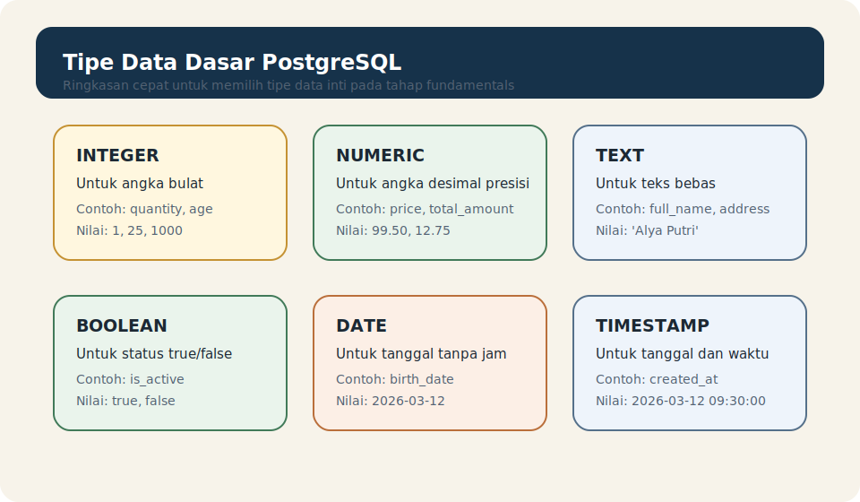

# Module 05 - Data Types Basics

## Tujuan

Memahami tipe data dasar PostgreSQL agar pembaca bisa memilih jenis data yang sesuai sejak awal, menjaga struktur table tetap jelas, dan menghindari kebiasaan menyimpan semua nilai sebagai teks.

## Hasil Belajar

Setelah menyelesaikan module ini, pembaca diharapkan mampu:

1. menjelaskan apa itu tipe data dalam PostgreSQL
2. mengenali tipe data dasar yang paling sering dipakai
3. memilih tipe data yang lebih sesuai untuk kebutuhan sederhana
4. memahami dampak pemilihan tipe data terhadap struktur data
5. menghindari kesalahan umum saat mendefinisikan column

## Apa Itu Tipe Data

`data type` menentukan jenis nilai yang boleh disimpan oleh sebuah column.

Saat kita membuat table, kita tidak hanya menulis nama column, tetapi juga menetapkan jenis nilai yang valid untuk column tersebut.

Contoh:

```sql
CREATE TABLE students (
    student_id INTEGER,
    full_name TEXT,
    is_active BOOLEAN,
    birth_date DATE
);
```

Dari contoh ini:

- `student_id` diharapkan berisi angka bulat
- `full_name` diharapkan berisi teks
- `is_active` diharapkan berisi nilai benar atau salah
- `birth_date` diharapkan berisi tanggal

## Kenapa Tipe Data Penting

Pemilihan tipe data penting karena memengaruhi:

- nilai apa yang boleh masuk ke column
- kejelasan struktur data
- cara query bekerja
- konsistensi data

Kalau tipe data dipilih dengan baik, struktur table jadi lebih mudah dibaca dan lebih aman dipakai.

## Cara Berpikir Sederhana Saat Memilih Tipe Data

Sebelum memilih tipe data, tanyakan:

1. nilai ini sebenarnya angka, teks, tanggal, atau status benar/salah?
2. apakah nilai ini perlu dihitung?
3. apakah nilai ini hanya untuk ditampilkan?
4. apakah nilai ini harus punya format waktu atau hanya tanggal?

Dengan pertanyaan sederhana ini, pemula biasanya sudah bisa menghindari banyak kesalahan dasar.

## Tipe Data Dasar Yang Paling Sering Dipakai

Berikut beberapa tipe data inti yang paling umum di tahap fundamentals:

| Tipe Data | Untuk Apa | Contoh Nilai |
| --------- | --------- | ------------ |
| `INTEGER` | angka bulat | `1`, `25`, `1000` |
| `NUMERIC` | angka desimal yang perlu presisi | `99.50`, `12.75` |
| `TEXT` | teks bebas | `'Alya Putri'` |
| `BOOLEAN` | status benar atau salah | `true`, `false` |
| `DATE` | tanggal tanpa jam | `2026-03-12` |
| `TIMESTAMP` | tanggal dan waktu | `2026-03-12 09:30:00` |

## Tabel Visual Ringkas



Visual ini dirancang sebagai ringkasan cepat untuk membantu pembaca mengenali peran tiap tipe data sebelum membaca contoh SQL yang lebih detail.

## INTEGER

Gunakan `INTEGER` untuk nilai angka bulat.

Contoh:

- jumlah item
- umur
- nomor urut sederhana

Contoh column:

```sql
quantity INTEGER
```

Jika nilainya memang dipakai sebagai angka bulat, jangan simpan sebagai `TEXT`.

## NUMERIC

Gunakan `NUMERIC` untuk angka desimal yang membutuhkan presisi, terutama jika nilainya tidak boleh berubah karena pembulatan yang tidak diinginkan.

Contoh:

- harga
- total pembayaran
- nilai keuangan lain

Contoh column:

```sql
price NUMERIC(10,2)
```

Di tahap awal, cukup pahami bahwa `NUMERIC` cocok untuk angka desimal yang ingin disimpan dengan hati-hati.

## TEXT

Gunakan `TEXT` untuk nilai teks yang panjangnya tidak perlu dibatasi secara ketat di tahap awal.

Contoh:

- nama
- alamat
- deskripsi singkat

Contoh column:

```sql
full_name TEXT
```

`TEXT` sangat berguna, tetapi bukan berarti semua data harus disimpan sebagai teks.

## BOOLEAN

Gunakan `BOOLEAN` untuk nilai yang hanya punya dua keadaan utama.

Contoh:

- aktif atau tidak aktif
- sudah dibayar atau belum
- tersedia atau tidak tersedia

Contoh column:

```sql
is_active BOOLEAN
```

Tipe ini lebih jelas daripada menyimpan status seperti `'yes'`, `'no'`, `'1'`, atau `'0'` sebagai teks.

## DATE

Gunakan `DATE` jika yang dibutuhkan hanya tanggal, tanpa jam.

Contoh:

- tanggal lahir
- tanggal registrasi
- tanggal mulai

Contoh column:

```sql
birth_date DATE
```

Kalau jam dan menit tidak penting, `DATE` biasanya sudah cukup.

## TIMESTAMP

Gunakan `TIMESTAMP` jika tanggal dan waktu sama-sama penting.

Contoh:

- waktu dibuat
- waktu update
- waktu login

Contoh column:

```sql
created_at TIMESTAMP
```

Ini berguna ketika urutan waktu perlu dicatat lebih detail daripada sekadar tanggal.

## Contoh Table Dengan Beberapa Tipe Data

```sql
CREATE TABLE products (
    product_id INTEGER,
    product_name TEXT,
    price NUMERIC(10,2),
    is_available BOOLEAN,
    created_at TIMESTAMP
);
```

Contoh ini menunjukkan bahwa setiap column punya jenis data yang sesuai dengan arti nilainya.

## Kesalahan Umum Pemula

Kesalahan yang sering muncul:

- menyimpan semua data sebagai `TEXT`
- memakai `INTEGER` untuk nilai yang seharusnya desimal
- memakai `TIMESTAMP` padahal hanya butuh `DATE`
- memakai teks untuk status yang lebih cocok memakai `BOOLEAN`
- memilih tipe data berdasarkan kebiasaan, bukan berdasarkan arti data

## Best Practices Awal

Beberapa kebiasaan baik:

- pilih tipe data berdasarkan arti nilai, bukan sekadar contoh yang pernah dilihat
- gunakan tipe data yang paling sederhana tetapi tetap tepat
- hindari menyimpan angka sebagai teks bila nilainya memang angka
- gunakan `BOOLEAN` untuk status ya/tidak
- gunakan `DATE` atau `TIMESTAMP` sesuai kebutuhan waktu yang sebenarnya

## Contoh Latihan

Lihat folder `examples/` untuk contoh table sederhana yang memakai beberapa tipe data inti PostgreSQL.

Bacalah contoh sambil mencocokkan setiap column dengan arti data yang ingin disimpan.

## Ringkasan

Tipe data adalah fondasi penting dalam desain table. Dengan memilih tipe data yang tepat, pembaca membuat struktur data lebih jelas, lebih konsisten, dan lebih mudah dipakai.

Kalau pembaca sudah paham:

- fungsi tipe data
- perbedaan tipe data dasar
- kapan memakai `INTEGER`, `NUMERIC`, `TEXT`, `BOOLEAN`, `DATE`, dan `TIMESTAMP`
- kesalahan umum saat memilih tipe data

maka pembaca siap masuk ke module berikutnya tentang `DEFAULT` dan nilai bawaan.

## Aturan Lokal Module

Lihat folder `docs/` module ini.
