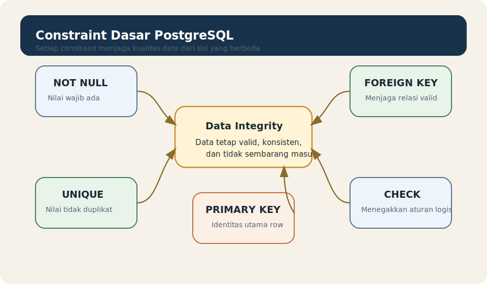

# Module 07 - Constraints And Data Integrity

## Tujuan

Memahami constraint dasar PostgreSQL agar pembaca dapat menjaga data tetap valid, konsisten, dan tidak sembarang masuk ke dalam table.

## Hasil Belajar

Setelah menyelesaikan module ini, pembaca diharapkan mampu:

1. menjelaskan apa itu constraint
2. memahami hubungan constraint dengan integritas data
3. mengenali constraint dasar yang paling sering dipakai
4. membaca contoh table yang memakai constraint
5. menghindari kesalahan awal saat mendefinisikan aturan data

## Apa Itu Constraint

`constraint` adalah aturan yang ditempelkan pada column atau table untuk membatasi data apa yang boleh masuk.

Tujuannya sederhana:

- mencegah data yang tidak valid
- menjaga konsistensi isi table
- membantu database menegakkan aturan dasar secara otomatis

Tanpa constraint, aplikasi lebih mudah memasukkan data yang salah, kosong, duplikat, atau tidak masuk akal.

## Apa Itu Data Integrity

`data integrity` berarti data tetap benar, konsisten, dan sesuai aturan yang diharapkan.

Contoh sederhana:

- nama yang wajib ada sebaiknya tidak kosong
- id utama sebaiknya unik
- nilai status sebaiknya sesuai aturan
- relasi ke data lain sebaiknya benar-benar mengarah ke data yang ada

Constraint membantu menjaga integritas ini langsung dari sisi database.

## Analogi Ringan

Cara mudah membayangkan constraint adalah seperti pagar aturan pada formulir pendaftaran.

Misalnya:

- nama tidak boleh kosong
- email tidak boleh sama dengan milik orang lain
- nomor identitas harus unik
- tanggal lahir tidak boleh di masa depan jika aturannya memang begitu

Kalau formulir punya validasi seperti itu, data yang masuk jadi lebih rapi. PostgreSQL melakukan hal serupa lewat constraint.

## Diagram Constraint Dasar



Diagram ini memberi gambaran singkat bahwa setiap constraint punya fungsi menjaga kualitas data dari arah yang berbeda.

## NOT NULL

`NOT NULL` berarti column tidak boleh berisi nilai kosong `NULL`.

Contoh:

```sql
full_name TEXT NOT NULL
```

Ini cocok untuk data yang memang wajib ada, misalnya nama pengguna atau nama produk.

## UNIQUE

`UNIQUE` berarti nilai pada column harus unik dan tidak boleh duplikat.

Contoh:

```sql
email TEXT UNIQUE
```

Ini cocok untuk data seperti email, username, atau kode tertentu yang seharusnya tidak dipakai oleh dua baris berbeda.

## PRIMARY KEY

`PRIMARY KEY` adalah identitas utama untuk setiap row.

Secara sederhana, `PRIMARY KEY` menggabungkan dua ide penting:

- nilainya harus unik
- nilainya tidak boleh `NULL`

Contoh:

```sql
student_id INTEGER PRIMARY KEY
```

Dalam banyak table, `PRIMARY KEY` menjadi penanda utama untuk membedakan satu row dari row lain.

## FOREIGN KEY

`FOREIGN KEY` dipakai untuk menghubungkan satu table dengan table lain.

Contoh sederhana:

- table `enrollments` punya `student_id`
- nilai `student_id` itu harus mengarah ke row yang benar-benar ada di table `students`

Contoh:

```sql
student_id INTEGER REFERENCES students(student_id)
```

Constraint ini membantu menjaga hubungan antar table tetap valid.

## CHECK

`CHECK` dipakai untuk memaksa sebuah kondisi logis.

Contoh:

```sql
price NUMERIC(10,2) CHECK (price >= 0)
```

Artinya, PostgreSQL hanya menerima nilai `price` yang lebih besar atau sama dengan nol.

Ini berguna untuk mencegah data yang secara logika tidak masuk akal.

## Contoh Table Dengan Beberapa Constraint

```sql
CREATE TABLE students (
    student_id INTEGER PRIMARY KEY,
    full_name TEXT NOT NULL,
    email TEXT UNIQUE,
    age INTEGER CHECK (age >= 0),
    is_active BOOLEAN DEFAULT true
);
```

Dari contoh ini:

- `student_id` adalah identitas utama
- `full_name` wajib diisi
- `email` tidak boleh duplikat
- `age` tidak boleh negatif
- `is_active` punya nilai bawaan

## Kenapa Constraint Sebaiknya Diletakkan Di Database

Pemula kadang hanya mengandalkan validasi dari aplikasi.

Masalahnya, data bisa masuk dari banyak tempat:

- aplikasi utama
- script SQL
- import data
- tool admin

Kalau aturan hanya ada di aplikasi, database tetap bisa menerima data yang salah dari jalur lain. Constraint membuat aturan dasar tetap dijaga di level database.

## Kesalahan Umum Pemula

Kesalahan yang sering muncul:

- menganggap constraint itu opsional padahal sangat penting
- lupa memberi `PRIMARY KEY`
- tidak membedakan `UNIQUE` dengan `PRIMARY KEY`
- memakai `CHECK` tanpa benar-benar memikirkan aturan logisnya
- mengira `DEFAULT` sudah cukup dan tidak perlu constraint lain

## Best Practices Awal

Beberapa kebiasaan baik:

- tentukan `PRIMARY KEY` sejak awal
- gunakan `NOT NULL` untuk data yang memang wajib
- gunakan `UNIQUE` untuk data yang harus berbeda antar row
- gunakan `CHECK` untuk aturan logis yang sederhana dan jelas
- pahami bahwa constraint adalah bagian dari desain data, bukan aksesori tambahan

## Contoh Latihan

Lihat folder `examples/` untuk contoh pembuatan table dengan beberapa constraint dasar dan contoh data yang valid maupun tidak valid.

Jalankan contoh secara bertahap agar pembaca bisa melihat bagaimana PostgreSQL membantu menolak data yang melanggar aturan.

## Ringkasan

Constraint membantu PostgreSQL menjaga kualitas data secara otomatis. Dengan constraint, pembaca tidak hanya menyimpan data, tetapi juga menetapkan aturan agar data tetap masuk akal dan konsisten.

Kalau pembaca sudah paham:

- fungsi constraint
- perbedaan `NOT NULL`, `UNIQUE`, `PRIMARY KEY`, `FOREIGN KEY`, dan `CHECK`
- hubungan constraint dengan integritas data
- pentingnya aturan data di level database

maka pembaca siap masuk ke module berikutnya tentang operasi CRUD dasar.

## Aturan Lokal Module

Lihat folder `docs/` module ini.
