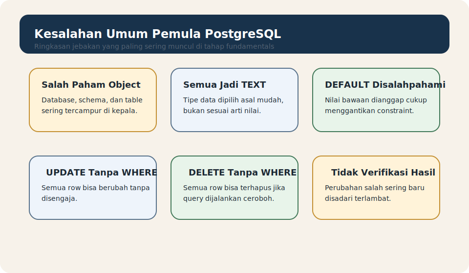

# Module 11 - Common Beginner Mistakes

## Tujuan

Memahami kesalahan umum pemula saat belajar PostgreSQL agar pembaca bisa mengenali jebakan sejak awal, bekerja lebih tenang, dan membangun kebiasaan yang lebih aman.

## Hasil Belajar

Setelah menyelesaikan module ini, pembaca diharapkan mampu:

1. mengenali kesalahan umum di tahap fundamentals
2. memahami kenapa kesalahan itu sering terjadi
3. menghindari anti-pattern dasar saat bekerja dengan data
4. membangun kebiasaan kerja yang lebih aman
5. meninjau kembali materi fundamentals dengan sudut pandang yang lebih matang

## Kenapa Module Ini Penting

Pemula biasanya tidak gagal karena syntax yang terlalu sulit.

Mereka lebih sering macet karena:

- salah memahami object dasar
- bekerja terlalu cepat tanpa verifikasi
- mencampuradukkan konsep yang berbeda
- mengubah data tanpa sadar dampaknya

Dengan mengenali kesalahan umum, pembaca bisa belajar lebih efisien dan lebih percaya diri.

## Infografik Ringkas



Visual ini merangkum beberapa jebakan paling sering pada tahap fundamentals.

## Salah Paham Antara Database, Schema, Dan Table

Kesalahan paling awal yang sering terjadi adalah mencampuradukkan level object.

Contoh salah paham:

- mengira database sama dengan table
- mengira schema sama dengan database
- tidak sadar object dibuat di schema mana

Cara menghindarinya:

- ingat hirarki `server -> database -> schema -> table`
- cek konteks kerja sebelum membuat object baru

## Menyimpan Semua Hal Sebagai TEXT

Karena `TEXT` terasa paling mudah, pemula sering menyimpan:

- angka
- status benar/salah
- tanggal

sebagai teks.

Masalahnya:

- arti data jadi kabur
- query jadi kurang rapi
- struktur table jadi kurang tepat

Cara menghindarinya:

- pilih tipe data berdasarkan arti nilai, bukan karena paling nyaman ditulis

## Menganggap DEFAULT Sudah Cukup Menggantikan Constraint

Pemula kadang berpikir:

- kalau sudah ada `DEFAULT`, berarti column sudah aman

Padahal:

- `DEFAULT` hanya memberi nilai bawaan
- constraint tetap dibutuhkan untuk menjaga validitas data

Cara menghindarinya:

- bedakan fungsi `DEFAULT` dan constraint sejak awal

## UPDATE Atau DELETE Tanpa WHERE

Ini adalah salah satu kesalahan paling berbahaya.

Contoh:

```sql
UPDATE students
SET is_active = false;
```

Query seperti ini akan mengubah semua row jika tidak ada `WHERE`.

Hal yang sama berlaku untuk `DELETE`.

Cara menghindarinya:

- biasakan `SELECT` dulu sebelum `UPDATE` atau `DELETE`
- cek ulang query sebelum dijalankan

## Tidak Mengecek Hasil Setelah Perubahan

Setelah `INSERT`, `UPDATE`, atau `DELETE`, pemula sering langsung lanjut tanpa memeriksa hasilnya.

Akibatnya:

- kesalahan kecil tidak cepat terlihat
- perubahan yang salah baru disadari terlambat

Cara menghindarinya:

- biasakan jalankan `SELECT` setelah perubahan penting

## Bingung Antara Error Koneksi Dan Error Query

Saat belajar PostgreSQL, tidak semua error punya sumber yang sama.

Beberapa error berasal dari:

- server belum berjalan
- username atau password salah
- database tidak ada
- query SQL salah

Cara menghindarinya:

- bedakan masalah koneksi, struktur, dan query
- baca pesan error dengan tenang

## Terlalu Cepat Masuk Ke Query Lanjutan

Pemula sering ingin langsung belajar:

- `JOIN`
- subquery
- agregasi yang lebih rumit

padahal fondasi seperti table, tipe data, constraint, dan CRUD belum mantap.

Cara menghindarinya:

- kuasai fundamentals dulu
- pastikan object dasar dan query dasar benar-benar dipahami

## Tidak Menyiapkan Data Latihan Dengan Baik

Tanpa data latihan yang cukup:

- query terasa abstrak
- filtering dan sorting sulit dirasakan
- hasil belajar jadi cepat lupa

Cara menghindarinya:

- gunakan seed kecil yang mudah dibaca
- simpan contoh data latihan yang konsisten

## Menulis Query Sekaligus Terlalu Rumit

Pemula kadang langsung menulis query panjang dengan banyak bagian sekaligus.

Akibatnya:

- sulit tahu bagian mana yang salah
- sulit belajar pola query dengan tenang

Cara menghindarinya:

- bangun query sedikit demi sedikit
- mulai dari `SELECT`
- tambahkan `WHERE`
- lalu `ORDER BY`, `LIMIT`, dan seterusnya

## Checklist Kebiasaan Aman

Kebiasaan kecil yang sangat membantu:

- pahami object yang sedang dipakai
- pilih tipe data dengan sadar
- gunakan constraint dasar
- verifikasi hasil perubahan dengan `SELECT`
- jangan terburu-buru menjalankan query destruktif
- bangun query dari bentuk sederhana ke bentuk yang lebih lengkap

## Contoh Latihan

Lihat folder `examples/` untuk ringkasan kesalahan umum dan daftar pengecekan singkat sebelum menjalankan query penting.

Tujuan latihan pada module ini bukan menambah syntax baru, tetapi memperkuat sikap kerja yang lebih aman.

## Ringkasan

Kesalahan umum pemula biasanya bukan karena PostgreSQL terlalu sulit, tetapi karena fondasi belum dipakai dengan disiplin yang cukup.

Kalau pembaca sudah paham:

- jebakan paling umum di tahap fundamentals
- kebiasaan yang membuat kerja lebih aman
- cara membaca ulang langkah sendiri sebelum salah lebih jauh

maka pembaca siap masuk ke module terakhir tentang roadmap belajar berikutnya.

## Aturan Lokal Module

Lihat folder `docs/` module ini.
