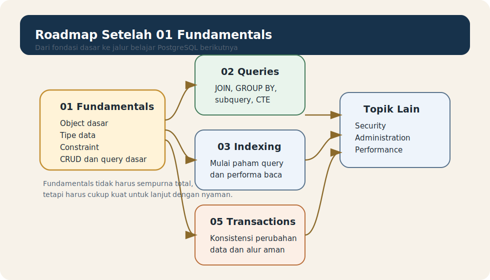

# Module 12 - Learning Roadmap And Next Steps

## Tujuan

Memahami arah belajar setelah menyelesaikan fundamentals agar pembaca tahu apa yang sudah dikuasai, apa yang perlu diperkuat, dan ke topic mana sebaiknya melangkah berikutnya.

## Hasil Belajar

Setelah menyelesaikan module ini, pembaca diharapkan mampu:

1. meninjau ulang capaian belajar dari topic fundamentals
2. mengenali kesiapan untuk masuk ke topic berikutnya
3. memilih urutan belajar lanjutan yang lebih masuk akal
4. memahami batas fundamentals dan awal topic lanjutan
5. melanjutkan belajar dengan arah yang lebih jelas

## Kenapa Perlu Roadmap

Setelah menyelesaikan banyak module dasar, pemula sering bertanya:

- saya lanjut ke mana?
- apakah saya sudah cukup paham?
- apa yang wajib dikuasai dulu sebelum belajar query yang lebih sulit?

Roadmap membantu menjawab pertanyaan itu dengan lebih terstruktur.

## Apa Yang Sudah Dikuasai Di Fundamentals

Jika pembaca sudah mengikuti topic ini dengan baik, maka fondasi yang sudah disentuh meliputi:

- apa itu PostgreSQL
- koneksi awal dan database pertama
- database, schema, table, row, dan column
- tipe data dasar
- `DEFAULT`
- constraint dasar
- CRUD dasar
- filtering, sorting, dan limiting dasar
- seed, import/export dasar
- kesalahan umum pemula

Ini berarti pembaca sudah punya fondasi yang cukup untuk mulai membaca query yang lebih kaya.

## Roadmap Visual

Roadmap ini menunjukkan jalur belajar yang paling wajar setelah fondasi selesai dibangun.

## Tanda Bahwa Fundamentals Sudah Cukup Kuat

Pembaca biasanya siap lanjut jika sudah cukup nyaman dengan hal-hal berikut:

- bisa membuat table sederhana
- bisa memilih tipe data dasar
- paham fungsi `DEFAULT` dan constraint inti
- bisa melakukan `INSERT`, `SELECT`, `UPDATE`, dan `DELETE`
- bisa memakai `WHERE`, `ORDER BY`, dan `LIMIT`
- tidak lagi bingung antara database, schema, dan table

Kalau beberapa hal ini masih terasa kabur, tidak masalah untuk mengulang module tertentu sebelum lanjut.

## Langkah Berikutnya Yang Paling Wajar

Setelah fundamentals, jalur belajar yang paling alami biasanya:

1. `02_queries`
2. `03_indexing`
3. `05_transactions`
4. topic teknis lain sesuai kebutuhan

Kenapa `02_queries` biasanya lebih dulu:

- pembaca sudah punya data dan table untuk berlatih
- query lanjutan baru terasa masuk akal setelah CRUD dasar dikuasai
- banyak pekerjaan harian di PostgreSQL dimulai dari kemampuan query yang baik

## Apa Yang Akan Ditemui Di 02_queries

Di topic berikutnya, pembaca biasanya mulai bertemu:

- `JOIN`
- `GROUP BY`
- `HAVING`
- subquery
- CTE
- set operations
- window functions

Inilah area tempat kemampuan membaca dan menulis query berkembang lebih serius.

## Kapan Masuk Ke 03_indexing

`03_indexing` biasanya lebih cocok dipelajari setelah pembaca:

- cukup nyaman membaca query
- mulai bertanya kenapa query tertentu lambat
- mulai punya intuisi tentang pencarian data

Indexing lebih mudah dipahami jika pembaca sudah tahu seperti apa query yang ingin dipercepat.

## Kapan Menyentuh 05_transactions

`05_transactions` cocok dipelajari ketika pembaca mulai peduli pada:

- serangkaian perubahan data yang harus konsisten
- kondisi berhasil semua atau gagal semua
- keamanan perubahan data dalam proses yang lebih nyata

Untuk pemula, transaction akan lebih masuk akal setelah CRUD dasar terasa natural.

## Jalur Belajar Yang Sehat

Pola belajar yang disarankan:

- kuasai dasar secukupnya
- lanjut ke query lanjutan
- kembali sebentar ke fundamentals jika ada konsep yang masih goyah
- pelajari performa, indexing, dan transactions saat konteksnya mulai terasa nyata

Belajar PostgreSQL tidak harus lurus tanpa kembali. Kadang justru pemahaman fundamentals menjadi lebih kuat setelah mencoba topik berikutnya.

## Saran Praktis Setelah Menyelesaikan Topic Ini

Beberapa langkah yang sangat bagus dilakukan:

- ulangi contoh SQL dari module awal sampai akhir
- buat satu database latihan pribadi
- isi dengan seed kecil
- latih `SELECT`, `WHERE`, `ORDER BY`, `INSERT`, `UPDATE`, dan `DELETE`
- mulai masuk ke `02_queries` dengan dataset yang sama

Dengan cara ini, pembaca tidak belajar topik baru di ruang kosong, tetapi di atas data yang sudah dikenalnya.

## Kesalahan Yang Perlu Dihindari Saat Lanjut

Kesalahan umum setelah fundamentals:

- merasa harus langsung menguasai semua fitur PostgreSQL
- lompat terlalu jauh ke topik teknis sebelum query dasar mantap
- tidak mengulang fundamentals yang masih lemah
- belajar topik lanjutan tanpa data latihan yang cukup

Belajar lebih baik jika bertahap, bukan terburu-buru.

## Ringkasan

Topic fundamentals bukan akhir, tetapi landasan untuk topic-topic PostgreSQL yang lebih kaya. Setelah ini, langkah paling masuk akal biasanya adalah memperkuat kemampuan query, lalu bergerak ke indexing, transactions, dan area lain sesuai kebutuhan.

Kalau pembaca sudah:

- paham object dasar PostgreSQL
- nyaman dengan CRUD dan query sederhana
- mengerti tipe data, `DEFAULT`, dan constraint dasar
- punya data latihan untuk dicoba

maka pembaca sudah berada di posisi yang baik untuk melanjutkan perjalanan belajar PostgreSQL.

## Aturan Lokal Module

Lihat folder `docs/` module ini.
